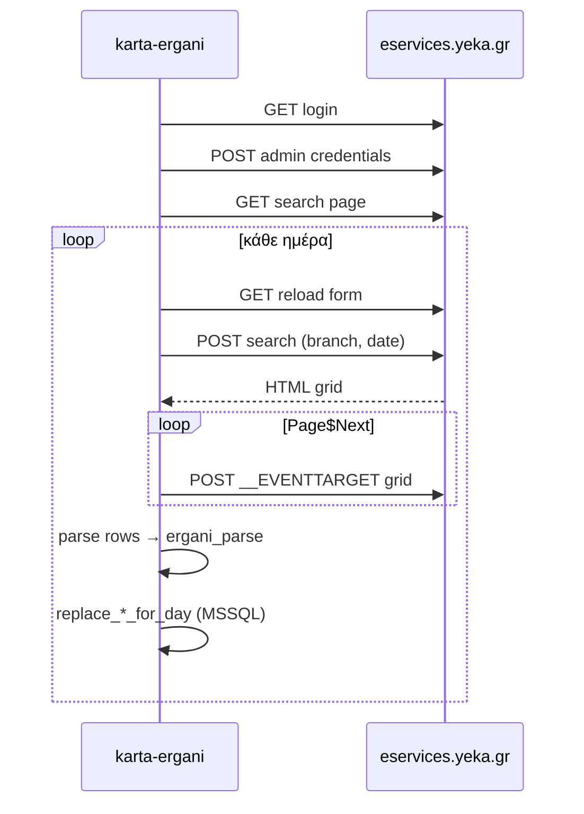

# CHANGELOG — karta-ergani

Όλες οι μεταβολές του project καταγράφονται εδώ (νέα πρώτα).

Για την τρέχουσα τεχνική εικόνα και οδηγούς συντήρησης, δες το `docs/`:
`PROJECT_STATE.md`, `ARCHITECTURE.md`, `RUNBOOK.md`, `ERGANI_PORTAL_SYNC.md`,
`DEPLOYMENT.md`, `DECISIONS.md`.

---

## 2026-06-24 (δ) — Διάσπαση αρχείων, responsive UI και διορθώσεις επιλογής καταστήματος

### Διάσπαση αρχείων / συντήρηση

- Μεταφέρθηκαν οι office UI σελίδες από `app/static/ui/*.html` σε Jinja templates
  (`app/templates/ui/*.html`) με κοινό `app/templates/ui/base.html` και sidebar partial.
- Το `app/routes_ui.py` σερβίρει πλέον templates με `render_template`, κρατώντας τις ίδιες UI
  διαδρομές.
- Το μεγάλο `office.css` έγινε manifest και σπάστηκε σε μικρότερα αρχεία:
  `office-foundation.css`, `office-components.css`, `office-sync.css`,
  `office-forms-date.css`, `office-report-worklog.css`, `office-work-card.css`,
  `office-responsive.css`.
- Το κοινό frontend JS σπάστηκε σε μικρότερα modules:
  `office-chrome.js`, `office-store.js`, `office-feedback.js`, `office-table.js`,
  `office-sync.js`, `office-format.js`, `office-store-sync.js`, `office-work-log.js`,
  `office-auth.js`, `office-boot.js`.
- Το backend split κράτησε compatibility facades:
  - `repo_work_log.py` → `repo_work_log_core.py`, `repo_work_log_schedule.py`
  - `scheduled_sync.py` → `scheduled_sync_notifications.py`
  - `today_alert_service.py` → `today_alert_notifications.py`

### Responsive / mobile friendly UI

- Το sidebar σε tablet/mobile γίνεται hamburger με 3 γραμμές και ανοίγει με click.
- Οι δυναμικοί πίνακες `table.data` εμπλουτίζονται αυτόματα με `data-label` και σε
  tablet/mobile γίνονται cards αντί για πίνακες με οριζόντιο scroll.
- Το responsive layer καλύπτει βασικά wrappers (`employees`, `sync-log`, `schedule`,
  `work-log`, `missing-cards`, `work-card`, `stores`) ώστε να μη σπρώχνουν το viewport.
- Το `office-table.js` έχει `MutationObserver` για πίνακες που δημιουργούνται μετά από API calls.

### Εργαζόμενοι / εικονίδια

- Στη λίστα εργαζομένων αφαιρέθηκε προσωρινά η στήλη «Μηνιαία» επειδή δεν υπάρχουν ακόμη
  δεδομένα για τη ροή.
- Το εβδομαδιαίο πρόγραμμα εμφανίζεται ως ξεχωριστό action icon (`employee-weekly-schedule-link`).
- Το εικονίδιο ιστορικού πραγματικής απασχόλησης (`bi-clock-history`) απέκτησε λευκό φόντο,
  μεγαλύτερο μέγεθος και καθαρό hover state.

### Ειδοποιήσεις / επιλογή καταστήματος

- Το autocomplete καταστήματος στις Ειδοποιήσεις ανοίγει πλέον κάθε φορά όλα τα καταστήματα
  με click/focus, ακόμη κι αν έχει ήδη επιλεγεί κατάστημα.
- Προστέθηκαν `openAll()` και `clearValue()` στο κοινό `Office.createAutocomplete`.
- Cache bust για τη ροή ειδοποιήσεων: `20260624storepick1`.

### Dependencies / runtime

- Προστέθηκαν στο virtualenv τα `openpyxl` και `xlrd`, ώστε ο συγχρονισμός Excel να μη
  πέφτει σε fallback HTML λόγω `No module named 'openpyxl'`.

### Έλεγχοι

- `python -m compileall` για `app`, `scripts`, `tests`, `run.py`, `wsgi.py`, `config.py`.
- Jinja render check για όλα τα `ui/*.html` templates.
- JS syntax checks για τα νέα split modules μέσω Node REPL.
- `git diff --check`.
- Local authenticated checks σε `/ui/`, `/ui/employees`, `/ui/sync-log`, `/ui/stores/notify`.

## 2026-06-24 (γ) — PIN ειδοποιήσεων, δημόσιοι σύνδεσμοι & προεπιλογή κάρτας από ωράριο

### Δημόσιοι σύνδεσμοι (Telegram / Email)

- **Νέο** `app/public_urls.py`:
  - `effective_public_base_url()` — σε production αγνοεί λανθασμένο `localhost` στο `.env` και
    χρησιμοποιεί `https://erganios.gr`.
  - `ui_public_url()` — απόλυτοι σύνδεσμοι για Telegram/Email.
  - `ui_relative_path()` — σχετικές διαδρομές μετά PIN (ίδιο host με το browser).
- **`today_alert_service.py`**: σύνδεσμοι ειδοποίησης σήμερα μέσω `ui_public_url`;
  redirect μετά PIN μέσω `ui_relative_path` (όχι `PUBLIC_BASE_URL` → localhost).
- **`telegram_punch_service.py`**: ίδιο pattern για `retro-hit` και `telegram-hit`.

### Επαλήθευση PIN ληπτών

- **`notify_pin.py`**: `verify_notify_pin_for_recipient` — δοκιμή hash με κανονικοποιημένο/ωμό
  mobile και fallback σε plaintext `notify_pin` όταν το hash είναι παλιό (π.χ. μετά αλλαγή κινητού).
- **`repo_notify_recipients.py`**:
  - re-hash PIN όταν αλλάζει mobile χωρίς νέο PIN·
  - `repair_notify_pin_hash()` — συγχρονισμός hash/mobile μετά επιτυχή PIN.
- **`repo_today_alert.py`**, **`repo_telegram_punch.py`**: SELECT `notify_pin` στο token row.
- **`today_alert_service.py`**, **`telegram_punch_service.py`**: χρήση νέας επαλήθευσης +
  αυτόματο repair hash μετά επιτυχία.

### UI ροής ληπτή (χωρίς login γραφείου)

- **`office-common.js`**:
  - `/ui/today-hit`, `/ui/today-action` στο `skipLoginRedirect`;
  - απενεργοποίηση `loadActiveStore` / chrome σε recipient flow (today, telegram-hit, retro-hit).
- **`office_auth.py`**: κανονικοποίηση path (trailing slash) στα public API prefixes.
- **`today-hit.js`**: καλύτερα μηνύματα σφάλματος μετά PIN· redirect σε relative URL.
- Cache bust: `office-common.js?v=20260624todaypin1`, `today-hit.js?v=20260624todaypin2`.

### Προεπιλογή χτυπήματος κάρτας από ψηφιακό ωράριο

- **`prepare_card_from_today_alert`**: `resolve_missing_punch_action` (ίδια λογική με ελλιπές
  χτύπημα) — προεπιλογή **είσοδος/έξοδος** και **ώρα** από το ψηφιακό ωράριο.
- Fallback: φόρτωση ωραρίου από DB + `card_action_for_today_kind` με `schedule_hour_to`.
- Σελίδα `retro-hit`: συμπλήρωση ώρας και επισήμανση σωστού κουμπιού από session context.

### Tests

- `tests/test_public_urls.py` — relative vs public URL, localhost σε production.
- `tests/test_notify_pin.py` — hash mismatch / κανονικοποιημένο mobile.

---

## 2026-06-24 — Αυτόνομες ειδοποιήσεις καταστήματος & κενή πραγματική = OK

### Ειδοποιήσεις (UI + backend)

- **Νέα σελίδα** `/ui/stores/notify` (`store-notify.html`, `store-notify.js`): διαχείριση
  ληπτών Telegram/Email ανεξάρτητα από το wizard διαπιστευτηρίων Ergani.
- Αφαιρέθηκαν οι λήπτες από `/ui/stores/credentials` — κουμπί **«Ειδοποιήσεις»** στη λίστα
  καταστημάτων (`stores-list.js`).
- Autocomplete επιλογής καταστήματος (`Office.createAutocomplete`), καθάρισμα πεδίου στο κλικ.
- **Δοκιμαστικό μήνυμα**: αποστολή Telegram **και** Email σε ενεργούς λήπτες με έγκυρο email.
- **`email_notify.py`**: ανάγνωση SMTP ρυθμίσεων από `.env` κατά την αποστολή (όχι μόνο στο startup).
- **`repo_notify_recipients.py`**: upsert αντί delete-all (αποφυγή FK conflict με
  `karta_telegram_today_alert_token`), έλεγχος `is_valid_email`, απενεργοποίηση email χωρίς έγκυρη διεύθυνση.
- **`store-notify.js`**: διόρθωση re-render σε κάθε keystroke email, sync Play/Stop από DOM
  (`syncNotifyRecipientsFromDom`), partial UI update (`updateNotifyEmailRowUi`).
- **`routes_store.py`**: JSON σφάλμα αντί unhandled 500 στο PUT ληπτών.

### Συγχρονισμός πραγματικής απασχόλησης

- **Κενή πραγματική δεν είναι σφάλμα**: όταν το portal δεν επιστρέφει Excel/grid ή δεν υπάρχουν
  καταγραφές, ο sync ολοκληρώνεται με `success=true` και `count=0`.
- **`portal_excel.py`**: `fetch_work_log_rows_via_excel` επιστρέφει `[]` για κενό/άκυρο Excel export
  (π.χ. «δεν επέστρεψε αρχείο Excel») αντί για `RuntimeError`.
- **`portal_work_log_sync.py`**: `_search_work_log` επιστρέφει `[], "empty"`· `_work_log_sync_result`
  θεωρεί επιτυχία όταν `errors==0` (όχι `days_synced > 0`)· persist κενών ημερών· ευρύτερος
  handler για μηνύματα κενής πραγματικής.
- Έτσι ο **αυτόματος συγχρονισμός** (`scheduled_today_sync`) μπορεί να συνεχίσει στο post-sync notify
  ακόμα κι όταν δεν υπάρχουν καταγραφές πραγματικής για τη μέρα.

---

## 2026-06-24 (β) — Κανόνες αυτόματων ειδοποιήσεων μετά sync

### Χρόνος ενεργοποίησης (10 λεπτά)

- **`late_check_in`**: καθυστέρηση εισόδου — αποστολή στον **πρώτο συγχρονισμό ≥10'** μετά την
  προγραμματισμένη ώρα έναρξης ωραρίου (π.χ. ωράριο 10:00 → sync στις 10:10+).
- **`late_check_out`** (νέος τύπος): έλλειψη εξόδου — αποστολή στον **πρώτο συγχρονισμό ≥10'**
  μετά το τέλος ωραρίου (π.χ. 18:30 → sync στις 18:40+), όταν υπάρχει είσοδος χωρίς έξοδο.
- **`missing_exit_8h`**: παραμένει fallback **μόνο** όταν δεν υπάρχει ώρα λήξης στο ωράριο
  (>8 ώρες από την πραγματική είσοδο).
- Σταθερά `NOTIFY_GRACE_MINUTES = 10` στο `today_notify_logic.py` και ευθυγράμμιση JS
  (`office-common.js`).

### Μία φορά (είσοδος) vs επανάληψη (έξοδος)

- Πίνακας **`karta_today_notify_sent`** (`sql/alter_add_today_notify_sent.sql`,
  `scripts/run_migration_today_notify_sent.py`): καταγραφή αυτόματων αποστολών.
- **`AUTO_NOTIFY_SEND_ONCE_KINDS`**: μόνο η **`late_check_in`** στέλνεται **μία φορά** ανά
  εργαζόμενο/ημέρα μετά sync.
- **`late_check_out`** / **`missing_exit_8h`**: επαναλαμβανόμενες αποστολές σε **κάθε**
  επιτυχημένο post-sync (~10 λεπτά), όσο λείπει η έξοδος.
- Χειροκίνητη καμπάνα (UI) δεν επηρεάζεται από τον πίνακα `notify_sent` — ισχύει μόνο το snooze.

### Post-sync σε συγχρονισμό περιόδου

- **`period_sync.py`**: μετά επιτυχημένο sync περιόδου που περιλαμβάνει τη **σήμερα**,
  enqueue ίδιων ασύγχρονων ειδοποιήσεων (`enqueue_post_sync_notifications`) — όχι μόνο στο
  `scheduled_today_sync`.

### Tests

- `tests/test_today_notify_logic.py`, `tests/test_today_notify_sent.py`.

---

- Προστέθηκε ανεξάρτητος πίνακας `dbo.karta_audit_log`, ξεχωριστός από τα
  `karta_sync_run` / `karta_sync_log`.
- Κεντρικό audit middleware γράφει κάθε mutating HTTP request
  (`POST`, `PUT`, `PATCH`, `DELETE`) με action, endpoint, status, χρήστη/source,
  κατάστημα, entity, IP και στοιχεία συσκευής/browser.
- Τα request details αποθηκεύονται με redaction για κωδικούς, tokens, API keys και PIN.
- Προστέθηκε `GET /api/audit/list` για προβολή των πρόσφατων audit events.
- Migration: `sql/alter_add_audit_log.sql` και runner
  `scripts/run_migration_audit_log.py`.

---

## 2026-06-24 — Ασύγχρονες ειδοποιήσεις μετά τον scheduled sync

- Μετά από επιτυχημένο scheduled sync καταστήματος (`scheduled_today_sync`) γίνεται
  πλέον enqueue ασύγχρονου worker για αυτόματη αποστολή ειδοποιήσεων καμπάνας
  Telegram/Email, ανάλογα με τους ενεργούς λήπτες και κανάλια.
- Ο συγχρονισμός του επόμενου καταστήματος δεν περιμένει την ολοκλήρωση των
  αποστολών Telegram/SMTP.
- Οι αυτόματες αποστολές σέβονται τους υπάρχοντες κανόνες `today_notify_kind` και
  το `today_notify_snoozed`.
- Προστέθηκε feature flag `KARTA_POST_SYNC_NOTIFY_ENABLED=1` στο `.env.example`.

---

## 2026-06-23 — Email ειδοποιήσεις ληπτών καταστήματος

- **Λήπτες ειδοποιήσεων** στο `/ui/stores/credentials`: προστέθηκε πεδίο `Email`
  ανά λήπτη και δεύτερο **Play/Stop** για ανεξάρτητη ενεργοποίηση email αποστολής.
- **Βάση**: νέα πεδία `email`, `email_active` στον
  `dbo.karta_store_notify_recipient` και migration
  `sql/alter_add_notify_recipient_email.sql`.
- **Backend**: προστέθηκε SMTP αποστολή με HTML email template (`app/email_notify.py`)
  και σύνδεση με τα υπάρχοντα flows ειδοποιήσεων κάρτας/ωραρίου, με token link όταν
  ο λήπτης έχει PIN.
- **Ρυθμίσεις**: `.env.example` με `SMTP_HOST`, `SMTP_PORT`, `SMTP_USERNAME`,
  `SMTP_PASSWORD`, `SMTP_FROM_EMAIL`, `SMTP_FROM_NAME`, `SMTP_USE_TLS`,
  `SMTP_USE_SSL`.

---

## 2026-06-23 — Σταθερό εβδομαδιαίο ωράριο ανά εργαζόμενο (WTOWeek)

- Επιβεβαιώθηκε ζωντανά μέσω `GET Lookup/Submissions` ότι το `WTOWeek` είναι ενεργό
  στους παραγωγικούς API χρήστες, συμπεριλαμβανομένου του EKIBEN II.
- **`app/wto_week_payload.py`**: κατασκευή και validation δήλωσης επτά ημερών:
  - τύποι `ΕΡΓ`, `ΤΗΛ`, `ΑΝ`, `ΜΕ`,
  - πολλαπλά χρονικά διαστήματα για διακεκομμένο ωράριο,
  - απαγόρευση συνδυασμού ανάπαυσης/μη εργασίας με εργασία,
  - προαιρετική ημερομηνία λήξης.
- **`app/routes_wto_week.py`**:
  - `GET /api/wto-week/availability`,
  - `POST /api/wto-week/submit`,
  - επανέλεγχος ενεργοποίησης `WTOWeek` πριν από κάθε υποβολή,
  - αποθήκευση request/response, πρωτοκόλλου και Ergani ID στη βάση.
- **`/ui/employees/weekly-schedule`**: νέα σελίδα δήλωσης εβδομαδιαίου
  προγράμματος ανά εργαζόμενο, με αντιγραφή Δευτέρας στις εργάσιμες ημέρες
  και προσθήκη διακεκομμένων διαστημάτων. Τα πεδία ώρας χρησιμοποιούν σταθερή
  24ωρη μορφή `ΩΩ:ΛΛ` (π.χ. `09:00`, `17:00`) ανεξάρτητα από το locale του browser,
  με αυτόματη μορφοποίηση πληκτρολόγησης (`930` → `09:30`, `1730` → `17:30`).
- **`/ui/employees`**: εικονίδιο ημερολογίου δίπλα στο επώνυμο κάθε ενεργού
  εργαζομένου που ανοίγει τη νέα σελίδα.
- Προστέθηκαν unit tests για payload επτά ημερών και βασικούς κανόνες validation.

---

## 2026-06-22 — WTODaily, ρεπό/άδεια, καμπάνα αρχικής, sync κάρτας, ώρα HH:MM

### Αναφορά αρχικής (`/ui/`) — κατάσταση & ενέργειες

- **`app/card_report.py`**: επέκταση ανίχνευσης — `late_arrival` / `absent` με `leave_eligible` και `rest_declare_eligible` (καθυστέρηση πέραν ευελιξίας, χωρίς είσοδο).
- **Κουμπιά ενεργειών** στη στήλη «Ενέργεια»:
  - **Ρεπό** — υποβολή WTODaily τύπου **ΑΝ** (χωρίς ώρες).
  - **Άδεια** — υποβολή WTOLeave (υπάρχουσα ροή).
  - **Καμπάνα Telegram** — ειδοποίηση τύπου 2 (`today-punch`) για σημερινές περιπτώσεις (`late_check_in`, `exit_without_entry`, `missing_exit_8h`).
- Κείμενο ενέργειας: *«Δήλωση ρεπό (WTODaily) ή άδειας (WTOLeave) — πέραν ευελιξίας προσέλευσης»*.
- **WTODaily** (`_wto_daily_fix`): πρόταση αλλαγής ωραρίου μόνο χωρίς καταγραφή εργασίας — `no_schedule`, `rest_day`, `early_card` (όχι `rest_with_card` / `no_schedule_work`).
- Ημέρα ρεπό με καταγραφή: `rest` / `needs_checkout` / `completed` (`_rest_day_row_eval`).

### Backend — WTODaily & άδεια

- **`app/wto_daily_payload.py`** (νέο): κατασκευή JSON `Documents/WTODaily` (τύποι ΕΡΓ, ΑΝ, ΤΗΛ, ΜΕ).
- **`app/routes_wto_daily.py`** (νέο): `POST /api/wto-daily/submit`.
- **`app/__init__.py`**: εγγραφή blueprint `wto_daily_bp`.

### UI αρχικής

- **`home.html`**: modal άδειας, modal WTODaily (ώρες 24h, τύπος ΑΝ για ρεπό), `cardReportNotifyMsg`.
- **`home.js`**: `openWtoRestModal`, `buildTodayNotifyButton`, κοινή αποστολή Telegram, κουμπιά `report-action-btns`.

### Telegram — καμπάνα & today-action

- **`app/repo_today_alert.py`**: `enrich_card_report_rows_with_today_notify` — `today_notify_kind` / `today_notify_snoozed` για γραμμές αναφοράς.
- **`app/routes_dashboard.py`**: κλήση enrichment πριν το JSON αναφοράς.
- **`app/static/js/office-common.js`**: `todayNotifyLabel`, `sendTodayPunchNotify` (κοινό work-log + αρχική)· `work-log-list.js` απλοποιήθηκε.
- **`today-action.js` / `today-action.html`**: panel WTODaily από Telegram (ώρες 24h).
- **`app/today_alert_service.py`**, **`routes_telegram.py`**: `submit_today_wto_daily`, endpoint `POST /api/telegram/today-action/wto-daily`.
- **`app/today_notify_logic.py`**: `WTO_DAILY_NOTIFY_KINDS` κενό (χωρίς κουδούνι WTODaily στο Telegram προς το παρόν).

### Συγχρονισμός μετά χτύπημα κάρτας (today-hit → retro-hit)

- **`app/scheduled_sync.py`**: `enqueue_sync_store_today_after_card` — background sync ωραρίου + πραγματικής για **σήμερα** μετά επιτυχές WRKCardSE (`operation`: `card_submit_today_sync`).
- **`app/telegram_punch_service.py`**: κλήση μετά επιτυχές `submit_retro_hit_from_session`· διόρθωση `mark_token_used` μόνο για punch tokens.
- **`retro-hit.js`**: μήνυμα «Συγχρονισμός σήμερα ξεκίνησε στο παρασκήνιο».

### Ψηφιακή κάρτα — μορφοποίηση ώρας

- **`office-common.js`**: `normalizeHourMinute` δέχεται και `1500` → `15:00`, `930` → `09:30`· κανονικοποίηση `retro_time` στους συνδέσμους κάρτας.
- **`work-card-list.js`**: `bindHourMinuteInput("wcRetroTime")`, `maybePrefillRetroTimeFromWorkLog` όταν λείπει `retro_time` στο URL.

### UI — Λήπτες Telegram (`/ui/stores/credentials`)

- **`store-credentials.js`**: εικονίδιο **κατάστασης** — ενεργός = **Play** πράσινο, παυμένος = **Stop** κόκκινο (όχι «επόμενη ενέργεια»).
- **`office.css`**: `.notify-toggle-btn--on` (πράσινο), `.notify-toggle-btn--off` (κόκκινο).

### Τεκμηρίωση Ergani

- **`documentation/schema_wtodaily.json`**, **`schema_wtoleave.json`**, **`schema_wtoweek.json`** (νέα).

### Σημείωση deploy

Μετά από αλλαγές Python/στατικών: **recycle** IIS app pool `erganios.gr` και **Ctrl+F5** στον browser (cache bust στα `?v=…` των JS/CSS).

---

## 2026-06-20 (ε) — Ειδοποίηση τύπου 2 (τρέχουσα ημέρα), snooze & audit

### Ειδοποίηση τύπου 2 — `/ui/work-log`

Νέα στήλη **κουδούνι** για σημερινές εγγραφές όταν ισχύει μία από τις συνθήκες:

1. **Εξόδος χωρίς είσοδο** (`exit_without_entry`) — ανεξάρτητα από ωράριο.
2. **Καθυστέρηση εισόδου** (`late_check_in`) — ψηφ. ωράριο + >10′ από επίσημη έναρξη, χωρίς είσοδο.
3. **Έλλειψη εξόδου** (`missing_exit_8h`) — >8 ώρες από πραγματική είσοδο, χωρίς έξοδο.

- **`app/today_notify_logic.py`**: κανόνες `resolve_today_notify_kind`, `today_leave_eligible`, `card_action_for_today_kind` (κοινά Python + JS).
- **`app/static/js/office-common.js`**: `workLogTodayNotify()`, `workLogRowIsToday()` κ.λπ.
- **`app/static/js/work-log-list.js`**: κουμπί αποστολής → `POST /api/telegram/notify/today-punch`· βελτιωμένα μηνύματα σφάλματος (`_parseError`).

### Telegram & ροή ενεργειών

- **`POST /api/telegram/notify/today-punch`**: αποστολή μηνύματος «υπάρχει πρόβλημα…» + σύνδεσμος.
- **`/ui/today-hit?t=TOKEN`**: επαλήθευση PIN λήπτη.
- **`/ui/today-action?t=TOKEN`**: επιλογές μετά το PIN:
  - **Αναβολή (snooze)** — δεν ξαναστέλνεται ειδοποίηση για την ίδια περίπτωση σήμερα.
  - **Καταχώριση άδειας** — **μόνο** σε `late_check_in` (χωρίς κάρτα ενώ υπάρχει ψηφ. ωράριο)· όχι σε εξόδου χωρίς είσοδο / έλλειψη εξόδου.
  - **Χτύπημα κάρτας** → `/ui/retro-hit` (προγενέστερη είσοδος/έξοδος ανά περίπτωση).

Αρχεία: `app/today_alert_service.py`, `app/repo_today_alert.py`, `app/telegram_notify.py`, `app/routes_telegram.py`, `today-hit.js/html`, `today-action.js/html`, `app/office_auth.py`, `app/routes_ui.py`.

### Snooze — απενεργοποίηση κουδουνιού & audit

- Πίνακας **`karta_today_notify_snooze`** (`sql/alter_add_today_alert.sql`): μοναδική εγγραφή ανά κατάστημα + ΑΦΜ + ημέρα + `notify_kind`.
- Στο work-log: αν υπάρχει snooze, το κουδούνι είναι **disabled**, `title`/`aria-label` = **Snoozed** (`today_notify_snoozed` από `/api/work-log/list`).
- **`sql/alter_add_today_snooze_audit.sql`**: στήλες audit στο snooze — `acted_by_name`, `acted_by_mobile`, `acted_via`, `office_user`, `client_ip`, `client_device`, `created_at`.
- Κατά την αναβολή: `capture_client_context()` (IP, User-Agent, γλώσσα, referer κ.λπ.) + όνομα λήπτη Telegram.
- Script: `python scripts/run_migration_today_snooze_audit.py`.

### Βάση & migrations

- **`sql/alter_add_today_alert.sql`**: `karta_telegram_today_alert_token`, `karta_today_notify_snooze`.
- **`scripts/run_migration_today_snooze_audit.py`**: idempotent εφαρμογή audit στηλών.

### UI / CSS

- **`office.css`**: `.work-log-notify-btn--today`, `.work-log-notify-btn--snoozed`, `.today-action-*`.

### Σημείωση λειτουργίας

Μετά από deploy νέου Python κώδικα απαιτείται **recycle** του IIS app pool `erganios.gr` ώστε να φορτωθούν τα νέα API endpoints.

---

## 2026-06-20 (δ) — UI καταστημάτων & εργαζομένων, ιστορικό πραγματικής, sync ανά παράρτημα, audit χτυπημάτων

### UI — Καταστήματα (`/ui/stores`)

- Στήλη **Ενέργειες**: μόνο εικονίδια (επιλογή, επεξεργασία, διαγραφή) σε ομοιόμορφα κουμπιά `2.5×2.5rem`.
- **Ενεργό κατάστημα**: πράσινο `check-circle`, κουμπί **disabled** (δεν ξαναεπιλέγεται).
- Διόρθωση «σκαλοπατιού» ευθυγράμμισης: `display:flex` αφαιρέθηκε από `<td>`· εσωτερικό `table-actions-inner` + `vertical-align: middle`.

### UI — Εργαζόμενοι (`/ui/employees`)

- Αφαιρέθηκε στήλη **Παράρτημα Ergani**· η πληροφορία εμφανίζεται κάτω από τη γραμμή καταστήματος (όνομα · ΑΦΜ εργοδότη).
- Νέα στήλη δεξιά με εικονίδιο **`clock-history`** → `/ui/work-log/history?…&from=employees` (ιστορικό πραγματικής ανά εργαζόμενο).
- Μικρότερο μέγεθος εικονιδίου `clock-history` μόνο στη σελίδα εργαζομένων.

### UI — Ιστορικό πραγματικής (`/ui/work-log/history`)

- **Κουμπί πίσω** (βέλος δίπλα στον τίτλο): διόρθωση — το κρυφό `.page-back` έμπαινε στον δρόμο του `initPageBackButton`.
- Έξυπνη πλοήγηση πίσω ανά `from`: `employees` → `/ui/employees`, `work-card` → ψηφιακή κάρτα με προεπιλογή εργαζομένου, `worklog` → `/ui/work-log`.
- Νέα στήλη **Κάρτα** (`credit-card-2-front`) — ίδια λογική με τη λίστα πραγματικής· σύνδεσμος σε προγενέστερο χτύπημα.
- **`Office.workCardUrlOptsFromRow()`**: fallback retro `check_in`/`check_out` ακόμα κι όταν λείπει ώρα από ψηφιακό ωράριο (π.χ. ΡΕΠΟ).

### UI — Ελλιπή χτυπήματα (`/ui/missing-cards`)

- Δεύτερος πίνακας **«Ολοκληρωμένα χτυπήματα από erganiOS»** με ξεχωριστή σελιδοποίηση (`closed_page`).
- Στη στήλη πρωτοκόλλου: **καταγραφή ηη/μμ/εεεε ΩΩ:ΛΛ** (`recorded_at`) αντί για «προγ. 001».
- Αφαιρέθηκε η περιγραφική πρόταση κάτω από τον τίτλο ολοκληρωμένων.

### Συγχρονισμός portal — διόρθωση διπλότυπων / λάθος παραρτήματος

- **`portal_work_log_sync.py`**, **`portal_schedule_sync.py`**: αν το Excel πετύχει → **μόνο** δεδομένα Excel (όχι ένωση με HTML pagination που έφερνε γραμμές άλλων παραρτημάτων).
- **`portal_excel.py`**: parsing μόνο `.xlsx`/`.xls`· αφαίρεση HTML parse από excel module· `default_branch_aa` στο export.
- **`ergani_parse.py`**: `filter_portal_items_for_branch()` — φιλτράρισμα ανά `source_aa` / `branch_aa`.
- **`repo_work_log.py`**: αυστηρό `p.code_aa = branch_aa` στο `employee_active`· `_format_recorded_at` για UI.
- **`repo_entities.py`**: αυστηρό φιλτράρισμα προσωπικού ανά παράρτημα· `deactivate_stale_employments(parartima_id=…)`· `upsert_employment` / `flex_arrival_map` ανά παράρτημα.

### Audit χτυπημάτων κάρτας (IP & συσκευή)

- **`app/client_request.py`**: `capture_client_context()` — IP (`X-Forwarded-For` / `X-Real-IP`) + JSON συσκευής (οθόνη, viewport, platform, γλώσσα, timezone).
- **`sql/alter_add_declaration_client_audit.sql`**: στήλες `client_ip`, `client_device` στο `karta_declaration`.
- **`repo_card.py`**, **`routes_work_card.py`**, **`telegram_punch_service.py`**: αποθήκευση κατά υποβολή.
- **Frontend**: `Office.clientDeviceInfo()` στο `office-common.js`· αποστολή από `work-card-list.js`, `missing-cards-list.js`, `retro-hit.js`.

### Telegram — νέες σελίδες χτυπήματος (αντικατάσταση `telegram-punch`)

- **`/ui/telegram-hit`** (+ redirect από `/ui/telegram-punch`): επαλήθευση PIN λήπτη για ειδοποίηση ελλιπούς χτυπήματος.
- **`/ui/retro-hit`** (+ redirect από `/ui/retro-punch`): μόνο panel προγενέστερης καταχώρησης μετά το PIN.
- **`sql/alter_add_tg_punch_pin_verified.sql`**: `pin_verified_at` στο `karta_telegram_punch_token` (λειτουργία χωρίς session cookie σε κινητό).
- **`app/repo_telegram_punch.py`**: `mark_pin_verified`, βελτιωμένο `get_punch_token_row` (CAST `datetime2`).
- **`app/telegram_punch_service.py`**: session `telegram_punch_ctx`, `resolve_missing_punch_action`, skip reasons για ειδοποίηση.
- **`app/office_auth.py`**: δημόσιες διαδρομές `/ui/telegram-hit`, `/ui/retro-hit`, API `/api/telegram/hit/*`, `/api/telegram/retro-hit/*`.
- **`app/routes_ui.py`**: `Cache-Control: no-cache` σε όλες τις σελίδες UI.

### Άλλα

- **`app/static/css/office.css`**: στυλ `table-actions-inner`, `employees-store-meta`, `#employeesWrap .work-log-history-btn`, ελλιπών χτυπημάτων (`missing-cards-recorded-at`).
- **`schema.sql`**: ενημέρωση για `client_ip`/`client_device`, `pin_verified_at`.

---

## 2026-06-19 — Ειδοποίηση τύπου 1: ελλιπές χτύπημα (παρελθόν)

- **Telegram**: μήνυμα «ελλιπές χτύπημα εισόδου/εξόδου» για συγκεκριμένο εργαζόμενο και ημέρα.
- **Σύνδεσμος** `/ui/telegram-punch?t=…` — επαλήθευση **PIN λήπτη** (4 ψηφία).
- Μετά επιτυχία PIN: **ξεχωριστή σελίδα** `/ui/retro-punch` — μόνο το panel **Προγενέστερη καταχώρηση** (όχι πλήρης ψηφιακή κάρτα).
- Ενεργοποίηση session καταστήματος + bearer Ergani κατά την επιβεβαίωση PIN (για λήπτες χωρίς login στο γραφείο).
- **Διόρθωση**: `get_punch_token_row` — `CAST` σε `datetime2` για `expires_at`/`used_at` (pyodbc -155 → Internal Server Error στη σελίδα PIN).

---

## 2026-06-18 (γ) — Excel πρώτα & μία αναζήτηση Από–Έως (ωράριο + πραγματική)

- **Ψηφιακό ωράριο**: Excel export πρώτα (όπως πραγματική), ένωση με HTML grid, fallback σε HTML.
- **Ωράριο + πραγματική**: **μία** αναζήτηση portal για όλο το διάστημα Από–Έως — **όχι** ημέρα-ημέρα· **ένα** Excel download ανά φάση sync.
- **`portal_excel.py`**: `fetch_schedule_rows_via_excel`, `parse_schedule_export` (9 στήλες ωραρίου).
- **Σειρά λήψης**: Excel **πριν** από HTML pagination (`Page$Next`) — το pagination ακύρωνε το ViewState και το export απέτυχε ψευδώς.
- **Log συγχρονισμού** (`period_sync`, `iter_*_sync_events`): event `range_ok` — μία γραμμή ανά διάστημα με πηγή `excel` / `excel+html` / `html`· ανά ημέρα μόνο όταν υπάρχουν εγγραφές (χωρίς επανάληψη «Excel απέτυχε» σε κάθε μέρα).
- Scripts δοκιμής: `scripts/test_schedule_excel.py`, `scripts/probe_schedule_excel.py`, `scripts/probe_excel_order.py`.

---

## 2026-06-17 (δ) — Ελλιπή χτυπήματα & sync πραγματικής

- **Ελλιπή χτυπήματα**: εμφανίζονται και μέρες με **δήλωση κάρτας (WRKCardSE)** χωρίς γραμμή πραγματικής (π.χ. ΒΗΧΟΣ 04/06 11:38) — `repo_work_log._missing_rows_from_card_events`.
- **Sync πραγματικής**: Excel export + ένωση με HTML grid· `fetch_source` στο αποτέλεσμα sync.

---

## 2026-06-17 (γ) — PIN λήπτη: ορατό, 4 ψηφία

- **PIN λήπτη Telegram**: ορατό πεδίο (όχι password), **ακριβώς 4 αριθμητικά ψηφία** (UI + backend).
- **Βάση**: στήλη `notify_pin` (`sql/alter_add_notify_pin_plain.sql`) για εμφάνιση στη φόρμα· το hash παραμένει για επαλήθευση punch.
- Σελίδα **`/ui/telegram-punch`**: ίδιος κανόνας 4 ψηφίων.

---

## 2026-06-17 (β) — Telegram λήπτες: play/stop & στοίχιση

- **UI καταστήματος**: κουμπί **play/stop** ανά λήπτη (πεδίο `active` στη βάση)· μηνύματα μόνο σε ενεργούς (`list_deliverable_recipients`).
- Διόρθωση **στοίχισης** στήλης ενεργειών (ίδιο ύψος με τα πεδία, flex κουμπιών).

---

## 2026-06-17 — Πραγματική: διατήρηση ιστορικών εγγραφών ανενεργών

- **Δεν διαγράφονται πλέον** εγγραφές πραγματικής για εργαζόμενους εκτός τρέχοντος προσωπικού μετά τον sync (αφαιρέθηκε `delete_work_log_without_active_employment`).
- **Sync portal**: εισαγωγή **όλων** των γραμμών από Ergani (χωρίς φιλτράρισμα μόνο στο τρέχον EX_BASE_05).
- **API / UI**: πεδίο `employee_active` στις λίστες πραγματικής· badge **«Ανενεργός»**· χωρίς σύνδεσμο κάρτας / Telegram ειδοποίηση για ανενεργούς.

---

## 2026-06-18 (β) — Αφαίρεση per-store auto-sync πραγματικής (30 λεπτά)

- **Αφαιρέθηκε** το διάστημα `work_log_sync_interval_minutes` — UI ρυθμίσεων καταστήματος, `POST /api/store/<id>/sync-settings`, auto-sync στο άνοιγμα **Πραγματικής απασχόλησης**.
- **Κρατήθηκε** συγχρονισμός Ergani κατά το **άνοιγμα Ψηφιακής κάρτας** (`work-card-list.js` → `refreshDayData`).
- **Πραγματική απασχόληση**: εμφανίζει μόνο τελευταίο sync + «Αυτόματος συγχρονισμός server κάθε 10 λεπτά».
- **Ψηφιακή κάρτα**: «Συγχρονισμός Ergani κατά το άνοιγμα της σελίδας».
- **Βάση**: `sql/alter_drop_work_log_sync_interval.sql`, script `run_migration_drop_work_log_sync_interval.py`.

---

## 2026-06-18 — Αυτόματος συγχρονισμός κάθε 10 λεπτά

### Υποδομή scheduler

- **`app/scheduled_sync.py`**: συγχρονισμός **όλων των καταστημάτων** με portal credentials για **σήμερα** — ψηφιακό ωράριο + πραγματική απασχόληση.
- **`scripts/run_scheduled_sync.py`**: CLI για Task Scheduler (`--dry-run`, `--store-id`, `--date`, `--force`).
- **`scripts/setup_scheduled_sync_task.ps1`**: εγκατάσταση Windows task **`ErganiOS-ScheduledSync10Min`** (μέσω `schtasks`: καθημερινά 00:00, επανάληψη κάθε **10 λεπτά**, `:00` / `:10` / `:20` …).
- **`.env`**: `KARTA_SCHEDULED_SYNC_ENABLED=1` (`0` για απενεργοποίηση).

### Καταγραφές sync (`/ui/sync-log`)

- Operation **`scheduled_today_sync`** — ετικέτα UI **«Αυτόματος συγχρονισμός»** (`routes_sync_log.py`).
- **Ξεχωριστό run ανά κατάστημα** (`store_id` + όνομα): φάσεις ωραρίου/πραγματικής, αποτελέσματα (πλήθος, πηγή excel/portal), σφάλματα.
- **Συνολική εγγραφή κύκλου** όταν συγχρονίζονται 2+ καταστήματα (`[OK]` / `[FAIL]` ανά κατάστημα).
- Καταγραφή **παράλειψης** (ήδη τρέχει sync)· dry-run **δεν** γράφει στη βάση.
- Portal sync με **`run_id`** κοινό — λεπτομέρειες portal στο ίδιο run, χωρίς ξεχωριστά orphan runs (`portal_schedule_sync.py`, `portal_work_log_sync.py`).

### Timestamps καταστήματος

- Μετά **επιτυχημένη** φάση: `touch_schedule_sync` / `touch_work_log_sync` → `schedule_last_sync_at`, `work_log_last_sync_at`, `last_sync_at` στο `karta_store_config` (ίδια λογική με χειροκίνητο sync).
- Στις καταγραφές: γραμμές `Ενημερώθηκε schedule_last_sync_at` / `work_log_last_sync_at` ή προειδοποίηση αν απέτυχε η φάση.
- Αν αποτύχει μία φάση (π.χ. SQL 4104 στην πραγματική), **δεν** ενημερώνεται το αντίστοιχο timestamp.

### Επόμενο (planned)

- Έλεγχοι ψηφιακής κάρτας vs ηλεκτρονικού ωραρίου και alerts (Telegram κ.λπ.) μετά τον sync.

---

## 2026-06-20 — Excel πραγματικής, wizard παραρτήματος, Telegram χτύπημα, καθαρισμός δεδομένων

### Πραγματική απασχόληση — Excel export (κύρια μέθοδος)

- **`app/portal_excel.py`**: μετά την αναζήτηση portal, postback `ExcelExport$1` → λήψη `.xlsx`· parsing με **openpyxl** (`read_only=False` — το export Ergani έχει λανθασμένο `dimension`).
- **`app/portal_work_log_sync.py`**: **μία** αναζήτηση για όλο το διάστημα Από–Έως (όχι ημέρα-ημέρα)· **Excel πρώτα**, HTML grid + `Page$Next` ως fallback.
- Εισαγωγή πραγματικής **μόνο για ΑΦΜ στο τρέχον προσωπικό** (EX_BASE_05 / `karta_employment`)· μετά τον sync αφαίρεση εγγραφών εκτός δυναμικού.
- **`requirements.txt`**: `openpyxl`, `xlrd`.
- Scripts: `scripts/test_work_log_excel.py`, `scripts/debug_ex_base_02.py`.

### Ελλειπή χτυπήματα & συνέπεια με προσωπικό

- **`list_work_log_missing_cards_paged`**: εμφανίζει μόνο εργαζόμενους με **ενεργή απασχόληση** στο παράρτημα (ίδιο κριτήριο με λίστα προσωπικού).
- **`delete_work_log_without_active_employment()`**: αφαίρεση «ορφανών» εγγραφών πραγματικής (ιστορικά δεδομένα Excel χωρίς τρέχον δυναμικό).
- Fix **SQL Server 4104** (`w.employee_afm could not be bound`): στο `DELETE` το correlated `EXISTS` χρησιμοποιεί `karta_work_log.*` (χωρίς alias `w` — το alias δεν ισχύει εκτός `FROM`).

### Wizard καταστήματος — EX_BASE_02 & credentials

- **`GET /api/store/<id>`**: επιστρέφει **πλήρη passwords** για φόρμα επεξεργασίας (η λίστα `/api/store/list` συνεχίζει masked).
- **`app/ergani_parse.py`**: βελτιωμένο parsing EX_BASE_02 (μονό `Pararthma` αντικείμενο, `Address`, `YpiresiaSepe`, κ.λπ.)· `_branch_item()` με πλήρη πεδία.
- **Βήμα 2 παράρτημα** (`store-branch.html/js`): πίνακας στοιχείων EX_BASE_02· προ-συμπλήρωση ΣΕΠΕ/ΟΑΕΔ/ΚΑΔ/Καλλικράτη στο βήμα 3.
- **Δεν** χρησιμοποιείται πλέον fallback παραρτημάτων από portal admin — κάθε **web user = ένα παράρτημα = ξεχωριστό κατάστημα**.

### Telegram — ασφαλές χτύπημα & ειδοποίηση ελλειπών

- **`sql/alter_add_notify_pin_and_punch_token.sql`**: `notify_pin_hash` ανά λήπτη, πίνακας `karta_telegram_punch_token`.
- **`app/notify_pin.py`**, **`app/repo_telegram_punch.py`**, **`app/telegram_punch_service.py`**.
- PIN 4–8 ψηφία στη φόρμα καταστήματος· δημόσια σελίδα **`/ui/telegram-punch`**, API confirm με token.
- **`POST /api/telegram/notify/missing-punch`**: ειδοποίηση ληπτών από σελίδα ελλειπών χτυπημάτων (κουδούνι).
- **`config.py`**: `PUBLIC_BASE_URL` (προεπιλογή `https://erganios.gr`).
- Scripts: `scripts/setup_telegram_webhook.py`, `scripts/run_migration_telegram_punch.py`, `scripts/run_migration_notify_recipients.py`.

### Άλλες διορθώσεις

- **`app/card_report.py`**: `leave_eligible = false` όταν έχει αναχώρηση χωρίς άφιξη.
- **Προγενέστερη κάρτα / λίστες**: `Office.workCardUrlOptsFromRow()`, enrich `card_event`/`retro_time` στο API work-log· skip `initRetroDefaults` αν `retro=1` στο URL.
- **`scripts/purge_store_data.py`**: διαγραφή operational δεδομένων ενός καταστήματος (ωράριο, πραγματική, employment, sync logs) — διατήρηση `karta_store_config`.

### IIS / παραγωγή (τοπικά)

- **`web.config`**, **`wsgi.py`**: ανάπτυξη με Waitress στο IIS.

---

## 2026-06-19 — Login προστασία UI

- **`KARTA_OFFICE_LOGIN_USER` / `KARTA_OFFICE_LOGIN_PASSWORD`** στο `.env` — session login για όλο το UI και τα `/api/*`.
- Σε **`FLASK_DEBUG=1`** χωρίς ρυθμίσεις: προεπιλογή `admin` / `ergani`.
- Σελίδα **`/ui/login`**, API `POST /api/auth/login`, `POST /api/auth/logout`, `GET /api/auth/status`.
- Χωρίς σύνδεση: redirect σε login (UI) ή `401` (API).
- **Δημόσια** (χωρίς login): `/static/*`, `/health`, `/api/telegram/webhook`, `POST /api/work-card/event` (με δικό του API key).
- Κουμπί **Αποσύνδεση** στο sidebar.

### Πραγματική απασχόληση — ελλιπείς ώρες & πίνακες

- Εικονίδιο **ρολογιού** αντί για «—» όταν λείπει ώρα εισόδου/εξόδου.
- **Όχι κόκκινη γραμμή** αν έχει είσοδο, λείπει έξοδος και η τρέχουσα ώρα είναι πριν το τέλος βάρδιας (ψηφ. ωράριο).
- **Βάρδιες μετά τα μεσάνυχτα** (`16:00 – 00:00`, `17:00 – 01:00` κ.λπ.): το τέλος ωραρίου θεωρείται επόμενη μέρα (`+1440` λεπτά, ίδια λογική με `card_report.py`)· μέχρι να περάσει αυτή η ώρα η γραμμή δεν είναι κόκκινη· υποστήριξη και τις πρώτες ώρες της επόμενης ημερομηνίας.
- Fix σύγκρισης ημερομηνίας `dd/mm/yyyy` ↔ `yyyy-mm-dd` (`workDateToIso`).
- **Στήλη ιστορικού** (εικονίδιο `clock-history` → modal) **αμέσως μετά το ΑΦΜ** — όχι δίπλα στο όνομα. Εφαρμογή σε: πραγματική, ελλειπείς κάρτες, ψηφιακό ωράριο, ψηφιακή κάρτα (`Office.createWorkLogHistoryCell()`).
- **Αφαίρεση στήλης ΑΑ** από τον πίνακα πραγματικής (`/ui/work-log`).
- **Hover γραμμής** σε όλους τους πίνακες `table.data` (ελαφρώς γκρι φόντο).
- **Κουμπί πίσω** (εικονίδιο `arrow-left`, πάνω δεξιά στον τίτλο) σε όλες τις σελίδες UI — `history.back()` ή αρχική αν δεν υπάρχει ιστορικό. Εξαίρεση: login, σελίδα ιστορικού με δικό της link.

---

## 2026-06-18 — Μηνιαία κατάσταση, ελλειπείς κάρτες, Telegram λήπτες

### Μηνιαία κατάσταση (EX_BASE_04)

- **`sql/alter_add_karta_monthly_status.sql`**: πίνακας `karta_monthly_status` (έτος, μήνας, ΑΦΜ, ημέρες εργασίας/τηλεργασίας/ρεπό/κάρτας/υπερωρίες κ.λπ.).
- **`app/repo_monthly_status.py`**, **`app/monthly_status_sync.py`**, **`app/routes_monthly_status.py`**: sync `EX_BASE_04` ανά μήνα/έτος, `GET /api/monthly-status/list`.
- **`app/ergani_parse.py`**: `parse_monthly_status()`, `parse_authorized_service_names()` — προέλεγχος `ServicesList` πριν την κλήση.
- UI **Συγχρονισμός**: block «Μηνιαία κατάσταση» με επιλογή έτους/μήνα.
- UI **`/ui/monthly-status`**: πίνακας μηνιαίων στοιχείων· στήλη **Μηνιαία** (ημερολόγιο) στη λίστα εργαζομένων.

### Ελλειπείς κάρτες

- Σελίδα **`/ui/missing-cards`** (όχι `missing-punches`): λίστα ελλιπών εισόδων/εξόδων πριν από σήμερα, paging, στήλη Κάρτα (χωρίς ΑΑ).

### UI — κάρτα & ώρες

- **Ψηφιακή κάρτα**: ώρα προγενέστερης σε **24ωρη** μορφή (`HH:mm`, όχι AM/PM)· ρολόι τερματικού `Office.formatTime24()`.
- **Αρχική / πραγματική / ελλειπείς κάρτες**: κρύβεται εικονίδιο κάρτας σε **ολοκληρωμένη μέρα** (`Office.shouldShowWorkCardLink()`).

### Telegram — λήπτες ειδοποιήσεων

- **`sql/alter_add_store_notify_recipients.sql`**: `karta_store_notify_recipient` (όνομα, κινητό, `telegram_chat_id`).
- **`app/repo_notify_recipients.py`**, **`app/telegram_notify.py`**, **`app/routes_telegram.py`**.
- API: `GET/PUT /api/store/<id>/notify-recipients`, `POST /api/telegram/webhook` (`/start 69…` → σύνδεση chat), `POST /api/telegram/test/<id>`.
- **Επεξεργασία καταστήματος** (βήμα 1 **Διαπιστευτήρια**): πίνακας ληπτών (όνομα + κινητό), αποθήκευση, δοκιμαστική αποστολή.
- **`.env` / `.env.example`**: `TELEGRAM_BOT_TOKEN` (BotFather).
- **Σύνδεση λήπτη:** ο χρήστης ανοίγει το bot και στέλνει `/start ΑΡΙΘΜΟΣ_ΚΙΝΗΤΟΥ` (ίδιο με καταχώρηση)· το `telegram_chat_id` συμπληρώνεται αυτόματα μέσω webhook.
- **Τοπική ανάπτυξη:** το webhook απαιτεί **δημόσιο HTTPS URL** (π.χ. ngrok → `https://…/api/telegram/webhook`)· χωρίς αυτό δουλεύει μόνο χειροκίνητο ID ή δοκιμαστική αποστολή αν υπάρχει ήδη chat_id.
- **UI καταστημάτων** (`/ui/stores`): στήλη **ID** (από `karta_store_config`) για αναγνώριση καταστήματος στη βάση.
- **Επεξεργασία:** URL `?edit=1&id=<store_id>`· redirect `/ui/store/edit/<id>`.
- **Fix DB:** αφαίρεση `created_at` (DATETIMEOFFSET) από SELECT ληπτών — αποφυγή σφάλματος pyodbc `SQL type -155`.

### Τεκμηρίωση EX_BASE_04

- `documentation/ex_base_04_*.json`, `documentation/services_list_ekiben.json`
- `scripts/verify_ex_base_04_call.py`, `scripts/probe_ex_base_04.py`

---

## 2026-06-17 — Ιστορικό πραγματικής, κάρτα από ελλείψεις, ψηφιακό ωράριο

### Backend — πραγματική + ωράριο

- **`app/repo_work_log.py`**:
  - `enrich_work_log_rows_with_schedule()` — στήλη ψηφιακού ωραρίου στη λίστα πραγματικής (`schedule_label`).
  - `enrich_work_log_history_with_card_punch()` — ιστορικό εργαζόμενου: `schedule_label`, `needs_card_punch`, `card_event`, `retro_time` από ψηφιακό ωράριο όταν λείπει είσοδος ή έξοδος.
- **`app/routes_work_log.py`**: κλήση enrich στο `GET /api/work-log/list` και `GET /api/work-log/history` (ανθεκτικό σε missing πίνακα schedule).

### UI — ιστορικό πραγματικής (`/ui/work-log/history`)

- Νέα σελίδα **`work-log-history.html`** + **`work-log-history.js`** — ίδιος πίνακας με το modal (Ημερομηνία, Ψηφ. ωράριο, Από, Έως, Συγχρονισμός).
- Στο modal και στη σελίδα: **κόκκινο εικονίδιο κάρτας** στη στήλη «Από» (έλλειψη εισόδου) ή «Έως» (έλλειψη εξόδου) → σύνδεσμος στην ψηφιακή κάρτα με προσυμπλήρωση.
- **`office-common.js`**: `loadWorkLogHistory()`, `workLogHistoryUrl()`, `renderWorkLogHistoryCardCell()`, `workCardUrl()` με παραμέτρους `retro`, `retro_time`, `card_event`, `retro_highlight`.

### UI — ψηφιακή κάρτα (`/ui/work-card`)

- Εικονίδιο **ιστορικού** δίπλα στον εργαζόμενο → `/ui/work-log/history?…&from=work-card` (εμφανίζεται μόνο με επιλεγμένο ΑΦΜ).
- Προσυμπλήρωση από URL: εργαζόμενος, ημερομηνία, προγενέστερη καταχώρηση (ημερομηνία/ώρα από ωράριο).
- **Κόκκινο** διακεκομμένο πλαίσιο προγενέστερης (`work-card-retro--required`) και highlight αντίστοιχου κουμπιού Είσοδος/Έξοδος (`work-card-action--required`) όταν `retro_highlight=1` και `card_event`.
- **Χωρίς συγχρονισμό Ergani** όταν `retro=1` και η ημέρα αναφοράς **δεν είναι σήμερα** — μόνο τοπικά δεδομένα + ενημερωτικό μήνυμα.
- Πίνακας πραγματικής στη σελίδα: νέα στήλη **Ψηφ. ωράριο**.

### UI — πραγματική απασχόληση (`/ui/work-log`)

- Στήλες **Ψηφ. ωράριο** και **Κάρτα** (εικονίδιο → `/ui/work-card` με προεπιλογή εργαζόμενου/ημέρας).

### CSS

- `.work-log-card-link--required` (κόκκινη κάρτα στο ιστορικό).
- `.work-card-employee-row`, `.work-card-employee-history` (ευθυγράμμιση ύψους με input).
- Modal ιστορικού: `.office-modal-panel.office-modal-panel--history` (πλάτος **1000px**, max 92vw) — διόρθωση override από το βασικό `.office-modal-panel` (400px).
- **Κόκκινες γραμμές** έλλειψης εισόδου/εξόδου: `Office.workLogRowIsDeficient()`, κλάση `.work-log-row--deficient` στο modal, στη σελίδα ιστορικού και στον πίνακα πραγματικής της κάρτας (`table.data tbody tr.work-log-row--deficient td` — υψηλότερη προτεραιότητα από το γκρι κείμενο του πίνακα).
- Cache-buster `office.css?v=…` στα HTML UI (ωράριο, πραγματική, κάρτα, ιστορικό).

### UI — αρχική (`/ui/`)

- Πίνακας αναφοράς: αφαίρεση στηλών **ΑΦΜ** και **Δηλώσεις κάρτας**.
- Νέα στήλη **Κάρτα** (μπλε εικονίδιο → `/ui/work-card` με προεπιλογή εργαζόμενου/ημέρας).
- Στήλη **Πραγματική**: αντί για `—` σε κενή είσοδο/έξοδο, **κόκκινο εικονίδιο ρολογιού** (`report-missing-time`).
- Ώρες ψηφ. ωραρίου / πραγματικής σε **μία γραμμή** (`.col-hours { white-space: nowrap }`).

---

## 2026-06-15 — Απόδοση UI, διόρθωση αναφοράς, branding erganiOS

### Απόδοση — φόρτωση σελίδων (ωράριο / πραγματική)

- **`app/db.py`**: queue **connection pool** για MSSQL — επαναχρησιμοποίηση σύνδεσης pyodbc μεταξύ requests (αντί νέας σύνδεσης ~1 s στο remote `95.141.32.37`).
- **`app/http_helpers.py`**: `resolve_active_store()` επιστρέφει sync metadata· **`active_store_payload()`** για JSON χωρίς διπλό query.
- **`app/routes_store.py`**: `GET /api/store/active` — **1** query αντί 2 (`get_store_config` δεύτερη φορά αφαιρέθηκε).
- **`office-common.js`**: `fetchActiveStore()` με dedup/cache, `invalidateActiveStoreCache()`, `applyActiveStoreChrome()`.
- **`work-log-list.js`**, **`schedule-list.js`**: μία κλήση `/api/store/active` ανά φόρτωση· **πίνακας αμέσως από DB**· auto-sync **στο background** (δεν μπλοκάρει την πρώτη εμφάνιση).
- **`stores-list.js`**: `invalidateActiveStoreCache()` μετά επιλογή καταστήματος.

Αποτέλεσμα: ~5 API calls / ~10 DB connects → **2 calls / ~2 connects**· χρόνος φόρτωσης (warm pool) ~20 s → **~0,5–1 s**.

### Backend — αναφορά κατάστασης κάρτας

- **`app/card_report.py`**: διόρθωση **ψευδούς «Πρόωρη αποχώρηση»** όταν η πραγματική λήξη είναι **μετά τα μεσάνυχτα** (`00:36*` κ.λπ.) — timeline λεπτών με `+1440` για επόμενη μέρα (`*`, `is_end_date_different`, ή `hour_to < hour_from`).
- **`app/ergani_parse.py`**: κατά portal sync, `is_end_date_different=1` όταν `hour_to` έχει `*` ή είναι πριν την `hour_from`.

### UI — branding erganiOS

- Logo sidebar: **`/static/img/erganios-logo.png`** (αντί κειμένου «Λογιστικό Γραφείο») — όλα τα HTML UI.
- **`office.css`**: στυλ `.logo-img` (λευκό φόντο, rounded).
- **`office-common.js`**: `initChrome()` δεν προσθέτει briefcase icon αν υπάρχει `.logo-img`.
- **Titles σελίδων**: μορφή **`erganiOS - …`** (Αρχική, Εργαζόμενοι, Ψηφιακό ωράριο, κ.λπ.).
- **Favicon**: `favicon.ico`, `favicon-16.png`, `favicon-32.png`, `apple-touch-icon.png` από εικονίδιο erganiOS· `<link rel="icon">` σε όλα τα UI HTML· route **`GET /favicon.ico`** στο Flask.

### Τοπική εκκίνηση (dev)

- Virtualenv `.venv/` + `python run.py` (port **5051**). Αρχείο `.env` από `.env.example` (δεν commit-άρεται).

---

## 2026-06-11 — Συγχρονισμός περιόδου, αναφορά περιόδου, navigation & UI

### Backend — συγχρονισμός περιόδου

- **`app/period_sync.py`**: πλήρης sync διαστήματος — προσωπικό (EX_BASE_01/02/05) + portal ψηφιακό ωράριο + portal πραγματική απασχόληση.
- **`app/routes_period_sync.py`**: `POST /api/period-sync/run` (async job), `GET /api/period-sync/run/status/<job_id>`.
- Label **`period_sync`** σε **`sync_jobs.py`**, **`routes_sync_log.py`**.
- Αναλυτικά μηνύματα log ανά φάση: **Προσωπικό** / **Ψηφιακό ωράριο** / **Πραγματική απασχόληση** (`portal_schedule_sync`, `portal_work_log_sync`, `period_sync`).

### Backend — ιστορικό πραγματικής

- **`GET /api/work-log/history?employee_afm=`** — όλες οι εγγραφές πραγματικής ενός εργαζόμενου από τη βάση (`repo_work_log.list_work_log_history_for_employee`).

### UI — σελίδα Συγχρονισμός (`/ui/sync`)

- **`sync-hub.html`**, **`sync-hub.js`**: επιλογή περιόδου, κουμπί **Συγχρονισμός**, live καταγραφή βημάτων (polling job).
- Ίδια διάταξη toolbar με ωράριο/πραγματική (`toolbar-dates` + `toolbar-dates-row`).

### UI — αρχική (`/ui/`)

- Αναφορά περιόδου: presets (Σήμερα, Χθες, Τελευταία εβδομάδα, Τελευταίος μήνας), διάστημα **Από–Έως**.
- **`autoApply: false`** — η αναφορά **δεν** ανανεώνεται αυτόματα· μόνο με **Ανανέωση** (refresh από DB, όχι Ergani sync).
- Toolbar ξεχωριστή κάρτα + πίνακας σε `list-card` (όπως ωράριο/πραγματική).
- **`routes_dashboard.py`**: `GET /api/dashboard/card-report` με `from` / `to`.

### UI — navigation & sidebar

- Νέο menu **Συγχρονισμός** (`/ui/sync`) σε όλα τα HTML.
- **Καταστήματα** μετακινήθηκαν πάνω από **Καταγραφές** (μετονομασία από «Καταγραφή»).
- Box ενεργού καταστήματος (`#sidebarActiveStore`) **μετά** το menu (κάτω από Καταγραφές), όχι στην κορυφή.
- Αφαίρεση κειμένου «Parse portal Ergani — eservices.yeka.gr…» από ψηφιακό ωράριο και πραγματική απασχόληση.

### UI — ημερολόγιο & λοιπά

- **`office-date-picker.js`**: ελληνικό φορμάτ ηη/μμ/εεεε, popup ημερολόγιο, `autoApply`, `layout`.
- **`office.css`**: `margin-bottom: 0` στο `.dp-text` (χωρίς κενό κάτω από inputs ημερομηνίας).
- **Ψηφιακό ωράριο**: εικονίδιο δίπλα στο όνομα → modal ιστορικού πραγματικής (`Office.appendWorkLogHistoryButton` στο `office-common.js`).

---

## 2026-06-11 — Auto-sync timestamps, ρυθμίσεις καταστήματος, UI polish

### Βάση

- Στήλες **`schedule_last_sync_at`**, **`work_log_last_sync_at`**, **`work_log_sync_interval_minutes`** (default 30) στο `karta_store_config`.
- Migration: **`sql/alter_add_store_sync_timestamps.sql`** · script: **`python scripts/run_migration_store_sync_timestamps.py`**.

### Backend

- **`app/repo_store.py`**: `touch_schedule_sync`, `touch_work_log_sync`, `effective_*_sync_at()` (fallback σε `last_sync_at` αν λείπουν οι νέες στήλες).
- Μετά επιτυχημένο portal sync: touch από **`portal_schedule_sync`**, **`portal_work_log_sync`**, **`sync_jobs.py`**.
- **`POST /api/store/record-sync`** — body `{ "kind": "schedule" | "work_log" }` (fallback από UI).
- **`POST /api/store/<id>/sync-settings`** — διάστημα auto-sync πραγματικής (λεπτά, min 5).
- **`GET /api/store/active`**: επιστρέφει timestamps + `work_log_sync_interval_minutes`.

### UI — auto-sync

| Σελίδα | Συμπεριφορά |
|--------|-------------|
| **Ψηφιακό ωράριο** (`schedule-list.js`) | Στο άνοιγμα: auto-sync αν **δεν** έχει γίνει sync **σήμερα** |
| **Πραγματική απασχόληση** (`work-log-list.js`) | Στο άνοιγμα: auto-sync αν πέρασαν **> N λεπτά** (ρύθμιση καταστήματος) |
| **Ψηφιακή κάρτα** (`work-card-list.js`) | Στο άνοιγμα: **πάντα** sync πραγματικής για την επιλεγμένη ημέρα (ενημερώνει `work_log_last_sync_at` στο backend) |

Γραμμή meta κάτω από τίτλο: «Τελευταίος συγχρονισμός …» (`Office.updateSyncMetaLine`).

### UI — ρυθμίσεις & λοιπά

- **`store-credentials.html`**: πεδίο «Διάστημα auto-sync πραγματικής (λεπτά)» + κουμπί αποθήκευσης (επεξεργασία καταστήματος).
- **`home.js`**: **Esc** κλείνει dropdown ή modal άδειας.
- **`office.css`**: διόρθωση hover κουμπιών (λευκό κείμενο σε primary/secondary/danger).

---

## 2026-06-10 — Sync log: κατάσταση, διάρκεια, ολοκλήρωση runs

### Backend

- **`repo_sync_log.reconcile_stale_runs()`** — runs που έμειναν `running` κλείνουν ως `error` (κλήση από `GET /api/sync-log/runs`).
- **`finish_run()`** σε standalone portal sync (`portal_schedule_sync`, `portal_work_log_sync`) και **`sync_jobs.py`** — κάθε run κλείνει πάντα.
- **`sync_route_util`**: portal sync **πάντα async** (live progress + αξιόπιστο `finish_run`).
- Διάρκεια run: SQL **`DATEDIFF`** (έως `finished_at` ή τώρα αν `running`).

### UI (`sync-log-list.js`)

- Στήλες **Έναρξη**, **Λήξη**, **Διάρκεια** στη λίστα runs.
- Auto-refresh όσο υπάρχει run `running` · λεπτομέρειες run με grid meta.

---

## 2026-06-09 — Ασφάλεια (αντίδραση σε security review)

### Διορθώσεις κώδικα

- **`config.py`**: αφαίρεση hardcoded DB/Ergani passwords· `validate_for_startup()` — fail-fast αν λείπουν secrets (ιδίως με `FLASK_DEBUG=0`).
- **`GET /api/store/<id>`**: masking `password` / `web_password` (όπως στο `/list`).
- **`/api/work-card/event`**: απαιτεί `WORK_CARD_API_KEY` εκτός `FLASK_DEBUG=1`.
- **`KARTA_OFFICE_TOKEN`**: προαιρετικό header `X-Office-Token` για όλα τα `/api/*` (εκτός health).
- **`sql/alter_add_card_event_unique.sql`**: unique index κατά διπλής υποβολής κάρτας.

### Εκκρεμεί / χειροκίνητα

- **Περιστροφή** κωδικών που εκτέθηκαν στο git ιστορικό (DB, Ergani) — τα παλιά defaults αφαιρέθηκαν μόνο από τον κώδικα.
- **Login UI / RBAC** για το admin panel — προτείνεται reverse-proxy auth ή μελλοντικό session login.
- **Ergani bearer** σε Flask cookie session — server-side session store ή μικρότερο TTL.
- **Κρυπτογράφηση** `karta_store_config.password` στη βάση (τώρα plaintext).

---

## 2026-06-09 — Κουμπί άδειας στην αρχική (WTOLeave)

### Backend

- **`app/leave_payload.py`**, **`app/leave_types.py`**, **`app/routes_leave.py`**
- `POST /api/leave/submit` → Ergani **`WTOLeave`** (Οργάνωση Χρόνου Εργασίας — Άδειες)
- `GET /api/leave/types` — κωδικοί τύπων άδειας (Παράρτημα 9)
- **`card_report.py`**: `leave_eligible` όταν δεν υπάρχει άφιξη και έχουν περάσει **ευελιξία + 1′** από την ώρα έναρξης

### UI (αρχική)

- Κουμπί **«Άδεια»** στη στήλη «Τι να γίνει» για επιλέξιμες γραμμές
- Modal: είδος άδειας + παρατηρήσεις → **Αποστολή στο Ergani**
- Αποθήκευση αίτησης στο `karta_declaration`

---

## 2026-06-05 — Ευέλικτη προσέλευση (EueliktoWrario)

### Βάση & sync

- Στήλη **`karta_employee.flex_arrival_minutes`** (`sql/alter_add_flex_arrival_minutes.sql`) — λεπτά ευελιξίας από EX_BASE_05 / `EueliktoWrario`.
- **`ergani_parse.parse_flex_arrival_minutes`**, **`upsert_employee`**, συγχρονισμός EX_BASE_05.

### Αναφορές & UI

- **`card_report.py`**: ανά εργαζόμενο tolerance (fallback 15′ αν `null`, 0′ αν μηδέν) για καθυστέρηση άφιξης / πρόωρη αποχώρηση.
- Στήλη **«Ευελ. (λεπτά)»** σε αρχική, ψηφιακό ωράριο, πραγματική απασχόληση, εργαζόμενους, ψηφιακή κάρτα.
- **`Office.formatFlexMinutes()`** στο `office-common.js`.

---

## 2026-06-05 — Sync logs στη βάση, αναλυτικά βήματα παντού

### Βάση (`karta_sync_run`, `karta_sync_log`)

- Migration: **`sql/alter_add_karta_sync_log.sql`** — κάθε συγχρονισμός = ένα `run_id` (UUID) + γραμμές log (INFO/WARN/ERROR).
- Module **`app/repo_sync_log.py`** — `create_run`, `append_line`, `update_run_progress`, `finish_run`, `list_lines`.

### Logging (`app/karta_log.py`)

- **`KartaLogger`** γράφει **μόνο στη βάση** (αφαιρέθηκε το `logs/karta-ergani.log`).
- Κάθε background job συνδέεται με `run_id`· status polling επιστρέφει **`log_lines`** από τη βάση.

### Επιλογή καταστήματος & πλήρης sync

- `POST /api/store/select` → auth + session, μετά **`{ async: true, job_id }`**· συγχρονισμός σε background.
- `GET /api/store/select/status/<job_id>` — progress + log γραμμές.
- **`iter_store_sync_events`** (`sync_service.py`): EX_BASE_01/02/05, portal ωράριο, portal πραγματική — με live βήματα όπως schedule/work-log.
- UI **`stores-list.js`**: sync panel + polling + scrollable log.

### Χειροκίνητος συγχρονισμός εργαζομένων

- `POST /api/ergani/sync-all` → async + `GET /api/ergani/sync-all/status/<job_id>`.
- UI **`employees-list.js`**: ίδιο pattern με καταστήματα.

### Portal sync (ωράριο / πραγματική)

- `run_id` περνά στο `iter_schedule_sync_events` / `iter_work_log_sync_events` — όλα τα logs στο ίδιο run.

---

## 2026-06-05 — Μία ειδοποίηση sync, live progress, logging

### Συγχρονισμός UI

- **Μία ειδοποίηση** κατά το sync — αφαιρέθηκε το διπλό μήνυμα (πίνακας + `schedMsg`). Μόνο το `#schedMsg` / `#workLogMsg` / `#wcMsg`.
- **`Office.runPortalSync()`** — για **διάστημα** ημερομηνιών: `POST` με `stream: true`, ανάγνωση **NDJSON** και ενημέρωση κειμένου σε πραγματικό χρόνο (π.χ. «Ενημέρωση ημερομηνίας 05/10/2026 (3/31)…»).
- Συγχρονισμός **ανά ημέρα** στο backend (μία σύνδεση portal, loop ημερομηνιών).

### Logging (`app/karta_log.py`)

- Καταγραφή σε **`logs/karta-ergani.log`** (append, thread-safe).
- **`KartaLogger`:** `info` / `warning` / `error` + buffer `entries` ανά διαδικασία.
- Portal sync: έναρξη, σύνδεση, αναζήτηση/αποθήκευση ανά ημέρα, ολοκλήρωση.
- Αποτέλεσμα sync: πεδίο **`logs`** στο JSON (`sync.logs`) για διάγνωση από UI/API.

### API progress (polling)

- Διάστημα ημερομηνιών: `POST /api/schedule/sync` ή `/api/work-log/sync` με `{ "from", "to" }` → **`{ "async": true, "job_id" }`** αμέσως.
- Frontend poll κάθε 400ms: `GET .../sync/status/<job_id>` → `message`, `step`, `total`, `status`.
- Progress bar στο μήνυμα loading (`office.css` `.sync-progress`).
- Module **`app/sync_jobs.py`** — background thread, αξιόπιστο live update (αντί buffered NDJSON).

---

## 2026-06-04 — UI, ταξινόμηση, portal sync διάστημα

### UI / μηνύματα

- **`office-common.js`:** `showLoading()` (spinner + «Παρακαλώ περιμένετε»), `setButtonLoading()` — κατά **συγχρονισμό** σε ωράριο, πραγματική, εργαζόμενους, κάρτα, επιλογή καταστήματος.
- **`office.css`:** animation `bi-spin`, κλάση `.msg.loading`, διόρθωση κενού ανάμεσα σε εικονίδιο (✓/⚠) και κείμενο στα `.msg`.
- **`work-card-list.js`:** κουμπί «Συγχρονισμός & ανανέωση» — πρώτα `POST /api/work-log/sync`, μετά φόρτωση πινάκων.

### Ταξινόμηση λιστών

| Σελίδα | Αρχείο | Σειρά |
|--------|--------|-------|
| **Αρχική** (`/ui/`) | `card_report.py`, `home.js` | Πρώτα όσοι **έχουν** ψηφ. ωράριο (ώρες ή τύπος βάρδιας)· στο τέλος «—»· μέσα σε κάθε ομάδα `_STATUS_ORDER` + επώνυμο |
| **Ψηφιακό ωράριο** (`/ui/schedule`) | `repo_schedule.py`, `schedule-list.js` | 1) **Ημερομηνία** (πολλαπλές ημέρες) · 2) με ώρες Από/Έως · 3) χωρίς ώρες **αλφαβητικά κατά Τύπο** · 4) επώνυμο |

### Portal sync — διάστημα ημερομηνιών (διόρθωση)

**Πρόβλημα:** Σε εύρος ημερομηνιών (όχι μόνο σήμερα/χθες) το parse συχνά δεν έφερνε αποτελέσματα — λάθος/ελλιπή `name` στα πεδία `DateFromEdit` / `DateToEdit` (μόνο underscore, όχι `$`).

**Λύση:**

- Νέο **`app/portal_form_util.py`:** `discover_date_input_names()`, `set_portal_dates()` — ανίχνευση πεδίων από HTML + fallback και `$` και `_`.
- **`portal_schedule_sync.py`:** `_search_schedule()` με `_extract_aspnet_form_data` (συμπεριλαμβανομένων text πεδίων)· για **διάστημα** μία αναζήτηση `Από` = πρώτη ημέρα, `Έως` = τελευταία· ομαδοποίηση ανά `work_date` στο grid· fallback ανά ημέρα αν αποτύχει.
- **`portal_work_log_sync.py`:** ίδια λογική (`_search_work_log`, `_persist_work_log_items`).
- **UI sync μηνύματα:** `schedule-list.js`, `work-log-list.js` — εμφάνιση `days_synced / work_dates.length` και πρώτων `errors[]` σε αποτυχία.

Μετά αλλαγές Python: **επανεκκίνηση Flask** (`python run.py` ή `scripts/restart_server.ps1`).

---

## Αναλυτική κατάσταση project (2026-06-11)

Πλήρης εικόνα όσων έχουν υλοποιηθεί μέχρι σήμερα — για onboarding και συνέχιση ανάπτυξης.

### Σκοπός

Flask εφαρμογή για **λογιστικό γραφείο**: διαχείριση πολλών σημείων/καταστημάτων Ergani, συγχρονισμός **ψηφιακού ωραρίου** και **πραγματικής απασχόλησης** από το portal `eservices.yeka.gr`, σύγκριση με **δηλώσεις ψηφιακής κάρτας** (WRKCardSE) στην αρχική, και ροή εγγραφής καταστήματος (wizard 3 βημάτων).

Βάση: **MSSQL `ergani-karta`**, μόνο **pyodbc** (χωρίς ORM). Πίνακες με πρόθεμα `karta_*`.

**Πίνακας περιεχομένων οδηγού:** [0 Εκκίνηση](#0-εκκίνηση-εφαρμογής) · [1 Καταστήματα](#1-λίστα-καταστημάτων) · [2 Wizard](#2-wizard-καταστήματος-3-βήματα) · [3 Ενεργό κατάστημα](#3-επιλογή-ενεργού-καταστήματος) · [4 API sync](#4-συγχρονισμός-ergani-api) · [5 Portal parse](#διαδικασία-portal-parse-αναλυτικά) · [6 Ωράριο / work-log UI](#6-σελίδες-ωραρίου-και-πραγματικής) · [7 Αρχική](#7-αρχική-αναφορά-card-report) · [8 Κάρτα WRKCardSE](#8-υποβολή-κτυπήματος-κάρτας-api)

---

### 0. Εκκίνηση εφαρμογής {#0-εκκίνηση-εφαρμογής}

| Βήμα | Τι γίνεται |
|------|-----------|
| 1 | `pip install -r requirements.txt` |
| 2 | `.env` από `.env.example` — `DB_PASSWORD`, προαιρετικά `ERGANI_*`, `WORK_CARD_API_KEY` |
| 3 | `python scripts/apply_schema.py` ή `sql/setup_run_as_admin.sql` (DBA) |
| 4 | `python run.py` → Flask port **5051** (`/health` → `ok`, `database`) |
| 5 | Browser → `/` ανακατευθύνει σε `/ui/` (αρχική) |

Μετά αλλαγή Python backend: επανεκκίνηση Flask (αλλιώς παλιός κώδικας / 404 HTML).

---

### 1. Λίστα καταστημάτων {#1-λίστα-καταστημάτων}

**UI:** `/ui/stores` · **JS:** `stores-list.js`

| Ενέργεια χρήστη | Backend / αποτέλεσμα |
|-----------------|----------------------|
| Φόρτωση σελίδας | `GET /api/store/list` — λίστα `karta_store_config`, passwords **masked** (`********`) |
| **Νέο κατάστημα** | `Office.clearDraft()` → `/ui/stores/credentials` (κενό draft) |
| **Επεξεργασία** | `GET /api/store/<id>` — **πλήρη** passwords για φόρμα · draft στο `sessionStorage` (`kartaStoreDraft`) |
| **Επιλογή** | Βλ. [§3](#3-επιλογή-ενεργού-καταστήματος) |
| **Διαγραφή** | `DELETE /api/store/<id>` — καθάρισμα Flask session αν ήταν ενεργό |

---

### 2. Wizard καταστήματος (3 βήματα) {#2-wizard-καταστήματος-3-βήματα}

Draft: `sessionStorage` key `kartaStoreDraft` (όνομα, credentials, token, branches, branch_aa, κωδικοί ΤΕΕΣ/ΟΑΕΔ/ΚΑΔ/Καλλικράτη).

#### Βήμα 1 — Διαπιστευτήρια

**UI:** `/ui/stores/credentials` · **JS:** `store-credentials.js`

**Πεδία φόρμας:**

| UI | Πεδία draft/API | Ρόλος |
|----|-----------------|-------|
| Όνομα σημείου | `name` | Εμφάνιση στο γραφείο |
| Admin username/password, usertype | `username`, `password`, `usertype` | Portal parse (01) |
| Web username/password | `web_username`, `web_password` | Ergani API (02) |
| Περιβάλλον API | `ergani_env` | `production` / `trial` |
| Διάστημα auto-sync πραγματικής (λεπτά) | `work_log_sync_interval_minutes` | Μόνο επεξεργασία · `POST /api/store/<id>/sync-settings` |

**Κλικ «Συνέχεια» — σειρά ενεργειών:**

| # | Ενέργεια | Endpoint / module |
|---|----------|-------------------|
| 1 | Client validation: όνομα, web, admin | — |
| 2 | Έλεγχος credentials | `POST /api/store/verify-wizard` → `_resolve_wizard_secrets` → `verify_store_wizard`: **web** `authenticate` API · **admin** `_login_session` portal |
| 3 | Δεύτερο API login (για token wizard) | `POST /api/ergani/auth/authenticate` με web, usertype `02`, header `X-Ergani-Env` |
| 4 | Λίστα παραρτημάτων | `GET /api/ergani/branches` με Bearer — `EX_BASE_02` |
| 5 | Αποθήκευση μερικών στοιχείων DB | `POST /api/store/credentials` → `repo.save_store_credentials` (admin + web + `ergani_env`, προαιρετικό `id`) |
| 6 | Ενημέρωση draft + redirect | `accessToken`, `employer_afm` από auth, `branches[]` → `/ui/stores/branch` |

**Επεξεργασία (`?edit=1`):** φόρτωση `GET /api/store/<id>` πριν τη συμπλήρωση φόρμας.

#### Βήμα 2 — Παράρτημα

**UI:** `/ui/stores/branch` · **JS:** `store-branch.js`

| # | Ενέργεια |
|---|----------|
| 1 | Αν λείπει `accessToken` ή `branches` → redirect credentials |
| 2 | Εμφάνιση dropdown από `draft.branches` (ήδη από EX_BASE_02) |
| 3 | Χρήστης επιλέγει `branch_aa` |
| 4 | `Office.setDraft({ branch_aa })` → `/ui/stores/mappings` |

Δεν γίνεται ακόμα τελική αποθήκευση όλων των πεδίων — μόνο draft.

#### Βήμα 3 — Χαρτογραφήσεις (ΤΕΕΣ, ΟΑΕΔ, ΚΑΔ, Καλλικράτης)

**UI:** `/ui/stores/mappings` · **JS:** `store-mappings.js`

| # | Ενέργεια | Endpoint |
|---|----------|----------|
| 1 | Έλεγχος draft (`accessToken`, `branch_aa`) | — |
| 2 | Φόρτωση καταλόγων | `GET /api/ergani/catalog/sepe|oaed|kad` με Bearer + `X-Ergani-Env` — `EX_BASE_03` |
| 3 | Autocomplete Καλλικράτη | `GET /api/ergani/kallikratis/search?q=` (τοπική DB `karta_kallikratis` αν υπάρχει) |
| 4 | Υποχρεωτική επιλογή ΤΕΕΣ, ΟΑΕΔ, ΚΑΔ από λίστα | — |
| 5 | **Αποθήκευση** | `POST /api/store/save` — πλήρες `karta_store_config` (credentials, branch, sepe/oaed/kad/kallikratis codes+desc) |
| 6 | `Office.clearDraft()` → `/ui/stores` | — |

---

### 3. Επιλογή ενεργού καταστήματος {#3-επιλογή-ενεργού-καταστήματος}

**UI:** κουμπί «Επιλογή» στη λίστα · sidebar banner ενεργού σημείου (`office-common.js`).

**`POST /api/store/select`:**

| # | Backend |
|---|---------|
| 1 | Φόρτωση `karta_store_config` by `id` |
| 2 | `api_login_credentials` → `ErganiClient.authenticate` (web, 02) |
| 3 | Flask **session**: `active_store_id`, `ergani_bearer`, `employer_afm`, `branch_aa`, `ergani_env` |
| 4 | `sync_store_from_ergani(...)` — βλ. [§4](#4-συγχρονισμός-ergani-api) |
| 5 | JSON απάντηση: `store` + `sync.sync_results` (employer, branches, employees, schedule, work_log) |

**`GET /api/store/active`:** τρέχον ενεργό (χωρίς sync).

**`resolve_active_store()`** (`http_helpers.py`): όλες οι σελίδες ωραρίου/εργαζομένων/αναφοράς διαβάζουν session + DB context (`store_api_context`).

---

### 4. Συγχρονισμός Ergani API {#4-συγχρονισμός-ergani-api}

**Module:** `app/sync_service.py` · κλήση: μετά `select`, `POST /api/ergani/sync-all`, ή χειροκίνητα από σελίδα εργαζομένων.

**Προϋπόθεση:** ενεργό κατάστημα + **web** credentials + Bearer (session ή header).

| Σειρά | Υπηρεσία | Τι αποθηκεύεται |
|-------|----------|-----------------|
| 1 | `EX_BASE_01` | `karta_employer` — ΑΦΜ, επωνυμία |
| 2 | `EX_BASE_02` | `karta_parartima` — όλα τα παραρτήματα εργοδότη |
| 3 | `EX_BASE_05` | `karta_employee` + `karta_employment` για το **επιλεγμένο** `branch_aa` · `deactivate_stale_employments` για ΑΦΜ που έφυγαν από απάντηση |
| 4 | Portal ωράριο (σήμερα) | `fetch_and_save_schedule_for_ctx` — 1 ημέρα, [§5](#διαδικασία-portal-parse-αναλυτικά) |
| 5 | Portal πραγματική (σήμερα) | `fetch_and_save_work_log_for_ctx` — 1 ημέρα, [§5](#διαδικασία-portal-parse-αναλυτικά) |
| 6 | `touch_schedule_sync` / `touch_work_log_sync` | ξεχωριστά timestamps ανά είδος sync (fallback: `last_sync_at`) |

**Σημείωση:** EX_BASE_08/07 JSON **δεν** χρησιμοποιούνται για sync — μόνο portal HTML.

**`POST /api/ergani/auth/authenticate`:** γενικό login (wizard ή integrations) — επιστρέφει `accessToken`, `employer_afm`.

**`GET /api/ergani/branches`**, **`/catalog/<type>`**, **`/kallikratis/search`:** απαιτούν Bearer + `X-Ergani-Env`.

---

### 6. Σελίδες ωραρίου και πραγματικής {#6-σελίδες-ωραρίου-και-πραγματικής}

#### Ψηφιακό ωράριο

**UI:** `/ui/schedule` · **JS:** `schedule-list.js`

| Ενέργεια | Ροή |
|----------|-----|
| Άνοιγμα | Date picker **διάστημα** (chips Από/Έως, max 31 ημέρες) · **auto-sync** αν δεν έχει γίνει sync σήμερα (`schedule_last_sync_at`) · `onApply` → φόρτωση |
| Προβολή | `GET /api/store/active` → `GET /api/schedule/list?date=` ή `?from=&to=` από `karta_schedule` · ταξινόμηση `sort_schedule_rows()` |
| **Συγχρονισμός Ergani** | `POST /api/schedule/sync` body `{ date }` ή `{ from, to }` → portal: **μία** αναζήτηση διάστημα ή fallback ανά ημέρα → `replace_schedule_for_day` ανά `work_date` |
| Loading | `showLoading` + spinner στο κουμπί και στον πίνακα κατά το parse |
| Μετά sync | `record-sync` (schedule) + `loadSchedule()` — πίνακας: πρώτα ημέρα → με ώρες → χωρίς ώρες (Τύπος α-ω) |

#### Πραγματική απασχόληση

**UI:** `/ui/work-log` · **JS:** `work-log-list.js` (ίδια λογική με ωράριο)

| Ενέργεια | Ροή |
|----------|-----|
| Άνοιγμα | **Auto-sync** αν πέρασαν > `work_log_sync_interval_minutes` από `work_log_last_sync_at` |
| Προβολή | `GET /api/work-log/list?...` από `karta_work_log` |
| Sync | `POST /api/work-log/sync` → `sync_work_log_from_portal` · μετά `record-sync` (work_log) |
| Ρυθμίσεις | Διάστημα auto-sync: επεξεργασία καταστήματος (`/ui/stores/credentials`) → `POST /api/store/<id>/sync-settings` |

Αν λείπουν πίνακες: HTTP 503 + hint `sql/alter_add_karta_schedule.sql` / `alter_add_karta_work_log.sql`.

#### Εργαζόμενοι

**UI:** `/ui/employees` · **JS:** `employees-list.js`

| Ενέργεια | Ροή |
|----------|-----|
| Προβολή | `GET /api/employees/list` — join τοπικής βάσης για ενεργό `(employer_afm, branch_aa)` |
| **Συγχρονισμός Ergani** | `POST /api/ergani/sync-all` ή επανάληψη βημάτων EX_BASE_01/02/05 (όχι portal) |

---

### 7. Αρχική αναφορά (card-report) {#7-αρχική-αναφορά-card-report}

**UI:** `/ui/` · **JS:** `home.js` · **Backend:** `app/card_report.py` · `GET /api/dashboard/card-report?date=YYYY-MM-DD`

**Προϋπόθεση:** ενεργό κατάστημα στο session.

| # | Βήμα backend |
|---|--------------|
| 1 | `resolve_active_store()` |
| 2 | Μετατροπή ημερομηνίας σε Ergani `dd/mm/yyyy` |
| 3 | Φόρτωση `karta_schedule`, `karta_work_log`, `karta_card_event` (είσοδος/έξοδος ανά ΑΦΜ) για `(employer_afm, branch_aa, date)` |
| 4 | Ένωση ανά ΑΦΜ εργαζομένου · `_evaluate_row` για κατάσταση |
| 5 | Ταξινόμηση: πρώτα γραμμές **με** ψηφ. ωράριο (`_schedule_shows_blank` = false), μετά χωρίς · μέσα σε κάθε ομάδα `_STATUS_ORDER` + επώνυμο (`home.js` `sortReportRows` ίδια λογική) |

**Καταστάσεις (`_evaluate_row`) — λογική:**

| status | Πότε |
|--------|------|
| `rest` | Ρεπό/ανάπαυση στο ωράριο (markers ΑΝΑΠΑΥΣΗ, ΡΕΠΟ, κ.λπ.) |
| `no_schedule` | Δεν υπάρχει εγγραφή ωραρίου |
| `unscheduled_work` | Πραγματική/κάρτα χωρίς ωράριο |
| `pending` | Πριν την ώρα έναρξης βάρδιας (>30 λεπτά νωρίτερα) |
| `needs_checkin` | Ώρα βάρδιας, χωρίς άφιξη πραγματική/κάρτα |
| `late_arrival` | Άφιξη >15 λεπτά μετά το ωράριο |
| `at_work` | Άφιξη, χωρίς αποχώρηση, πριν/εντός βάρδιας |
| `needs_checkout` | Μετά το τέλος βάρδιας, χωρίς έξοδο |
| `completed` | Πλήρεις ώρες πραγματικής (σύγκριση με ωράριο, σημειώσεις καθυστέρησης) |
| `absent` | Ώρα βάρδιας πέρασε, χωρίς άφιξη |

UI: chips σύνοψης, πίνακας (ωράριο / πραγματική / κάρτα είσοδος-έξοδος / κατάσταση / ενέργεια).

---

### 8. Υποβολή κτυπήματος κάρτας (API) {#8-υποβολή-κτυπήματος-κάρτας-api}

**Endpoint:** `POST /api/work-card/event` · **Κωδικός Ergani:** `WRKCardSE` (Documents).

**Προορισμός:** εξωτερικά συστήματα (ταμείο, κιοσκ) — όχι κύριο κουμπί στο office UI.

| # | Βήμα |
|---|------|
| 1 | Προαιρετικό `X-Work-Card-Api-Key` (αν οριστεί στο `.env`) |
| 2 | JSON: `employer_afm`, `branch_aa`, `employee_afm`, `event` ή `f_type` (0 είσοδος / 1 έξοδος), `reference_date`, κ.λπ. |
| 3 | Bearer από header **ή** auto-login καταστήματος `get_store_by_afm` + web credentials |
| 4 | Έλεγχος εργαζομένου στη βάση · αποφυγή διπλότυπου `card_event_exists` |
| 5 | `build_wrk_card_se_payload` → `ErganiClient.document_submit` |
| 6 | `persist_wrk_card_submit`: `karta_declaration` (protocol, submitDate, `ergani_submission_id`) + `karta_card_event` |

**`GET /api/work-card/info`:** metadata υπηρεσίας.

---

### Διπλά διαπιστευτήρια ανά κατάστημα

| Ρόλος | Στήλες DB / πεδία UI | Usertype | Χρήση |
|--------|----------------------|----------|--------|
| **Web** | `web_username`, `web_password` | `02` | **Μόνο Ergani REST API**: `authenticate`, `EX_BASE_01/02/03/05`, επιλογή παραρτήματος, bearer session |
| **Admin** | `username`, `password`, `usertype` | `01` (π.χ. EFKA…) | **Μόνο portal** `eservices.yeka.gr`: login HTML, parse σελίδων ωραρίου / πραγματικής |

Κεντρική λογική: `app/ergani_env.py` — `api_login_credentials()`, `portal_login_credentials()` **χωρίς** fallback web→portal.

Migration web πεδίων: `sql/alter_add_store_web_credentials.sql` · ενημέρωση `sql/schema.sql`.

### Περιβάλλον Ergani ανά κατάστημα (`ergani_env`)

Κανόνας: **δοκιμαστικό → όλα στο `trialv2eservices.yeka.gr`** · **παραγωγή → όλα στο `eservices.yeka.gr`**.

| Υπηρεσία | Παραγωγή | Δοκιμαστικό |
|----------|----------|-------------|
| REST API | `https://eservices.yeka.gr/WebservicesAPI/Api/` | `https://trialv2eservices.yeka.gr/WebservicesAPI/Api/` |
| Portal parse (ωράριο, πραγματική, wizard admin) | `https://eservices.yeka.gr/` | `https://trialv2eservices.yeka.gr/` |

- Στήλη `ergani_env` στο `karta_store_config` · επιλογή στο wizard.
- Κεντρικά: `app/ergani_env.py` — `base_url_for_env`, `portal_base_for_env`, `store_api_context` (περιλαμβάνει `api_base_url` + `portal_base_url`).
- Session ενεργού καταστήματος: όλες οι κλήσεις μετά «Επιλογή» χρησιμοποιούν το URL του καταστήματος.
- Wizard / κλήσεις με `X-Ergani-Env` ή `ergani_env` στο JSON.
- `config.py`: global `.env` `ERGANI_API_BASE_URL` μόνο για προεπιλογή· αν υπάρχει παλιό `trialeservices` χωρίς `trialv2`, διορθώνεται σε παραγωγή.

### Διαδικασία portal parse (αναλυτικά) {#διαδικασία-portal-parse-αναλυτικά}

Το parse **δεν** χρησιμοποιεί Ergani REST API (`EX_BASE_08` / `EX_BASE_07`). Προσομοιώνει τον browser στο **ASP.NET WebForms** portal `https://eservices.yeka.gr/` με `requests.Session`, admin credentials (`portal_login_credentials`) και HTML parsing.

#### 1. Σύνδεση (`_login_session`)

| Βήμα | Ενέργεια |
|------|----------|
| 1 | `GET` αρχική σελίδα portal |
| 2 | `_find_login_form`: εντοπισμός φόρμας με `SiteLogin$UserName` |
| 3 | `_asp_hidden`: συλλογή hidden fields (`__VIEWSTATE`, `__EVENTVALIDATION`, …) |
| 4 | `POST` με `UserName`, `Password`, `Login=Είσοδος` |
| 5 | Έλεγχος: αν παραμένει `SiteLogin$UserName` ή `text-danger` → αποτυχία |
| 6 | Προαιρετικά `GET Default.aspx` αν εμφανιστεί στη σελίδα |

**Σημαντικό:** Δεν στέλνεται το checkbox «Σύνδεση με κωδικούς ΕΡΓΑΝΗ» — για EFKA (01) και web user (02) το checkbox προκαλεί αποτυχία login στο portal.

#### 2. Άνοιγμα σελίδας αναζήτησης

| Δεδομένα | URL path | Έλεγχος φόρτωσης |
|----------|----------|-------------------|
| Ψηφιακό ωράριο | `Mitroa/ErgazomenosWorkingSearch.aspx` | `ErgazomenosWorkingSearchControl` στο HTML |
| Πραγματική απασχόληση | `WTO/Workcard/DailyWorkTimesSearch.aspx` | `DailyWorkTimesSearchControl` στο HTML |

Κοινά helpers (ωράριο): `_open_current_status` · (work-log): `_open_daily_work_times` στο `portal_work_log_sync.py`.

#### 3. Αναζήτηση (`_search_schedule` / `_search_work_log`)

Διάστημα sync (έως 31 ημέρες, `iso_to_ergani_dates`):

1. **Πολλαπλές ημέρες:** μία αναζήτηση `DateFromEdit` = πρώτη ημέρα, `DateToEdit` = τελευταία · parse grid με στήλη ημερομηνίας (index 4) · `_persist_*_items` ανά `work_date`.
2. **Fallback:** αν αποτύχει το διάστημα, επανάληψη **ανά ημέρα** (Από = Έως = ημέρα).
3. **Μία ημέρα:** απευθείας βήμα 2.

Κάθε αναζήτηση:

1. **Reload** σελίδας (`GET page_url`).
2. `_extract_aspnet_form_data(..., include_text=True)` + `set_portal_dates()` από `portal_form_util.py` (ανίχνευση `name` από HTML, fallback `$` και `_`).
3. **Παράρτημα:** `PararthmaListEdit` = `_pick_pararthma(html, branch_aa)`.
4. **Φίλτρα κενά:** ΑΦΜ, επώνυμο, όνομα.
5. **Κουμπί:** `SearchControlSearchButton` = `Αναζήτηση`.
6. `POST` · αν `error.aspx` → σφάλμα.

#### 4. Parse πίνακα αποτελεσμάτων (`_parse_grid_rows`)

- Σάρωση `<tr>` στο HTML απάντησης.
- Κρατούνται μόνο γραμμές με `<td class="MovableElement">` (grid Ergani).
- Αγνοούνται γραμμές pagination (`Page$Next`).
- **Φίλτρο ΑΦΜ:** η 2η στήλη πρέπει να είναι `8–11` ψηφία.
- Κείμενο κελιών: αφαίρεση tags, collapse whitespace.

**Στήλες grid (0-based index):**

| Index | Ψηφιακό ωράριο (≥9 κελιά) | Πραγματική απασχόληση (≥7 κελιά) |
|-------|---------------------------|----------------------------------|
| 0 | `source_aa` (aa γραμμής) | id |
| 1 | ΑΦΜ εργαζομένου | ΑΦΜ |
| 2 | Όνομα | Όνομα |
| 3 | Επώνυμο | Επώνυμο |
| 4 | Ημερομηνία εργασίας | Ημερομηνία |
| 5 | Ψηφιακή οργάνωση (στο extra) | Ώρα από |
| 6 | Κάρτα (στο extra) | Ώρα έως |
| 7 | Διάλειμμα (κείμενο) | — |
| 8 | Απασχόληση / βάρδια (regex ή ΡΕΠΟ) | — |

#### 5. Σελιδοποίηση (`_collect_all_grid_rows`)

- Αν στο HTML υπάρχει `__doPostBack` με `Page$Next` (έως **80** σελίδες, `MAX_GRID_PAGES`):
  - `POST` με `__EVENTTARGET` = grid control (`ErgazomenosWorkingGridControl$Grid$Grid` ή `DailyWorkTimesGridControl$Grid$Grid`).
  - `__EVENTARGUMENT` = `Page$Next`.
  - Αφαιρείται το κουμπί αναζήτησης από το payload (αποφυγή διπλού submit).
- Συγχώνευση όλων των γραμμών από όλες τις σελίδες.

#### 6. Μετατροπή σε εγγραφές DB (`app/ergani_parse.py`)

| Συνάρτηση | Είσοδος | Έξοδος |
|-----------|---------|--------|
| `portal_rows_to_schedule_items` | γραμμές 9 κελιών + `default_work_date` | dict για `karta_schedule` |
| `portal_rows_to_work_log_items` | γραμμές 7 κελιών + `default_work_date` | dict για `karta_work_log` |

**Ωράριο — λογική κελιού 8 (απασχόληση):**

- Regex `^(\S+)\s+(\d{1,2}:\d{2})\s*-\s*(\d{1,2}:\d{2})$` → `shift_type`, `hour_from`, `hour_to`.
- Αλλιώς αν «ΑΝΑΠΑΥΣΗ»/«ΡΕΠΟ» → `ΑΝΑΠΑΥΣΗ/ΡΕΠΟ` · αν «ΜΗ ΕΡΓΑΣΙΑ» → αντίστοιχο shift.
- Κελί 7: `break_in_work=1` αν περιέχει «Εντός».
- `extra`: συνένωση ΨΟ, Κάρτα, κείμενο διαλείμματος.

**Work-log:** ώρες από κελιά 5–6, κενές/`—` → κενό string.

Ημερομηνίες: `_normalize_portal_date` (μορφές `dd/mm/yyyy`, `dd/mm/yy`).

#### 7. Αποθήκευση

Για κάθε ημέρα του διαστήματος:

1. `upsert_employee_by_afm` (μία φορά ανά ΑΦΜ ανά ημέρα).
2. `replace_schedule_for_day` ή `replace_work_log_for_day` — **αντικατάσταση** όλων των εγγραφών της ημέρας για `(employer_afm, branch_aa)` (όχι merge ανά γραμμή).

Entry points:

- `sync_schedule_from_portal(ctx, from_iso, to_iso)` → καλείται από `schedule_sync.fetch_and_save_schedule*` (bearer API **αγνοείται**).
- `sync_work_log_from_portal(...)` → από `work_log_sync`.

Αποτέλεσμα JSON sync: `success`, `count`, `days_synced`, `errors[]`, `source: "portal"`.

#### 8. Διάγραμμα ροής (σύντομα)

#### Σχετικά αρχεία

| Αρχείο | Ρόλος |
|--------|--------|
| `app/portal_schedule_sync.py` | Login, ωράριο, grid 9 στ., pagination |
| `app/portal_work_log_sync.py` | Work-log σελίδα, grid 7 στ. (κοινό login από schedule) |
| `app/ergani_parse.py` | `portal_rows_to_schedule_items`, `portal_rows_to_work_log_items` |
| `app/schedule_sync.py` / `app/work_log_sync.py` | Thin wrapper προς portal (χωρίς API bearer) |
| `app/portal_auth.py` | `verify_admin_portal` = μόνο βήμα login για wizard |

**Σημείωση:** Οι συναρτήσεις `parse_schedule` / `parse_work_log` στο ίδιο αρχείο αφορούν **JSON από Ergani API** (ExecuteService), όχι το portal HTML — δεν χρησιμοποιούνται για το τρέχον sync ωραρίου/πραγματικής.

### UI λογιστικού γραφείου

- `/` → redirect `/ui/home`.
- Σελίδες: αρχική, καταστήματα, credentials, branch, mappings, εργαζόμενοι, ψηφιακό ωράριο, πραγματική απασχόληση, ψηφιακή κάρτα, ιστορικό sync (`/ui/sync-log`).
- Κοινό: `office.css`, Bootstrap Icons, `office-common.js`, inline date picker (chips Από/Έως).
- Blueprint UI: `app/routes_ui.py` · API stores: `routes_store.py` · ergani: `routes_ergani.py`.

### Αποθήκευση απάντησης Ergani (κάρτα)

Μετά POST Documents: `id`, `protocol`, `submitDate` στον **γονικό** `karta_declaration` (`ergani_submission_id`, `protocol`, `submit_date_text`, `response_json`). Γραμμές κτυπήματος στο `karta_card_event` με `declaration_id`.

### SQL / εγκατάσταση

| Αρχείο | Σκοπός |
|--------|--------|
| `sql/schema.sql` | Πλήρες σχήμα `karta_*` |
| `sql/setup_run_as_admin.sql` | One-shot εγκατάσταση από DBA (sysadmin) |
| `sql/alter_add_karta_schedule.sql` | Ψηφιακό ωράριο |
| `sql/alter_add_karta_work_log.sql` | Πραγματική απασχόληση |
| `sql/alter_add_store_web_credentials.sql` | Web credentials |
| `sql/alter_add_ergani_env.sql` | Περιβάλλον API |
| `sql/alter_add_ergani_submission_id.sql` | Submission id δήλωσης |
| `sql/alter_add_karta_sync_log.sql` | Ιστορικό sync runs + γραμμές log |
| `sql/alter_add_flex_arrival_minutes.sql` | Ευέλικτη προσέλευση (λεπτά) |
| `sql/alter_add_store_sync_timestamps.sql` | Timestamps auto-sync ανά κατάστημα |
| `sql/alter_add_card_event_unique.sql` | Unique index κατά διπλής υποβολής κάρτας |

Εφαρμογή: `python scripts/apply_schema.py` · για μεμονωμένα alter: `python scripts/run_migration_*.py`.

### Λειτουργία ανάπτυξης

- Εκκίνηση: `python run.py` — port **5051** (ή `PORT` στο περιβάλλον).
- Μετά **οποιαδήποτε αλλαγή Python backend**, απαιτείται επανεκκίνηση του Flask· αλλιώς 404 HTML / `SyntaxError` στο JSON parse.
- Επανεκκίνηση (PowerShell): σταμάτημα διεργασίας στο port 5051, μετά `python run.py` από τη ρίζα του project.

### Δοκιμές / παρατηρήσεις

- **webuser3** (τύπος 02): OK στο API, αποτυχία στο portal (αναμενόμενο).
- **EFKA…** (τύπος 01): OK στο portal.
- Μέχρι επιτυχές αποθήκευση wizard, `web_username`/`web_password` στη DB μπορεί να είναι NULL.

### Διορθώσεις (τελευταία)

- **`_resolve_wizard_secrets`** (`routes_store.py`): το `pick()` διάβαζε μόνο `admin_username`/`admin_password` αντί για `username`/`password` που στέλνει το JS → ψευδές «Υποχρεωτικά admin…» παρότι τα πεδία ήταν γεμάτα. Διορθώθηκε: δοκιμή όλων των ονομάτων πεδίων με σειρά.

---

## 2026-06-04 — Διόρθωση wizard credentials (`_resolve_wizard_secrets`)

- Bug: `pick("username", "admin_username")` έπαιρνε μόνο το δεύτερο key όταν υπήρχε `alt` → κενά admin στο verify.
- Fix: `pick(*keys)` δοκιμάζει `username`, `admin_username` κ.λπ. μέχρι να βρει τιμή.
- Μετά την αλλαγή: επανεκκίνηση Flask στο port 5051.

---

## 2026-06-04 — Διόρθωση σύνδεσης wizard (παραγωγή)

- `.env` στο project: `eservices.yeka.gr` (υπερισχύει Windows User env `trialv2`).
- Σαφέστερο μήνυμα σφάλματος auth + ετικέτα Usertype «Εξωτερικός».

---

## 2026-06-04 — Ergani API παραγωγής

- Προεπιλογή `ERGANI_API_BASE_URL`: `https://eservices.yeka.gr/WebservicesAPI/Api/` (αντί trial).
- Αν στο `.env` υπάρχει παλιό `trialeservices.yeka.gr` (χωρίς `trialv2`), αντικαθίσταται αυτόματα από το `config.py`.

---

## 2026-06-04 — Πραγματική απασχόληση (EX_BASE_07)

- Μενού **Πραγματική απασχόληση** (`/ui/work-log`), `GET /api/work-log/list`, `POST /api/work-log/sync`.
- Πίνακας `karta_work_log`, συγχρονισμός με επιλογή καταστήματος και date picker GA.
- Migration: `sql/alter_add_karta_work_log.sql`.

---

## 2026-06-04 — Περιβάλλον Ergani ανά κατάστημα

- Στήλη `ergani_env` (`production` | `trial`) στο `karta_store_config`.
- Επιλογή στο wizard διαπιστευτηρίων· όλες οι κλήσεις Ergani χρησιμοποιούν το URL του καταστήματος.
- Migration: `sql/alter_add_ergani_env.sql`.

---

## 2026-06-04 — Μηνύματα Ergani (EX_BASE_07/08)

- HTTP 400 «Service Code is not authenticate…» → σαφής εξήγηση (έλλειψη εξουσιοδότησης API χρήστη).

---

## 2026-06-04 — Date picker inline

- Αφαίρεση GA popup· chips + πεδία Από/Έως στο toolbar, εφαρμογή αμέσως.

---

## 2026-06-04 — Date picker στυλ Google Analytics (αποσύρθηκε)

- ~~Πάνελ presets + Εφαρμογή/Άκυρο~~ — αντικαταστάθηκε από inline picker.
- `GET /api/schedule/list?from=&to=` και sync πολλών ημερών (έως 14).

---

## 2026-06-04 — Ψηφιακό ωράριο (EX_BASE_08)

- Μενού **Ψηφιακό ωράριο** (`/ui/schedule`), `GET /api/schedule/list`, `POST /api/schedule/sync`.
- Πίνακας `karta_schedule`· συγχρονισμός με επιλογή καταστήματος (σήμερα) και από τη σελίδα ωραρίου ανά ημερομηνία.
- Migration: `sql/alter_add_karta_schedule.sql`.

---

## 2026-06-04 — Εργαζόμενοι & συγχρονισμός Ergani

- Μενού **Εργαζόμενοι** (`/ui/employees`), API `GET /api/employees/list`.
- Με **επιλογή καταστήματος** αυτόματος συγχρονισμός: EX_BASE_01 (εργοδότης), EX_BASE_02 (παραρτήματα), EX_BASE_05 (εργαζόμενοι)· κλήση EX_BASE_08/07 (χωρίς αποθήκευση ακόμα).
- `POST /api/ergani/sync-all` για χειροκίνητο sync· `app/sync_service.py`, `routes_sync.py`.

---

## 2026-06-04 — Εικονίδια UI (Bootstrap Icons)

- Bootstrap Icons στο `office.css`· κουμπιά, sidebar, βήματα wizard, banner ενεργού καταστήματος, πίνακας καταστημάτων.

---

## 2026-06-04 — UI λογιστικού γραφείου (ξεχωριστές σελίδες)

- Νέο UI στο `/ui/` (χωρίς σχέση με `console.html` του ergani): `home`, λίστα καταστημάτων, wizard 3 βημάτων (credentials → παράρτημα → ΤΕΕΣ/ΟΑΕΔ/ΚΑΔ/Καλλικράτης).
- Κάθε οθόνη = ξεχωριστό HTML (`app/static/ui/`) και ξεχωριστό endpoint σε `app/routes_ui.py`.
- API blueprints: `routes_store.py` (`/api/store/*`), `routes_ergani.py` (`/api/ergani/*`).
- Ροή Ergani: `authenticate` → `EX_BASE_02` branches → `EX_BASE_03` catalogs + αναζήτηση Καλλικράτη.
- Draft wizard στο `sessionStorage` (`kartaStoreDraft`). Η αρχική `/` ανακατευθύνει στο `/ui/`.

---

## 2026-06-04 — Script εγκατάστασης για DBA

- Προστέθηκε `sql/setup_run_as_admin.sql`: δημιουργία βάσης, `db_owner` για login `ergani`, όλοι οι πίνακες `karta_*`. Τρέχει **μία φορά** στο SSMS ως διαχειριστής (όχι με login `ergani`).

---

## 2026-06-04 — Αποθήκευση απάντησης Ergani (id / protocol / submitDate)

### Σχεδιασμός

Η απάντηση μετά το «χτύπημα» κάρτας (HTTP 200, JSON `[{ "id", "protocol", "submitDate" }]`) **δεν** μπαίνει στις στήλες `f_*` του `karta_card_event`. Εκεί μένουν μόνο τα στοιχεία του κτυπήματος (ΑΦΜ, τύπος 0/1, ώρες κ.λπ.).

Η απάντηση Ergani αποθηκεύεται στον **γονικό** πίνακα `karta_declaration`:

| Πεδίο Ergani | Στήλη DB |
|--------------|----------|
| `id` (π.χ. `5440089`) | `ergani_submission_id` |
| `protocol` (π.χ. `AK - KAP198345`) | `protocol` |
| `submitDate` (π.χ. `04/06/2026 10:39`) | `submit_date_text` |
| ολόκληρο JSON | `response_json` |
| HTTP status | `http_status`, `success` |

Κάθε γραμμή `karta_card_event` συνδέεται με `declaration_id` → FK προς `karta_declaration`.

### Αλλαγές κώδικα

- `sql/schema.sql`: στήλη `ergani_submission_id` στο `karta_declaration`
- `sql/alter_add_ergani_submission_id.sql`: migration για υπάρχουσα βάση
- `app/repo_card.py`: `parse_ergani_submit_response`, JOIN στο `list_card_events` (επιστρέφει protocol, submit_date_text, ergani_submission_id)
- `app/routes_work_card.py`: πέρασμα `id` από την απάντηση στο persist

---

## 2026-06-04 — Αρχική υλοποίηση

### Στόχος

Ξεχωριστή εφαρμογή **Ψηφιακής Κάρτας Εργασίας** με τοπική αποθήκευση στη βάση **MSSQL `ergani-karta`**, αποκλειστικά **pyodbc** (χωρίς SQLAlchemy). Τα στοιχεία σύνδεσης MSSQL ευθυγραμμίζονται με το `D:\repository_online\ergani` (χρήστης `ergani`).

### Ρυθμίσεις (`config.py` στη ρίζα)

| Μεταβλητή | Προεπιλογή / πηγή |
|-----------|-------------------|
| `DB_SERVER` | `95.141.32.37` (ίδιο με ergani) |
| `DB_DATABASE` | `ergani-karta` |
| `DB_USERNAME` | `ergani` |
| `DB_PASSWORD` | ίδιο default με `ergani/app/config.py` — **override μέσω `.env`** |
| `DB_ODBC_DRIVER` | `ODBC Driver 17 for SQL Server` |
| `ERGANI_API_BASE_URL` | `https://eservices.yeka.gr/WebservicesAPI/Api/` |
| `ERGANI_USERNAME` / `PASSWORD` / `USERTYPE` | όπως ergani |
| `WORK_CARD_API_KEY` | προαιρετικό για `X-Work-Card-Api-Key` |
| `WORK_CARD_DEFAULT_EMPLOYER_AFM` / `BRANCH_AA` | προεπιλογές υποβολής |

Μέθοδος `Config.pyodbc_connection_string()` — μόνο για pyodbc.

### Βάση δεδομένων (`sql/schema.sql`)

Νέοι πίνακες με πρόθεμα `karta_` (όχι `ergani_` — ξεχωριστή βάση):

- `karta_store_config` — credentials ανά σημείο/παράρτημα
- `karta_employer`, `karta_parartima`, `karta_employee`, `karta_employment`
- `karta_declaration` — ιστορικό POST Documents
- `karta_card_event` — κτυπήματα κάρτας (αντίστοιχο `ergani_declaration_card_line`)

Εφαρμογή σχήματος: `python scripts/apply_schema.py` (pyodbc, `autocommit` ανά batch `GO`).

### Αρχεία Python (όλα &lt; 1000 γραμμές)

| Αρχείο | Ρόλος |
|--------|--------|
| `config.py` | Μοναδικό σημείο ρυθμίσεων εισόδου |
| `run.py` | Εκκίνηση Flask |
| `app/db.py` | `get_connection`, `cursor`, `connection` — pyodbc |
| `app/row_util.py` | Μετατροπή pyodbc rows → dict |
| `app/ergani_client.py` | Authentication + `Documents/WRKCardSE` |
| `app/work_card_payload.py` | JSON σώμα WRKCardSE |
| `app/payload_parse.py` | Parsing `Cards` block |
| `app/http_helpers.py` | Bearer, JSON helpers |
| `app/repo_entities.py` | Upsert εργοδότη/εργαζομένου |
| `app/repo_card.py` | Αποθήκευση/ανάγνωση κτυπημάτων |
| `app/repo_store.py` | Store config + λίστα εργαζομένων |
| `app/repo_schedule.py` | `sort_schedule_rows`, `list_schedule_for_*` |
| `app/portal_form_util.py` | Ανίχνευση/ορίσμα ημερομηνιών φόρμας portal |
| `app/card_report.py` | Αναφορά αρχικής, `_schedule_shows_blank` |
| `app/routes_work_card.py` | `POST/GET /api/work-card/*` |
| `app/routes_local.py` | `GET /api/local/*` |
| `app/__init__.py` | Flask factory |

### API endpoints

- `GET /` — index
- `GET /health`, `GET /api/local/health`
- `GET /api/work-card/info`
- `POST /api/work-card/event` — υποβολή Ergani + εγγραφή σε `karta_*`
- `GET /api/local/employees`
- `GET /api/local/work-card/events?limit=`
- Aliases: `GET/POST /api/local/work-card/info|event`

### Αποκλεισμοί / αποφάσεις

- **Δεν** χρησιμοποιείται SQLAlchemy ούτε ORM.
- **Δεν** αντιγράφεται ολόκληρο το `ergani` (sync, WebE3N, console wizard) — μόνο ροή κάρτας.
- Κωδικός πρόσβασης MSSQL **δεν** commit-άρεται στο CHANGELOG· μόνο στο `.env` / `config.py` defaults όπως το ergani.

### Επόμενα βήματα (χειροκίνητα)

1. Δημιουργία βάσης `ergani-karta` στον SQL Server (αν δεν υπάρχει) και δικαιώματα για login `ergani`.
2. `copy .env.example .env` και συμπλήρωση `DB_PASSWORD`.
3. `pip install -r requirements.txt`
4. `python scripts/apply_schema.py`
5. `python run.py` — προεπιλογή port `5051`.

### Σημείωση εγκατάστασης (2026-06-04)

Η σύνδεση pyodbc στο `ergani-karta` είναι επιτυχής· αν το `apply_schema.py` αποτύχει με `CREATE TABLE permission denied`, ο login `ergani` χρειάζεται `db_owner` ή `CREATE TABLE` στη βάση (ζητήστε από DBA ή εκτελέστε το `sql/schema.sql` με sysadmin).
