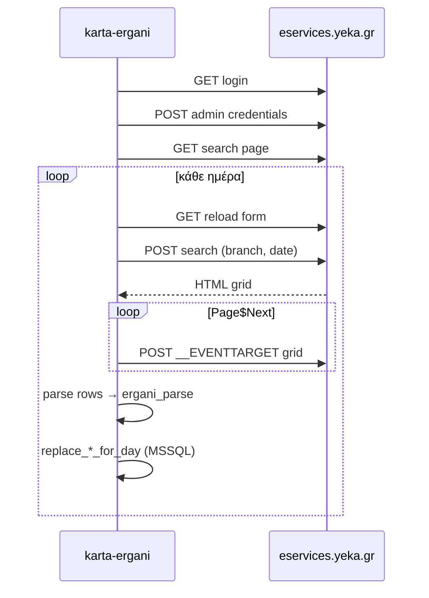

# CHANGELOG — karta-ergani

Όλες οι μεταβολές του project καταγράφονται εδώ (νέα πρώτα).

---

## 2026-06-09 — Κουμπί άδειας στην αρχική (WTOLeave)

### Backend

- **`app/leave_payload.py`**, **`app/leave_types.py`**, **`app/routes_leave.py`**
- `POST /api/leave/submit` → Ergani **`WTOLeave`** (Οργάνωση Χρόνου Εργασίας — Άδειες)
- `GET /api/leave/types` — κωδικοί τύπων άδειας (Παράρτημα 9)
- **`card_report.py`**: `leave_eligible` όταν δεν υπάρχει άφιξη και έχουν περάσει **ευελιξία + 1′** από την ώρα έναρξης

### UI (αρχική)

- Κουμπί **«Άδεια»** στη στήλη «Τι να γίνει» για επιλέξιμες γραμμές
- Modal: είδος άδειας + παρατηρήσεις → **Αποστολή στο Ergani**
- Αποθήκευση αίτησης στο `karta_declaration`

---

## 2026-06-05 — Ευέλικτη προσέλευση (EueliktoWrario)

### Βάση & sync

- Στήλη **`karta_employee.flex_arrival_minutes`** (`sql/alter_add_flex_arrival_minutes.sql`) — λεπτά ευελιξίας από EX_BASE_05 / `EueliktoWrario`.
- **`ergani_parse.parse_flex_arrival_minutes`**, **`upsert_employee`**, συγχρονισμός EX_BASE_05.

### Αναφορές & UI

- **`card_report.py`**: ανά εργαζόμενο tolerance (fallback 15′ αν `null`, 0′ αν μηδέν) για καθυστέρηση άφιξης / πρόωρη αποχώρηση.
- Στήλη **«Ευελ. (λεπτά)»** σε αρχική, ψηφιακό ωράριο, πραγματική απασχόληση, εργαζόμενους, ψηφιακή κάρτα.
- **`Office.formatFlexMinutes()`** στο `office-common.js`.

---

## 2026-06-05 — Sync logs στη βάση, αναλυτικά βήματα παντού

### Βάση (`karta_sync_run`, `karta_sync_log`)

- Migration: **`sql/alter_add_karta_sync_log.sql`** — κάθε συγχρονισμός = ένα `run_id` (UUID) + γραμμές log (INFO/WARN/ERROR).
- Module **`app/repo_sync_log.py`** — `create_run`, `append_line`, `update_run_progress`, `finish_run`, `list_lines`.

### Logging (`app/karta_log.py`)

- **`KartaLogger`** γράφει **μόνο στη βάση** (αφαιρέθηκε το `logs/karta-ergani.log`).
- Κάθε background job συνδέεται με `run_id`· status polling επιστρέφει **`log_lines`** από τη βάση.

### Επιλογή καταστήματος & πλήρης sync

- `POST /api/store/select` → auth + session, μετά **`{ async: true, job_id }`**· συγχρονισμός σε background.
- `GET /api/store/select/status/<job_id>` — progress + log γραμμές.
- **`iter_store_sync_events`** (`sync_service.py`): EX_BASE_01/02/05, portal ωράριο, portal πραγματική — με live βήματα όπως schedule/work-log.
- UI **`stores-list.js`**: sync panel + polling + scrollable log.

### Χειροκίνητος συγχρονισμός εργαζομένων

- `POST /api/ergani/sync-all` → async + `GET /api/ergani/sync-all/status/<job_id>`.
- UI **`employees-list.js`**: ίδιο pattern με καταστήματα.

### Portal sync (ωράριο / πραγματική)

- `run_id` περνά στο `iter_schedule_sync_events` / `iter_work_log_sync_events` — όλα τα logs στο ίδιο run.

---

## 2026-06-05 — Μία ειδοποίηση sync, live progress, logging

### Συγχρονισμός UI

- **Μία ειδοποίηση** κατά το sync — αφαιρέθηκε το διπλό μήνυμα (πίνακας + `schedMsg`). Μόνο το `#schedMsg` / `#workLogMsg` / `#wcMsg`.
- **`Office.runPortalSync()`** — για **διάστημα** ημερομηνιών: `POST` με `stream: true`, ανάγνωση **NDJSON** και ενημέρωση κειμένου σε πραγματικό χρόνο (π.χ. «Ενημέρωση ημερομηνίας 05/10/2026 (3/31)…»).
- Συγχρονισμός **ανά ημέρα** στο backend (μία σύνδεση portal, loop ημερομηνιών).

### Logging (`app/karta_log.py`)

- Καταγραφή σε **`logs/karta-ergani.log`** (append, thread-safe).
- **`KartaLogger`:** `info` / `warning` / `error` + buffer `entries` ανά διαδικασία.
- Portal sync: έναρξη, σύνδεση, αναζήτηση/αποθήκευση ανά ημέρα, ολοκλήρωση.
- Αποτέλεσμα sync: πεδίο **`logs`** στο JSON (`sync.logs`) για διάγνωση από UI/API.

### API progress (polling)

- Διάστημα ημερομηνιών: `POST /api/schedule/sync` ή `/api/work-log/sync` με `{ "from", "to" }` → **`{ "async": true, "job_id" }`** αμέσως.
- Frontend poll κάθε 400ms: `GET .../sync/status/<job_id>` → `message`, `step`, `total`, `status`.
- Progress bar στο μήνυμα loading (`office.css` `.sync-progress`).
- Module **`app/sync_jobs.py`** — background thread, αξιόπιστο live update (αντί buffered NDJSON).

---

## 2026-06-04 — UI, ταξινόμηση, portal sync διάστημα

### UI / μηνύματα

- **`office-common.js`:** `showLoading()` (spinner + «Παρακαλώ περιμένετε»), `setButtonLoading()` — κατά **συγχρονισμό** σε ωράριο, πραγματική, εργαζόμενους, κάρτα, επιλογή καταστήματος.
- **`office.css`:** animation `bi-spin`, κλάση `.msg.loading`, διόρθωση κενού ανάμεσα σε εικονίδιο (✓/⚠) και κείμενο στα `.msg`.
- **`work-card-list.js`:** κουμπί «Συγχρονισμός & ανανέωση» — πρώτα `POST /api/work-log/sync`, μετά φόρτωση πινάκων.

### Ταξινόμηση λιστών

| Σελίδα | Αρχείο | Σειρά |
|--------|--------|-------|
| **Αρχική** (`/ui/`) | `card_report.py`, `home.js` | Πρώτα όσοι **έχουν** ψηφ. ωράριο (ώρες ή τύπος βάρδιας)· στο τέλος «—»· μέσα σε κάθε ομάδα `_STATUS_ORDER` + επώνυμο |
| **Ψηφιακό ωράριο** (`/ui/schedule`) | `repo_schedule.py`, `schedule-list.js` | 1) **Ημερομηνία** (πολλαπλές ημέρες) · 2) με ώρες Από/Έως · 3) χωρίς ώρες **αλφαβητικά κατά Τύπο** · 4) επώνυμο |

### Portal sync — διάστημα ημερομηνιών (διόρθωση)

**Πρόβλημα:** Σε εύρος ημερομηνιών (όχι μόνο σήμερα/χθες) το parse συχνά δεν έφερνε αποτελέσματα — λάθος/ελλιπή `name` στα πεδία `DateFromEdit` / `DateToEdit` (μόνο underscore, όχι `$`).

**Λύση:**

- Νέο **`app/portal_form_util.py`:** `discover_date_input_names()`, `set_portal_dates()` — ανίχνευση πεδίων από HTML + fallback και `$` και `_`.
- **`portal_schedule_sync.py`:** `_search_schedule()` με `_extract_aspnet_form_data` (συμπεριλαμβανομένων text πεδίων)· για **διάστημα** μία αναζήτηση `Από` = πρώτη ημέρα, `Έως` = τελευταία· ομαδοποίηση ανά `work_date` στο grid· fallback ανά ημέρα αν αποτύχει.
- **`portal_work_log_sync.py`:** ίδια λογική (`_search_work_log`, `_persist_work_log_items`).
- **UI sync μηνύματα:** `schedule-list.js`, `work-log-list.js` — εμφάνιση `days_synced / work_dates.length` και πρώτων `errors[]` σε αποτυχία.

Μετά αλλαγές Python: **επανεκκίνηση Flask** (`python run.py` ή `scripts/restart_server.ps1`).

---

## Αναλυτική κατάσταση project (2026-06-04)

Πλήρης εικόνα όσων έχουν υλοποιηθεί μέχρι σήμερα — για onboarding και συνέχιση ανάπτυξης.

### Σκοπός

Flask εφαρμογή για **λογιστικό γραφείο**: διαχείριση πολλών σημείων/καταστημάτων Ergani, συγχρονισμός **ψηφιακού ωραρίου** και **πραγματικής απασχόλησης** από το portal `eservices.yeka.gr`, σύγκριση με **δηλώσεις ψηφιακής κάρτας** (WRKCardSE) στην αρχική, και ροή εγγραφής καταστήματος (wizard 3 βημάτων).

Βάση: **MSSQL `ergani-karta`**, μόνο **pyodbc** (χωρίς ORM). Πίνακες με πρόθεμα `karta_*`.

**Πίνακας περιεχομένων οδηγού:** [0 Εκκίνηση](#0-εκκίνηση-εφαρμογής) · [1 Καταστήματα](#1-λίστα-καταστημάτων) · [2 Wizard](#2-wizard-καταστήματος-3-βήματα) · [3 Ενεργό κατάστημα](#3-επιλογή-ενεργού-καταστήματος) · [4 API sync](#4-συγχρονισμός-ergani-api) · [5 Portal parse](#διαδικασία-portal-parse-αναλυτικά) · [6 Ωράριο / work-log UI](#6-σελίδες-ωραρίου-και-πραγματικής) · [7 Αρχική](#7-αρχική-αναφορά-card-report) · [8 Κάρτα WRKCardSE](#8-υποβολή-κτυπήματος-κάρτας-api)

---

### 0. Εκκίνηση εφαρμογής {#0-εκκίνηση-εφαρμογής}

| Βήμα | Τι γίνεται |
|------|-----------|
| 1 | `pip install -r requirements.txt` |
| 2 | `.env` από `.env.example` — `DB_PASSWORD`, προαιρετικά `ERGANI_*`, `WORK_CARD_API_KEY` |
| 3 | `python scripts/apply_schema.py` ή `sql/setup_run_as_admin.sql` (DBA) |
| 4 | `python run.py` → Flask port **5051** (`/health` → `ok`, `database`) |
| 5 | Browser → `/` ανακατευθύνει σε `/ui/` (αρχική) |

Μετά αλλαγή Python backend: επανεκκίνηση Flask (αλλιώς παλιός κώδικας / 404 HTML).

---

### 1. Λίστα καταστημάτων {#1-λίστα-καταστημάτων}

**UI:** `/ui/stores` · **JS:** `stores-list.js`

| Ενέργεια χρήστη | Backend / αποτέλεσμα |
|-----------------|----------------------|
| Φόρτωση σελίδας | `GET /api/store/list` — λίστα `karta_store_config`, passwords **masked** (`********`) |
| **Νέο κατάστημα** | `Office.clearDraft()` → `/ui/stores/credentials` (κενό draft) |
| **Επεξεργασία** | `GET /api/store/<id>` — **πλήρη** passwords για φόρμα · draft στο `sessionStorage` (`kartaStoreDraft`) |
| **Επιλογή** | Βλ. [§3](#3-επιλογή-ενεργού-καταστήματος) |
| **Διαγραφή** | `DELETE /api/store/<id>` — καθάρισμα Flask session αν ήταν ενεργό |

---

### 2. Wizard καταστήματος (3 βήματα) {#2-wizard-καταστήματος-3-βήματα}

Draft: `sessionStorage` key `kartaStoreDraft` (όνομα, credentials, token, branches, branch_aa, κωδικοί ΤΕΕΣ/ΟΑΕΔ/ΚΑΔ/Καλλικράτη).

#### Βήμα 1 — Διαπιστευτήρια

**UI:** `/ui/stores/credentials` · **JS:** `store-credentials.js`

**Πεδία φόρμας:**

| UI | Πεδία draft/API | Ρόλος |
|----|-----------------|-------|
| Όνομα σημείου | `name` | Εμφάνιση στο γραφείο |
| Admin username/password, usertype | `username`, `password`, `usertype` | Portal parse (01) |
| Web username/password | `web_username`, `web_password` | Ergani API (02) |
| Περιβάλλον API | `ergani_env` | `production` / `trial` |

**Κλικ «Συνέχεια» — σειρά ενεργειών:**

| # | Ενέργεια | Endpoint / module |
|---|----------|-------------------|
| 1 | Client validation: όνομα, web, admin | — |
| 2 | Έλεγχος credentials | `POST /api/store/verify-wizard` → `_resolve_wizard_secrets` → `verify_store_wizard`: **web** `authenticate` API · **admin** `_login_session` portal |
| 3 | Δεύτερο API login (για token wizard) | `POST /api/ergani/auth/authenticate` με web, usertype `02`, header `X-Ergani-Env` |
| 4 | Λίστα παραρτημάτων | `GET /api/ergani/branches` με Bearer — `EX_BASE_02` |
| 5 | Αποθήκευση μερικών στοιχείων DB | `POST /api/store/credentials` → `repo.save_store_credentials` (admin + web + `ergani_env`, προαιρετικό `id`) |
| 6 | Ενημέρωση draft + redirect | `accessToken`, `employer_afm` από auth, `branches[]` → `/ui/stores/branch` |

**Επεξεργασία (`?edit=1`):** φόρτωση `GET /api/store/<id>` πριν τη συμπλήρωση φόρμας.

#### Βήμα 2 — Παράρτημα

**UI:** `/ui/stores/branch` · **JS:** `store-branch.js`

| # | Ενέργεια |
|---|----------|
| 1 | Αν λείπει `accessToken` ή `branches` → redirect credentials |
| 2 | Εμφάνιση dropdown από `draft.branches` (ήδη από EX_BASE_02) |
| 3 | Χρήστης επιλέγει `branch_aa` |
| 4 | `Office.setDraft({ branch_aa })` → `/ui/stores/mappings` |

Δεν γίνεται ακόμα τελική αποθήκευση όλων των πεδίων — μόνο draft.

#### Βήμα 3 — Χαρτογραφήσεις (ΤΕΕΣ, ΟΑΕΔ, ΚΑΔ, Καλλικράτης)

**UI:** `/ui/stores/mappings` · **JS:** `store-mappings.js`

| # | Ενέργεια | Endpoint |
|---|----------|----------|
| 1 | Έλεγχος draft (`accessToken`, `branch_aa`) | — |
| 2 | Φόρτωση καταλόγων | `GET /api/ergani/catalog/sepe|oaed|kad` με Bearer + `X-Ergani-Env` — `EX_BASE_03` |
| 3 | Autocomplete Καλλικράτη | `GET /api/ergani/kallikratis/search?q=` (τοπική DB `karta_kallikratis` αν υπάρχει) |
| 4 | Υποχρεωτική επιλογή ΤΕΕΣ, ΟΑΕΔ, ΚΑΔ από λίστα | — |
| 5 | **Αποθήκευση** | `POST /api/store/save` — πλήρες `karta_store_config` (credentials, branch, sepe/oaed/kad/kallikratis codes+desc) |
| 6 | `Office.clearDraft()` → `/ui/stores` | — |

---

### 3. Επιλογή ενεργού καταστήματος {#3-επιλογή-ενεργού-καταστήματος}

**UI:** κουμπί «Επιλογή» στη λίστα · sidebar banner ενεργού σημείου (`office-common.js`).

**`POST /api/store/select`:**

| # | Backend |
|---|---------|
| 1 | Φόρτωση `karta_store_config` by `id` |
| 2 | `api_login_credentials` → `ErganiClient.authenticate` (web, 02) |
| 3 | Flask **session**: `active_store_id`, `ergani_bearer`, `employer_afm`, `branch_aa`, `ergani_env` |
| 4 | `sync_store_from_ergani(...)` — βλ. [§4](#4-συγχρονισμός-ergani-api) |
| 5 | JSON απάντηση: `store` + `sync.sync_results` (employer, branches, employees, schedule, work_log) |

**`GET /api/store/active`:** τρέχον ενεργό (χωρίς sync).

**`resolve_active_store()`** (`http_helpers.py`): όλες οι σελίδες ωραρίου/εργαζομένων/αναφοράς διαβάζουν session + DB context (`store_api_context`).

---

### 4. Συγχρονισμός Ergani API {#4-συγχρονισμός-ergani-api}

**Module:** `app/sync_service.py` · κλήση: μετά `select`, `POST /api/ergani/sync-all`, ή χειροκίνητα από σελίδα εργαζομένων.

**Προϋπόθεση:** ενεργό κατάστημα + **web** credentials + Bearer (session ή header).

| Σειρά | Υπηρεσία | Τι αποθηκεύεται |
|-------|----------|-----------------|
| 1 | `EX_BASE_01` | `karta_employer` — ΑΦΜ, επωνυμία |
| 2 | `EX_BASE_02` | `karta_parartima` — όλα τα παραρτήματα εργοδότη |
| 3 | `EX_BASE_05` | `karta_employee` + `karta_employment` για το **επιλεγμένο** `branch_aa` · `deactivate_stale_employments` για ΑΦΜ που έφυγαν από απάντηση |
| 4 | Portal ωράριο (σήμερα) | `fetch_and_save_schedule_for_ctx` — 1 ημέρα, [§5](#διαδικασία-portal-parse-αναλυτικά) |
| 5 | Portal πραγματική (σήμερα) | `fetch_and_save_work_log_for_ctx` — 1 ημέρα, [§5](#διαδικασία-portal-parse-αναλυτικά) |
| 6 | `touch_last_sync` | ενημέρωση timestamp καταστήματος |

**Σημείωση:** EX_BASE_08/07 JSON **δεν** χρησιμοποιούνται για sync — μόνο portal HTML.

**`POST /api/ergani/auth/authenticate`:** γενικό login (wizard ή integrations) — επιστρέφει `accessToken`, `employer_afm`.

**`GET /api/ergani/branches`**, **`/catalog/<type>`**, **`/kallikratis/search`:** απαιτούν Bearer + `X-Ergani-Env`.

---

### 6. Σελίδες ωραρίου και πραγματικής {#6-σελίδες-ωραρίου-και-πραγματικής}

#### Ψηφιακό ωράριο

**UI:** `/ui/schedule` · **JS:** `schedule-list.js`

| Ενέργεια | Ροή |
|----------|-----|
| Άνοιγμα | Date picker **διάστημα** (chips Από/Έως, max 31 ημέρες) · `onApply` → φόρτωση |
| Προβολή | `GET /api/store/active` → `GET /api/schedule/list?date=` ή `?from=&to=` από `karta_schedule` · ταξινόμηση `sort_schedule_rows()` |
| **Συγχρονισμός Ergani** | `POST /api/schedule/sync` body `{ date }` ή `{ from, to }` → portal: **μία** αναζήτηση διάστημα ή fallback ανά ημέρα → `replace_schedule_for_day` ανά `work_date` |
| Loading | `showLoading` + spinner στο κουμπί και στον πίνακα κατά το parse |
| Μετά sync | `loadSchedule()` — πίνακας: πρώτα ημέρα → με ώρες → χωρίς ώρες (Τύπος α-ω) |

#### Πραγματική απασχόληση

**UI:** `/ui/work-log` · **JS:** `work-log-list.js` (ίδια λογική με ωράριο)

| Ενέργεια | Ροή |
|----------|-----|
| Προβολή | `GET /api/work-log/list?...` από `karta_work_log` |
| Sync | `POST /api/work-log/sync` → `sync_work_log_from_portal` |

Αν λείπουν πίνακες: HTTP 503 + hint `sql/alter_add_karta_schedule.sql` / `alter_add_karta_work_log.sql`.

#### Εργαζόμενοι

**UI:** `/ui/employees` · **JS:** `employees-list.js`

| Ενέργεια | Ροή |
|----------|-----|
| Προβολή | `GET /api/employees/list` — join τοπικής βάσης για ενεργό `(employer_afm, branch_aa)` |
| **Συγχρονισμός Ergani** | `POST /api/ergani/sync-all` ή επανάληψη βημάτων EX_BASE_01/02/05 (όχι portal) |

---

### 7. Αρχική αναφορά (card-report) {#7-αρχική-αναφορά-card-report}

**UI:** `/ui/` · **JS:** `home.js` · **Backend:** `app/card_report.py` · `GET /api/dashboard/card-report?date=YYYY-MM-DD`

**Προϋπόθεση:** ενεργό κατάστημα στο session.

| # | Βήμα backend |
|---|--------------|
| 1 | `resolve_active_store()` |
| 2 | Μετατροπή ημερομηνίας σε Ergani `dd/mm/yyyy` |
| 3 | Φόρτωση `karta_schedule`, `karta_work_log`, `karta_card_event` (είσοδος/έξοδος ανά ΑΦΜ) για `(employer_afm, branch_aa, date)` |
| 4 | Ένωση ανά ΑΦΜ εργαζομένου · `_evaluate_row` για κατάσταση |
| 5 | Ταξινόμηση: πρώτα γραμμές **με** ψηφ. ωράριο (`_schedule_shows_blank` = false), μετά χωρίς · μέσα σε κάθε ομάδα `_STATUS_ORDER` + επώνυμο (`home.js` `sortReportRows` ίδια λογική) |

**Καταστάσεις (`_evaluate_row`) — λογική:**

| status | Πότε |
|--------|------|
| `rest` | Ρεπό/ανάπαυση στο ωράριο (markers ΑΝΑΠΑΥΣΗ, ΡΕΠΟ, κ.λπ.) |
| `no_schedule` | Δεν υπάρχει εγγραφή ωραρίου |
| `unscheduled_work` | Πραγματική/κάρτα χωρίς ωράριο |
| `pending` | Πριν την ώρα έναρξης βάρδιας (>30 λεπτά νωρίτερα) |
| `needs_checkin` | Ώρα βάρδιας, χωρίς άφιξη πραγματική/κάρτα |
| `late_arrival` | Άφιξη >15 λεπτά μετά το ωράριο |
| `at_work` | Άφιξη, χωρίς αποχώρηση, πριν/εντός βάρδιας |
| `needs_checkout` | Μετά το τέλος βάρδιας, χωρίς έξοδο |
| `completed` | Πλήρεις ώρες πραγματικής (σύγκριση με ωράριο, σημειώσεις καθυστέρησης) |
| `absent` | Ώρα βάρδιας πέρασε, χωρίς άφιξη |

UI: chips σύνοψης, πίνακας (ωράριο / πραγματική / κάρτα είσοδος-έξοδος / κατάσταση / ενέργεια).

---

### 8. Υποβολή κτυπήματος κάρτας (API) {#8-υποβολή-κτυπήματος-κάρτας-api}

**Endpoint:** `POST /api/work-card/event` · **Κωδικός Ergani:** `WRKCardSE` (Documents).

**Προορισμός:** εξωτερικά συστήματα (ταμείο, κιοσκ) — όχι κύριο κουμπί στο office UI.

| # | Βήμα |
|---|------|
| 1 | Προαιρετικό `X-Work-Card-Api-Key` (αν οριστεί στο `.env`) |
| 2 | JSON: `employer_afm`, `branch_aa`, `employee_afm`, `event` ή `f_type` (0 είσοδος / 1 έξοδος), `reference_date`, κ.λπ. |
| 3 | Bearer από header **ή** auto-login καταστήματος `get_store_by_afm` + web credentials |
| 4 | Έλεγχος εργαζομένου στη βάση · αποφυγή διπλότυπου `card_event_exists` |
| 5 | `build_wrk_card_se_payload` → `ErganiClient.document_submit` |
| 6 | `persist_wrk_card_submit`: `karta_declaration` (protocol, submitDate, `ergani_submission_id`) + `karta_card_event` |

**`GET /api/work-card/info`:** metadata υπηρεσίας.

---

### Διπλά διαπιστευτήρια ανά κατάστημα

| Ρόλος | Στήλες DB / πεδία UI | Usertype | Χρήση |
|--------|----------------------|----------|--------|
| **Web** | `web_username`, `web_password` | `02` | **Μόνο Ergani REST API**: `authenticate`, `EX_BASE_01/02/03/05`, επιλογή παραρτήματος, bearer session |
| **Admin** | `username`, `password`, `usertype` | `01` (π.χ. EFKA…) | **Μόνο portal** `eservices.yeka.gr`: login HTML, parse σελίδων ωραρίου / πραγματικής |

Κεντρική λογική: `app/ergani_env.py` — `api_login_credentials()`, `portal_login_credentials()` **χωρίς** fallback web→portal.

Migration web πεδίων: `sql/alter_add_store_web_credentials.sql` · ενημέρωση `sql/schema.sql`.

### Περιβάλλον Ergani ανά κατάστημα (`ergani_env`)

Κανόνας: **δοκιμαστικό → όλα στο `trialv2eservices.yeka.gr`** · **παραγωγή → όλα στο `eservices.yeka.gr`**.

| Υπηρεσία | Παραγωγή | Δοκιμαστικό |
|----------|----------|-------------|
| REST API | `https://eservices.yeka.gr/WebservicesAPI/Api/` | `https://trialv2eservices.yeka.gr/WebservicesAPI/Api/` |
| Portal parse (ωράριο, πραγματική, wizard admin) | `https://eservices.yeka.gr/` | `https://trialv2eservices.yeka.gr/` |

- Στήλη `ergani_env` στο `karta_store_config` · επιλογή στο wizard.
- Κεντρικά: `app/ergani_env.py` — `base_url_for_env`, `portal_base_for_env`, `store_api_context` (περιλαμβάνει `api_base_url` + `portal_base_url`).
- Session ενεργού καταστήματος: όλες οι κλήσεις μετά «Επιλογή» χρησιμοποιούν το URL του καταστήματος.
- Wizard / κλήσεις με `X-Ergani-Env` ή `ergani_env` στο JSON.
- `config.py`: global `.env` `ERGANI_API_BASE_URL` μόνο για προεπιλογή· αν υπάρχει παλιό `trialeservices` χωρίς `trialv2`, διορθώνεται σε παραγωγή.

### Διαδικασία portal parse (αναλυτικά) {#διαδικασία-portal-parse-αναλυτικά}

Το parse **δεν** χρησιμοποιεί Ergani REST API (`EX_BASE_08` / `EX_BASE_07`). Προσομοιώνει τον browser στο **ASP.NET WebForms** portal `https://eservices.yeka.gr/` με `requests.Session`, admin credentials (`portal_login_credentials`) και HTML parsing.

#### 1. Σύνδεση (`_login_session`)

| Βήμα | Ενέργεια |
|------|----------|
| 1 | `GET` αρχική σελίδα portal |
| 2 | `_find_login_form`: εντοπισμός φόρμας με `SiteLogin$UserName` |
| 3 | `_asp_hidden`: συλλογή hidden fields (`__VIEWSTATE`, `__EVENTVALIDATION`, …) |
| 4 | `POST` με `UserName`, `Password`, `Login=Είσοδος` |
| 5 | Έλεγχος: αν παραμένει `SiteLogin$UserName` ή `text-danger` → αποτυχία |
| 6 | Προαιρετικά `GET Default.aspx` αν εμφανιστεί στη σελίδα |

**Σημαντικό:** Δεν στέλνεται το checkbox «Σύνδεση με κωδικούς ΕΡΓΑΝΗ» — για EFKA (01) και web user (02) το checkbox προκαλεί αποτυχία login στο portal.

#### 2. Άνοιγμα σελίδας αναζήτησης

| Δεδομένα | URL path | Έλεγχος φόρτωσης |
|----------|----------|-------------------|
| Ψηφιακό ωράριο | `Mitroa/ErgazomenosWorkingSearch.aspx` | `ErgazomenosWorkingSearchControl` στο HTML |
| Πραγματική απασχόληση | `WTO/Workcard/DailyWorkTimesSearch.aspx` | `DailyWorkTimesSearchControl` στο HTML |

Κοινά helpers (ωράριο): `_open_current_status` · (work-log): `_open_daily_work_times` στο `portal_work_log_sync.py`.

#### 3. Αναζήτηση (`_search_schedule` / `_search_work_log`)

Διάστημα sync (έως 31 ημέρες, `iso_to_ergani_dates`):

1. **Πολλαπλές ημέρες:** μία αναζήτηση `DateFromEdit` = πρώτη ημέρα, `DateToEdit` = τελευταία · parse grid με στήλη ημερομηνίας (index 4) · `_persist_*_items` ανά `work_date`.
2. **Fallback:** αν αποτύχει το διάστημα, επανάληψη **ανά ημέρα** (Από = Έως = ημέρα).
3. **Μία ημέρα:** απευθείας βήμα 2.

Κάθε αναζήτηση:

1. **Reload** σελίδας (`GET page_url`).
2. `_extract_aspnet_form_data(..., include_text=True)` + `set_portal_dates()` από `portal_form_util.py` (ανίχνευση `name` από HTML, fallback `$` και `_`).
3. **Παράρτημα:** `PararthmaListEdit` = `_pick_pararthma(html, branch_aa)`.
4. **Φίλτρα κενά:** ΑΦΜ, επώνυμο, όνομα.
5. **Κουμπί:** `SearchControlSearchButton` = `Αναζήτηση`.
6. `POST` · αν `error.aspx` → σφάλμα.

#### 4. Parse πίνακα αποτελεσμάτων (`_parse_grid_rows`)

- Σάρωση `<tr>` στο HTML απάντησης.
- Κρατούνται μόνο γραμμές με `<td class="MovableElement">` (grid Ergani).
- Αγνοούνται γραμμές pagination (`Page$Next`).
- **Φίλτρο ΑΦΜ:** η 2η στήλη πρέπει να είναι `8–11` ψηφία.
- Κείμενο κελιών: αφαίρεση tags, collapse whitespace.

**Στήλες grid (0-based index):**

| Index | Ψηφιακό ωράριο (≥9 κελιά) | Πραγματική απασχόληση (≥7 κελιά) |
|-------|---------------------------|----------------------------------|
| 0 | `source_aa` (aa γραμμής) | id |
| 1 | ΑΦΜ εργαζομένου | ΑΦΜ |
| 2 | Όνομα | Όνομα |
| 3 | Επώνυμο | Επώνυμο |
| 4 | Ημερομηνία εργασίας | Ημερομηνία |
| 5 | Ψηφιακή οργάνωση (στο extra) | Ώρα από |
| 6 | Κάρτα (στο extra) | Ώρα έως |
| 7 | Διάλειμμα (κείμενο) | — |
| 8 | Απασχόληση / βάρδια (regex ή ΡΕΠΟ) | — |

#### 5. Σελιδοποίηση (`_collect_all_grid_rows`)

- Αν στο HTML υπάρχει `__doPostBack` με `Page$Next` (έως **80** σελίδες, `MAX_GRID_PAGES`):
  - `POST` με `__EVENTTARGET` = grid control (`ErgazomenosWorkingGridControl$Grid$Grid` ή `DailyWorkTimesGridControl$Grid$Grid`).
  - `__EVENTARGUMENT` = `Page$Next`.
  - Αφαιρείται το κουμπί αναζήτησης από το payload (αποφυγή διπλού submit).
- Συγχώνευση όλων των γραμμών από όλες τις σελίδες.

#### 6. Μετατροπή σε εγγραφές DB (`app/ergani_parse.py`)

| Συνάρτηση | Είσοδος | Έξοδος |
|-----------|---------|--------|
| `portal_rows_to_schedule_items` | γραμμές 9 κελιών + `default_work_date` | dict για `karta_schedule` |
| `portal_rows_to_work_log_items` | γραμμές 7 κελιών + `default_work_date` | dict για `karta_work_log` |

**Ωράριο — λογική κελιού 8 (απασχόληση):**

- Regex `^(\S+)\s+(\d{1,2}:\d{2})\s*-\s*(\d{1,2}:\d{2})$` → `shift_type`, `hour_from`, `hour_to`.
- Αλλιώς αν «ΑΝΑΠΑΥΣΗ»/«ΡΕΠΟ» → `ΑΝΑΠΑΥΣΗ/ΡΕΠΟ` · αν «ΜΗ ΕΡΓΑΣΙΑ» → αντίστοιχο shift.
- Κελί 7: `break_in_work=1` αν περιέχει «Εντός».
- `extra`: συνένωση ΨΟ, Κάρτα, κείμενο διαλείμματος.

**Work-log:** ώρες από κελιά 5–6, κενές/`—` → κενό string.

Ημερομηνίες: `_normalize_portal_date` (μορφές `dd/mm/yyyy`, `dd/mm/yy`).

#### 7. Αποθήκευση

Για κάθε ημέρα του διαστήματος:

1. `upsert_employee_by_afm` (μία φορά ανά ΑΦΜ ανά ημέρα).
2. `replace_schedule_for_day` ή `replace_work_log_for_day` — **αντικατάσταση** όλων των εγγραφών της ημέρας για `(employer_afm, branch_aa)` (όχι merge ανά γραμμή).

Entry points:

- `sync_schedule_from_portal(ctx, from_iso, to_iso)` → καλείται από `schedule_sync.fetch_and_save_schedule*` (bearer API **αγνοείται**).
- `sync_work_log_from_portal(...)` → από `work_log_sync`.

Αποτέλεσμα JSON sync: `success`, `count`, `days_synced`, `errors[]`, `source: "portal"`.

#### 8. Διάγραμμα ροής (σύντομα)

#### Σχετικά αρχεία

| Αρχείο | Ρόλος |
|--------|--------|
| `app/portal_schedule_sync.py` | Login, ωράριο, grid 9 στ., pagination |
| `app/portal_work_log_sync.py` | Work-log σελίδα, grid 7 στ. (κοινό login από schedule) |
| `app/ergani_parse.py` | `portal_rows_to_schedule_items`, `portal_rows_to_work_log_items` |
| `app/schedule_sync.py` / `app/work_log_sync.py` | Thin wrapper προς portal (χωρίς API bearer) |
| `app/portal_auth.py` | `verify_admin_portal` = μόνο βήμα login για wizard |

**Σημείωση:** Οι συναρτήσεις `parse_schedule` / `parse_work_log` στο ίδιο αρχείο αφορούν **JSON από Ergani API** (ExecuteService), όχι το portal HTML — δεν χρησιμοποιούνται για το τρέχον sync ωραρίου/πραγματικής.

### UI λογιστικού γραφείου

- `/` → redirect `/ui/home`.
- Σελίδες: αρχική, καταστήματα, credentials, branch, mappings, εργαζόμενοι, ψηφιακό ωράριο, πραγματική απασχόληση.
- Κοινό: `office.css`, Bootstrap Icons, `office-common.js`, inline date picker (chips Από/Έως).
- Blueprint UI: `app/routes_ui.py` · API stores: `routes_store.py` · ergani: `routes_ergani.py`.

### Αποθήκευση απάντησης Ergani (κάρτα)

Μετά POST Documents: `id`, `protocol`, `submitDate` στον **γονικό** `karta_declaration` (`ergani_submission_id`, `protocol`, `submit_date_text`, `response_json`). Γραμμές κτυπήματος στο `karta_card_event` με `declaration_id`.

### SQL / εγκατάσταση

| Αρχείο | Σκοπός |
|--------|--------|
| `sql/schema.sql` | Πλήρες σχήμα `karta_*` |
| `sql/setup_run_as_admin.sql` | One-shot εγκατάσταση από DBA (sysadmin) |
| `sql/alter_add_karta_schedule.sql` | Ψηφιακό ωράριο |
| `sql/alter_add_karta_work_log.sql` | Πραγματική απασχόληση |
| `sql/alter_add_store_web_credentials.sql` | Web credentials |
| `sql/alter_add_ergani_env.sql` | Περιβάλλον API |
| `sql/alter_add_ergani_submission_id.sql` | Submission id δήλωσης |

Εφαρμογή: `python scripts/apply_schema.py`.

### Λειτουργία ανάπτυξης

- Εκκίνηση: `python run.py` — port **5051** (ή `PORT` στο περιβάλλον).
- Μετά **οποιαδήποτε αλλαγή Python backend**, απαιτείται επανεκκίνηση του Flask· αλλιώς 404 HTML / `SyntaxError` στο JSON parse.
- Επανεκκίνηση (PowerShell): σταμάτημα διεργασίας στο port 5051, μετά `python run.py` από τη ρίζα του project.

### Δοκιμές / παρατηρήσεις

- **webuser3** (τύπος 02): OK στο API, αποτυχία στο portal (αναμενόμενο).
- **EFKA…** (τύπος 01): OK στο portal.
- Μέχρι επιτυχές αποθήκευση wizard, `web_username`/`web_password` στη DB μπορεί να είναι NULL.

### Διορθώσεις (τελευταία)

- **`_resolve_wizard_secrets`** (`routes_store.py`): το `pick()` διάβαζε μόνο `admin_username`/`admin_password` αντί για `username`/`password` που στέλνει το JS → ψευδές «Υποχρεωτικά admin…» παρότι τα πεδία ήταν γεμάτα. Διορθώθηκε: δοκιμή όλων των ονομάτων πεδίων με σειρά.

---

## 2026-06-04 — Διόρθωση wizard credentials (`_resolve_wizard_secrets`)

- Bug: `pick("username", "admin_username")` έπαιρνε μόνο το δεύτερο key όταν υπήρχε `alt` → κενά admin στο verify.
- Fix: `pick(*keys)` δοκιμάζει `username`, `admin_username` κ.λπ. μέχρι να βρει τιμή.
- Μετά την αλλαγή: επανεκκίνηση Flask στο port 5051.

---

## 2026-06-04 — Διόρθωση σύνδεσης wizard (παραγωγή)

- `.env` στο project: `eservices.yeka.gr` (υπερισχύει Windows User env `trialv2`).
- Σαφέστερο μήνυμα σφάλματος auth + ετικέτα Usertype «Εξωτερικός».

---

## 2026-06-04 — Ergani API παραγωγής

- Προεπιλογή `ERGANI_API_BASE_URL`: `https://eservices.yeka.gr/WebservicesAPI/Api/` (αντί trial).
- Αν στο `.env` υπάρχει παλιό `trialeservices.yeka.gr` (χωρίς `trialv2`), αντικαθίσταται αυτόματα από το `config.py`.

---

## 2026-06-04 — Πραγματική απασχόληση (EX_BASE_07)

- Μενού **Πραγματική απασχόληση** (`/ui/work-log`), `GET /api/work-log/list`, `POST /api/work-log/sync`.
- Πίνακας `karta_work_log`, συγχρονισμός με επιλογή καταστήματος και date picker GA.
- Migration: `sql/alter_add_karta_work_log.sql`.

---

## 2026-06-04 — Περιβάλλον Ergani ανά κατάστημα

- Στήλη `ergani_env` (`production` | `trial`) στο `karta_store_config`.
- Επιλογή στο wizard διαπιστευτηρίων· όλες οι κλήσεις Ergani χρησιμοποιούν το URL του καταστήματος.
- Migration: `sql/alter_add_ergani_env.sql`.

---

## 2026-06-04 — Μηνύματα Ergani (EX_BASE_07/08)

- HTTP 400 «Service Code is not authenticate…» → σαφής εξήγηση (έλλειψη εξουσιοδότησης API χρήστη).

---

## 2026-06-04 — Date picker inline

- Αφαίρεση GA popup· chips + πεδία Από/Έως στο toolbar, εφαρμογή αμέσως.

---

## 2026-06-04 — Date picker στυλ Google Analytics (αποσύρθηκε)

- ~~Πάνελ presets + Εφαρμογή/Άκυρο~~ — αντικαταστάθηκε από inline picker.
- `GET /api/schedule/list?from=&to=` και sync πολλών ημερών (έως 14).

---

## 2026-06-04 — Ψηφιακό ωράριο (EX_BASE_08)

- Μενού **Ψηφιακό ωράριο** (`/ui/schedule`), `GET /api/schedule/list`, `POST /api/schedule/sync`.
- Πίνακας `karta_schedule`· συγχρονισμός με επιλογή καταστήματος (σήμερα) και από τη σελίδα ωραρίου ανά ημερομηνία.
- Migration: `sql/alter_add_karta_schedule.sql`.

---

## 2026-06-04 — Εργαζόμενοι & συγχρονισμός Ergani

- Μενού **Εργαζόμενοι** (`/ui/employees`), API `GET /api/employees/list`.
- Με **επιλογή καταστήματος** αυτόματος συγχρονισμός: EX_BASE_01 (εργοδότης), EX_BASE_02 (παραρτήματα), EX_BASE_05 (εργαζόμενοι)· κλήση EX_BASE_08/07 (χωρίς αποθήκευση ακόμα).
- `POST /api/ergani/sync-all` για χειροκίνητο sync· `app/sync_service.py`, `routes_sync.py`.

---

## 2026-06-04 — Εικονίδια UI (Bootstrap Icons)

- Bootstrap Icons στο `office.css`· κουμπιά, sidebar, βήματα wizard, banner ενεργού καταστήματος, πίνακας καταστημάτων.

---

## 2026-06-04 — UI λογιστικού γραφείου (ξεχωριστές σελίδες)

- Νέο UI στο `/ui/` (χωρίς σχέση με `console.html` του ergani): `home`, λίστα καταστημάτων, wizard 3 βημάτων (credentials → παράρτημα → ΤΕΕΣ/ΟΑΕΔ/ΚΑΔ/Καλλικράτης).
- Κάθε οθόνη = ξεχωριστό HTML (`app/static/ui/`) και ξεχωριστό endpoint σε `app/routes_ui.py`.
- API blueprints: `routes_store.py` (`/api/store/*`), `routes_ergani.py` (`/api/ergani/*`).
- Ροή Ergani: `authenticate` → `EX_BASE_02` branches → `EX_BASE_03` catalogs + αναζήτηση Καλλικράτη.
- Draft wizard στο `sessionStorage` (`kartaStoreDraft`). Η αρχική `/` ανακατευθύνει στο `/ui/`.

---

## 2026-06-04 — Script εγκατάστασης για DBA

- Προστέθηκε `sql/setup_run_as_admin.sql`: δημιουργία βάσης, `db_owner` για login `ergani`, όλοι οι πίνακες `karta_*`. Τρέχει **μία φορά** στο SSMS ως διαχειριστής (όχι με login `ergani`).

---

## 2026-06-04 — Αποθήκευση απάντησης Ergani (id / protocol / submitDate)

### Σχεδιασμός

Η απάντηση μετά το «χτύπημα» κάρτας (HTTP 200, JSON `[{ "id", "protocol", "submitDate" }]`) **δεν** μπαίνει στις στήλες `f_*` του `karta_card_event`. Εκεί μένουν μόνο τα στοιχεία του κτυπήματος (ΑΦΜ, τύπος 0/1, ώρες κ.λπ.).

Η απάντηση Ergani αποθηκεύεται στον **γονικό** πίνακα `karta_declaration`:

| Πεδίο Ergani | Στήλη DB |
|--------------|----------|
| `id` (π.χ. `5440089`) | `ergani_submission_id` |
| `protocol` (π.χ. `AK - KAP198345`) | `protocol` |
| `submitDate` (π.χ. `04/06/2026 10:39`) | `submit_date_text` |
| ολόκληρο JSON | `response_json` |
| HTTP status | `http_status`, `success` |

Κάθε γραμμή `karta_card_event` συνδέεται με `declaration_id` → FK προς `karta_declaration`.

### Αλλαγές κώδικα

- `sql/schema.sql`: στήλη `ergani_submission_id` στο `karta_declaration`
- `sql/alter_add_ergani_submission_id.sql`: migration για υπάρχουσα βάση
- `app/repo_card.py`: `parse_ergani_submit_response`, JOIN στο `list_card_events` (επιστρέφει protocol, submit_date_text, ergani_submission_id)
- `app/routes_work_card.py`: πέρασμα `id` από την απάντηση στο persist

---

## 2026-06-04 — Αρχική υλοποίηση

### Στόχος

Ξεχωριστή εφαρμογή **Ψηφιακής Κάρτας Εργασίας** με τοπική αποθήκευση στη βάση **MSSQL `ergani-karta`**, αποκλειστικά **pyodbc** (χωρίς SQLAlchemy). Τα στοιχεία σύνδεσης MSSQL ευθυγραμμίζονται με το `D:\repository_online\ergani` (χρήστης `ergani`).

### Ρυθμίσεις (`config.py` στη ρίζα)

| Μεταβλητή | Προεπιλογή / πηγή |
|-----------|-------------------|
| `DB_SERVER` | `95.141.32.37` (ίδιο με ergani) |
| `DB_DATABASE` | `ergani-karta` |
| `DB_USERNAME` | `ergani` |
| `DB_PASSWORD` | ίδιο default με `ergani/app/config.py` — **override μέσω `.env`** |
| `DB_ODBC_DRIVER` | `ODBC Driver 17 for SQL Server` |
| `ERGANI_API_BASE_URL` | `https://eservices.yeka.gr/WebservicesAPI/Api/` |
| `ERGANI_USERNAME` / `PASSWORD` / `USERTYPE` | όπως ergani |
| `WORK_CARD_API_KEY` | προαιρετικό για `X-Work-Card-Api-Key` |
| `WORK_CARD_DEFAULT_EMPLOYER_AFM` / `BRANCH_AA` | προεπιλογές υποβολής |

Μέθοδος `Config.pyodbc_connection_string()` — μόνο για pyodbc.

### Βάση δεδομένων (`sql/schema.sql`)

Νέοι πίνακες με πρόθεμα `karta_` (όχι `ergani_` — ξεχωριστή βάση):

- `karta_store_config` — credentials ανά σημείο/παράρτημα
- `karta_employer`, `karta_parartima`, `karta_employee`, `karta_employment`
- `karta_declaration` — ιστορικό POST Documents
- `karta_card_event` — κτυπήματα κάρτας (αντίστοιχο `ergani_declaration_card_line`)

Εφαρμογή σχήματος: `python scripts/apply_schema.py` (pyodbc, `autocommit` ανά batch `GO`).

### Αρχεία Python (όλα &lt; 1000 γραμμές)

| Αρχείο | Ρόλος |
|--------|--------|
| `config.py` | Μοναδικό σημείο ρυθμίσεων εισόδου |
| `run.py` | Εκκίνηση Flask |
| `app/db.py` | `get_connection`, `cursor`, `connection` — pyodbc |
| `app/row_util.py` | Μετατροπή pyodbc rows → dict |
| `app/ergani_client.py` | Authentication + `Documents/WRKCardSE` |
| `app/work_card_payload.py` | JSON σώμα WRKCardSE |
| `app/payload_parse.py` | Parsing `Cards` block |
| `app/http_helpers.py` | Bearer, JSON helpers |
| `app/repo_entities.py` | Upsert εργοδότη/εργαζομένου |
| `app/repo_card.py` | Αποθήκευση/ανάγνωση κτυπημάτων |
| `app/repo_store.py` | Store config + λίστα εργαζομένων |
| `app/repo_schedule.py` | `sort_schedule_rows`, `list_schedule_for_*` |
| `app/portal_form_util.py` | Ανίχνευση/ορίσμα ημερομηνιών φόρμας portal |
| `app/card_report.py` | Αναφορά αρχικής, `_schedule_shows_blank` |
| `app/routes_work_card.py` | `POST/GET /api/work-card/*` |
| `app/routes_local.py` | `GET /api/local/*` |
| `app/__init__.py` | Flask factory |

### API endpoints

- `GET /` — index
- `GET /health`, `GET /api/local/health`
- `GET /api/work-card/info`
- `POST /api/work-card/event` — υποβολή Ergani + εγγραφή σε `karta_*`
- `GET /api/local/employees`
- `GET /api/local/work-card/events?limit=`
- Aliases: `GET/POST /api/local/work-card/info|event`

### Αποκλεισμοί / αποφάσεις

- **Δεν** χρησιμοποιείται SQLAlchemy ούτε ORM.
- **Δεν** αντιγράφεται ολόκληρο το `ergani` (sync, WebE3N, console wizard) — μόνο ροή κάρτας.
- Κωδικός πρόσβασης MSSQL **δεν** commit-άρεται στο CHANGELOG· μόνο στο `.env` / `config.py` defaults όπως το ergani.

### Επόμενα βήματα (χειροκίνητα)

1. Δημιουργία βάσης `ergani-karta` στον SQL Server (αν δεν υπάρχει) και δικαιώματα για login `ergani`.
2. `copy .env.example .env` και συμπλήρωση `DB_PASSWORD`.
3. `pip install -r requirements.txt`
4. `python scripts/apply_schema.py`
5. `python run.py` — προεπιλογή port `5051`.

### Σημείωση εγκατάστασης (2026-06-04)

Η σύνδεση pyodbc στο `ergani-karta` είναι επιτυχής· αν το `apply_schema.py` αποτύχει με `CREATE TABLE permission denied`, ο login `ergani` χρειάζεται `db_owner` ή `CREATE TABLE` στη βάση (ζητήστε από DBA ή εκτελέστε το `sql/schema.sql` με sysadmin).
