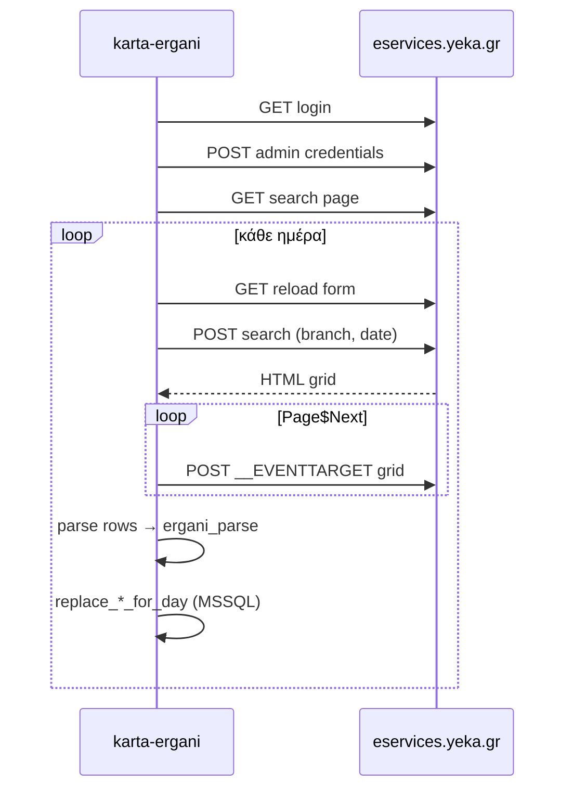

# CHANGELOG — karta-ergani

Όλες οι μεταβολές του project καταγράφονται εδώ (νέα πρώτα).

Για την τρέχουσα τεχνική εικόνα και οδηγούς συντήρησης, δες το `docs/`:
`PROJECT_STATE.md`, `ARCHITECTURE.md`, `RUNBOOK.md`, `ERGANI_PORTAL_SYNC.md`,
`DEPLOYMENT.md`, `DECISIONS.md`.

---

## 2026-08-19 — Αρχειοθέτηση ψηφιακής οργάνωσης από portal (schedule archive)

- Νέος πίνακας `karta_portal_schedule_archive` — αποθηκεύει parsed δεδομένα ψηφιακής οργάνωσης ανά εργαζόμενο/ημέρα.
- Νέο module `app/portal_schedule_archive.py`: login → αναζήτηση στο portal → Excel download → parse στήλης «Απασχόληση» (εργασία, υπερωρία, άδεια) → MERGE/upsert στη βάση.
- Αυτόματο scheduling: κάθε **1η του μήνα στις 05:00** αρχειοθετεί τους 2 προηγούμενους μήνες.
- Αρχική εκτέλεση Ιαν–Ιούν 2026 για **όλα** τα καταστήματα (38.246 εγγραφές).

---

## 2026-08-19 — Απολογιστικός: χειροκίνητη αλλαγή υπερωρίας + fix POST_CARRY status

- Νέο modal στο UI: κλικ στο κελί «Υπερωρία» ανοίγει editor (Από/Έως) για override.
- Backend `PUT /api/apologistic/overtime` — αποθηκεύει override στο snapshot, καταγράφει ιστορικό.
- Fix: ημέρες με overnight-carry που η πρόταση = δηλωμένο ωράριο βγαίνουν πλέον **Σ** (ok) αντί **Μ** (change).
- Landing page: αντικατάσταση «Epsilon» → «ανταγωνισμό».

---

## 2026-08-19 — Revert: στήλη «Χτύπημα» χωρίς overnight-carried punches

- Αναιρέθηκε η εμφάνιση overnight-carried χτυπημάτων στη στήλη «Χτύπημα» του απολογιστικού.
- Η στήλη δείχνει ξανά μόνο τα χτυπήματα που ανήκουν λογιστικά στη συγκεκριμένη ημέρα.

---

## 2026-08-19 — Work log: “διορθ.” μόνο όταν η κάρτα διορθώνει vs portal

- Στην οθόνη πραγματικής (`office-work-log`), όταν η πραγματική ώρα από portal είναι **μεταγενέστερη** από retro δήλωση κάρτας, η εφαρμογή κρατά την πραγματική και **δεν** εμφανίζει ανάποδα badge «διορθ.».
- Προσαρμόστηκε και η UI/tooltip λογική ώστε το “διορθ.” να αντιστοιχεί στη σωστή κατεύθυνση του mismatch.

---

## 2026-08-18 — AI Agent: διατήρηση καταστήματος και ονομάτων στη συνομιλία

- Το κατάστημα και τα ονόματα που έχουν ήδη κλειδώσει στη συνομιλία **μένουν**
  μέχρι ο χρήστης να ζητήσει ρητά άλλο κατάστημα ή άλλα ονόματα.
- **Reply** σε ειδοποίηση ή προηγούμενη εντολή: κατάστημα και όνομα/ΑΦΜ είναι
  δεδομένα (`Κλειστόν`, `κλείσε στις 17.00` δεν τα ξαναρωτά).
- Χωρίς reply, χρησιμοποιείται το τελευταίο outbound με store/employee focus.
- Οι ειδοποιήσεις today-alert και ελλιπών χτυπημάτων αποθηκεύουν `store_id` και
  `employee_afm` στο outbound, ώστε το reply να δένει.
- Ομαδικές εντολές («όσους τελειώνουν στις …») δεν κουβαλούν τα προηγούμενα ονόματα.

---

## 2026-08-18 — AI Agent ερωτήσεις/greeklish, μελλοντικό χτύπημα και Excel Ώρες

### AI Agent

- Όταν ο Agent είναι απενεργοποιημένος, το μήνυμα είναι κοινό για UI και Telegram
  (`app/assistant_messages.py`): **«Καλέστε στο {τηλέφωνο}…»**
  (`AI_AGENT_CONTACT_PHONE`).
- Το Gemini διαβάζει **greeklish** ως ελληνικά και αντιστοιχίζει ονόματα φωνητικά
  στον κατάλογο του καταστήματος.
- Ερωτήσεις πάνω στην εικόνα εργασίας **σήμερα** (`today_info`) απαντώνται από το
  `today_home` χωρίς επιβεβαίωση και χωρίς αποστολή στο ΕΡΓΑΝΗ
  (π.χ. «ποιοι τελειώνουν στις 20:40», «τι ώρα τελειώνει η Μασούρα»).
- Η απαγόρευση **μελλοντικού χτυπήματος κάρτας** δεν είναι στο prompt. Ισχύει μόνο
  στην ενέργεια κάρτας: `new_card_punch_blocked_reason` και `build_wrk_card_se_payload`
  (`Η ώρα κίνησης δεν μπορεί να είναι μελλοντική`). Ερωτήσεις για ωράριο αργότερα
  σήμερα επιτρέπονται.

### Ψηφιακό ωράριο — Excel στήλη Ώρες

- Η στήλη **Ώρες** είναι τύπος Excel που αθροίζει τα διαστήματα της εβδομάδας
  (`TIME(INT/100), MOD/100)` για τιμές `1100`/`1900`, overnight, ΡΕΠΟ=0).
  Format `[h]:mm`. Download χωρίς cache.

### Απολογιστικό

- Overnight carry μετά από `*`: παράθυρο **13h** (5ήμερο) / **12h** (6ήμερο)
  συν διάλειμμα εκτός εργασίας από τη θεωρούμενη έναρξη (όχι παράθυρο 2 ωρών).

---

## 2026-08-18 — AI Agent, Excel ωράριο και άδεια στο απολογιστικό

### AI Agent

- Προστέθηκε **`today_home`** στο Gemini prompt: snapshot Αρχικής μόνο για σήμερα
  (`app/assistant_home_context.py`, ίδια πηγή με `build_card_status_report()`).
- Ο κατάλογος `allowed_employees` περιορίζεται σε **ενεργούς** εργαζομένους του
  καταστήματος (`list_active_employees_for_store`).
- Χτυπήματα κάρτας: validation και εκτέλεση με `new_card_punch_blocked_reason` —
  **έξοδος μόνο σε ανοιχτές κάρτες**, **είσοδος μόνο χωρίς ήδη δηλωμένη είσοδο**
  (ίδια λογική με `work_card_guards.py` / Αρχική). Σε ομαδικές εντολές οι
  μη επιλέξιμοι παραλείπονται με μήνυμα «Παραλείφθηκαν: …».

### Ψηφιακό ωράριο — Excel

- Στο **Κατέβασμα Excel** (`/ui/schedule`) προστέθηκε στήλη **Ώρες** δίπλα στο όνομα
  (σύνολο δηλωμένων ωρών εβδομάδας από `karta_schedule`). Οι ημέρες μένουν κενές.
- Παλιά Excel χωρίς «Ώρες» συνεχίζουν να διαβάζονται στο ανέβασμα.

### Απολογιστικό

- Στο modal **Αλλαγή πρότασης** προστέθηκε επιλογή **Άδεια** με όλους τους τύπους
  της Αρχικής (ADKAN, ADAS, …) · υποβολή WTOLeave αντί WTODailyA.

---

## 2026-08-18 — Landing hero, Google Ads tracking και νέα screenshots

### Public landing / marketing

- Το public landing ενημερώθηκε με νέο hero:
  **«Διαχείριση Ψηφιακής Κάρτας Εργασίας με τη δύναμη του AI»**,
  badge **AI**, νέο highlight **«Απολογιστικό με 3 κλικ»** και
  πιο δυνατό marketing copy γύρω από ομαδοποίηση ζητημάτων και προτάσεις λύσεων.
- Προστέθηκε νέο συγκριτικό section **erganiOS vs Epsilon** με 10 διαφορές
  πάνω σε ομαδοποίηση, προτάσεις, ρεπό/ανταλλαγές, σπαστό, 5ήμερο/6ήμερο,
  Κυριακές, υπερεργασία και μη προβλέψιμο ωράριο.
- Στο public nav προστέθηκε εμφανές τηλέφωνο επικοινωνίας **`6977392742`**.
- Στην ενότητα **Οθόνες προγράμματος** μπήκαν πρώτα δύο νέα screenshots από το
  απολογιστικό:
  **Απολογιστικό ελέγχου** και **Μεταβολές εβδομάδας**.
- Η ενότητα **Τιμοκατάλογος** άλλαξε από γενικές κάρτες σε interactive pricing selector
  με εύρη **1-2**, **3-5**, **6-20**, **21-50**, **51-100**, **101-200**.
- Το αριστερό pricing card δείχνει το βασικό **erganiOS** με στρογγυλές marketing τιμές
  (**94€**, **112€**, **148€**, **187€**, **274€**, **439€**) και περιεχόμενο
  **Απολογιστικό + Ωρομέτρηση**.
- Το δεξί pricing card είναι ξεχωριστό **AI Agent** box με AI icon,
  μήνυμα **Κατόπιν συνεννόησης** και περιγραφή για αυτοματοποιημένες διαδικασίες
  στην ημερήσια λειτουργία και στη διαχείριση καρτών.
- Το visual του pricing έγινε μπλε αντί για κόκκινο και το CTA του AI Agent
  καλεί απευθείας στο **`6977392742`**.

### Google Ads / conversions

- Προστέθηκε sitewide **Google tag (`AW-11221001888`)** στο κοινό `ui/base.html`,
  αμέσως μετά το `<head>`, ώστε να φορτώνει μία φορά ανά σελίδα.
- Το conversion event
  **`AW-11221001888/Ac5bCMOorKwYEKDNy-Yp`**
  πυροδοτείται πλέον μόνο όταν:
  - αποστέλλεται επιτυχώς η φόρμα επικοινωνίας του landing (`POST /api/contact`)
  - γίνεται click σε public link `tel:`
- Η υλοποίηση έγινε σε `landing-contact.js` αντί για static snippet στο `<head>`,
  επειδή το landing δεν έχει ξεχωριστή thank-you page και η φόρμα υποβάλλεται με AJAX.

### Telegram assistant

- Στο Telegram inline confirmation button το label έγινε
  **`Επιβεβαίωση με PIN`** για να είναι σαφές ότι η εκτέλεση περνά από PIN verification.

## 2026-08-17 — Απολογιστικό: μαζικές ενέργειες πάνω/κάτω από τον πίνακα

- Στο `/ui/apologistic` (και στο μηνιαίο ανά εργαζόμενο), όταν είναι ενεργό
  το φίλτρο **Για έλεγχο**, η γραμμή «Έγκριση όλων προς μεταβολή» εμφανίζεται
  και πάνω και κάτω από τον πίνακα.
- Η **Μαζική Καταχώρηση** εμφανίζεται και όταν υπάρχουν εγγραφές Ελέγχου,
  πάνω και κάτω από τον πίνακα. Η προεπισκόπηση περιλαμβάνει μόνο εκκρεμείς
  **Μεταβολές (Μ/Μ\*)** και τις υπερωρίες τους· οι γραμμές **Έλεγχος (Ε)**
  εξαιρούνται και παραμένουν ως έχουν.
- Το backend απορρίπτει WTODailyA αν η γραμμή δεν είναι Μεταβολή και WTOOvA
  αν η γραμμή είναι Έλεγχος.

## 2026-08-17 — AI Agent ανά κατάστημα, UI/Telegram και πραγματική εκτέλεση

- Προστέθηκε `ai_agent_enabled` ανά κατάστημα με ασφαλές default `0`.
- Ενοποιήθηκαν συνομιλίες, commands, task/event logging και ιστορικό μεταξύ
  Telegram και πλευρικού office chat.
- Προστέθηκαν optimistic messages, loading, διατήρηση ανοιχτής κατάστασης,
  σωστή τοπική ώρα και ταυτότητες `Εσείς`/`erganiOS`.
- Το Gemini χρησιμοποιεί συγκεκριμένα models, structured `commands[]` και
  failover σε timeout ή transient HTTP errors.
- Υποστηρίζονται πολλοί εργαζόμενοι και διαφορετικές εντολές στο ίδιο μήνυμα,
  χτυπήματα βάσει πραγματικού ωραρίου και ημερομηνίες `ΗΗ/ΜΜ/ΕΕΕΕ`.
- Η επιβεβαίωση εκτελεί πραγματικές WRKCardSE/WTODaily/WTOLeave υποβολές και
  επιστρέφει πρωτόκολλο ή σφάλμα ανά εργαζόμενο/ενέργεια.
- Προστέθηκαν migrations, access-control routes και tests για UI, Telegram,
  batch validation, execution, πρωτόκολλα και απενεργοποίηση πριν την υποβολή.

## 2026-08-17 — Ισοσκελισμένη ανισομερής κατανομή απολογιστικού

- Το `/ui/apologistic` αφαίρεσε το κουμπί **ΟΛΑ** από μήνα/εβδομάδα/διάστημα· η
  επιστροφή σε όλα τα αποτελέσματα γίνεται με κλικ στην κάρτα **Αποτελέσματα**
  (ή **Υπολογισμένες** στον μηνιαίο view), που ξε-επιλέγει και τυχόν tab ημέρας.
- Βελτιώθηκε το πεδίο αναζήτησης εργαζομένου: placeholder **Αναζήτηση ονόματος**,
  στοιχισμένος φακός (grid overlay) και `cursor: pointer` στο κουμπί καθαρισμού.
- Το `scripts/_recalc_apologistic_from_jun.py` σταματά πλέον αυτόματα στη χθεσινή
  ημερομηνία (`date.today() - 1 day`) αντί για σκληρά κωδικοποιημένο τέλος μήνα.

- Το `/ui/apologistic` απέκτησε αναζήτηση ονόματος/επωνύμου χωρίς τόνους και
  πραγματική ημερολογιακή ταξινόμηση γραμμών, επιλογών και μαζικής εκτέλεσης
  ανταλλαγών αντί για τυχαία σειρά.
- Οι κάρτες ανταλλαγής εμφανίζουν πλέον σαφώς `δηλωμένο → ΡΕΠΟ` ή
  `ΜΗ ΔΗΛΩΜΕΝΗ ΕΡΓΑΣΙΑ → ΡΕΠΟ`.
- Χτυπήματα της νέας ημερομηνίας που προηγούνται της ρητής λήξης `*` της
  προηγούμενης βάρδιας αποδίδονται στην προηγούμενη εργασιακή ημέρα, εξαιρούνται
  από το νέο κύριο χτύπημα και διατηρούνται στο audit. Διορθώθηκε επίσης η
  διπλή εμφάνιση `**` σε πίνακα, hover και Excel.
- Στο `/ui/employees/monthly-overview` αφαιρέθηκε η στήλη ημέρας και η ημερομηνία
  εμφανίζεται ως `ηη/μμ`.
- Καταγράφηκε ως υποχρεωτική προδιαγραφή ότι κάθε επανυπολογισμός του
  Απολογιστικού σταματά στη χθεσινή ημερομηνία και δεν συμπεριλαμβάνει ποτέ τη
  σημερινή ημέρα, της οποίας τα δεδομένα μπορεί να είναι ακόμη ελλιπή.
- Η επιλογή ανισομερούς κατανομής του καταστήματος συνδέθηκε με τη μηχανή
  απολογιστικού για πλήρη απασχόληση και ακριβές εβδομαδιαίο σύνολο `40:00`.
- Ελλειμματικές ημέρες κάτω από `8:00`/`6:40`, με επαρκές πραγματικό χτύπημα,
  συμπληρώνονται από την πραγματική έναρξη με ισόποση αφαίρεση από ημέρες πάνω
  από την ημερήσια βάση.
- Οι προτάσεις δημιουργούνται μόνο με μηδενικό ισοζύγιο και εμφανίζονται ως μία
  ομάδα σε `Έλεγχο`. Η έγκριση όλων των ημερών γίνεται σε μία συναλλαγή.
- Προστέθηκαν tests πενθημέρου, εξαημέρου και απόρριψης μη πλήρως καλυπτόμενης
  ή μη 40ωρης εβδομάδας.

## 2026-08-16 — Απολογιστικό ανά μήνα και προσαρμοσμένο διάστημα

- Προστέθηκαν tabs **Ανά μήνα**, **Ανά εβδομάδα** και **Ανά διάστημα** στο
  `/ui/apologistic`, με κοινά φίλτρα, ενέργειες, ιστορικό και εξαγωγή Excel.
- Η μηνιαία προβολή επιστρέφει μόνο ημέρες του επιλεγμένου μήνα και εμφανίζει
  όλες τις εβδομάδες που τον τέμνουν, περικομμένες στα όριά του.
- Η επιλογή διαστήματος χρησιμοποιεί τον κοινό ελληνικό date picker της εφαρμογής,
  έως την τελευταία ολοκληρωμένη εβδομάδα και με μέγιστο εύρος ενός έτους.
- Το **ΟΛΑ** λειτουργεί ενιαία στις τρεις προβολές και καθαρίζει ημέρα και KPI
  φίλτρο. Στην αλλαγή προβολής οι μετρητές μηδενίζονται μέχρι να φορτωθούν τα νέα
  αποθηκευμένα αποτελέσματα.
- Προστέθηκε μαζική ανάκτηση αποθηκευμένων ημερήσιων snapshots ανά κατάστημα και
  εύρος, χωρίς on-the-fly επανυπολογισμό.

## 2026-08-16 — Απολογιστικό rules-v4: σύμβαση και ημερήσια βάση υπερωρίας

- Το 5ήμερο/6ήμερο προέρχεται πλέον αποκλειστικά από τη σύμβαση και χρησιμοποιείται
  σε όλους τους εβδομαδιαίους κανόνες και στα όρια 13/12 ωρών.
- Προστέθηκε ανεξάρτητη ημερήσια βάση υπερωρίας από τη διάρκεια του δηλωμένου
  ωραρίου: ακριβώς `8:00` ή `6:40`, διαφορετικά βάση σύμβασης. Η διάρκεια του
  χτυπήματος δεν επιλέγει τη βάση και η επιλογή δεν αλλάζει τον συμβατικό
  χαρακτηρισμό.
- Σε πραγματικό διάστημα πάνω από 13/12 ώρες το αποτέλεσμα παραμένει «Έλεγχος»,
  αλλά η «Πρόταση» παράγεται κανονικά από τους υπόλοιπους κανόνες.
- Νέα πεδία ελέγχου: `daily_overtime_basis_days`,
  `daily_overtime_basis_minutes`, `daily_overtime_basis_source`.

## 2026-08-16 — Απολογιστικό rules-v3: βάση 5ημέρου/6ημέρου (αντικαταστάθηκε από rules-v4)

- Ομοιόμορφο δηλωμένο ημερήσιο σύνολο ακριβώς `8:00` επιλέγει βάση 5ημέρου και
  ακριβώς `6:40` βάση 6ημέρου, ακόμη κι αν διαφωνεί η σύμβαση.
- Μη τυπικές ή μεικτές δηλωμένες διάρκειες χρησιμοποιούν τη βάση της σύμβασης.
- Επιβεβαιώθηκε με test ότι μονό χτύπημα σε ρεπό ακολουθεί τον κανόνα ανταλλαγής
  όταν υπάρχει δηλωμένη εργάσιμη ημέρα χωρίς χτύπημα.
- Η τεκμηρίωση εκ περιτροπής διορθώθηκε: υπερωρία μετά τις 8:00/6:40 και όχι
  μετά τη μικρότερη δηλωμένη διάρκεια.

## 2026-08-15 — Telegram replies σε Gemini dry-run tasks

- Κανονικά Telegram μηνύματα γίνονται δεκτά μόνο από ενεργά `chat_id` ληπτών·
  όλοι οι υπόλοιποι αποστολείς αγνοούνται σιωπηρά.
- Προστέθηκε Gemini structured-output parser για κάρτα τώρα/πριν, αλλαγή ωραρίου,
  ρεπό και άδεια, με deterministic validation καταστήματος και εργαζομένου.
- Οι εντολές αποθηκεύονται σε κατάσταση συνομιλίας ή `needs_clarification` και η
  απάντηση περιγράφει τι **θα** εκτελεστεί. Καμία ενέργεια δεν αποστέλλεται στο
  ΕΡΓΑΝΗ.
- Μία εντολή μπορεί να αφορά πολλούς εργαζομένους, με deterministic έλεγχο κάθε
  ΑΦΜ και υποστήριξη σχετικού χρόνου όπως «10 λεπτά πριν».
- Η επιβεβαίωση γίνεται απευθείας με προσωπικό PIN, χωρίς βήμα `ΝΑΙ/ΟΧΙ`, πριν
  από την τελική κατάσταση `confirmed_dry_run`, με redaction και κλείδωμα
  προσπαθειών. Κάθε άλλο κείμενο αντιμετωπίζεται ως νέα εντολή.
- Κάθε επιτυχημένο Gemini request αποθηκεύει model, διάρκεια, αναλυτικά token
  counts και το πλήρες `usageMetadata` JSON στο assistant task.
- Νέοι πίνακες inbound/outbound Telegram, assistant tasks και append-only task events.

## 2026-08-14 — Καταγραφές χτυπημάτων: ΑΦΜ και hover εργαζομένου

- Στο `/ui/sync-log#punches` η στήλη εργαζομένου εμφανίζει πλέον μόνο το ΑΦΜ,
  ώστε ο πίνακας να παραμένει συμπαγής.
- Το πλήρες ονοματεπώνυμο εμφανίζεται με hover πάνω στο ΑΦΜ και παρέχεται επίσης
  ως προσβάσιμη περιγραφή (`aria-label`).
- Οι νέες καταγραφές Listener αποθηκεύουν ΑΦΜ και ονοματεπώνυμο στα στοιχεία audit.
  Για παλιότερες καταγραφές που έχουν μόνο ΑΦΜ, το API συμπληρώνει τα ονόματα με
  μία μαζική ανάκτηση εργαζομένων ανά σελίδα αποτελεσμάτων.

## 2026-08-14 — Διόρθωση λίστας Πρωτοκόλλων

- Η σελιδοποίηση στο `/ui/protocols` χρησιμοποιεί το σωστό πεδίο `items` του
  κοινού helper και δεν αποτυγχάνει πλέον με `Cannot read properties of undefined
  (reading 'forEach')`.
- Η λίστα κανονικοποιεί μη αναμενόμενη ή κενή συλλογή API σε ασφαλή κενό πίνακα.

## 2026-08-14 — Listener: retry αιτιολογίας και πλήρες σφάλμα στις Καταγραφές

- Όταν το ΕΡΓΑΝΗ απορρίπτει job Listener επειδή λείπει λόγος καθυστέρησης,
  το erganiOS δημιουργεί μία νέα υποβολή με `f_aitiologia=001` και την αποστέλλει
  ξανά μέσω του ίδιου Listener, χωρίς direct fallback.
- Στο audit χτυπημάτων αποθηκεύονται πλέον `ergani_http_status`, η δομημένη
  `ergani_response` και το `error_message` του Listener. Η στήλη «Λεπτομέρειες»
  εμφανίζει το πραγματικό μήνυμα ΕΡΓΑΝΗ αντί για το γενικό «HTTP 400».

## 2026-08-14 — UI Πρωτόκολλα (κατάλογος Ergani)

- Νέα σελίδα `/ui/protocols` στο μενού **Πρωτόκολλα** (μετά την πραγματική).
- Λίστα όπως WorkCardSearch: αρ. πρωτοκόλλου, ημ/νία υποβολής, τύπος, κατάσταση,
  εκπρόθεσμο, παράρτημα — με date range picker όπως η πραγματική.
- API: `GET /api/protocols/list`, `POST /api/protocols/sync` (+ async status).
- Δικαιώματα: `work_log.view` / `work_log.sync` (sync μόνο admin).

---

## 2026-08-14 — Καταγραφές χτυπημάτων: κανάλι listener / erganiOS

- Στο tab **Χτυπήματα κάρτας** εμφανίζεται στήλη **Κανάλι**: `listener` ή `erganiOS`
  (και fallback αν ο listener ήταν offline/timeout).

---

## 2026-08-14 — Πρωτόκολλα: δικά μας χτυπήματα πρώτα, μετά 1-1 στα υπόλοιπα

- Τα δικά μας `karta_declaration.protocol` γράφονται στο `karta_work_log.protocol_from/to`.
- Η 1-1 απαγωγή αγνοεί τα ήδη γεμάτα πεδία και τα πρωτόκολλά τους, ώστε δύο χτυπήματα
  την ίδια ώρα (ένα δικό μας) να αφήνουν το άλλο 1-1 με το εναπομείναν πρωτόκολλο.

---

## 2026-08-14 — Πρωτόκολλα Ergani: sync, 1-1 απαγωγή, πραγματική

- **Νέος πίνακας** `karta_ergani_protocol`: κατάλογος πρωτοκόλλων χτυπημάτων από portal
  (WorkCardSearch), ανεξάρτητα από δικές μας υποβολές.
- **Στήλη** `protocol_last_sync_at` στο `karta_store_config`.
- **Νέες στήλες** `protocol_from`, `protocol_to` στο `karta_work_log` — εμφάνιση πρωτοκόλλου
  κάτω από Από/Έως στο `/ui/work-log`.
- **1-1 απαγωγή** (`apply_protocol_sync`): σύγκριση `hour_from`/`hour_to` ↔ `submit_at`.
  Γράφει στην πραγματική (κενό πεδίο μόνο) + κενά `karta_declaration.protocol`.
  Πολλαπλά πρωτόκολλα ή πολλαπλές ώρες στην ίδια στιγμή → **κενό**.
- **Συγχρονισμός πρωτοκόλλων**: αρχικός sync (βήμα 6, 31 ημέρες), περιοδικός (`period_sync`),
  νυχτερινός `scheduled_nightly_protocol_sync` (~03:00, χθες, **μετά** 30ήμερο πραγματικής).
- **Backfill** (2026-04-11 – 2026-08-14): ~40k πρωτόκολλα Ergani, ~14,5k ενημερώσεις
  πραγματικής (~53% κάλυψη ωρών — το υπόλοιπο μη 1-1).
- Scripts: `backfill_ergani_protocols.py`, `backfill_protocol_deduction_matches.py`,
  `analyze_protocol_deduction_matches.py`.
- Migrations: `sql/alter_add_karta_ergani_protocol.sql`, `sql/alter_add_work_log_protocol.sql`,
  `scripts/ensure_karta_ergani_protocol_table.py`, `scripts/ensure_work_log_protocol_columns.py`.
- Ρύθμιση: `KARTA_SCHEDULED_PROTOCOL_SYNC_*` (`.env.example`).

---

## 2026-08-14 — Εργαζόμενοι: ενιαία εικονίδια, στήλες, tabs ενεργοί/ανενεργοί

- **`/ui/employees`**: ενιαία action κουμπιά (`.employees-action-btn`) για στοιχεία
  σύμβασης, μηνιαία εικόνα, εβδομαδιαίο ωράριο και ιστορικό απασχόλησης.
- **Νέες στήλες**: «Σύμβαση» (περίληψη τρέχουσας σύμβασης Ergani) και «Ανοιχτά
  (MM/YYYY)» (ελλιπή χτυπήματα τρέχοντος μήνα ανά εργαζόμενο).
- **Κατάσταση**: μόνο εικονίδιο (tooltip «Ενεργός»/«Ανενεργός»), χωρίς κείμενο στη
  γραμμή.
- **Tabs Ενεργοί / Ανενεργοί** με μετρητές· το API φέρνει όλους τους εργαζόμενους
  (`active_only=False`), ώστε να εμφανίζονται και όσοι έχουν ιστορικό/ελλιπή αλλά
  δεν είναι πλέον ενεργοί.
- **Εικονίδια**: μηνιαία εικόνα `calendar3`, εβδομαδιαίο ωράριο `table` (διακριτό από
  το ημερολόγιο).
- Backend: `count_incomplete_punches_by_employee_for_month()` στο `repo_work_log.py`,
  εμπλουτισμός `GET /api/employees/list` με `contract_label`, `open_punches_month`,
  `active_count`, `inactive_count`.

---

## 2026-08-13 (ε) — Απολογιστικό: μηνιαία προβολή, σπαστό ωράριο, υπερωρία πολλών ημερών

- **`/ui/employees/monthly-overview`**: ίδιος πίνακας και λειτουργίες με `/ui/apologistic`,
  ανά εργαζόμενο και μήνα (όλες οι ημέρες 28–31)· κοινά modals από partial.
- **Modal πρότασης — σπαστό ωράριο**: δεύτερο ζεύγος Από/Έως στην Εργασία (κενό by default)·
  αποθήκευση `ΩΩ:ΛΛ–ΩΩ:ΛΛ · ΩΩ:ΛΛ–ΩΩ:ΛΛ` αν συμπληρωθεί· backend `normalize_proposed_value`
  δέχεται σπαστό.
- **Modal πρότασης — layout**: τα κουμπιά μένουν μέσα στο πλαίσιο (flex + scroll πεδίου
  επιλογών).
- **Υποβολή WTOOvA πολλών ημερών**: εμφάνιση όλων των διαστημάτων χωρίς dropdown· ένα κλικ
  υποβάλλει όλες τις ημέρες διαδοχικά· το κουμπί Ergani ολοκληρώνεται μόνο όταν έχουν σταλεί
  όλες.
- **Μαζική Καταχώρηση**: κρύβεται όταν υπάρχουν γραμμές «Για έλεγχο».
- **Εξαγωγή Excel** από τον ορατό πίνακα απολογιστικού (`POST /api/apologistic/export`).
- **Κουμπί scroll στην κορυφή** σε όλες τις σελίδες office UI.
- Κοινά partials: `app/templates/ui/partials/apologistic-modals.html`.

---

## 2026-08-13 (δ) — Πρόταση απολογιστικού: τύποι Ρεπό/Εργασία/Μη εργασία/Τηλεργασία

- Το modal αλλαγής πρότασης έχει radio επιλογές (κάθετα) και ωράριο Από/Έως
  για Εργασία και Τηλεργασία.
- Αποθήκευση: `ΑΝΑΠΑΥΣΗ/ΡΕΠΟ`, `ΩΩ:ΛΛ–ΩΩ:ΛΛ`, `ΜΗ ΕΡΓΑΣΙΑ`, `ΤΗΛΕΡΓΑΣΙΑ ΩΩ:ΛΛ–ΩΩ:ΛΛ`.
- Η υποβολή WTODailyA αντιστοιχεί σε τύπους Ergani `ΑΝ` / `ΕΡΓ` / `ΜΕ` / `ΤΗΛ`.
- Χειροκίνητη αλλαγή πρότασης σε γραμμή «Έλεγχος» → αποτέλεσμα γίνεται «Μεταβολή».

---

## 2026-08-13 (γ) — Μαζική Καταχώρηση εβδομάδας (προεπισκόπηση)

- Στο `/ui/apologistic`, όταν «Για έλεγχο» = 0 και υπάρχουν μεταβολές με εκκρεμείς
  υποβολές, εμφανίζεται κουμπί **Μαζική Καταχώρηση εβδομάδας**.
- Ανοίγει modal με αναλυτική λίστα WTODailyA + WTOOvA που θα στέλνονταν (χωρίς όσα
  έχουν ήδη σταλεί μεμονωμένα). **Δεν** αποστέλλει ακόμη στο Ergani.

---

## 2026-08-13 (β) — Μεταφορά ΡΕΠΟ Κυριακής ανά κατάστημα

- Νέα ρύθμιση στο `/ui/stores/notify`: **«Υπάγεται στη μεταφορά ΡΕΠΟ λόγω
  εργασίας την Κυριακή»** (`karta_store_config.sunday_rest_transfer_enabled`).
- Default **ΟΧΙ** για όλα τα καταστήματα· αρχικά **ΝΑΙ** μόνο για id **13** και **14**.
- Όταν είναι ΟΧΙ, το απολογιστικό **δεν** δημιουργεί εκκρεμότητα «Οφείλεται ρεπό».
- `CALCULATION_VERSION` → `2026-08-13.2`. Επαναϋπολογισμός από 1/6/2026.
- Migration: `sql/alter_add_store_sunday_rest_transfer.sql`.

---

## 2026-08-13 — Χτύπημα σε ρεπό/μη εργασία κάτω από ημέρες σύμβασης → Σύμφωνο

- Νέος κανόνας απολογιστικού: όταν υπάρχει χτύπημα σε Ρεπό ή Μη εργασία και οι
  ημέρες με κάρτα στην εβδομάδα είναι **λιγότερες** από τις «Ημέρες εβδομαδιαίας
  απασχόλησης» της σύμβασης, το αποτέλεσμα είναι «Σύμφωνο» (όχι «Έλεγχος»).
- `CALCULATION_VERSION` → `2026-08-13.1`. Επαναϋπολογισμός από 1/6/2026.
- Βλ. `docs/APOLOGISTIKO_LOGIC.md`.

---

## 2026-08-12 — Απολογιστικό: UI, υποβολές Ergani, καταγραφές

- **Πρόταση ωραρίου**: το διάλειμμα εκτός ωραρίου δεν προστίθεται πλέον στην πρόταση
  (`CALCULATION_VERSION` `2026-08-12.1`).
- **Προβολή εβδομάδας**: κουμπί **ΟΛΑ** + tabs ημερών· στήλη «Ημέρα» στην εβδομαδιαία
  προβολή.
- **KPI Υποβεβλημένες**: μετράει WTODailyA και WTOOvA· φίλτρο γραμμών με υποβολή.
- **Υποβολή Ergani** από `/ui/apologistic`: WTODailyA/WTOOvA, πίνακας
  `karta_apologistic_submit`, stale ένδειξη όταν αλλάζει η πρόταση μετά την υποβολή.
- **Κανόνας UI/backend**: χωρίς κουμπί WTODailyA όταν η μόνη μεταβολή είναι υπερωρία.
- **Hover εργαζομένου**: εβδομαδιαίος πίνακας ημερών/χτυπημάτων.
- **Καταγραφές**: καρτέλα `/ui/sync-log#apologistic` + `GET /api/sync-log/apologistic`.
- Βλ. `docs/APOLOGISTIKO_LOGIC.md`, migration `sql/alter_add_apologistic_submit.sql`.

---

## 2026-08-14 — Windows listener v0.3.9

- Το long-poll παραλαβής `WRKCardSE` μειώθηκε από 25″ σε 8″ και το retry μετά από
  σφάλμα σύνδεσης σταθεροποιήθηκε στα 2″.
- Το backend περιορίζει επίσης το `/jobs/next` σε έως 8″, ώστε ακόμη και με proxy
  buffering ο listener να παραλαμβάνει νέο χτύπημα εντός 10″ όταν η σύνδεση λειτουργεί.
- Δεν αλλάζει η απομόνωση ανά κατάστημα, το lease/idempotency ή το fallback των 60″.

---

## 2026-08-11 — Αυτόματο κλείσιμο μέσω Listener

- Το `auto_close_prev_day` ακολουθεί πλέον το `card_submission_mode` του
  καταστήματος όπως κάθε υποβολή `WRKCardSE`.
- Με online Listener δημιουργείται idempotent job και η υποβολή καταγράφεται με
  `submission_channel=listener`, δημόσια IP και executor device.
- Με offline Listener ή ακυρώσιμο queued timeout χρησιμοποιείται η υπάρχουσα
  απευθείας διαδρομή erganiOS και καταγράφεται ο λόγος fallback.
- Αν το job έχει ήδη παραληφθεί από Listener, απαγορεύεται direct fallback ώστε
  να μην προκύψει διπλό χτύπημα.
- Προστέθηκαν regression tests για online Listener, offline fallback και leased
  job χωρίς δεύτερη υποβολή.

---

## 2026-08-11 — Σταθερή τελική ένδειξη υποβολής κάρτας

- Ο elapsed timer της υποβολής `WRKCardSE` σταματά πλέον αμέσως με την απόκριση της υποβολής,
  πριν εμφανιστεί επιτυχία/σφάλμα και πριν ανανεωθούν οι πίνακες.
- Διορθώθηκε η περίπτωση όπου το πρωτόκολλο επιτυχίας εμφανιζόταν στιγμιαία και στη συνέχεια
  αντικαθιστούνταν λανθασμένα από μήνυμα «Σε εξέλιξη» κατά την ανανέωση δεδομένων.

## 2026-08-11 — Windows listener v0.3.5

- Απενεργοποιήθηκε το globalization-invariant mode στο self-contained executable.
- Διορθώθηκε το crash εκκίνησης σε ελληνικά Windows με `CultureNotFoundException` για culture
  `el-GR` / identifier `1032`.

## 2026-08-11 — Windows listener v0.3.6

- Επανασχεδιάστηκε πλήρως το setup UI με σύγχρονο header, καθαρές κάρτες pairing/ΕΡΓΑΝΗ,
  συνεπή πεδία και κουμπιά και καλύτερη αξιοποίηση χώρου.
- Προστέθηκαν εμφανές service-state badge και χρωματικά status επιτυχίας, αναμονής και σφάλματος.
- Διατηρήθηκαν η responsive κύλιση για μικρές οθόνες, η DPAPI αποθήκευση και όλη η υπάρχουσα
  λειτουργία εγκατάστασης/απεγκατάστασης χωρίς αλλαγή.

## 2026-08-11 — Windows listener v0.3.7

- Αφαιρέθηκε το scrollbar και συμπτύχθηκε η διάταξη ώστε όλα τα στοιχεία να εμφανίζονται στο
  βασικό παράθυρο χωρίς κύλιση.
- Το προεπιλεγμένο και fallback `Usertype` διορθώθηκε από `02` σε `01`.

## 2026-08-11 — Windows listener v0.3.8

- Επαναφέρθηκε το εσωτερικό scrollbar ώστε τα κουμπιά, το status και οι σημειώσεις να είναι πάντα
  προσβάσιμα σε μικρές αναλύσεις.
- Η ετικέτα `Περιβάλλον Ergani API` απλοποιήθηκε σε `Ergani API`.

## 2026-08-10 — Τοπικός listener ψηφιακής κάρτας v0.3.4

- Προστέθηκε κοινή ζωντανή ένδειξη εξέλιξης σε όλα τα UI σημεία υποβολής `WRKCardSE`: αρχική
  καταχώρηση, elapsed timer, αναμονή listener/ΕΡΓΑΝΗ, προειδοποίηση fallback στα 60″ και ολοκλήρωση.
- Η τελική επιτυχία αναφέρει αν η υποβολή έγινε μέσω listener, απευθείας μέσω erganiOS ή μέσω
  fallback επειδή ο listener ήταν offline/έληξε το timeout, μαζί με τον συνολικό χρόνο αναμονής.
- Η μαζική υποβολή ελλιπών καρτών εμφανίζει την ίδια κατάσταση ξεχωριστά για κάθε χτύπημα και
  κρατά κλειδωμένες τις ενέργειες όσο εκτελείται η τρέχουσα υποβολή.
- Συνδέθηκε ο dispatcher στην πραγματική ροή `WRKCardSE`, αποκλειστικά ανά κατάστημα με mode
  `listener`. Το job μεταφέρει το Ergani API environment του καταστήματος στον τοπικό listener.
- Προστέθηκε idempotent enqueue, αναμονή αποτελέσματος και ασφαλές fallback στην υπάρχουσα ροή
  μόνο όταν το job παραμένει `queued`. Job που έχει ήδη παραληφθεί δεν υποβάλλεται δεύτερη φορά.
- Τα αποτελέσματα listener συσχετίζονται με την τοπική declaration και καταγράφουν channel,
  δημόσια IP και executor device. Η παλιά ροή και όλες οι άλλες υπηρεσίες παραμένουν αμετάβλητες.

- Additive ρυθμίσεις `card_submission_mode` / `listener_offline_seconds` ανά κατάστημα,
  με default `erganios` για όλα τα υπάρχοντα καταστήματα.
- Νέοι πίνακες `karta_card_listener_device`, `karta_card_listener_job` και
  `karta_card_listener_attempt`, με μοναδική συσκευή και credentials ανά store.
- Device-authenticated API για health, περιοδική ενημέρωση δημόσιας IP, long polling και
  result callback.
- Καταγραφή `submission_channel`, `submission_ip` και `executor_instance`. Η IP server
  λαμβάνεται μόνο από config και η IP listener ανανεώνεται ανεξάρτητα κάθε 5 λεπτά.
- Νέο UI ρυθμίσεων ανά κατάστημα για mode, timeout, pairing, status και revoke.
- Συμπαγής responsive διάταξη των listener ρυθμίσεων και κατανοητό μήνυμα όταν το
  backend δεν μπορεί να φορτώσει καταστήματα λόγω αποτυχίας σύνδεσης με τη βάση.
- Συμβατότητα pairing/polling με `pyodbc` εγκαταστάσεις που δεν υποστηρίζουν απευθείας
  SQL Server `datetimeoffset` (`ODBC type -155`), μέσω ασφαλούς μετατροπής σε ISO κείμενο.
- Το όνομα υπολογιστή μεταφέρθηκε από browser prompt μέσα στη φόρμα pairing. Μετά τη
  δημιουργία εμφανίζονται ευδιάκριτα Device ID/Token με ανεξάρτητα κουμπιά αντιγραφής,
  ενώ η αποθήκευση διευκρινίζει ότι αφορά μόνο mode και offline timeout.
- Η κατάσταση listener εμφανίζεται πλέον σε responsive πίνακα συσκευών. Η τελευταία
  επικοινωνία μορφοποιείται στην τοπική ώρα ως `ηη/μμ/εεεε ωω:λλ`, ενώ το API παρέχει
  συλλογή `devices` για μελλοντική υποστήριξη πολλαπλών listeners.
- Η φόρμα δημιουργίας pairing είναι αρχικά κρυφή και ανοίγει/κλείνει από το κουμπί
  **Προσθήκη listener**, διατηρώντας καθαρή την κύρια οθόνη ρυθμίσεων.
- Προστέθηκε ασφαλής διαγραφή ανά Offline listener από τον πίνακα. Η κατάσταση
  επαληθεύεται και στο backend, το pairing ακυρώνεται οριστικά και το κατάστημα
  επιστρέφει αυτόματα στη διαδρομή `erganios`. Online listener δεν διαγράφεται.
- Η **Ανάκληση** μεταφέρθηκε στις ενέργειες κάθε listener και λειτουργεί για Online και
  Offline ενεργές συσκευές. Ανακαλεί μόνο το επιλεγμένο Device ID/token, κρατά τη γραμμή
  ως ιστορικό και επαναφέρει με ασφάλεια τη διαδρομή σε `erganios`.
- Windows listener v0.3.4: WinForms setup, DPAPI, Windows Service automatic start/recovery,
  ACL, self-install/uninstall και disabled ένδειξη περιβάλλοντος ΕΡΓΑΝΗ.
- Η setup φόρμα είναι resizable/scrollable και προσαρμόζεται στο διαθέσιμο working area για
  μικρές αναλύσεις και υψηλό DPI. Η δημόσια IP αναγνωρίζεται περιοδικά από τον listener,
  επικυρώνεται στο backend και δεν επιτρέπεται να αποθηκευτεί loopback IP όπως `127.0.0.1`.
- Το setup εκτελείται elevated ώστε, μετά την εφαρμογή των περιορισμένων ACL, να συνεχίζει
  να φορτώνει και να ενημερώνει το ίδιο κρυπτογραφημένο config της Windows Service.
- Η δημόσια IP λαμβάνεται από `https://api.ipify.org/?format=json` και έχει προτεραιότητα
  έναντι της απάντησης backend, ώστε loopback τιμή όπως `127.0.0.1` να μην μπορεί να
  αντικαταστήσει τη σωστή δημόσια IP.
- Ο dispatcher προς listener jobs είναι ενεργός αποκλειστικά για `WRKCardSE` στα καταστήματα που
  έχουν επιλέξει mode `listener`, με ασφαλές fallback στην υπάρχουσα ροή.
- Αναλυτική τεκμηρίωση: `docs/CARD_LISTENER.md`.

---

## 2026-08-08 — Λεπτομέρειες εργαζομένου (σύμβαση)

- Στο `/ui/employees`: εικονίδιο πίνακα αριστερά στη γραμμή → νέα σελίδα
  `/ui/employees/detail?afm=…` με πίνακα Πεδίο/Τιμή (`karta_employment_contract`).
- Προηγούμενες εκδόσεις στο τέλος της σελίδας· κλικ για αναλυτικό πίνακα.

---

## 2026-08-08 — Σύμβαση: μόνο εργαζόμενοι ψηφιακού ωραρίου

- Ο sync στοιχείων σύμβασης δεν διατρέχει πια όλο το Μητρώο παραρτήματος.
- Scope: ενεργοί εργαζόμενοι ∩ ΑΦΜ στο **`karta_schedule`** του καταστήματος ·
  λίστα Μητρώου μία φορά, καρτέλες μόνο για το overlap.
- Οι υπόλοιποι στο Μητρώο αγνοούνται.

---

## 2026-08-08 — Στοιχεία σύμβασης προσωπικού (Μητρώα Ergani)

### Βάση
- Νέος πίνακας **`karta_employment_contract`** (append-only snapshots) με υποχρεωτικά
  **`employer_afm`**, **`branch_aa`**, **`employee_afm`** σε κάθε γραμμή + πεδία σύμβασης
  (ειδικότητα, ΣΤΕΠ 92, ώρες, αποδοχές, διάλειμμα, ευέλικτη προσέλευση, ημ. ενημέρωσης Ergani, κ.λπ.).
- Ιστορικό: νέα γραμμή όταν αλλάζει hash πεδίων ή ημ. ενημέρωσης· `is_current=1` μόνο στην τελευταία.
- Migration: `sql/alter_add_karta_employment_contract.sql` ·
  `python scripts/ensure_karta_employment_contract_table.py`.

### Portal sync
- Path: **`Mitroa/ErgazomenosSearch.aspx`** → **`Mitroa/Ergazomenos.aspx?ergodotiId=&afm=`**
  (Τρέχουσα Κατάσταση + παράρτημα → Επιλογή → tabs εργασιακής σχέσης / ψηφιακής οργάνωσης χρόνου).
- Modules: `app/portal_employment_contract_sync.py`, `app/employment_contract_parse.py`,
  `app/repo_employment_contract.py`.
- Ευέλικτη προσέλευση ενημερώνει και το `karta_employee.flex_arrival_minutes`.

### API / UI / scheduled
- `GET/POST /api/employees/contract/list|history|sync` (+ status job).
- UI: `/ui/employees` → εικονίδιο → `/ui/employees/detail` (πίνακας ανά εργαζόμενο)·
  `/ui/employees/contracts` (λίστα καταστήματος, sync admin).
- Ημερήσιο scheduled: `scheduled_employment_contract_sync` (default **04:00**,
  `KARTA_SCHEDULED_EMPLOYMENT_CONTRACT_*`).

---

## 2026-08-07 — Επιλογή καταστήματος → αρχική

- Από `/ui/stores`, μετά από επιτυχή επιλογή καταστήματος γίνεται μετάβαση στην **αρχική** (`/ui/`).
- Νέο κατάστημα: μετά sync τελευταίου μήνα επίσης `/ui/` (όχι `/ui/home` που δεν υπάρχει).

## 2026-08-07 — Νέο κατάστημα: αυτόματη επιλογή + sync τελευταίου μήνα

- Μετά την αποθήκευση **νέου** καταστήματος (wizard βήμα 3), γίνεται αμέσως
  επιλογή του ως ενεργού και συγχρονισμός περιόδου **τελευταίων 30 ημερών**
  (εργαζόμενοι / ωράριο / πραγματική), μετά μετάβαση στην **αρχική** του καταστήματος.

## 2026-08-06 — Συμπλήρωση ημέρας: κουμπί κλεισίματος (Χ)

- Στο panel συμπλήρωσης ημέρας (`/ui/schedule`) προστέθηκε **Χ** πάνω δεξιά για κλείσιμο.

## 2026-08-06 — Συμπλήρωση ημέρας: προφόρτωση Σήμερα + κανόνες κλειδώματος

- Στο `/ui/schedule`, το **Συμπλήρωση ημέρας** ανοίγει με προεπιλογή **Σήμερα**.
- Παρελθόν (χθες και πριν) δεν επιλέγεται· αν εμφανιστεί, όλες οι γραμμές κλειδώνουν.
- Σήμερα: **ανοιχτά** ρεπό και χωρίς ωράριο· **κλειδωμένα** όσα έχουν ώρα έναρξης ≤ τώρα
  ή έχουν ήδη χτύπημα κάρτας / πραγματική απασχόληση.

## 2026-08-06 — Auto-close: retry χωρίς αιτιολογία όταν η Ergani την απαγορεύει

- Αν το `auto_close_prev_day` πάρει 400 με «Δεν πρέπει να δηλώνεται λόγος καθυστέρησης…»,
  επαναλαμβάνει την ίδια υποβολή με `f_aitiologia: null` (ίδια λογική με την κανονική κάρτα).

## 2026-08-04 — Fix: πρόωρη είσοδος σε overnight δεν είναι late_check_in

- Bug: σε ωράριο τύπου 18:00–01:00, είσοδος λίγο πριν την έναρξη (π.χ. 17:54)
  με έξοδο μέσα στη βάρδια μετράγονταν λάθος ως «χωρίς κάλυψη» → Telegram
  «καθυστέρηση εισόδου» ενώ υπήρχαν είσοδος+έξοδος.
- Fix στο `_work_entry_covers_interval` (διάκριση πρόωρης άφιξης vs χτύπημα μετά τα μεσάνυχτα).

## 2026-08-03 — Auto-close: προαιρετική σταθερή ώρα κλεισίματος

- Νέο πεδίο **Ώρα κλεισίματος** στις ενέργειες καταστήματος (`auto_close_fixed_exit_time`).
- Κενό: έξοδος βάσει διάρκειας ωραρίου (υπάρχουσα λογική).
- Συμπληρωμένο (π.χ. 23:00): ανοιχτές έξοδοι που θα έκλειναν στις 23:00 ή μετά → τυχαία
  στο επόμενο μισάωρο· όσες κλείνουν νωρίτερα βάσει ωραρίου μένουν στην ώρα τους.
- Migration: `sql/alter_add_auto_close_fixed_exit_time.sql`.

## 2026-08-03 — Excel ωραρίου κενό (χωρίς προγεμισμένες ώρες)

- Το Κατέβασμα Excel στο `/ui/schedule` (τρέχουσα / επόμενη) βγάζει πλέον κενές ώρες/ΡΕΠΟ
  για συμπλήρωση· δεν γεμίζει από το τοπικό ψηφιακό ωράριο.

## 2026-08-03 — Αρχική: κενό ωράριο και WTODaily

- Κενή εγγραφή ψηφιακού ωραρίου (στήλη «—», χωρίς ώρες/τύπο) δεν εμφανίζει πλέον
  «Αναμένεται είσοδος»· μετράει ως **χωρίς εγγραφή ωραρίου**.
- Στις ίδιες περιπτώσεις εμφανίζεται κουμπί **Αλλαγή ωραρίου** (WTODaily), χωρίς απαίτηση
  «πριν την έναρξη βάρδιας».

## 2026-08-03 — Χρήστες: διαγραφή και καταγραφές ενεργειών

- Στο `/ui/users`, δίπλα στο φάκελο email: εικονίδιο **log** (modal με audit: σύνδεση,
  αποδοχή όρων, IP, κ.λπ.) και εικονίδιο **διαγραφής** (ρόλος/δικαιώματα/καταστήματα/λογαριασμός).
- API: `GET /api/users/<id>/activity`, `DELETE /api/users/<id>` · δικαίωμα `users.delete`.
- Δεν επιτρέπεται διαγραφή του εαυτού ή του τελευταίου `super_admin`.
- Η διαγραφή σβήνει και τις audit εγγραφές του χρήστη· το activity φιλτράρει με
  `since=created_at` ώστε reuse username να μην δείχνει παλιό ιστορικό.

## 2026-08-03 — Welcome email με προσωρινό κωδικό

- Το email καλωσορίσματος εμφανίζει ρητά username και **προσωρινό κωδικό**.
- Επαναποστολή από το φάκελο: νέος προσωρινός κωδικός στη βάση + στο email
  (`must_change_password`).

## 2026-08-03 — Client IP πίσω από IIS / forgot-password loop

- `web.config` rewrite θέτει `X-Forwarded-For` / `X-Real-IP` από `REMOTE_ADDR`·
  `app/client_request.py` αγνοεί loopback όταν υπάρχει πραγματικό forwarded IP.
- Fix redirect loop σε forgot/reset password (`office-boot.js` / `office-auth.js`).

## 2026-08-03 — Ξέχασα τον κωδικό (self-service reset)

- Από τη σύνδεση: σύνδεσμος «Ξέχασα τον κωδικό μου» → email με token (λήξη 2 ώρες)
  → ορισμός νέου κωδικού στο `/ui/reset-password`.
- Migration: `sql/alter_add_user_password_reset.sql`.

## 2026-08-03 — Onboarding νέου χρήστη (email, κωδικός, όροι)

- Νέος χρήστης απαιτεί έγκυρο email· στέλνεται email καλωσορίσματος με επιβεβαίωση.
- Στην πρώτη σύνδεση υποχρεωτική αλλαγή κωδικού και αποδοχή όρων χρήσης.
- Η αποδοχή όρων καταγράφει ημερομηνία/ώρα, IP και έκδοση κειμένου
  (`terms_accepted_at`, `terms_accepted_ip`, `terms_version`).
- Migration: `sql/alter_add_user_onboarding.sql` /
  `scripts/run_migration_user_onboarding.py`.
- Ενδεικτικό κείμενο όρων σε `app/user_terms.py` (θα αντικατασταθεί).

## 2026-07-29 — Auto-close: έξοδος από λάθος είσοδο επόμενης μέρας

- Αν υπάρχει ανοιχτή είσοδος χωρίς έξοδο την **επόμενη** ημερολογιακή μέρα πριν τις 03:00
  (π.χ. χτύπημα εισόδου αντί εξόδου μετά τα μεσάνυχτα), το αυτόματο κλείσιμο βάζει την
  έξοδο της προηγούμενης μέρας εργασίας στην ίδια ώρα με `*` (`f_reference_date` = μέρα
  εργασίας, `event_at` = ημερολογιακή ώρα της μεταγενέστερης εισόδου).
- Ισχύει **μόνο** σε αυτό το σενάριο· οι υπόλοιπες λογικές χτυπημάτων δεν αλλάζουν.

## 2026-07-29 — Τυχαία ±5′ σε ώρες εισόδου/εξόδου

- Όπου το σύστημα προτείνει/υποβάλλει ώρα εισόδου ή εξόδου (auto-close, προτεινόμενα
  χτυπήματα UI/Telegram, close-all), γίνεται τυχαία προσθαφαίρεση έως ±5 λεπτά ώστε
  π.χ. είσοδος `08:02` να μην δίνει πάντα έξοδο ακριβώς `16:02`.

## 2026-07-29 — Excel ωραρίου προγεμισμένο από Ergani

- Το Κατέβασμα Excel στο `/ui/schedule` (τρέχουσα / επόμενη εβδομάδα) γεμίζει ώρες και ΡΕΠΟ
  από το ψηφιακό ωράριο (`karta_schedule`), όχι κενό template.

## 2026-07-28 — Auto-close μόνο μέσα σε παράθυρο ~15′ μετά την ώρα

- Διόρθωση: με ώρα `02:00` **δεν** τρέχει πλέον οποτεδήποτε μετά (π.χ. στις 20:45).
  Εκτελείται μόνο εντός ~15 λεπτών από την ώρα ρύθμισης.
- Το async job ξαναδιαβάζει αν η ρύθμιση είναι ενεργή πριν υποβάλει χτυπήματα.

## 2026-07-28 — Ετικέτες ειδοποίησης με grace καταστήματος

- Τα μηνύματα Telegram/Email (τύπος 2) εμφανίζουν πλέον **>15' / >30' / >45'** σύμφωνα με
  `notify_grace_minutes` του καταστήματος, όχι σταθερό 15'.

## 2026-07-28 — Auto-close και για έξοδο χωρίς είσοδο

- Το αυτόματο κλείσιμο συμπληρώνει και **είσοδο** όταν υπάρχει έξοδος χωρίς είσοδο
  (`έξοδος − διάρκεια ωραρίου`, αλλιώς 8ωρο).
- Αν η έξοδος είναι μετά τα μεσάνυχτα (< 03:00 την επόμενη ημερολογιακή), η είσοδος
  μπαίνει στην προηγούμενη μέρα εργασίας.

## 2026-07-27 — Auto-close τελευταίας ημέρας (τρέχουσα ή προηγούμενη)

- Η ώρα εκτέλεσης καθορίζει την ημέρα: **12:00–23:59** κλείνει την τρέχουσα χωρίς `*`,
  **00:00–11:59** κλείνει την προηγούμενη με `*` όταν η έξοδος περνάει μεσάνυχτα.
- Ενημερώθηκε το κείμενο ρυθμίσεων στο `/ui/store-notify`.

## 2026-07-27 — Καθυστέρηση ειδοποιήσεων ανά κατάστημα (15 / 30 / 45 λεπτά)

- Νέα ρύθμιση **Καθυστέρηση ειδοποιήσεων** στις ενέργειες καταστήματος (`/ui/store-notify`).
- Στήλη `karta_store_config.notify_grace_minutes` (`sql/alter_add_store_notify_grace_minutes.sql`).
- Τα grace εφαρμόζονται σε `late_check_in`, `late_check_out`, `exit_needs_correction` (scheduled sync, καμπάνα, αποστολές).

## 2026-07-27 — Ασύγχρονη ουρά auto-close ανά κατάστημα

- Στο αυτόματο κλείσιμο προηγούμενης ημέρας, κάθε κατάστημα στέλνει τις εξόδους του
  σε δική του ασύγχρονη ουρά.
- Μέσα στο ίδιο κατάστημα, τα χτυπήματα απέχουν τυχαία `120–180` δευτ. μεταξύ τους
  (ρυθμιζόμενο από `KARTA_AUTO_CLOSE_QUEUE_MIN_DELAY_SECONDS` /
  `KARTA_AUTO_CLOSE_QUEUE_MAX_DELAY_SECONDS`).
- Η αναμονή του store A δεν καθυστερεί το store B στο ίδιο scheduled sync.

Μετά από deploy: recycle IIS + νέο run του scheduled sync.

---

## 2026-07-27 — Γρήγορη σελιδοποίηση Καταγραφών (keyset, όχι COUNT)

- Τα tabs Καταγραφών (`#sent`, ενέργειες, χτυπήματα, ωράριο, συνδέσεις) ζητούν
  μόνο `TOP(N+1)` με `before_id` — **χωρίς** `COUNT(*)` σε χιλιάδες γραμμές και
  χωρίς φόρτωση όλων στο browser.
- Απεσταλμένες: φίλτρο `JSON_VALUE(...event) = today_notification_send` αντί για
  `LIKE %…%` σε όλο το `fields_json`.
- Audit: φίλτρα σε indexed `action` prefix.

Μετά από deploy: recycle IIS + Ctrl+F5.

---

## 2026-07-27 — Σελιδοποίηση σε όλες τις Καταγραφές

- `/ui/sync-log`: σελιδοποίηση (20/σελίδα) σε Συγχρονισμό, Ενέργειες, Απεσταλμένες,
  Χτυπήματα, Αλλαγές ωραρίου και Συνδέσεις — όχι πλέον φόρτωση έως 200 γραμμών.
- `/api/audit/list`: `offset` + πραγματικό `count`· `/api/sync-log/notifications` default 20.

Μετά από deploy: recycle IIS + Ctrl+F5 στις Καταγραφές.

---

## 2026-07-24 — Σημείωση overnight * σε προγενέστερη / today-hit

- Μικρή επεξηγηματική σημείωση κάτω από την ώρα κτυπήματος (Ψηφιακή κάρτα, retro-hit)
  και στο today-hit για ειδοποιήσεις εξόδου: έξοδος πριν τις 03:00 δένεται στη μέρα εισόδου με *.

Μετά από deploy: Ctrl+F5.

---

## 2026-07-24 — Διόρθωση πληκτρολόγησης ώρας (προγενέστερη κάρτα)

- Στο `/ui/work-card` το πεδίο «Ώρα κτυπήματος» άδειασε σε κάθε πλήκτρο
  (ατελής ώρα → clamp σε κενό). Διορθώθηκε ώστε να μορφοποιεί κατά την πληκτρολόγηση
  και να κάνει clamp μόνο σε πλήρες `ΩΩ:ΛΛ`.

Μετά από deploy: Ctrl+F5 στη σελίδα Ψηφιακής κάρτας.

---

## 2026-07-24 — Overnight * και στα χειροκίνητα κλεισίματα

- Έξοδος πριν τις 03:00 (Ψηφιακή κάρτα / προγενέστερο / Telegram / API):
  `f_reference_date` = μέρα εργασίας, `event_at` = ημερολογιακή ώρα εξόδου —
  ίδια γραμμή με `*` όπως στο auto-close και στο «Κλείστε όλα».
- Αν επιλεγεί η ημερομηνία εξόδου (π.χ. 24/07 00:54) με ανοιχτή είσοδο χθες → ref χθες.
- Αν επιλεγεί η μέρα εργασίας + ώρα ξημερωμάτων → το `event_at` πάει στην επόμενη μέρα.

Μετά από deploy: recycle IIS + Ctrl+F5.

---

## 2026-07-24 — Έξοδος μόνο αν υπάρχει είσοδος

- Σε κάθε υποβολή `check_out` (UI / API / Telegram / auto-close) απαιτείται είσοδος:
  χτύπημα κάρτας (`f_type=0`) ή `Από` στην πραγματική για τη μέρα εργασίας.
- Το «Κλείστε όλα» δεν προτείνει πλέον έξοδο χωρίς πραγματική είσοδο.

Μετά από deploy: recycle IIS + Ctrl+F5.

---

## 2026-07-24 — Ελλειπή Χτυπήματα μόνο για διαχειριστές στο μενού

- Το στοιχείο μενού **Ελλειπή Χτυπήματα** εμφανίζεται μόνο σε ρόλους διαχειριστή
  (`super_admin`, `admin`, `backoffice_admin`) — όπως Συγχρονισμός / Ρυθμίσεις / Καταγραφές.

Μετά από deploy: recycle IIS· νέο login αν χρειάζεται για session ρόλου.

---

## 2026-07-24 — Νυχτερινή έξοδος με * (όχι ορφανή γραμμή)

- Έξοδος μετά τα μεσάνυχτα: `f_reference_date` = **μέρα εργασίας (είσοδος)**,
  `f_date` = ημερολογιακή ώρα εξόδου (επόμενη μέρα).
- Έτσι το Ergani δένει στην **ίδια γραμμή** με `*` αντί για ορφανό «μόνο Έως» την επόμενη.
- Ισχύει σε `auto_close_prev_day`, Κλείστε όλα / missing cards, και χειροκίνητα
  (work-card / Telegram / API μέσω `normalize_overnight_checkout_reference`).

Μετά από deploy: recycle IIS + Ctrl+F5.

---

## 2026-07-24 — Auto-close μόνο με πραγματική είσοδο

- Το `auto_close_prev_day` κλείνει **μόνο** ανοιχτές γραμμές portal πραγματικής
  (`karta_work_log` με `Από` και χωρίς `Έως`).
- Δεν χρησιμοποιεί πλέον fallback χτυπημάτων κάρτας που μπορούσαν να «εφεύρουν» είσοδο.
- Χωρίς πραγματική είσοδο → παράλειψη (`χωρίς πραγματική είσοδο`), όχι αυτόματη έξοδος.

Μετά από deploy: recycle IIS app pool.

---

## 2026-07-24 — Tooltip ονόματος σε ID καταστήματος

- Όπου εμφανίζεται ID καταστήματος (λίστα καταστημάτων, sync log, audit punches/schedule,
  autocomplete), στο hover (`title`) φαίνεται και το **όνομα** (`Όνομα · ID 10`).
- Cache ονομάτων από `/api/store/list` ώστε να γεμίζει το tooltip ακόμα κι όταν το API
  επιστρέφει μόνο `store_id`.

Μετά από deploy: Ctrl+F5 στις σχετικές σελίδες.

---

## 2026-07-23 — Αρχική: ρεπό με χτύπημα χωρίς κουμπιά WTODaily

- Αν το ψηφ. ωράριο είναι **ρεπό** αλλά υπάρχει ήδη είσοδος κάρτας/πραγματική,
  δεν εμφανίζονται πλέον **Αλλαγή ωραρίου / Ρεπό / Άδεια** (μένει η δήλωση εξόδου).
- Backend: `rest_day_actions_always` μόνο όταν δεν υπάρχει work signal.
- Frontend: `restDayAlwaysShowActions` ελέγχει `rowHasWorkSignal`.

Μετά από deploy: recycle IIS + Ctrl+F5 στην Αρχική.

---

## 2026-07-23 — Ψηφιακό ωράριο: επιλογή ημερομηνίας στη λίστα

- Το `/ui/schedule` έδειχνε **μόνο σήμερα** — δεν υπήρχε date picker στη λίστα, οπότε το
  εβδομαδιαίο Excel (επόμενη εβδομάδα) φαινόταν «χωρίς στοιχεία» αν κοιτούσες άλλη μέρα.
- Προστέθηκε επιλογή ημερομηνίας (σήμερα / αύριο / μεθαύριο / ημερολόγιο)· ο συγχρονισμός
  Ergani χρησιμοποιεί την επιλεγμένη ημέρα.
- Τα δεδομένα store 4 για 27/07–02/08 **υπάρχουν** στη βάση από την εισαγωγή Excel (22/07).

Μετά από deploy: recycle IIS + Ctrl+F5 στο `/ui/schedule`.

---

## 2026-07-23 — Ειδοποίηση late_check_in με πρόωρο χτύπημα

- Bug: είσοδος **πριν** την έναρξη ωραρίου (π.χ. 07:24 για 07:30–15:30) δεν θεωρούνταν
  κάλυψη διαστήματος (`start <= entry`), οπότε στελνόταν «καθυστέρηση εισόδου» ενώ υπήρχε χτύπημα.
- `_work_entry_covers_interval`: δέχεται πρόωρη άφιξη· ολοκληρωμένο προηγούμενο διάστημα δεν καλύπτει το επόμενο.
- Αν υπάρχει ανοιχτή είσοδος χωρίς ταίριασμα διαστήματος → όχι `late_check_in`.
- Test: `test_early_check_in_before_schedule_start_not_late_check_in`.

Μετά από deploy: recycle IIS app pool.

---

## 2026-07-22 — BONEVA: ρεπό + εργασία στο ίδιο row (σπαστό portal)

### Αιτία

- Το portal για σπαστό βάζει στο κελί απασχόλησης π.χ. `ΕΡΓΑΣΙΑ 11:00-16:00 ΕΡΓΑΣΙΑ 20:30-23:30`.
- Ο sync κρατούσε όλο το κείμενο στο `shift_type` χωρίς `hour_from`/`hour_to`.
- Το `_is_rest_day` θεωρούσε **οποιοδήποτε** `shift_type` χωρίς ώρες ως ρεπό → κατάσταση «Ανάπαυση / ρεπό»
  ενώ η στήλη ψηφ. ωραρίου έδειχνε το κείμενο εργασίας.

### Διόρθωση

- `ergani_parse`: parse πολλαπλών διαστημάτων → μία γραμμή `karta_schedule` ανά διάστημα.
- `card_report._is_rest_day`: ρεπό μόνο με ρητά markers (ΑΝΑΠΑΥΣΗ/ΡΕΠΟ/…), όχι κάθε κενό-ώρες.
- `_expand_schedule_hours_from_shift_type`: διορθώνει ήδη συγχρονισμένα blob χωρίς re-sync.
- Tests: `test_schedule_employment_parse.py`.

Μετά από deploy: recycle IIS· για μόνιμη διόρθωση στη βάση, συγχρονισμός ψηφ. ωραρίου του καταστήματος.

---

## 2026-07-22 — Excel ωραρίου: ώρες με 4 ψηφία (0900→09:00)

### Template `/ui/schedule`

- Οι στήλες Από/Έως χρησιμοποιούν μορφή `00\:00`: γράφεις **0900** / **1340** και εμφανίζονται **09:00** / **13:40**.
- Αφαιρέθηκε το Excel time validation που απέρριπτε τα ψηφία.
- Οδηγίες στο φύλλο ενημερωμένες.
- **Σπαστό ωράριο:** κάθε εργαζόμενος έχει **2 γραμμές** — πάνω = 1ο διάστημα (Από/Έως), κάτω = 2ο.
  Ανά ημέρα πλέον 3 στήλες: **Ενέργεια, Από, Έως** (όχι Από1…Έως2 δίπλα-δίπλα).
- Γραμμή ημερομηνιών (3η): διπλό ύψος.

### Εισαγωγή

- `_format_time_cell` δέχεται ακέραια HHMM (900, 1340), κείμενο `0900`, `09:00`, και παλιά Excel time fractions.
- Προεπισκόπηση εισαγωγής: ταξινόμηση ημερομηνίας **χρονολογικά** (όχι αλφαβητικά `01/08` πριν το `27/07`).
- Backward compat με παλιό single-sheet (5 στήλες Από1…Έως2 σε μία γραμμή).
- Tests: `ScheduleExcelTimeCellTests` + roundtrip με stacked γραμμές.

Μετά από deploy: κατέβασμα **νέου** template από `/ui/schedule` και recycle IIS app pool.

---

## 2026-07-21 — Νυχτερινή πραγματική (αναφορά/ειδοποιήσεις) και clamp ώρας work-card

### Πραγματική απασχόληση / `/ui/home` / ειδοποιήσεις

- **`work_log_overnight.py`**: αφαίρεση orphan εξόδου D+1 όταν η D-1 έχει ήδη πλήρη νυχτερινή βάρδια
  (`is_end_date_different`), ακόμα κι αν η ώρα εξόδου δεν ταιριάζει ακριβώς (π.χ. `00:35` vs `00:40`).
- **`portal_work_log_sync.py`**: dedupe ανά ημέρα κρατά **πολλαπλά slots** για ίδιο ΑΦΜ (orphan έξοδος +
  νέα είσοδος)· συμπτύσσει μόνο πραγματικά διπλότυπα rows.
- **`repo_work_log.py`**: card-event fallback δεν κολλάει checkout σε entry-only row όταν υπάρχει
  ξεχωριστή exit-only γραμμή την ίδια μέρα.
- **`card_report.py`**: σειρά `append_card_punches` → `normalize_overnight` (ώστε να μην ξαναμπαίνουν
  orphan exits)· hints προγενέστερου χτυπήματος μόνο για **επεξεργάσιμες** ημέρες.
- Επηρεάζει γενικά όλα τα καταστήματα: αναφορά αρχικής, scheduled post-sync ειδοποιήσεις,
  `today_alert_notifications`.
- Tests: `test_portal_work_log_sync.py` (dedupe slots, overnight merge, card fallback).

### Ψηφιακή κάρτα `/ui/work-card`

- **`office-format.js`**: `clampRetroTimeToNow()` — αν η ημερομηνία κτυπήματος είναι σήμερα και η ώρα
  μελλοντική, εμφανίζεται/στέλνεται η **τρέχουσα ώρα** (όχι π.χ. τέλος ωραρίου `19:00`/`20:00`).
- **`work-card-list.js`**: clamp στο prefill, blur/change πεδίου ώρας και πριν την υποβολή WRKCardSE.

Μετά από deploy: recycle IIS app pool (`erganios.gr`).

---

## 2026-07-14 — Excel εβδομαδιαίου ωραρίου σε ένα φύλλο

### Template & εισαγωγή

- Το εβδομαδιαίο template Excel έχει πλέον **ένα φύλλο «Εβδομάδα»** (+ «Οδηγίες»), αντί για 7 ξεχωριστά tabs.
- **Μία γραμμή ανά εργαζόμενο**· κάθε ημέρα έχει 5 στήλες: **Ενέργεια, Από1, Έως1, Από2, Έως2** (σπαστό ωράριο).
- Νέο module `schedule_excel_layout.py` — κοινή διάταξη στηλών template/import.
- `schedule_excel_import.py`: parser για single-sheet· **backward compat** με παλιά αρχεία (1 tab/ημέρα).
- Στο νέο format: κενή ημέρα = **skip** (όχι αυτόματο ΡΕΠΟ)· ρεπό μόνο με explicit **ΡΕΠΟ** στη στήλη Ενέργεια.
- Tests: `ScheduleExcelSingleSheetTests` roundtrip generate → fill → parse.

### UI

- `office-feedback.js`: δεν εμφανίζεται πλέον κενή πράσινη μπάρα μηνύματος (φόρμα συμπλήρωσης ημέρας).

Μετά από deploy: κατέβασμα **νέου** template από `/ui/schedule` και recycle IIS app pool.

---

## 2026-07-10 — Νυχτερινή πραγματική, φόρμα ημερήσιου ωραρίου, ειδοποιήσεις και email χρηστών

### Νυχτερινές βάρδιες / orphan εξόδους πραγματικής

- Νέο module `app/work_log_overnight.py`: εντοπισμός και συγχώνευση orphan εξόδων (`— / 00:56`)
  σε λάθος ημέρα, όταν το ΕΡΓΑΝΗ στέλνει πλήρη βάρδια στη D και μόνο έξοδο στη D+1.
- Κλήσεις repair/normalize από `portal_work_log_sync`, `repo_work_log`
  (`normalize_overnight_work_log_rows`), `card_report` (`/ui/home`) και `routes_work_log`.
- Script `scripts/repair_overnight_work_log_all_stores.py [days]` (προεπιλογή 30, έως 90):
  pre-repair DB → portal sync → post-repair, με JSON αναφορά στο `data/`.
- Script `scripts/run_90day_work_log_repair.py` για one-off 90ήμερο sync όλων των καταστημάτων.

### Scheduled sync πραγματικής (30ήμερο / 90ήμερο repair)

- Νυχτερινό **30ήμερο** sync: `scheduled_recent_work_log_sync` (`KARTA_SCHEDULED_RECENT_WORK_LOG_*`,
  προεπιλογή `03:00`).
- Κυριακάτικο **90ήμερο** repair: `scheduled_weekly_repair_work_log_sync`
  (`KARTA_SCHEDULED_WEEKLY_REPAIR_*`, προεπιλογή `05:00`, weekday `6`).
- Το login-triggered background sync **δεν** πυροδοτεί τα βαρέα maintenance jobs.
- Ενημέρωση `docs/RUNBOOK.md` και tests `test_scheduled_sync_notifications.py`.

### Φόρμα ημερήσιου ωραρίου HTML (`/ui/schedule`)

- Backend: `schedule_day_form_service.py`, `routes_schedule_day_form.py`
  (`GET/POST /api/schedule/day-form`, preview, submit) — ίδια λογική με Excel import
  (`_build_import_row`, `apply_import_row`, WTODaily).
- UI: inline panel κάτω από toolbar (όχι modal). Κουμπί **Συμπλήρωση ημέρας** → επιλογή
  ημερομηνίας μέσα στο panel → λίστα εργαζομένων με ενέργεια (εργασία/ρεπό) και 2 διαστήματα
  ωραρίου → προεπισκόπηση → αποστολή Ergani + αυτόματος συγχρονισμός ωραρίου.
- Αφαιρέθηκε η επιλογή διαστήματος Από–Έως από το toolbar· ο πίνακας ωραρίου δείχνει
  προεπιλογή **σήμερα** (μετά από επιτυχή submit, την ημέρα που υποβλήθηκε).
- Δικαίωμα `schedule.submit_daily`· CSS/JS cache-bust `?v=20260710dayform3`.

### Ειδοποιήσεις σημερινών καμπανών — πολιτική ανά παραλήπτη

- Νέος πίνακας `karta_today_notify_recipient_send` (`sql/alter_add_today_notify_recipient_send.sql`,
  migration `scripts/run_migration_today_notify_recipient_send.py`): καταγραφή αποστολών ανά
  παραλήπτη/εργαζόμενο/ημέρα.
- Πολιτικές `notify_repeat_policy` στο `/ui/stores/notify`: `once_snooze`, `twice_snooze`,
  `repeat_until_action` — εφαρμόζονται στο `today_alert_notifications.py` και `repo_today_alert.py`.
- Tests: `test_today_alert_notifications_policy.py`, `test_portal_work_log_sync.py`.

### Email επαλήθευσης νέων χρηστών

- BCC `info@erganios.gr` στο verification email (`user_email_verification.py`, `email_notify.py` με `bcc`).
- Roboto font stack, χαιρετισμός με `full_name` (όχι username).
- API `POST /api/users/<id>/resend-verification-email` και κουμπί επαναποστολής στο `/ui/users`
  (`users-list.js` — `div role="button"` αντί nested button).
- Tests: `test_email_notify.py`, `test_access_control.py`.

### Λοιπά

- `schedule_import_service.py`: `comments` από row, `source` από `batch_meta` (`html_day_form`).
- `office-date-picker.js`: `onDayClick` hook στο `bindGreekDateField` (χρησιμοποιείται στη φόρμα ημέρας).

Μετά από deploy: **recycle** IIS app pool `erganios.gr` και **Ctrl+F5** στο browser.

---

## 2026-07-09 — Login/store defaults, auth IP και UI βελτιώσεις

### Active store για non-admin

- Μετά το login και στο πρώτο `GET /api/store/active`, αν ο χρήστης δεν είναι admin και
  δεν έχει ήδη `active_store_id`, επιλέγεται αυτόματα το πρώτο assigned store.
- Η διόρθωση καλύπτει περιπτώσεις όπου το UI έμενε με μήνυμα
  «Επιλέξτε ενεργό κατάστημα» αμέσως μετά τη σύνδεση.

### Audit / auth IP

- Η καταγραφή `client_ip` προτιμά πλέον forwarded/proxy headers:
  `X-Forwarded-For`, `X-Real-IP`, `X-Original-For`, `X-ARR-ClientIP`,
  `True-Client-IP`, `CF-Connecting-IP`, `Forwarded`.
- Το `remote_addr` χρησιμοποιείται μόνο ως fallback.
- Στο `client_device` αποθηκεύονται και μεταδεδομένα όπως `ip_source`,
  `remote_addr`, `x_forwarded_for`, `x_arr_clientip` για debugging πίσω από IIS/reverse proxy.

### Sidebar / users / landing

- Το menu item **Εργαζόμενοι** μετακινήθηκε ώστε να εμφανίζεται ακριβώς πάνω από το
  **Καταστήματα** στο sidebar.
- Στο `/ui/users` το μήνυμα `usersMsg` μεταφέρθηκε κάτω από τα action buttons.
- Στο `/ui/users` η αναζήτηση καταστήματος έγινε με `office-autocomplete.js`
  αντί για `datalist`, ώστε τα αποτελέσματα να μη χάνονται στο typing.
- Στο public landing page μπήκε νέο hero με:
  **«Ψηφιακή Κάρτα Εργασίας χωρίς άγχος. Συμβατή με το ΕΡΓΑΝΗ ΙΙ.»**,
  CTA **Δωρεάν Δοκιμή** / **Δείτε Demo** και metrics για πιο καθαρό conversion messaging.

---

## 2026-07-08 — Retry αιτιολογίας WRKCardSE

### Ψηφιακή κάρτα (`WRKCardSE`)

- Νέο retry όταν ο Ergani επιστρέφει ότι **δεν πρέπει να δηλώνεται λόγος καθυστέρησης**:
  το erganiOS ξαναστέλνει το payload με `f_aitiologia: null` ώστε να ικανοποιείται το XSD
  χωρίς να δηλώνεται πραγματικός λόγος.
- Το fallback αυτό καλύπτει περιπτώσεις όπου το πρώτο submit με αιτιολογία απορρίπτεται
  ως «εντός επιτρεπόμενου χρονικού ορίου», αλλά το δεύτερο submit χωρίς το στοιχείο
  `f_aitiologia` απορριπτόταν από το schema ως incomplete content.
- Η απόφαση `wrk_card_needs_aitiologia()` παραμένει συντηρητική όταν λείπουν ώρες
  ωραρίου/ευελιξίας και το τελικό handling γίνεται από το retry logic του route.

---

## 2026-07-07 — Διορθωτικά χτυπήματα WRKCardSE, προβολή τελευταίου χτυπήματος και templates Excel

### Ειδοποίηση διόρθωσης εξόδου (`exit_needs_correction`)

- Νέος κανόνας καμπάνας όταν ο εργαζόμενος έχει χτυπήσει **λάθος έξοδο πριν την είσοδο**
  (π.χ. έξοδος 15:58 και μετά είσοδος 16:00).
- Η ειδοποίηση ενεργοποιείται με τον **ίδιο τύπο υπολογισμού** με το `late_check_out`:
  **αναμενόμενη έξοδος = είσοδος + (τέλος_ωραρίου − αρχή_ωραρίου)** και alert ≥15′ μετά.
- Η προτεινόμενη διορθωτική έξοδος **δεν** βασίζεται στην ώρα λήξης του ψηφ. προγράμματος
  ούτε στο λάθος χτύπημα — μόνο στην πραγματική είσοδο + διάρκεια ωραρίου.
- Telegram/Email: το κείμενο περιλαμβάνει είσοδο και προτεινόμενη διορθωτική έξοδο.
- Στην **Αρχική** αναφορά εμφανίζεται ξεχωριστό πορτοκαλί πλαίσιο «Χρειάζεται διόρθωση εξόδου»
  στη στήλη «Τι να γίνει», με ώρα διόρθωσης από `είσοδος + διάρκεια ωραρίου`.

### Διορθωτικό χτύπημα κάρτας

- Όταν το WRKCardSE βρίσκει **ήδη υπάρχουσα καταχώρηση** ίδιου τύπου/ημέρας, το backend επιστρέφει πλέον `409` με `correction_available` αντί για απλό generic error.
- Το `/ui/work-card` και το `/ui/retro-hit` ρωτούν τον χρήστη αν θέλει να προχωρήσει σε **διορθωτικό χτύπημα**.
- Αν ο χρήστης επιβεβαιώσει, γίνεται retry με `correction_mode=true`.
- Σε επιτυχημένη διορθωτική υποβολή, το erganiOS αντικαθιστά την παλιά τοπική εγγραφή για τον ίδιο εργαζόμενο / ημέρα / τύπο και κρατά τη νέα ως ενεργή.
- Υπάρχει audit πεδίο `correction_mode` στα `work_card_punch_submit` events.

### `/ui/work-log`

- Η σελίδα δείχνει πλέον το **τελευταίο χτύπημα** όταν υπάρχει νεότερη διορθωτική δήλωση κάρτας.
- Αν το νεότερο χτύπημα αντικαθιστά παλιότερο, εμφανίζεται badge `διορθ.` και tooltip με την προηγούμενη ώρα.
- Στο `/ui/work-log` η σειρά quick dates έγινε: **Χθες**, Σήμερα, Αύριο, Μεθαύριο.

### `/ui/work-card`

- Διορθώθηκε bug όπου η προγενέστερη καταχώρηση έμενε σε μόνιμο loading state, επειδή τα submit buttons κλείδωναν αλλά δεν ξεκλείδωναν σωστά στο `finally`.
- Διορθώθηκε και το retry της correction flow: το δεύτερο submit δεν μπλοκάρεται πια από `workCardPortalSyncBusy`.

### Excel template εβδομαδιαίου ωραρίου

- Προστέθηκε script `scripts/make_weekly_template.py` για δημιουργία template εβδομαδιαίου ωραρίου ανά κατάστημα.
- Δημιουργήθηκε παράδειγμα `scripts/weekly_schedule_template_stanotas_mykonos.xlsx` για το κατάστημα **ΣΤΑΝΩΤΑΣ - ΜΥΚΟΝΟΣ**:
  - ένα φύλλο ανά ημέρα,
  - πραγματική ημερομηνία σε κάθε φύλλο,
  - όλους τους εργαζόμενους σε γραμμές,
  - `Ενέργεια` μόνο `ΡΕΠΟ` ή κενό,
  - validation ώρας σε μορφή `ΩΩ:ΛΛ`.
- **Εισαγωγή Excel με ενδιάμεσο πίνακα** (`/ui/schedule` → «Ανέβασμα Excel»):
  - Ανάγνωση template (φύλλο «Οδηγίες» + 7 ημέρες),
  - αποθήκευση σε `karta_schedule_import_batch` / `karta_schedule_import_row`,
  - προεπισκόπηση με σύγκριση **τρέχον vs νέο** (Νέο / Αλλαγή / Ίδιο / Σφάλμα),
  - επιβεβαίωση → αποστολή **WTODaily** στο Ergani ανά αλλαγή και ενημέρωση τοπικού `karta_schedule`.
  - Κανόνας Excel: `ΡΕΠΟ` = ρεπό, κενή ενέργεια + ώρες = αλλαγή, κενό παντού = χωρίς αλλαγή.

### Excel εισαγωγή — βελτιώσεις (07/07, απογευματική συνεδρία)

- **Κατέβασμα template** στο `/ui/schedule` → «Κατέβασμα Excel» με επιλογές **Τρέχουσα** / **Επόμενη εβδομάδα**.
  - API: `GET /api/schedule/import/template?week=current|next`
  - Κοινή λογική: `app/schedule_excel_template.py` (και `scripts/make_weekly_template.py`).
- **Λείπουν από φύλλο ημέρας → ΡΕΠΟ**: εργαζόμενος που δεν υπάρχει καθόλου στο tab μιας ημέρας
  θεωρείται χωρίς εργασία (`import_action=absent`) και στέλνεται WTODaily ΑΝ αν χρειάζεται.
- **Καταγραφή αλλαγών Excel** στο audit:
  - ανά γραμμή `wto_daily.schedule_change` με `source=excel_import`, batch/αρχείο,
  - συνολικό `schedule_import.batch_applied` μετά την επιβεβαίωση,
  - νέα καρτέλα **Αλλαγές ωραρίου** στο `/ui/sync-log#schedule`.
- **Μετά την επιβεβαίωση** τρέχει συγχρονισμός ωραρίου portal για το διάστημα του Excel.
- **UX**: `#schedMsg` πάνω από τον πίνακα ωραρίου· λευκό background στο dropdown κατεβάσματος.
- Script `scripts/apply_excel_absent_rest.py` για μαζική αποστολή ΡΕΠΟ σε absent γραμμές.
- Tests: `tests/test_schedule_excel_import.py`.

---

## 2026-07-06 (γ) — Canonical homepage, Login και public UX

### SEO homepage

- Το canonical public marketing URL είναι πλέον **`https://erganios.gr/`** (όχι το slug path).
- Το `/` σερβίρει κανονικά το landing (H1: «Η Ψηφιακή Κάρτα Εργασίας σε τάξη, κάθε μέρα»).
- Το `/psifiaki-karta-ergasias/` κάνει **301 redirect** προς `/` (αποφυγή duplicate content).
- Το `/ui/landing` συνεχίζει να κάνει 301 προς `/`.
- `LANDING_HOME_PATH` στο `landing_seo.py` → `/`· canonical/links στα SEO άρθρα δείχνουν στο root.

### Public navigation

- Κουμπί **Login** πάνω δεξιά στο public nav → `/ui/login`.
- Το `/` προστέθηκε στα public paths (`office_auth.py`) χωρίς απαίτηση office login.

### Fix redirect στο homepage

- Το `/` έδινε landing από server αλλά το `office-boot.js` φόρτωνε office APIs και το auth guard έστελνε στο `/ui/login?next=%2F`.
- Fix: `office-boot.js` και `office-auth.js` αντιμετωπίζουν `/` και SEO landing paths ως public (χωρίς `loadActiveStore` / login redirect).

### Ψηφιακό ωράριο

- Στο `/ui/schedule` η σειρά quick dates: **Χθες**, Σήμερα, Αύριο, Μεθαύριο (`schedule-list.js`).

---

## 2026-07-06 (β) — Ψηφιακή κάρτα: αιτιολογία, sync status, κλείδωμα χτυπημάτων

### Αιτιολογία WRKCardSE (`f_aitiologia`)

- Η απόφαση για αιτιολογία γίνεται **πριν** την υποβολή στην Ergani (`resolve_wrk_card_aitiologia` στο `work_card_payload.py`).
- **Προηγούμενη ημέρα** (ή οποιαδήποτε ημερομηνία ≠ σήμερα): **πάντα** κωδικός `001`.
- **Σήμερα**: σύγκριση ώρας χτυπήματος με ψηφιακό ωράριο + ευελιξία άφιξης (`flex_arrival_minutes`, default 15′):
  - **Είσοδος**: αιτιολογία αν η ώρα είναι πριν την έναρξη ή μετά την έναρξη + flex.
  - **Έξοδος**: αιτιολογία αν η ώρα είναι πριν το τέλος − flex ή μετά το τέλος + flex.
- Εντός ορίου: **δεν** στέλνεται `f_aitiologia` (αποφεύγεται σφάλμα Ergani «Δεν πρέπει να δηλώνεται λόγος καθυστέρησης»).
- Το frontend **δεν** στέλνει πλέον hardcoded `001`· αποφασίζει το backend (`work-card-list.js`, `retro-hit.js`).
- Fallback retry: αναγνώριση ελληνικών μηνυμάτων Ergani (`_ergani_missing_aitiologia` στο `routes_work_card.py`).
- Unit tests: `tests/test_work_card_aitiologia.py`.

### Sync ψηφιακής κάρτας

- Fix στο `office-sync.js`: το status URL για `/api/work-log/work-card-sync` δείχνει σωστά στο `/api/work-log/sync/status/<job_id>` (δεν κολλούσε πλέον στο «έναρξη…»).
- Κατά το portal sync στη σελίδα κάρτας, τα κουμπιά εισόδου/εξόδου κλειδώνουν (`workCardPortalSyncBusy`, CSS `work-card-punches-locked`).

### Retro-hit (Telegram / UI)

- Πολυγραμμικά μηνύματα στο `/ui/retro-hit` (`showRetroMsg` με `\n` → ` `).
- Αφαίρεση σταθερού `aitiologia: "001"` από frontend· η λογική αιτιολογίας είναι κοινή με τη ροή κάρτας.

---

## 2026-07-06 — SEO landing, disclaimer κάρτας και κανόνες Ρεπό/Άδεια

### Δημόσια σελίδα και SEO

- Το canonical public landing ήταν αρχικά **`/psifiaki-karta-ergasias/`** (βλ. ενότητα 2026-07-06 (γ) για τη μεταφορά στο `/`).
- Ανανεώθηκε πλήρως το marketing landing (HTML/CSS): logo `erganios-logo.png` με διαφανές φόντο, slideshow, τιμοκατάλογος, φόρμα επικοινωνίας, ενότητα οδηγών.
- Προστέθηκαν **5 SEO υποσελίδες** μέσω `app/landing_seo.py` και `register_landing_seo_routes()`:
  - `/psifiaki-karta-logistika-grafeia/`
  - `/ti-einai-i-psifiaki-karta-ergasias/`
  - `/chttypimata-kartas-ergasias/`
  - `/apokliseis-psifiakis-kartas/`
  - `/psifiako-orario-ergani/`
- Κοινά partials για public nav/footer (`_landing_public_nav.html`, `_landing_public_footer.html`) και base άρθρου `landing-article.html`.
- Τα public paths (landing + SEO slugs) είναι χωρίς office login (`office_auth.py`, `office-boot.js` χωρίς office chrome).
- SEO: canonical URLs, meta description/keywords, Open Graph, JSON-LD.

### Disclaimer ψηφιακής κάρτας

- Προστέθηκε κόκκινο disclaimer box «**Τι απαγορεύεται**» με απαγορεύσεις χρήσης κάρτας και disclaimer ευθύνης **erganiOS**.
- Εμφανίζεται στη **Ψηφιακή κάρτα** (`/ui/work-card`) και στη σελίδα **Κλείστε όλα** (`/ui/missing-cards/close-all`).
- Κοινό partial: `app/templates/ui/partials/_work_card_disclaimer.html`· styles στο `office-work-card.css`.

### Αρχική — Ρεπό / Άδεια

- Τα κουμπιά **Ρεπό** και **Άδεια** εμφανίζονται μόνο **πριν την έναρξη** του ψηφιακού ωραρίου κάθε εργαζομένου (όχι σταθερά ώρα, π.χ. 10:00).
- Για ημέρες **ρεπό / μη εργασίας** (`rest_day_actions_always`): τα actions **Ρεπό** και **Αλλαγή ωραρίου** παραμένουν πάντα διαθέσιμα (σήμερα και μελλοντικές ημέρες).
- Backend: `_is_leave_eligible()` στο `card_report.py`· frontend: `canDeclareRestBeforeShift()`, `restDayAlwaysShowActions()` στο `home.js`.
- Οι σημερινές ειδοποιήσεις άδειας απενεργοποιήθηκαν (`today_leave_eligible()` → πάντα `False` στο `today_notify_logic.py`).
- Unit tests: `tests/test_card_report_leave_eligible.py`.

### Λοιπά

- Fix στο `scripts/setup_scheduled_sync_task.ps1` για έλεγχο legacy scheduled tasks σε Windows.
- Fix αόρατου κειμένου στο CTA κουμπί του μπλε banner landing (`landing-btn-cta`: ρητό χρώμα αντί για `color: inherit` από το banner).

### Φόρμα επικοινωνίας (landing)

- Η φόρμα στο `#contact` στέλνει `POST /api/contact` (`landing-contact.js` → `app/routes_contact.py`).
- Η αποστολή γίνεται μέσω **SMTP Mailgun** (`app/email_notify.py`, ρυθμίσεις `SMTP_*` στο `.env`).
- **Από:** `SMTP_FROM_NAME` + `SMTP_FROM_EMAIL` (π.χ. `erganiOS <noreply@erganios.gr>`).
- **Προς:** `info@erganios.gr` (σταθερά `CONTACT_TO_EMAIL`).
- Honeypot: κρυφό πεδίο `website` — αν συμπληρωθεί, επιστρέφει επιτυχία χωρίς αποστολή.
- Το `info@erganios.gr` δίπλα στο κουμπί είναι `mailto:` εναλλακτικό, όχι ο μηχανισμός αποστολής.
- Αν δεν φτάνει το email: έλεγξε logs στο Mailgun, spam στο mailbox, ότι υπάρχει `info@` στο `mail.erganios.gr`, DNS SPF (`include:mailgun.org`).

---

## 2026-07-04 — Public landing, τιμοκατάλογος και ανωνυμοποιημένα screenshots

- Ανανεώθηκε η δημόσια σελίδα `/ui/landing` με καθαρό marketing περιεχόμενο για τις
  λειτουργίες ωραρίου, WTODaily, WTOWeek, ειδοποιήσεις και καθημερινή εικόνα αποκλίσεων.
- Αφαιρέθηκαν από το public landing αναφορές σε καταγραφές/audit και εμφανίσεις που
  περιγράφουν καταγραφή κινήσεων εισόδου/εξόδου ως ξεχωριστό δημόσιο feature.
- Προστέθηκε τιμοκατάλογος με εύρη εργαζομένων **2-5**, **6-15**, **16-30**, **30+**,
  χωρίς ετικέτα «Προτεινόμενο».
- Προστέθηκε φόρμα επικοινωνίας στο landing και public endpoint `/api/contact`, με
  honeypot, βασικό validation και αποστολή προς `info@erganios.gr`.
- Προστέθηκε slideshow με οθόνες του προγράμματος: Αρχική, Εργαζόμενοι, εβδομαδιαίο
  πρόγραμμα, ελλιπή χτυπήματα, ρεπό από Αρχική και αλλαγή ωραρίου από Αρχική.
- Τα screenshots του slideshow είναι ανωνυμοποιημένα: θολώνονται ονόματα, ΑΦΜ,
  στοιχεία εργοδότη/καταστήματος και το φόντο πίσω από modal όπου εμφανίζονται
  προσωπικά ή αναγνωριστικά στοιχεία.
- Τα public screenshot filenames είναι ουδέτερα και δεν περιέχουν όνομα καταστήματος.
- Τα κεφαλαία labels του landing γράφονται χωρίς τόνους, ώστε η CSS μετατροπή σε uppercase
  να μη δημιουργεί άτοπα τονισμένα κεφαλαία.

---

## 2026-07-02 — Αρχική για αύριο/μεθαύριο και ημερήσιο future schedule sync

- Στην Αρχική ο date picker περιορίστηκε σε **Χθες / Σήμερα / Αύριο / Μεθαύριο**, με το
  **Χθες** πρώτο αριστερά.
- Τα quick buttons της Αρχικής φορτώνουν πλέον άμεσα την αναφορά με `onclick`, χωρίς να
  χρειάζεται πάτημα στο **Ανανέωση**. Το manual **Ανανέωση** παραμένει για τα πεδία ημερομηνίας.
- Το shared `office-date-picker` υποστηρίζει presets για **Αύριο** και **Μεθαύριο** και
  σέβεται τη σειρά που περνά η κάθε σελίδα στο `quickPresets`.
- Στις γραμμές της Αρχικής πριν από την έναρξη βάρδιας εμφανίζονται διαθέσιμα και τα δύο
  actions: **Αλλαγή ωραρίου** και **Ρεπό**, ακόμη και για μελλοντικές ημέρες όπου υπάρχει
  ψηφιακό ωράριο αλλά δεν υπάρχει ακόμη πραγματική απασχόληση/χτύπημα.
- Το scheduled sync συνεχίζει να συγχρονίζει μόνο τη σημερινή πραγματική/ωράριο στο βασικό
  15λεπτο run, αλλά πρόσθεσε ξεχωριστή ημερήσια φάση `scheduled_future_schedule_sync`.
- Η ημερήσια φάση συγχρονίζει ψηφιακό ωράριο για **αύριο + μεθαύριο** μία φορά ανά κατάστημα,
  μετά την ώρα του αυτόματου κλεισίματος προηγούμενης ημέρας (default `00:30`), ώστε η
  Αρχική να έχει έτοιμα δεδομένα μελλοντικών ημερών χωρίς χειροκίνητο sync.
- Προστέθηκαν regression tests για το today-only scheduled sync και για το future schedule
  auto action/guard.

---

## 2026-07-02 — Τοπική ενημέρωση μετά από κάρτα και WTODaily

- Απενεργοποιήθηκε το delayed after-card sync Πραγματικής Απασχόλησης που έτρεχε ~10″ μετά από επιτυχημένο WRKCardSE.
- Μετά από επιτυχημένη καταχώρηση κάρτας, η εικόνα συνεχίζει να ενημερώνεται από τα τοπικά `karta_card_event`, δηλαδή από τη δήλωση που μόλις αποθηκεύσαμε.
- Μετά από επιτυχημένη υποβολή WTODaily για σημερινή αλλαγή ωραρίου ή δήλωση ρεπό, ενημερώνεται άμεσα το τοπικό `karta_schedule` για τον συγκεκριμένο εργαζόμενο/ημέρα.
- Η WTODaily αλλαγή ωραρίου από την Αρχική υποστηρίζει πλέον σπαστό ωράριο με πολλαπλά
  διαστήματα και στέλνει πολλαπλά `ErgazomenosWTOAnalytics` στο payload.
- Το τοπικό `karta_schedule` κρατά τα πολλαπλά διαστήματα της ημέρας και η Αρχική τα
  εμφανίζει ενιαία, π.χ. `09:00 – 13:00 / 17:00 – 21:00`.
- Οι καμπάνες καθυστέρησης/εξόδου για σπαστό ωράριο είναι πλέον ανά διάστημα
  (`late_check_in@09:00`, `late_check_in@17:00`), ώστε snooze ή auto-send του πρωινού
  διαστήματος να μην μπλοκάρει το απογευματινό.
- Κάθε επιτυχημένη WTODaily αλλαγή ωραρίου γράφει πλέον ειδικό audit event
  `wto_daily.schedule_change` με εργαζόμενο, ημερομηνία, παλιό ωράριο, νέο/ζητούμενο
  ωράριο, protocol/Ergani id και τον χρήστη/actor που την έκανε.
- Η WTODaily αποστολή αλλαγής ωραρίου κάνει πλέον αυτόματο refresh του Ergani bearer
  και μία επανάληψη όταν το API απαντά `Authorization has been denied`, ώστε να μην
  αποτυγχάνει το σπαστό/κανονικό ωράριο λόγω ληγμένου session.
- Η τοπική ενημέρωση WTODaily ρεπό γράφει πλέον το shift type ως **`ΑΝΑΠΑΥΣΗ/ΡΕΠΟ`**, ίδια μορφή με το portal sync, αντί για `Ρεπό/ανάπαυση`.
- Το UI της WTODaily επιτυχίας γράφει πλέον ότι η τοπική εικόνα ενημερώθηκε, αντί να ζητά χειροκίνητο sync ψηφιακού ωραρίου.

---

## 2026-07-01 — Ρυθμίσεις και αυτόματο κλείσιμο προηγούμενης ημέρας

- Η σελίδα **Ειδοποιήσεις** μετονομάστηκε σε **Ρυθμίσεις** και κρατά την υπάρχουσα ενότητα ληπτών Telegram/Email.
- Προστέθηκε ενότητα **Ενέργειες** με ρύθμιση ανά κατάστημα για αυτόματο κλείσιμο ανοιχτών καρτών μόνο της προηγούμενης ημέρας.
- Η ώρα εκτέλεσης εμφανίζεται/συμπληρώνεται ως 24ωρο `HH:MM`, χωρίς native AM/PM picker.
- Το scheduled sync ελέγχει τη ρύθμιση μετά τα μεσάνυχτα, τρέχει μία φορά ανά προηγούμενη ημερομηνία και υποβάλλει έξοδο με ώρα εισόδου + διάρκεια ωραρίου ή fallback 8ωρο σε ρεπό/χωρίς διάρκεια.
- Μετά την αυτόματη ενέργεια στέλνεται σύνοψη στους ενεργούς Telegram/Email λήπτες του καταστήματος.
- Προστέθηκε migration `sql/alter_add_store_action_settings.sql` και runner `scripts/run_migration_store_action_settings.py`.

---

## 2026-06-30 — Email verification χρηστών και casing erganiOS

- Η δημιουργία χρήστη από `/ui/users` στέλνει email επιβεβαίωσης όταν υπάρχει email στον χρήστη.
- Προστέθηκε public σελίδα `/ui/verify-email?t=...` και endpoint `/api/users/verify-email` για επαλήθευση του token.
- Το verification token αποθηκεύεται στη βάση μόνο ως SHA-256 hash, έχει λήξη 48 ωρών και καθαρίζεται μετά την επιβεβαίωση.
- Προστέθηκαν migration SQL/script για τα πεδία `email_verified_at`, `email_verification_token_hash`,
  `email_verification_sent_at`, `email_verification_expires_at` στους office users.
- Τα email templates κρατούν πλέον το brand ακριβώς ως **erganiOS** και δεν το μετατρέπουν με CSS σε κεφαλαία.
- Το scheduled sync task μετονομάστηκε σε `erganiOS-ScheduledSync15Min`, ενώ το setup script διαγράφει και τα παλιά `ErganiOS-*` task names.
- Στην Αρχική, οι σημερινές γραμμές με ψηφιακό ωράριο εμφανίζουν επιλογή **Ρεπό** μέχρι και την ώρα έναρξης της βάρδιας.
- Η επιλογή **Ρεπό** κρύβεται μετά την έναρξη (π.χ. βάρδια 10:00 → στις 10:01 δεν εμφανίζεται), καθώς και όταν υπάρχει ήδη πραγματική ώρα ή χτύπημα κάρτας.
- Η Αρχική χρησιμοποιεί πλέον το ίδιο fallback με την Πραγματική απασχόληση: όταν λείπει είσοδος/έξοδος από `karta_work_log`, συμπληρώνει από τις τοπικές δηλώσεις κάρτας `karta_card_event` πριν υπολογίσει το status.
- Στις Καταγραφές προστέθηκε tab **Συνδέσεις**, το οποίο εμφανίζει audit events `auth.login_success`, `auth.login_failed` και `auth.logout`.
- Στη Σύγκριση δικαιωμάτων του `/ui/users` εμφανίζονται πλέον μόνο οι διαθέσιμοι ρόλοι και όχι οι πραγματικοί χρήστες.

---

## 2026-06-29 — After-card sync μόνο Πραγματικής Απασχόλησης (καταργήθηκε 2026-07-02)

- Μετά από επιτυχημένη αποστολή ψηφιακής κάρτας από `/ui/work-card`, ξεκινά background
  συγχρονισμός αποκλειστικά της Πραγματικής Απασχόλησης από το Ergani portal.
  Η συμπεριφορά αυτή καταργήθηκε στις 2026-07-02 και αντικαταστάθηκε από τοπική ενημέρωση.
- Το after-card sync περιμένει 10 δευτερόλεπτα πριν διαβάσει το portal, ώστε να προλαβαίνει
  να εμφανιστεί το νέο WRKCardSE χτύπημα στο Ημερολόγιο Πραγματικής Απασχόλησης.
- Η ίδια συμπεριφορά ισχύει και για `today-hit`/retro-hit, επειδή περνά από το κοινό
  `_submit_work_card`.
- Το after-card background job δεν συγχρονίζει πλέον ψηφιακό ωράριο και δεν κάνει δεύτερο
  enqueue από το Telegram service.
- Η λίστα `/api/work-log/list` συμπληρώνει την εικόνα από τα δικά μας `karta_card_event`:
  αν το portal δεν έχει ακόμα φέρει γραμμή ή λείπει είσοδος/έξοδος, εμφανίζεται fallback
  ώρα από τη δήλωση κάρτας που αποθηκεύσαμε τοπικά.
- Προστέθηκε regression test που επιβεβαιώνει ότι το after-card sync καλεί μόνο
  `sync_work_log_from_portal` και όχι `sync_schedule_from_portal`, καθώς και test για το
  fallback merge τοπικών χτυπημάτων στη λίστα πραγματικής.

---

## 2026-06-28 — WRKCardSE live χτύπημα και `f_aitiologia`

- Για τρέχουσες δηλώσεις ψηφιακής κάρτας από το UI, η υποβολή δοκιμάζει πρώτα χωρίς
  `f_aitiologia`.
- Αν η Ergani επιστρέψει XSD error ότι λείπει `f_aitiologia`, γίνεται retry με
  `f_aitiologia: null` ώστε να καλύπτεται το schema χωρίς να δηλώνεται λόγος καθυστέρησης.
- Αν η Ergani εξακολουθεί να ζητά `f_aitiologia`, γίνεται τελευταίο retry με `001`.
- Η προγενέστερη καταχώρηση συνεχίζει να στέλνει ρητά `001` όπως πριν.

---

## 2026-06-27 — Κανόνες εξόδου, ώρες ωραρίου στα alerts, debug Excel portal

### Κανόνες ειδοποίησης (`today_notify_logic.py`)
- **`late_check_out`**: αναμενόμενη έξοδος = **ώρα εισόδου + διάρκεια ψηφ. ωραρίου**
  (`τέλος − αρχή`), με υποστήριξη λήξης **μετά τα μεσάνυχτα**.
- **`missing_exit_8h`**: μόνο όταν **δεν** υπάρχει ψηφ. ωράριο εργασίας σήμερα (ρεπό, «—»).
- **`merge_notify_work_hours`**: η **κάρτα υπερισχύει** της πραγματικής όταν υπάρχει χτύπημα.
- Νέο `_has_digital_work_schedule()` · τεκμηρίωση κανόνων στο module docstring.

### Κείμενο Telegram/Email alerts
- Γραμμή **«Ώρες εργασίας (ψηφ. ωράριο): HH:MM – HH:MM (X ώρες Y λεπτά)»** σε όλα τα
  alerts με ψηφ. ωράριο (`format_digital_schedule_summary`).
- Για **`late_check_out`**: επιπλέον **«Είσοδος · Αναμενόμενη έξοδος»**.

### Debug Excel τρέχουσας ημέρας (portal sync)
- Νέο `app/portal_excel_archive.py`: αποθήκευση raw Excel + `.meta.json` ανά sync **σήμερα**.
- Φάκελος: `data/portal_excel_debug/store_{id}/{YYYY-MM-DD}/` (στο `.gitignore`).
- Env: `KARTA_PORTAL_EXCEL_DEBUG_TODAY` (default `true`), `KARTA_PORTAL_EXCEL_DEBUG_DIR`.
- Log: `Debug Excel τρέχουσας ημέρας: …` · fix import `log_excel_archive_saved`.

---

## 2026-06-27 — «Κλείστε όλα»: διατήρηση διάρκειας ωραρίου

- Στο `/ui/missing-cards/close-all`, όταν αλλάζει χειροκίνητα είσοδος ή έξοδος σε ζευγάρι
  χτυπημάτων, η άλλη ώρα μετακινείται ώστε να διατηρείται η διάρκεια του ψηφιακού ωραρίου.
- Όταν λείπει μόνο η είσοδος και υπάρχει ήδη έξοδος, η είσοδος προτείνεται πλέον ως
  **έξοδος - διάρκεια ωραρίου** (π.χ. 14:00-20:40 και έξοδος 21:41 → είσοδος 15:01).
- Η αιτιολογία `001` δεν αφαιρείται πλέον από WRKCardSE εισόδους εντός ευελιξίας, γιατί το
  XSD της Ergani απορρίπτει το payload χωρίς `f_aitiologia`.
- Διορθώθηκε αποτυχία post-sync ειδοποίησης καμπάνας από διπλό πεδίο `event` στο logging
  (`KartaLogger.info() got multiple values for keyword argument 'event'`).
- Ανανεώθηκε το cache-bust του close-all JS για να φορτώνεται η νέα συμπεριφορά μετά από refresh.

---

## 2026-06-26 — Sync/ειδοποιήσεις 15 λεπτά + snapshot βάσης στα logs

### Διάστημα 15 λεπτά (αντί 10)
- **Task Scheduler**: `scripts/setup_scheduled_sync_task.ps1` → task **`erganiOS-ScheduledSync15Min`**
  (`/ri 15`, `:00` / `:15` / `:30` / `:45`). Διαγράφει αυτόματα τα παλιά tasks `ErganiOS-ScheduledSync10Min` / `ErganiOS-ScheduledSync15Min`.
- **`NOTIFY_GRACE_MINUTES = 15`** (`today_notify_logic.py`): καθυστέρηση εισόδου και έλλειψη εξόδου
  ενεργοποιούνται στον **πρώτο sync ≥15'** μετά το όριο (όχι 10').
- UI/JS: ετικέτες «>15'», «Αυτόματος συγχρονισμός server κάθε 15 λεπτά», πολιτική ληπτών
  «Συνέχεια κάθε 15 λεπτά».

### Snapshot βάσης κατά την αποστολή ειδοποίησης
- Νέα **`notify_db_snapshot()`**: διαβάζει από DB πραγματική (`karta_work_log`) και κάρτα
  (`karta_card_event`) τη στιγμή της αποστολής.
- **`send_today_punch_notifications`**: log `today_notification_db_snapshot` πριν την αποστολή +
  τα ίδια πεδία στα `today_notification_send` (Telegram/Email).

### Ειδοποιήσεις — λογική κάρτα + πραγματική (προηγούμενες αλλαγές ίδιας ημέρας)
- **`merge_notify_work_hours()`**: συνδυάζει ώρες πραγματικής και κάρτας πριν τον κανόνα.
- **`card_event_blocks_today_notify()`**: δεν στέλνει αν υπάρχει χτύπημα κάρτας στη βάση.
- **`enrich_card_report_rows_with_today_notify`**: χρησιμοποιεί block `card` από card report.

### Καταγραφές χτυπημάτων κάρτας (UI)
- Tab **«Χτυπήματα κάρτας»** στις Καταγραφές· αναλυτικά μηνύματα Ergani στα audit logs
  (`error_message`, `ergani_response`).

### «Κλείστε όλα» / persist χτυπημάτων
- Αποτυχία αποθήκευσης μετά Ergani OK → `success: false` + audit (όχι σιωπηλή επιτυχία).

**Production:** μετά deploy, τρέξε ως Administrator:
`powershell -ExecutionPolicy Bypass -File scripts\setup_scheduled_sync_task.ps1`

---

## 2026-06-26 — Fix αιτιολογίας καθυστέρησης σε προγενέστερο χτύπημα (today-hit / retro-hit)

- Το Ergani απορρίπτει `f_aitiologia` όταν η ώρα κίνησης είναι **εντός επιτρεπόμενου ορίου**
  (ώρα έναρξης ωραρίου + ευελιξία `flex_arrival_minutes`).
- Για `late_check_in` → retro είσοδο στην ώρα ωραρίου: **δεν** στέλνεται πλέον κωδικός `001`.
- Κεντρικός έλεγχος στο `resolve_wrk_card_aitiologia` / `_submit_work_card` — ισχύει για retro-hit,
  today-hit, «Κλείστε όλα» και χειροκίνητη κάρτα.
- Έξοδος (`check_out`): κρατάει `f_aitiologia` όταν ζητείται, γιατί το XSD του WRKCardSE
  την απαιτεί σε προγενέστερη καταχώρηση εξόδου.

---

## 2026-06-25 — «Κλείστε όλα» στα ελλιπή χτυπήματα

- Στη σελίδα **Ελλιπή Χτυπήματα** προστέθηκε κουμπί **Κλείστε όλα** → ξεχωριστή σελίδα
  `/ui/missing-cards/close-all` (χωρίς modal/paging)· API `GET /api/work-log/missing-cards/close-all-plan`.
- Modal επιβεβαίωσης με λίστα ενεργειών: εργαζόμενος, ημερομηνία, **είσοδος/έξοδος**, ώρα από ψηφιακό ωράριο.
- Μετά την επιβεβαίωση, αποστολή **ένα-ένα** μέσω `POST /api/work-card/submit` (προγενέστερο, αιτιολογία 001).
- Ώρα εξόδου: είσοδος + διάρκεια ωραρίου (ή `needs_card_punch` από backend)· υποστήριξη έξοδου μετά τα μεσάνυχτα.
- **UI:** εμφανίζει πόσα χτυπήματα είναι αυτόματα vs πόσες εγγραφές εξαιρούνται (ρεπό, χωρίς ωράριο).
- **Έξοδος χωρίς ψηφ. ωράριο:** fallback είσοδος + 8 ώρες (όπως `missing_exit_8h`).

---

## 2026-06-25 — Fix crashes post-sync ειδοποιήσεων (typo + διπλό log arg)

- **`late_check_out` / email λήπτες:** διόρθωση `notify_kind=kind` → `resolved_kind` στο
  `send_today_punch_notifications` — προκαλούσε `NameError` και μηδενικές αποστολές.
- **`late_check_in` / already_sent:** αφαίρεση διπλού `notify_kind` στο `log_step` — προκαλούσε
  `TypeError` αντί ήσυχης παράλειψης όταν είχε ήδη σταλεί η αυτόματη ειδοποίηση.

---

## 2026-06-25 — Αναμενόμενη έξοδος = είσοδος + διάρκεια ωραρίου

- Το `late_check_out` δεν συγκρίνει πλέον με το `hour_to` του ψηφιακού ωραρίου απευθείας.
- **Αναμενόμενη έξοδος** = ώρα εισόδου (κάρτα/πραγματική) + διάρκεια βάρδιας από το ωράριο
  (π.χ. ωράριο 10:00–18:00, είσοδος 12:00 → έξοδος 20:00, ειδοποίηση μετά 20:10).
- Όταν η έξοδος περνά **μετά τα μεσάνυχτα** (π.χ. είσοδος 22:00 → έξοδος 06:00 επόμενης μέρας),
  το `late_check_out` ενεργοποιείται και την επόμενη ημερολογιακή μέρα για την ίδια εγγραφή
  `work_date` — backend + UI καμπάνας (`allowsOvernightExitOnToday`).
- Βοηθητικό `expected_exit_reference_date_iso` για ημερομηνία εξόδου όταν αλλάζει μέρα.
- Ισχύει στο backend (`today_notify_logic.py`), UI καμπάνας, και προεπιλογή retro χτυπήματος εξόδου
  (`repo_work_log.py`, `card_action_for_today_kind`).

---

## 2026-06-25 — Fix επανάληψης «μία φορά» στις ειδοποιήσεις

- Το auto-snooze μετά αποστολή γράφεται πλέον **για κάθε** λήπτη `once_snooze`, όχι μόνο
  για τον πρώτο της λίστας (π.χ. makis έπαιρνε ξανά ενώ ο dimitris ήταν snoozed).
- Για `late_check_in` στο post-sync: ενεργοποιήθηκε ο έλεγχος `karta_today_notify_sent`
  — δεν ξαναστέλνεται αυτόματα για τον ίδιο εργαζόμενο την ίδια μέρα.

---

## 2026-06-25 — Snooze ανά λήπτη ειδοποίησης

### Πρόβλημα

- Το snooze ήταν **global** ανά υπόθεση (κατάστημα + εργαζόμενος + ημέρα + τύπος), όχι ανά λήπτη.
- Με πολιτική `once_snooze`, όταν ο **dimitris** έπαιρνε auto-snooze μετά την αποστολή, η καμπάνα στο UI
  έδειχνε «Snoozed» και ο **makis** δεν έπαιρνε πλέον ειδοποιήσεις.

### Διόρθωση

- Migration `sql/alter_snooze_per_recipient.sql`: νέο UQ
  `(store_id, recipient_id, employee_afm, work_date_ergani, notify_kind)`.
- `is_snoozed()` απαιτεί `recipient_id` — έλεγχος/αποστολή ανά λήπτη.
- Post-sync και χειροκίνητη αποστολή παραλείπουν μόνο snoozed λήπτες.
- Η καμπάνα στο work-log απενεργοποιείται μόνο όταν **όλοι** οι λήπτες είναι σε αναβολή.

---

## 2026-06-25 — Fix post-sync ειδοποιήσεων από Task Scheduler

### Πρόβλημα

- Στο sync log εμφανιζόταν «Αποστολή ειδοποίησης καμπάνας: … (late_check_out)» και
  **Ολοκληρώθηκε** σε δευτερόλεπτα, χωρίς γραμμές «Εστάλη ειδοποίηση Telegram/Email».
- Οι λήπτες (π.χ. makis στο ΣΤΑΝΩΤΑΣ - ΜΥΚΟΝΟΣ) **δεν έλαβαν** μήνυμα παρά το «επιτυχές» run.
- Το μήνυμα «Αποστολή ειδοποίησης…» είναι **έναρξη προσπάθειας**, όχι επιβεβαίωση παράδοσης.

### Αιτία

- Το `scripts/run_scheduled_sync.py` (Task Scheduler κάθε ~10 λεπτά) ολοκληρώνει το sync
  και **τερματίζει αμέσως** τη διεργασία.
- Οι ειδοποιήσεις τρέχαν σε **daemon background thread** (`enqueue_post_sync_notifications`)·
  το thread σκοτωνόταν πριν προλάβει να καλέσει το Telegram Bot API.
- Το `reconcile_stale_runs` μπορούσε να κλείσει τέτοια runs ως `done` με παραπλανητικό
  τελευταίο progress μήνυμα («Αποστολή ειδοποίησης…»).

### Διόρθωση

- **`scheduled_sync_notifications.py`**: προεπιλογή **συγχρονής** εκτέλεσης
  (`background=False`) — `_send_post_sync_notifications` τρέχει στο ίδιο process και
  ολοκληρώνεται πριν τερματίσει το CLI. Προαιρετικά `background=True` για fire-and-forget
  (π.χ. από web worker).
- **`repo_sync_log.py`**: στο `reconcile_stale_runs`, αν το τελευταίο log είναι progress
  ειδοποίησης, το run κλείνει με «Διακόπηκε — η αποστολή ειδοποιήσεων δεν ολοκληρώθηκε»
  αντί για ψευδές «Ολοκληρώθηκε».

### Επαλήθευση

- Χειροκίνητη κλήση `send_today_punch_notifications` για ΚΑΚΚΑΛΗ / store 6: επιτυχής
  αποστολή προς ενεργούς λήπτες Telegram (makis, dimitris) — οι ρυθμίσεις ληπτών ήταν σωστές.

---

## 2026-06-25 — Καταγραφή αποστολών ειδοποιήσεων

- Οι post-sync ειδοποιήσεις γράφουν πλέον sync log γραμμή ανά αποστολή Telegram/Email με
  κατάστημα, λήπτη, κανάλι, εργαζόμενο, ημερομηνία και `notify_kind`.
- Καταγράφονται και αποτυχίες αποστολής ανά λήπτη/κανάλι με το αντίστοιχο σφάλμα.
- Η αυτόματη αναβολή μετά από ειδοποίηση `once_snooze` γράφεται επίσης ως ξεχωριστή
  γραμμή sync log.
- Το tab **Συγχρονισμός** στις Καταγραφές απέκτησε αναζήτηση που ψάχνει σε run metadata,
  log messages και structured fields, ώστε να βρίσκεις λήπτες, εργαζομένους, ΑΦΜ,
  κανάλια και τύπους ειδοποίησης.
- Προστέθηκε ξεχωριστό tab **Απεσταλμένες ειδοποιήσεις** στις Καταγραφές για άμεση προβολή
  των αποστολών ανά κατάστημα, λήπτη, εργαζόμενο και κανάλι.

---

## 2026-06-25 — Fix πρόωρης ειδοποίησης καθυστέρησης εισόδου

- Διορθώθηκε ο υπολογισμός `late_check_in` ώστε ωράριο που ξεκινά αργότερα μέσα στην ίδια
  ημέρα (π.χ. `17:00`) να μη θεωρείται εκπρόθεσμο νωρίτερα λόγω wrap 24ώρου.
- Διορθώθηκε αντίστοιχα η πρόωρη αξιολόγηση `late_check_out` για νυχτερινές βάρδιες
  τύπου `17:00–01:00`.
- Προστέθηκαν unit tests για μελλοντική ώρα έναρξης και νυχτερινή λήξη.

---

## 2026-06-25 — Πολιτική επανάληψης ειδοποιήσεων ανά λήπτη

- Στη σελίδα `/ui/stores/notify` προστέθηκαν radio επιλογές κάτω από κάθε λήπτη:
  **Μία φορά και αυτόματο snooze** ή **Συνέχεια κάθε 10 λεπτά μέχρι ενέργεια**.
- Η post-sync αποστολή κοιτάει την πολιτική του λήπτη:
  - για `once_snooze`, στέλνει την ειδοποίηση και μετά γράφει **άμεσα snooze ανά λήπτη**
    (όχι μόνο στον πρώτο λήπτη της λίστας),
  - για `repeat_until_action`, στέλνει χωρίς αυτόματο snooze, ώστε να επαναληφθεί στο επόμενο
    scheduled post-sync μέχρι να γίνει ενέργεια.
- Για `late_check_in` στο auto post-sync: μετά την πρώτη επιτυχή αποστολή, ελέγχεται ο
  πίνακας `karta_today_notify_sent` — δεν ξαναστέλνεται για τον ίδιο εργαζόμενο/ημέρα.
- Προστέθηκε migration `sql/alter_add_notify_recipient_policy.sql` και runner
  `scripts/run_migration_notify_recipient_policy.py`.
- Προστέθηκαν focused tests για το `send -> snooze` και το repeat-without-snooze path.

---

## 2026-06-25 — WTOWeek availability με ανανέωση Ergani bearer

- Διορθώθηκε το `/api/wto-week/availability` ώστε όταν το αποθηκευμένο Ergani bearer έχει
  λήξει ή απορριφθεί με 401/403, να καθαρίζεται από το session, να γίνεται νέο API login
  και να επαναλαμβάνεται μία φορά ο έλεγχος `Lookup/Submissions`.
- Η ίδια ανανέωση bearer εφαρμόζεται και πριν από `POST /api/wto-week/submit`, ώστε να μη
  μπλοκάρεται η υποβολή WTOWeek από stale session token.
- Προστέθηκε unit test για το σενάριο expired token → refresh → επιτυχής availability check.
- Προστέθηκε `pytest` στο τοπικό virtualenv και επιβεβαιώθηκαν τα WTOWeek tests:
  `tests/test_wto_week_payload.py`, `tests/test_wto_week_routes.py`.

---

## 2026-06-25 — Καταγραφές ανά tab, audit ενεργειών ειδοποιήσεων και μοναδικό PIN

### Καταγραφές / audit ειδοποιήσεων

- Η σελίδα `/ui/sync-log` χωρίστηκε σε δύο tabs:
  - **Συγχρονισμός**: δείχνει όλες τις καταγραφές by default και φιλτράρει με autocomplete
    επιλογής καταστήματος.
  - **Ενέργειες ειδοποιήσεων**: δείχνει clicks/actions από `today-hit` / `today-action`.
- Αφαιρέθηκε το checkbox **«Μόνο ενεργό κατάστημα»** από τις Καταγραφές.
- Το audit API υποστηρίζει `kind=today_notifications` και επιστρέφει masked paths για tokens
  (`/api/telegram/today-hit/***/confirm`).
- Στις ενέργειες ειδοποιήσεων εμφανίζεται στήλη **Ποιος**, με ταυτοποίηση από τον λήπτη/PIN
  του notification token όπου είναι διαθέσιμη.
- Τα GET ανοίγματα public notification links γράφονται πλέον στο audit, όχι μόνο τα POST actions.
- Το PIN λήπτη είναι μοναδικό ανά κατάστημα:
  - validation στο UI και στο backend save ληπτών,
  - migration `sql/alter_unique_notify_pin_per_store.sql`,
  - runner `scripts/run_migration_unique_notify_pin.py`.

---

## 2026-06-24 (δ) — Διάσπαση αρχείων, responsive UI και διορθώσεις επιλογής καταστήματος

### Διάσπαση αρχείων / συντήρηση

- Μεταφέρθηκαν οι office UI σελίδες από `app/static/ui/*.html` σε Jinja templates
  (`app/templates/ui/*.html`) με κοινό `app/templates/ui/base.html` και sidebar partial.
- Το `app/routes_ui.py` σερβίρει πλέον templates με `render_template`, κρατώντας τις ίδιες UI
  διαδρομές.
- Το μεγάλο `office.css` έγινε manifest και σπάστηκε σε μικρότερα αρχεία:
  `office-foundation.css`, `office-components.css`, `office-sync.css`,
  `office-forms-date.css`, `office-report-worklog.css`, `office-work-card.css`,
  `office-responsive.css`.
- Το κοινό frontend JS σπάστηκε σε μικρότερα modules:
  `office-chrome.js`, `office-store.js`, `office-feedback.js`, `office-table.js`,
  `office-sync.js`, `office-format.js`, `office-store-sync.js`, `office-work-log.js`,
  `office-auth.js`, `office-boot.js`.
- Το backend split κράτησε compatibility facades:
  - `repo_work_log.py` → `repo_work_log_core.py`, `repo_work_log_schedule.py`
  - `scheduled_sync.py` → `scheduled_sync_notifications.py`
  - `today_alert_service.py` → `today_alert_notifications.py`

### Responsive / mobile friendly UI

- Το sidebar σε tablet/mobile γίνεται hamburger με 3 γραμμές και ανοίγει με click.
- Οι δυναμικοί πίνακες `table.data` εμπλουτίζονται αυτόματα με `data-label` και σε
  tablet/mobile γίνονται cards αντί για πίνακες με οριζόντιο scroll.
- Το responsive layer καλύπτει βασικά wrappers (`employees`, `sync-log`, `schedule`,
  `work-log`, `missing-cards`, `work-card`, `stores`) ώστε να μη σπρώχνουν το viewport.
- Το `office-table.js` έχει `MutationObserver` για πίνακες που δημιουργούνται μετά από API calls.

### Εργαζόμενοι / εικονίδια

- Στη λίστα εργαζομένων αφαιρέθηκε προσωρινά η στήλη «Μηνιαία» επειδή δεν υπάρχουν ακόμη
  δεδομένα για τη ροή.
- Το εβδομαδιαίο πρόγραμμα εμφανίζεται ως ξεχωριστό action icon (`employee-weekly-schedule-link`).
- Το εικονίδιο ιστορικού πραγματικής απασχόλησης (`bi-clock-history`) απέκτησε λευκό φόντο,
  μεγαλύτερο μέγεθος και καθαρό hover state.

### Ειδοποιήσεις / επιλογή καταστήματος

- Το autocomplete καταστήματος στις Ειδοποιήσεις ανοίγει πλέον κάθε φορά όλα τα καταστήματα
  με click/focus, ακόμη κι αν έχει ήδη επιλεγεί κατάστημα.
- Προστέθηκαν `openAll()` και `clearValue()` στο κοινό `Office.createAutocomplete`.
- Cache bust για τη ροή ειδοποιήσεων: `20260624storepick1`.

### Dependencies / runtime

- Προστέθηκαν στο virtualenv τα `openpyxl` και `xlrd`, ώστε ο συγχρονισμός Excel να μη
  πέφτει σε fallback HTML λόγω `No module named 'openpyxl'`.

### Έλεγχοι

- `python -m compileall` για `app`, `scripts`, `tests`, `run.py`, `wsgi.py`, `config.py`.
- Jinja render check για όλα τα `ui/*.html` templates.
- JS syntax checks για τα νέα split modules μέσω Node REPL.
- `git diff --check`.
- Local authenticated checks σε `/ui/`, `/ui/employees`, `/ui/sync-log`, `/ui/stores/notify`.

## 2026-06-24 (γ) — PIN ειδοποιήσεων, δημόσιοι σύνδεσμοι & προεπιλογή κάρτας από ωράριο

### Δημόσιοι σύνδεσμοι (Telegram / Email)

- **Νέο** `app/public_urls.py`:
  - `effective_public_base_url()` — σε production αγνοεί λανθασμένο `localhost` στο `.env` και
    χρησιμοποιεί `https://erganios.gr`.
  - `ui_public_url()` — απόλυτοι σύνδεσμοι για Telegram/Email.
  - `ui_relative_path()` — σχετικές διαδρομές μετά PIN (ίδιο host με το browser).
- **`today_alert_service.py`**: σύνδεσμοι ειδοποίησης σήμερα μέσω `ui_public_url`;
  redirect μετά PIN μέσω `ui_relative_path` (όχι `PUBLIC_BASE_URL` → localhost).
- **`telegram_punch_service.py`**: ίδιο pattern για `retro-hit` και `telegram-hit`.

### Επαλήθευση PIN ληπτών

- **`notify_pin.py`**: `verify_notify_pin_for_recipient` — δοκιμή hash με κανονικοποιημένο/ωμό
  mobile και fallback σε plaintext `notify_pin` όταν το hash είναι παλιό (π.χ. μετά αλλαγή κινητού).
- **`repo_notify_recipients.py`**:
  - re-hash PIN όταν αλλάζει mobile χωρίς νέο PIN·
  - `repair_notify_pin_hash()` — συγχρονισμός hash/mobile μετά επιτυχή PIN.
- **`repo_today_alert.py`**, **`repo_telegram_punch.py`**: SELECT `notify_pin` στο token row.
- **`today_alert_service.py`**, **`telegram_punch_service.py`**: χρήση νέας επαλήθευσης +
  αυτόματο repair hash μετά επιτυχία.

### UI ροής ληπτή (χωρίς login γραφείου)

- **`office-common.js`**:
  - `/ui/today-hit`, `/ui/today-action` στο `skipLoginRedirect`;
  - απενεργοποίηση `loadActiveStore` / chrome σε recipient flow (today, telegram-hit, retro-hit).
- **`office_auth.py`**: κανονικοποίηση path (trailing slash) στα public API prefixes.
- **`today-hit.js`**: καλύτερα μηνύματα σφάλματος μετά PIN· redirect σε relative URL.
- Cache bust: `office-common.js?v=20260624todaypin1`, `today-hit.js?v=20260624todaypin2`.

### Προεπιλογή χτυπήματος κάρτας από ψηφιακό ωράριο

- **`prepare_card_from_today_alert`**: `resolve_missing_punch_action` (ίδια λογική με ελλιπές
  χτύπημα) — προεπιλογή **είσοδος/έξοδος** και **ώρα** από το ψηφιακό ωράριο.
- Fallback: φόρτωση ωραρίου από DB + `card_action_for_today_kind` με `schedule_hour_to`.
- Σελίδα `retro-hit`: συμπλήρωση ώρας και επισήμανση σωστού κουμπιού από session context.

### Tests

- `tests/test_public_urls.py` — relative vs public URL, localhost σε production.
- `tests/test_notify_pin.py` — hash mismatch / κανονικοποιημένο mobile.

---

## 2026-06-24 — Αυτόνομες ειδοποιήσεις καταστήματος & κενή πραγματική = OK

### Ειδοποιήσεις (UI + backend)

- **Νέα σελίδα** `/ui/stores/notify` (`store-notify.html`, `store-notify.js`): διαχείριση
  ληπτών Telegram/Email ανεξάρτητα από το wizard διαπιστευτηρίων Ergani.
- Αφαιρέθηκαν οι λήπτες από `/ui/stores/credentials` — κουμπί **«Ειδοποιήσεις»** στη λίστα
  καταστημάτων (`stores-list.js`).
- Autocomplete επιλογής καταστήματος (`Office.createAutocomplete`), καθάρισμα πεδίου στο κλικ.
- **Δοκιμαστικό μήνυμα**: αποστολή Telegram **και** Email σε ενεργούς λήπτες με έγκυρο email.
- **`email_notify.py`**: ανάγνωση SMTP ρυθμίσεων από `.env` κατά την αποστολή (όχι μόνο στο startup).
- **`repo_notify_recipients.py`**: upsert αντί delete-all (αποφυγή FK conflict με
  `karta_telegram_today_alert_token`), έλεγχος `is_valid_email`, απενεργοποίηση email χωρίς έγκυρη διεύθυνση.
- **`store-notify.js`**: διόρθωση re-render σε κάθε keystroke email, sync Play/Stop από DOM
  (`syncNotifyRecipientsFromDom`), partial UI update (`updateNotifyEmailRowUi`).
- **`routes_store.py`**: JSON σφάλμα αντί unhandled 500 στο PUT ληπτών.

### Συγχρονισμός πραγματικής απασχόλησης

- **Κενή πραγματική δεν είναι σφάλμα**: όταν το portal δεν επιστρέφει Excel/grid ή δεν υπάρχουν
  καταγραφές, ο sync ολοκληρώνεται με `success=true` και `count=0`.
- **`portal_excel.py`**: `fetch_work_log_rows_via_excel` επιστρέφει `[]` για κενό/άκυρο Excel export
  (π.χ. «δεν επέστρεψε αρχείο Excel») αντί για `RuntimeError`.
- **`portal_work_log_sync.py`**: `_search_work_log` επιστρέφει `[], "empty"`· `_work_log_sync_result`
  θεωρεί επιτυχία όταν `errors==0` (όχι `days_synced > 0`)· persist κενών ημερών· ευρύτερος
  handler για μηνύματα κενής πραγματικής.
- Έτσι ο **αυτόματος συγχρονισμός** (`scheduled_today_sync`) μπορεί να συνεχίσει στο post-sync notify
  ακόμα κι όταν δεν υπάρχουν καταγραφές πραγματικής για τη μέρα.

---

## 2026-06-24 (β) — Κανόνες αυτόματων ειδοποιήσεων μετά sync

### Χρόνος ενεργοποίησης (10 λεπτά)

- **`late_check_in`**: καθυστέρηση εισόδου — αποστολή στον **πρώτο συγχρονισμό ≥10'** μετά την
  προγραμματισμένη ώρα έναρξης ωραρίου (π.χ. ωράριο 10:00 → sync στις 10:10+).
- **`late_check_out`** (νέος τύπος): έλλειψη εξόδου — αποστολή στον **πρώτο συγχρονισμό ≥10'**
  μετά το τέλος ωραρίου (π.χ. 18:30 → sync στις 18:40+), όταν υπάρχει είσοδος χωρίς έξοδο.
- **`missing_exit_8h`**: παραμένει fallback **μόνο** όταν δεν υπάρχει ώρα λήξης στο ωράριο
  (>8 ώρες από την πραγματική είσοδο).
- Σταθερά `NOTIFY_GRACE_MINUTES = 10` στο `today_notify_logic.py` και ευθυγράμμιση JS
  (`office-common.js`).

### Μία φορά (είσοδος) vs επανάληψη (έξοδος)

- Πίνακας **`karta_today_notify_sent`** (`sql/alter_add_today_notify_sent.sql`,
  `scripts/run_migration_today_notify_sent.py`): καταγραφή αυτόματων αποστολών.
- **`AUTO_NOTIFY_SEND_ONCE_KINDS`**: μόνο η **`late_check_in`** στέλνεται **μία φορά** ανά
  εργαζόμενο/ημέρα μετά sync.
- **`late_check_out`** / **`missing_exit_8h`**: επαναλαμβανόμενες αποστολές σε **κάθε**
  επιτυχημένο post-sync (~10 λεπτά), όσο λείπει η έξοδος.
- Χειροκίνητη καμπάνα (UI) δεν επηρεάζεται από τον πίνακα `notify_sent` — ισχύει μόνο το snooze.

### Post-sync σε συγχρονισμό περιόδου

- **`period_sync.py`**: μετά επιτυχημένο sync περιόδου που περιλαμβάνει τη **σήμερα**,
  enqueue ίδιων ασύγχρονων ειδοποιήσεων (`enqueue_post_sync_notifications`) — όχι μόνο στο
  `scheduled_today_sync`.

### Tests

- `tests/test_today_notify_logic.py`, `tests/test_today_notify_sent.py`.

---

- Προστέθηκε ανεξάρτητος πίνακας `dbo.karta_audit_log`, ξεχωριστός από τα
  `karta_sync_run` / `karta_sync_log`.
- Κεντρικό audit middleware γράφει κάθε mutating HTTP request
  (`POST`, `PUT`, `PATCH`, `DELETE`) με action, endpoint, status, χρήστη/source,
  κατάστημα, entity, IP και στοιχεία συσκευής/browser.
- Τα request details αποθηκεύονται με redaction για κωδικούς, tokens, API keys και PIN.
- Προστέθηκε `GET /api/audit/list` για προβολή των πρόσφατων audit events.
- Migration: `sql/alter_add_audit_log.sql` και runner
  `scripts/run_migration_audit_log.py`.

---

## 2026-06-24 — Ασύγχρονες ειδοποιήσεις μετά τον scheduled sync

- Μετά από επιτυχημένο scheduled sync καταστήματος (`scheduled_today_sync`) γίνεται
  πλέον enqueue ασύγχρονου worker για αυτόματη αποστολή ειδοποιήσεων καμπάνας
  Telegram/Email, ανάλογα με τους ενεργούς λήπτες και κανάλια.
- Ο συγχρονισμός του επόμενου καταστήματος δεν περιμένει την ολοκλήρωση των
  αποστολών Telegram/SMTP.
- Οι αυτόματες αποστολές σέβονται τους υπάρχοντες κανόνες `today_notify_kind` και
  το `today_notify_snoozed`.
- Προστέθηκε feature flag `KARTA_POST_SYNC_NOTIFY_ENABLED=1` στο `.env.example`.

---

## 2026-06-23 — Email ειδοποιήσεις ληπτών καταστήματος

- **Λήπτες ειδοποιήσεων** στο `/ui/stores/credentials`: προστέθηκε πεδίο `Email`
  ανά λήπτη και δεύτερο **Play/Stop** για ανεξάρτητη ενεργοποίηση email αποστολής.
- **Βάση**: νέα πεδία `email`, `email_active` στον
  `dbo.karta_store_notify_recipient` και migration
  `sql/alter_add_notify_recipient_email.sql`.
- **Backend**: προστέθηκε SMTP αποστολή με HTML email template (`app/email_notify.py`)
  και σύνδεση με τα υπάρχοντα flows ειδοποιήσεων κάρτας/ωραρίου, με token link όταν
  ο λήπτης έχει PIN.
- **Ρυθμίσεις**: `.env.example` με `SMTP_HOST`, `SMTP_PORT`, `SMTP_USERNAME`,
  `SMTP_PASSWORD`, `SMTP_FROM_EMAIL`, `SMTP_FROM_NAME`, `SMTP_USE_TLS`,
  `SMTP_USE_SSL`.

---

## 2026-06-23 — Σταθερό εβδομαδιαίο ωράριο ανά εργαζόμενο (WTOWeek)

- Επιβεβαιώθηκε ζωντανά μέσω `GET Lookup/Submissions` ότι το `WTOWeek` είναι ενεργό
  στους παραγωγικούς API χρήστες, συμπεριλαμβανομένου του EKIBEN II.
- **`app/wto_week_payload.py`**: κατασκευή και validation δήλωσης επτά ημερών:
  - τύποι `ΕΡΓ`, `ΤΗΛ`, `ΑΝ`, `ΜΕ`,
  - πολλαπλά χρονικά διαστήματα για διακεκομμένο ωράριο,
  - απαγόρευση συνδυασμού ανάπαυσης/μη εργασίας με εργασία,
  - προαιρετική ημερομηνία λήξης.
- **`app/routes_wto_week.py`**:
  - `GET /api/wto-week/availability`,
  - `POST /api/wto-week/submit`,
  - επανέλεγχος ενεργοποίησης `WTOWeek` πριν από κάθε υποβολή,
  - αποθήκευση request/response, πρωτοκόλλου και Ergani ID στη βάση.
- **`/ui/employees/weekly-schedule`**: νέα σελίδα δήλωσης εβδομαδιαίου
  προγράμματος ανά εργαζόμενο, με αντιγραφή Δευτέρας στις εργάσιμες ημέρες
  και προσθήκη διακεκομμένων διαστημάτων. Τα πεδία ώρας χρησιμοποιούν σταθερή
  24ωρη μορφή `ΩΩ:ΛΛ` (π.χ. `09:00`, `17:00`) ανεξάρτητα από το locale του browser,
  με αυτόματη μορφοποίηση πληκτρολόγησης (`930` → `09:30`, `1730` → `17:30`).
- **`/ui/employees`**: εικονίδιο ημερολογίου δίπλα στο επώνυμο κάθε ενεργού
  εργαζομένου που ανοίγει τη νέα σελίδα.
- Προστέθηκαν unit tests για payload επτά ημερών και βασικούς κανόνες validation.

---

## 2026-06-22 — WTODaily, ρεπό/άδεια, καμπάνα αρχικής, sync κάρτας, ώρα HH:MM

### Αναφορά αρχικής (`/ui/`) — κατάσταση & ενέργειες

- **`app/card_report.py`**: επέκταση ανίχνευσης — `late_arrival` / `absent` με `leave_eligible` και `rest_declare_eligible` (καθυστέρηση πέραν ευελιξίας, χωρίς είσοδο).
- **Κουμπιά ενεργειών** στη στήλη «Ενέργεια»:
  - **Ρεπό** — υποβολή WTODaily τύπου **ΑΝ** (χωρίς ώρες).
  - **Άδεια** — υποβολή WTOLeave (υπάρχουσα ροή).
  - **Καμπάνα Telegram** — ειδοποίηση τύπου 2 (`today-punch`) για σημερινές περιπτώσεις (`late_check_in`, `exit_without_entry`, `missing_exit_8h`).
- Κείμενο ενέργειας: *«Δήλωση ρεπό (WTODaily) ή άδειας (WTOLeave) — πέραν ευελιξίας προσέλευσης»*.
- **WTODaily** (`_wto_daily_fix`): πρόταση αλλαγής ωραρίου μόνο χωρίς καταγραφή εργασίας — `no_schedule`, `rest_day`, `early_card` (όχι `rest_with_card` / `no_schedule_work`).
- Ημέρα ρεπό με καταγραφή: `rest` / `needs_checkout` / `completed` (`_rest_day_row_eval`).

### Backend — WTODaily & άδεια

- **`app/wto_daily_payload.py`** (νέο): κατασκευή JSON `Documents/WTODaily` (τύποι ΕΡΓ, ΑΝ, ΤΗΛ, ΜΕ).
- **`app/routes_wto_daily.py`** (νέο): `POST /api/wto-daily/submit`.
- **`app/__init__.py`**: εγγραφή blueprint `wto_daily_bp`.

### UI αρχικής

- **`home.html`**: modal άδειας, modal WTODaily (ώρες 24h, τύπος ΑΝ για ρεπό), `cardReportNotifyMsg`.
- **`home.js`**: `openWtoRestModal`, `buildTodayNotifyButton`, κοινή αποστολή Telegram, κουμπιά `report-action-btns`.

### Telegram — καμπάνα & today-action

- **`app/repo_today_alert.py`**: `enrich_card_report_rows_with_today_notify` — `today_notify_kind` / `today_notify_snoozed` για γραμμές αναφοράς.
- **`app/routes_dashboard.py`**: κλήση enrichment πριν το JSON αναφοράς.
- **`app/static/js/office-common.js`**: `todayNotifyLabel`, `sendTodayPunchNotify` (κοινό work-log + αρχική)· `work-log-list.js` απλοποιήθηκε.
- **`today-action.js` / `today-action.html`**: panel WTODaily από Telegram (ώρες 24h).
- **`app/today_alert_service.py`**, **`routes_telegram.py`**: `submit_today_wto_daily`, endpoint `POST /api/telegram/today-action/wto-daily`.
- **`app/today_notify_logic.py`**: `WTO_DAILY_NOTIFY_KINDS` κενό (χωρίς κουδούνι WTODaily στο Telegram προς το παρόν).

### Συγχρονισμός μετά χτύπημα κάρτας (today-hit → retro-hit)

- **`app/scheduled_sync.py`**: `enqueue_sync_store_today_after_card` — background sync ωραρίου + πραγματικής για **σήμερα** μετά επιτυχές WRKCardSE (`operation`: `card_submit_today_sync`).
- **`app/telegram_punch_service.py`**: κλήση μετά επιτυχές `submit_retro_hit_from_session`· διόρθωση `mark_token_used` μόνο για punch tokens.
- **`retro-hit.js`**: μήνυμα «Συγχρονισμός σήμερα ξεκίνησε στο παρασκήνιο».

### Ψηφιακή κάρτα — μορφοποίηση ώρας

- **`office-common.js`**: `normalizeHourMinute` δέχεται και `1500` → `15:00`, `930` → `09:30`· κανονικοποίηση `retro_time` στους συνδέσμους κάρτας.
- **`work-card-list.js`**: `bindHourMinuteInput("wcRetroTime")`, `maybePrefillRetroTimeFromWorkLog` όταν λείπει `retro_time` στο URL.

### UI — Λήπτες Telegram (`/ui/stores/credentials`)

- **`store-credentials.js`**: εικονίδιο **κατάστασης** — ενεργός = **Play** πράσινο, παυμένος = **Stop** κόκκινο (όχι «επόμενη ενέργεια»).
- **`office.css`**: `.notify-toggle-btn--on` (πράσινο), `.notify-toggle-btn--off` (κόκκινο).

### Τεκμηρίωση Ergani

- **`documentation/schema_wtodaily.json`**, **`schema_wtoleave.json`**, **`schema_wtoweek.json`** (νέα).

### Σημείωση deploy

Μετά από αλλαγές Python/στατικών: **recycle** IIS app pool `erganios.gr` και **Ctrl+F5** στον browser (cache bust στα `?v=…` των JS/CSS).

---

## 2026-06-20 (ε) — Ειδοποίηση τύπου 2 (τρέχουσα ημέρα), snooze & audit

### Ειδοποίηση τύπου 2 — `/ui/work-log`

Νέα στήλη **κουδούνι** για σημερινές εγγραφές όταν ισχύει μία από τις συνθήκες:

1. **Εξόδος χωρίς είσοδο** (`exit_without_entry`) — ανεξάρτητα από ωράριο.
2. **Καθυστέρηση εισόδου** (`late_check_in`) — ψηφ. ωράριο + >10′ από επίσημη έναρξη, χωρίς είσοδο.
3. **Έλλειψη εξόδου** (`missing_exit_8h`) — >8 ώρες από πραγματική είσοδο, χωρίς έξοδο.

- **`app/today_notify_logic.py`**: κανόνες `resolve_today_notify_kind`, `today_leave_eligible`, `card_action_for_today_kind` (κοινά Python + JS).
- **`app/static/js/office-common.js`**: `workLogTodayNotify()`, `workLogRowIsToday()` κ.λπ.
- **`app/static/js/work-log-list.js`**: κουμπί αποστολής → `POST /api/telegram/notify/today-punch`· βελτιωμένα μηνύματα σφάλματος (`_parseError`).

### Telegram & ροή ενεργειών

- **`POST /api/telegram/notify/today-punch`**: αποστολή μηνύματος «υπάρχει πρόβλημα…» + σύνδεσμος.
- **`/ui/today-hit?t=TOKEN`**: επαλήθευση PIN λήπτη.
- **`/ui/today-action?t=TOKEN`**: επιλογές μετά το PIN:
  - **Αναβολή (snooze)** — δεν ξαναστέλνεται ειδοποίηση για την ίδια περίπτωση σήμερα.
  - **Καταχώριση άδειας** — **μόνο** σε `late_check_in` (χωρίς κάρτα ενώ υπάρχει ψηφ. ωράριο)· όχι σε εξόδου χωρίς είσοδο / έλλειψη εξόδου.
  - **Χτύπημα κάρτας** → `/ui/retro-hit` (προγενέστερη είσοδος/έξοδος ανά περίπτωση).

Αρχεία: `app/today_alert_service.py`, `app/repo_today_alert.py`, `app/telegram_notify.py`, `app/routes_telegram.py`, `today-hit.js/html`, `today-action.js/html`, `app/office_auth.py`, `app/routes_ui.py`.

### Snooze — απενεργοποίηση κουδουνιού & audit

- Πίνακας **`karta_today_notify_snooze`** (`sql/alter_add_today_alert.sql`): μοναδική εγγραφή ανά κατάστημα + ΑΦΜ + ημέρα + `notify_kind`.
- Στο work-log: αν υπάρχει snooze, το κουδούνι είναι **disabled**, `title`/`aria-label` = **Snoozed** (`today_notify_snoozed` από `/api/work-log/list`).
- **`sql/alter_add_today_snooze_audit.sql`**: στήλες audit στο snooze — `acted_by_name`, `acted_by_mobile`, `acted_via`, `office_user`, `client_ip`, `client_device`, `created_at`.
- Κατά την αναβολή: `capture_client_context()` (IP, User-Agent, γλώσσα, referer κ.λπ.) + όνομα λήπτη Telegram.
- Script: `python scripts/run_migration_today_snooze_audit.py`.

### Βάση & migrations

- **`sql/alter_add_today_alert.sql`**: `karta_telegram_today_alert_token`, `karta_today_notify_snooze`.
- **`scripts/run_migration_today_snooze_audit.py`**: idempotent εφαρμογή audit στηλών.

### UI / CSS

- **`office.css`**: `.work-log-notify-btn--today`, `.work-log-notify-btn--snoozed`, `.today-action-*`.

### Σημείωση λειτουργίας

Μετά από deploy νέου Python κώδικα απαιτείται **recycle** του IIS app pool `erganios.gr` ώστε να φορτωθούν τα νέα API endpoints.

---

## 2026-06-20 (δ) — UI καταστημάτων & εργαζομένων, ιστορικό πραγματικής, sync ανά παράρτημα, audit χτυπημάτων

### UI — Καταστήματα (`/ui/stores`)

- Στήλη **Ενέργειες**: μόνο εικονίδια (επιλογή, επεξεργασία, διαγραφή) σε ομοιόμορφα κουμπιά `2.5×2.5rem`.
- **Ενεργό κατάστημα**: πράσινο `check-circle`, κουμπί **disabled** (δεν ξαναεπιλέγεται).
- Διόρθωση «σκαλοπατιού» ευθυγράμμισης: `display:flex` αφαιρέθηκε από `<td>`· εσωτερικό `table-actions-inner` + `vertical-align: middle`.

### UI — Εργαζόμενοι (`/ui/employees`)

- Αφαιρέθηκε στήλη **Παράρτημα Ergani**· η πληροφορία εμφανίζεται κάτω από τη γραμμή καταστήματος (όνομα · ΑΦΜ εργοδότη).
- Νέα στήλη δεξιά με εικονίδιο **`clock-history`** → `/ui/work-log/history?…&from=employees` (ιστορικό πραγματικής ανά εργαζόμενο).
- Μικρότερο μέγεθος εικονιδίου `clock-history` μόνο στη σελίδα εργαζομένων.

### UI — Ιστορικό πραγματικής (`/ui/work-log/history`)

- **Κουμπί πίσω** (βέλος δίπλα στον τίτλο): διόρθωση — το κρυφό `.page-back` έμπαινε στον δρόμο του `initPageBackButton`.
- Έξυπνη πλοήγηση πίσω ανά `from`: `employees` → `/ui/employees`, `work-card` → ψηφιακή κάρτα με προεπιλογή εργαζομένου, `worklog` → `/ui/work-log`.
- Νέα στήλη **Κάρτα** (`credit-card-2-front`) — ίδια λογική με τη λίστα πραγματικής· σύνδεσμος σε προγενέστερο χτύπημα.
- **`Office.workCardUrlOptsFromRow()`**: fallback retro `check_in`/`check_out` ακόμα κι όταν λείπει ώρα από ψηφιακό ωράριο (π.χ. ΡΕΠΟ).

### UI — Ελλιπή χτυπήματα (`/ui/missing-cards`)

- Δεύτερος πίνακας **«Ολοκληρωμένα χτυπήματα από erganiOS»** με ξεχωριστή σελιδοποίηση (`closed_page`).
- Στη στήλη πρωτοκόλλου: **καταγραφή ηη/μμ/εεεε ΩΩ:ΛΛ** (`recorded_at`) αντί για «προγ. 001».
- Αφαιρέθηκε η περιγραφική πρόταση κάτω από τον τίτλο ολοκληρωμένων.

### Συγχρονισμός portal — διόρθωση διπλότυπων / λάθος παραρτήματος

- **`portal_work_log_sync.py`**, **`portal_schedule_sync.py`**: αν το Excel πετύχει → **μόνο** δεδομένα Excel (όχι ένωση με HTML pagination που έφερνε γραμμές άλλων παραρτημάτων).
- **`portal_excel.py`**: parsing μόνο `.xlsx`/`.xls`· αφαίρεση HTML parse από excel module· `default_branch_aa` στο export.
- **`ergani_parse.py`**: `filter_portal_items_for_branch()` — φιλτράρισμα ανά `source_aa` / `branch_aa`.
- **`repo_work_log.py`**: αυστηρό `p.code_aa = branch_aa` στο `employee_active`· `_format_recorded_at` για UI.
- **`repo_entities.py`**: αυστηρό φιλτράρισμα προσωπικού ανά παράρτημα· `deactivate_stale_employments(parartima_id=…)`· `upsert_employment` / `flex_arrival_map` ανά παράρτημα.

### Audit χτυπημάτων κάρτας (IP & συσκευή)

- **`app/client_request.py`**: `capture_client_context()` — IP (`X-Forwarded-For` / `X-Real-IP`) + JSON συσκευής (οθόνη, viewport, platform, γλώσσα, timezone).
- **`sql/alter_add_declaration_client_audit.sql`**: στήλες `client_ip`, `client_device` στο `karta_declaration`.
- **`repo_card.py`**, **`routes_work_card.py`**, **`telegram_punch_service.py`**: αποθήκευση κατά υποβολή.
- **Frontend**: `Office.clientDeviceInfo()` στο `office-common.js`· αποστολή από `work-card-list.js`, `missing-cards-list.js`, `retro-hit.js`.

### Telegram — νέες σελίδες χτυπήματος (αντικατάσταση `telegram-punch`)

- **`/ui/telegram-hit`** (+ redirect από `/ui/telegram-punch`): επαλήθευση PIN λήπτη για ειδοποίηση ελλιπούς χτυπήματος.
- **`/ui/retro-hit`** (+ redirect από `/ui/retro-punch`): μόνο panel προγενέστερης καταχώρησης μετά το PIN.
- **`sql/alter_add_tg_punch_pin_verified.sql`**: `pin_verified_at` στο `karta_telegram_punch_token` (λειτουργία χωρίς session cookie σε κινητό).
- **`app/repo_telegram_punch.py`**: `mark_pin_verified`, βελτιωμένο `get_punch_token_row` (CAST `datetime2`).
- **`app/telegram_punch_service.py`**: session `telegram_punch_ctx`, `resolve_missing_punch_action`, skip reasons για ειδοποίηση.
- **`app/office_auth.py`**: δημόσιες διαδρομές `/ui/telegram-hit`, `/ui/retro-hit`, API `/api/telegram/hit/*`, `/api/telegram/retro-hit/*`.
- **`app/routes_ui.py`**: `Cache-Control: no-cache` σε όλες τις σελίδες UI.

### Άλλα

- **`app/static/css/office.css`**: στυλ `table-actions-inner`, `employees-store-meta`, `#employeesWrap .work-log-history-btn`, ελλιπών χτυπημάτων (`missing-cards-recorded-at`).
- **`schema.sql`**: ενημέρωση για `client_ip`/`client_device`, `pin_verified_at`.

---

## 2026-06-19 — Ειδοποίηση τύπου 1: ελλιπές χτύπημα (παρελθόν)

- **Telegram**: μήνυμα «ελλιπές χτύπημα εισόδου/εξόδου» για συγκεκριμένο εργαζόμενο και ημέρα.
- **Σύνδεσμος** `/ui/telegram-punch?t=…` — επαλήθευση **PIN λήπτη** (4 ψηφία).
- Μετά επιτυχία PIN: **ξεχωριστή σελίδα** `/ui/retro-punch` — μόνο το panel **Προγενέστερη καταχώρηση** (όχι πλήρης ψηφιακή κάρτα).
- Ενεργοποίηση session καταστήματος + bearer Ergani κατά την επιβεβαίωση PIN (για λήπτες χωρίς login στο γραφείο).
- **Διόρθωση**: `get_punch_token_row` — `CAST` σε `datetime2` για `expires_at`/`used_at` (pyodbc -155 → Internal Server Error στη σελίδα PIN).

---

## 2026-06-18 (γ) — Excel πρώτα & μία αναζήτηση Από–Έως (ωράριο + πραγματική)

- **Ψηφιακό ωράριο**: Excel export πρώτα (όπως πραγματική), ένωση με HTML grid, fallback σε HTML.
- **Ωράριο + πραγματική**: **μία** αναζήτηση portal για όλο το διάστημα Από–Έως — **όχι** ημέρα-ημέρα· **ένα** Excel download ανά φάση sync.
- **`portal_excel.py`**: `fetch_schedule_rows_via_excel`, `parse_schedule_export` (9 στήλες ωραρίου).
- **Σειρά λήψης**: Excel **πριν** από HTML pagination (`Page$Next`) — το pagination ακύρωνε το ViewState και το export απέτυχε ψευδώς.
- **Log συγχρονισμού** (`period_sync`, `iter_*_sync_events`): event `range_ok` — μία γραμμή ανά διάστημα με πηγή `excel` / `excel+html` / `html`· ανά ημέρα μόνο όταν υπάρχουν εγγραφές (χωρίς επανάληψη «Excel απέτυχε» σε κάθε μέρα).
- Scripts δοκιμής: `scripts/test_schedule_excel.py`, `scripts/probe_schedule_excel.py`, `scripts/probe_excel_order.py`.

---

## 2026-06-17 (δ) — Ελλιπή χτυπήματα & sync πραγματικής

- **Ελλιπή χτυπήματα**: εμφανίζονται και μέρες με **δήλωση κάρτας (WRKCardSE)** χωρίς γραμμή πραγματικής (π.χ. ΒΗΧΟΣ 04/06 11:38) — `repo_work_log._missing_rows_from_card_events`.
- **Sync πραγματικής**: Excel export + ένωση με HTML grid· `fetch_source` στο αποτέλεσμα sync.

---

## 2026-06-17 (γ) — PIN λήπτη: ορατό, 4 ψηφία

- **PIN λήπτη Telegram**: ορατό πεδίο (όχι password), **ακριβώς 4 αριθμητικά ψηφία** (UI + backend).
- **Βάση**: στήλη `notify_pin` (`sql/alter_add_notify_pin_plain.sql`) για εμφάνιση στη φόρμα· το hash παραμένει για επαλήθευση punch.
- Σελίδα **`/ui/telegram-punch`**: ίδιος κανόνας 4 ψηφίων.

---

## 2026-06-17 (β) — Telegram λήπτες: play/stop & στοίχιση

- **UI καταστήματος**: κουμπί **play/stop** ανά λήπτη (πεδίο `active` στη βάση)· μηνύματα μόνο σε ενεργούς (`list_deliverable_recipients`).
- Διόρθωση **στοίχισης** στήλης ενεργειών (ίδιο ύψος με τα πεδία, flex κουμπιών).

---

## 2026-06-17 — Πραγματική: διατήρηση ιστορικών εγγραφών ανενεργών

- **Δεν διαγράφονται πλέον** εγγραφές πραγματικής για εργαζόμενους εκτός τρέχοντος προσωπικού μετά τον sync (αφαιρέθηκε `delete_work_log_without_active_employment`).
- **Sync portal**: εισαγωγή **όλων** των γραμμών από Ergani (χωρίς φιλτράρισμα μόνο στο τρέχον EX_BASE_05).
- **API / UI**: πεδίο `employee_active` στις λίστες πραγματικής· badge **«Ανενεργός»**· χωρίς σύνδεσμο κάρτας / Telegram ειδοποίηση για ανενεργούς.

---

## 2026-06-18 (β) — Αφαίρεση per-store auto-sync πραγματικής (30 λεπτά)

- **Αφαιρέθηκε** το διάστημα `work_log_sync_interval_minutes` — UI ρυθμίσεων καταστήματος, `POST /api/store/<id>/sync-settings`, auto-sync στο άνοιγμα **Πραγματικής απασχόλησης**.
- **Κρατήθηκε** συγχρονισμός Ergani κατά το **άνοιγμα Ψηφιακής κάρτας** (`work-card-list.js` → `refreshDayData`).
- **Πραγματική απασχόληση**: εμφανίζει μόνο τελευταίο sync + «Αυτόματος συγχρονισμός server κάθε 10 λεπτά».
- **Ψηφιακή κάρτα**: «Συγχρονισμός Ergani κατά το άνοιγμα της σελίδας».
- **Βάση**: `sql/alter_drop_work_log_sync_interval.sql`, script `run_migration_drop_work_log_sync_interval.py`.

---

## 2026-06-18 — Αυτόματος συγχρονισμός κάθε 10 λεπτά

### Υποδομή scheduler

- **`app/scheduled_sync.py`**: συγχρονισμός **όλων των καταστημάτων** με portal credentials για **σήμερα** — ψηφιακό ωράριο + πραγματική απασχόληση.
- **`scripts/run_scheduled_sync.py`**: CLI για Task Scheduler (`--dry-run`, `--store-id`, `--date`, `--force`).
- **`scripts/setup_scheduled_sync_task.ps1`**: εγκατάσταση Windows task **`erganiOS-ScheduledSync10Min`** (μέσω `schtasks`: καθημερινά 00:00, επανάληψη κάθε **10 λεπτά**, `:00` / `:10` / `:20` …).
- **`.env`**: `KARTA_SCHEDULED_SYNC_ENABLED=1` (`0` για απενεργοποίηση).

### Καταγραφές sync (`/ui/sync-log`)

- Operation **`scheduled_today_sync`** — ετικέτα UI **«Αυτόματος συγχρονισμός»** (`routes_sync_log.py`).
- **Ξεχωριστό run ανά κατάστημα** (`store_id` + όνομα): φάσεις ωραρίου/πραγματικής, αποτελέσματα (πλήθος, πηγή excel/portal), σφάλματα.
- **Συνολική εγγραφή κύκλου** όταν συγχρονίζονται 2+ καταστήματα (`[OK]` / `[FAIL]` ανά κατάστημα).
- Καταγραφή **παράλειψης** (ήδη τρέχει sync)· dry-run **δεν** γράφει στη βάση.
- Portal sync με **`run_id`** κοινό — λεπτομέρειες portal στο ίδιο run, χωρίς ξεχωριστά orphan runs (`portal_schedule_sync.py`, `portal_work_log_sync.py`).

### Timestamps καταστήματος

- Μετά **επιτυχημένη** φάση: `touch_schedule_sync` / `touch_work_log_sync` → `schedule_last_sync_at`, `work_log_last_sync_at`, `last_sync_at` στο `karta_store_config` (ίδια λογική με χειροκίνητο sync).
- Στις καταγραφές: γραμμές `Ενημερώθηκε schedule_last_sync_at` / `work_log_last_sync_at` ή προειδοποίηση αν απέτυχε η φάση.
- Αν αποτύχει μία φάση (π.χ. SQL 4104 στην πραγματική), **δεν** ενημερώνεται το αντίστοιχο timestamp.

### Επόμενο (planned)

- Έλεγχοι ψηφιακής κάρτας vs ηλεκτρονικού ωραρίου και alerts (Telegram κ.λπ.) μετά τον sync.

---

## 2026-06-20 — Excel πραγματικής, wizard παραρτήματος, Telegram χτύπημα, καθαρισμός δεδομένων

### Πραγματική απασχόληση — Excel export (κύρια μέθοδος)

- **`app/portal_excel.py`**: μετά την αναζήτηση portal, postback `ExcelExport$1` → λήψη `.xlsx`· parsing με **openpyxl** (`read_only=False` — το export Ergani έχει λανθασμένο `dimension`).
- **`app/portal_work_log_sync.py`**: **μία** αναζήτηση για όλο το διάστημα Από–Έως (όχι ημέρα-ημέρα)· **Excel πρώτα**, HTML grid + `Page$Next` ως fallback.
- Εισαγωγή πραγματικής **μόνο για ΑΦΜ στο τρέχον προσωπικό** (EX_BASE_05 / `karta_employment`)· μετά τον sync αφαίρεση εγγραφών εκτός δυναμικού.
- **`requirements.txt`**: `openpyxl`, `xlrd`.
- Scripts: `scripts/test_work_log_excel.py`, `scripts/debug_ex_base_02.py`.

### Ελλειπή χτυπήματα & συνέπεια με προσωπικό

- **`list_work_log_missing_cards_paged`**: εμφανίζει μόνο εργαζόμενους με **ενεργή απασχόληση** στο παράρτημα (ίδιο κριτήριο με λίστα προσωπικού).
- **`delete_work_log_without_active_employment()`**: αφαίρεση «ορφανών» εγγραφών πραγματικής (ιστορικά δεδομένα Excel χωρίς τρέχον δυναμικό).
- Fix **SQL Server 4104** (`w.employee_afm could not be bound`): στο `DELETE` το correlated `EXISTS` χρησιμοποιεί `karta_work_log.*` (χωρίς alias `w` — το alias δεν ισχύει εκτός `FROM`).

### Wizard καταστήματος — EX_BASE_02 & credentials

- **`GET /api/store/<id>`**: επιστρέφει **πλήρη passwords** για φόρμα επεξεργασίας (η λίστα `/api/store/list` συνεχίζει masked).
- **`app/ergani_parse.py`**: βελτιωμένο parsing EX_BASE_02 (μονό `Pararthma` αντικείμενο, `Address`, `YpiresiaSepe`, κ.λπ.)· `_branch_item()` με πλήρη πεδία.
- **Βήμα 2 παράρτημα** (`store-branch.html/js`): πίνακας στοιχείων EX_BASE_02· προ-συμπλήρωση ΣΕΠΕ/ΟΑΕΔ/ΚΑΔ/Καλλικράτη στο βήμα 3.
- **Δεν** χρησιμοποιείται πλέον fallback παραρτημάτων από portal admin — κάθε **web user = ένα παράρτημα = ξεχωριστό κατάστημα**.

### Telegram — ασφαλές χτύπημα & ειδοποίηση ελλειπών

- **`sql/alter_add_notify_pin_and_punch_token.sql`**: `notify_pin_hash` ανά λήπτη, πίνακας `karta_telegram_punch_token`.
- **`app/notify_pin.py`**, **`app/repo_telegram_punch.py`**, **`app/telegram_punch_service.py`**.
- PIN 4–8 ψηφία στη φόρμα καταστήματος· δημόσια σελίδα **`/ui/telegram-punch`**, API confirm με token.
- **`POST /api/telegram/notify/missing-punch`**: ειδοποίηση ληπτών από σελίδα ελλειπών χτυπημάτων (κουδούνι).
- **`config.py`**: `PUBLIC_BASE_URL` (προεπιλογή `https://erganios.gr`).
- Scripts: `scripts/setup_telegram_webhook.py`, `scripts/run_migration_telegram_punch.py`, `scripts/run_migration_notify_recipients.py`.

### Άλλες διορθώσεις

- **`app/card_report.py`**: `leave_eligible = false` όταν έχει αναχώρηση χωρίς άφιξη.
- **Προγενέστερη κάρτα / λίστες**: `Office.workCardUrlOptsFromRow()`, enrich `card_event`/`retro_time` στο API work-log· skip `initRetroDefaults` αν `retro=1` στο URL.
- **`scripts/purge_store_data.py`**: διαγραφή operational δεδομένων ενός καταστήματος (ωράριο, πραγματική, employment, sync logs) — διατήρηση `karta_store_config`.

### IIS / παραγωγή (τοπικά)

- **`web.config`**, **`wsgi.py`**: ανάπτυξη με Waitress στο IIS.

---

## 2026-06-19 — Login προστασία UI

- **`KARTA_OFFICE_LOGIN_USER` / `KARTA_OFFICE_LOGIN_PASSWORD`** στο `.env` — session login για όλο το UI και τα `/api/*`.
- Σε **`FLASK_DEBUG=1`** χωρίς ρυθμίσεις: προεπιλογή `admin` / `ergani`.
- Σελίδα **`/ui/login`**, API `POST /api/auth/login`, `POST /api/auth/logout`, `GET /api/auth/status`.
- Χωρίς σύνδεση: redirect σε login (UI) ή `401` (API).
- **Δημόσια** (χωρίς login): `/static/*`, `/health`, `/api/telegram/webhook`, `POST /api/work-card/event` (με δικό του API key).
- Κουμπί **Αποσύνδεση** στο sidebar.

### Πραγματική απασχόληση — ελλιπείς ώρες & πίνακες

- Εικονίδιο **ρολογιού** αντί για «—» όταν λείπει ώρα εισόδου/εξόδου.
- **Όχι κόκκινη γραμμή** αν έχει είσοδο, λείπει έξοδος και η τρέχουσα ώρα είναι πριν το τέλος βάρδιας (ψηφ. ωράριο).
- **Βάρδιες μετά τα μεσάνυχτα** (`16:00 – 00:00`, `17:00 – 01:00` κ.λπ.): το τέλος ωραρίου θεωρείται επόμενη μέρα (`+1440` λεπτά, ίδια λογική με `card_report.py`)· μέχρι να περάσει αυτή η ώρα η γραμμή δεν είναι κόκκινη· υποστήριξη και τις πρώτες ώρες της επόμενης ημερομηνίας.
- Fix σύγκρισης ημερομηνίας `dd/mm/yyyy` ↔ `yyyy-mm-dd` (`workDateToIso`).
- **Στήλη ιστορικού** (εικονίδιο `clock-history` → modal) **αμέσως μετά το ΑΦΜ** — όχι δίπλα στο όνομα. Εφαρμογή σε: πραγματική, ελλειπείς κάρτες, ψηφιακό ωράριο, ψηφιακή κάρτα (`Office.createWorkLogHistoryCell()`).
- **Αφαίρεση στήλης ΑΑ** από τον πίνακα πραγματικής (`/ui/work-log`).
- **Hover γραμμής** σε όλους τους πίνακες `table.data` (ελαφρώς γκρι φόντο).
- **Κουμπί πίσω** (εικονίδιο `arrow-left`, πάνω δεξιά στον τίτλο) σε όλες τις σελίδες UI — `history.back()` ή αρχική αν δεν υπάρχει ιστορικό. Εξαίρεση: login, σελίδα ιστορικού με δικό της link.

---

## 2026-06-18 — Μηνιαία κατάσταση, ελλειπείς κάρτες, Telegram λήπτες

### Μηνιαία κατάσταση (EX_BASE_04)

- **`sql/alter_add_karta_monthly_status.sql`**: πίνακας `karta_monthly_status` (έτος, μήνας, ΑΦΜ, ημέρες εργασίας/τηλεργασίας/ρεπό/κάρτας/υπερωρίες κ.λπ.).
- **`app/repo_monthly_status.py`**, **`app/monthly_status_sync.py`**, **`app/routes_monthly_status.py`**: sync `EX_BASE_04` ανά μήνα/έτος, `GET /api/monthly-status/list`.
- **`app/ergani_parse.py`**: `parse_monthly_status()`, `parse_authorized_service_names()` — προέλεγχος `ServicesList` πριν την κλήση.
- UI **Συγχρονισμός**: block «Μηνιαία κατάσταση» με επιλογή έτους/μήνα.
- UI **`/ui/monthly-status`**: πίνακας μηνιαίων στοιχείων· στήλη **Μηνιαία** (ημερολόγιο) στη λίστα εργαζομένων.

### Ελλειπείς κάρτες

- Σελίδα **`/ui/missing-cards`** (όχι `missing-punches`): λίστα ελλιπών εισόδων/εξόδων πριν από σήμερα, paging, στήλη Κάρτα (χωρίς ΑΑ).

### UI — κάρτα & ώρες

- **Ψηφιακή κάρτα**: ώρα προγενέστερης σε **24ωρη** μορφή (`HH:mm`, όχι AM/PM)· ρολόι τερματικού `Office.formatTime24()`.
- **Αρχική / πραγματική / ελλειπείς κάρτες**: κρύβεται εικονίδιο κάρτας σε **ολοκληρωμένη μέρα** (`Office.shouldShowWorkCardLink()`).

### Telegram — λήπτες ειδοποιήσεων

- **`sql/alter_add_store_notify_recipients.sql`**: `karta_store_notify_recipient` (όνομα, κινητό, `telegram_chat_id`).
- **`app/repo_notify_recipients.py`**, **`app/telegram_notify.py`**, **`app/routes_telegram.py`**.
- API: `GET/PUT /api/store/<id>/notify-recipients`, `POST /api/telegram/webhook` (`/start 69…` → σύνδεση chat), `POST /api/telegram/test/<id>`.
- **Επεξεργασία καταστήματος** (βήμα 1 **Διαπιστευτήρια**): πίνακας ληπτών (όνομα + κινητό), αποθήκευση, δοκιμαστική αποστολή.
- **`.env` / `.env.example`**: `TELEGRAM_BOT_TOKEN` (BotFather).
- **Σύνδεση λήπτη:** ο χρήστης ανοίγει το bot και στέλνει `/start ΑΡΙΘΜΟΣ_ΚΙΝΗΤΟΥ` (ίδιο με καταχώρηση)· το `telegram_chat_id` συμπληρώνεται αυτόματα μέσω webhook.
- **Τοπική ανάπτυξη:** το webhook απαιτεί **δημόσιο HTTPS URL** (π.χ. ngrok → `https://…/api/telegram/webhook`)· χωρίς αυτό δουλεύει μόνο χειροκίνητο ID ή δοκιμαστική αποστολή αν υπάρχει ήδη chat_id.
- **UI καταστημάτων** (`/ui/stores`): στήλη **ID** (από `karta_store_config`) για αναγνώριση καταστήματος στη βάση.
- **Επεξεργασία:** URL `?edit=1&id=<store_id>`· redirect `/ui/store/edit/<id>`.
- **Fix DB:** αφαίρεση `created_at` (DATETIMEOFFSET) από SELECT ληπτών — αποφυγή σφάλματος pyodbc `SQL type -155`.

### Τεκμηρίωση EX_BASE_04

- `documentation/ex_base_04_*.json`, `documentation/services_list_ekiben.json`
- `scripts/verify_ex_base_04_call.py`, `scripts/probe_ex_base_04.py`

---

## 2026-06-17 — Ιστορικό πραγματικής, κάρτα από ελλείψεις, ψηφιακό ωράριο

### Backend — πραγματική + ωράριο

- **`app/repo_work_log.py`**:
  - `enrich_work_log_rows_with_schedule()` — στήλη ψηφιακού ωραρίου στη λίστα πραγματικής (`schedule_label`).
  - `enrich_work_log_history_with_card_punch()` — ιστορικό εργαζόμενου: `schedule_label`, `needs_card_punch`, `card_event`, `retro_time` από ψηφιακό ωράριο όταν λείπει είσοδος ή έξοδος.
- **`app/routes_work_log.py`**: κλήση enrich στο `GET /api/work-log/list` και `GET /api/work-log/history` (ανθεκτικό σε missing πίνακα schedule).

### UI — ιστορικό πραγματικής (`/ui/work-log/history`)

- Νέα σελίδα **`work-log-history.html`** + **`work-log-history.js`** — ίδιος πίνακας με το modal (Ημερομηνία, Ψηφ. ωράριο, Από, Έως, Συγχρονισμός).
- Στο modal και στη σελίδα: **κόκκινο εικονίδιο κάρτας** στη στήλη «Από» (έλλειψη εισόδου) ή «Έως» (έλλειψη εξόδου) → σύνδεσμος στην ψηφιακή κάρτα με προσυμπλήρωση.
- **`office-common.js`**: `loadWorkLogHistory()`, `workLogHistoryUrl()`, `renderWorkLogHistoryCardCell()`, `workCardUrl()` με παραμέτρους `retro`, `retro_time`, `card_event`, `retro_highlight`.

### UI — ψηφιακή κάρτα (`/ui/work-card`)

- Εικονίδιο **ιστορικού** δίπλα στον εργαζόμενο → `/ui/work-log/history?…&from=work-card` (εμφανίζεται μόνο με επιλεγμένο ΑΦΜ).
- Προσυμπλήρωση από URL: εργαζόμενος, ημερομηνία, προγενέστερη καταχώρηση (ημερομηνία/ώρα από ωράριο).
- **Κόκκινο** διακεκομμένο πλαίσιο προγενέστερης (`work-card-retro--required`) και highlight αντίστοιχου κουμπιού Είσοδος/Έξοδος (`work-card-action--required`) όταν `retro_highlight=1` και `card_event`.
- **Χωρίς συγχρονισμό Ergani** όταν `retro=1` και η ημέρα αναφοράς **δεν είναι σήμερα** — μόνο τοπικά δεδομένα + ενημερωτικό μήνυμα.
- Πίνακας πραγματικής στη σελίδα: νέα στήλη **Ψηφ. ωράριο**.

### UI — πραγματική απασχόληση (`/ui/work-log`)

- Στήλες **Ψηφ. ωράριο** και **Κάρτα** (εικονίδιο → `/ui/work-card` με προεπιλογή εργαζόμενου/ημέρας).

### CSS

- `.work-log-card-link--required` (κόκκινη κάρτα στο ιστορικό).
- `.work-card-employee-row`, `.work-card-employee-history` (ευθυγράμμιση ύψους με input).
- Modal ιστορικού: `.office-modal-panel.office-modal-panel--history` (πλάτος **1000px**, max 92vw) — διόρθωση override από το βασικό `.office-modal-panel` (400px).
- **Κόκκινες γραμμές** έλλειψης εισόδου/εξόδου: `Office.workLogRowIsDeficient()`, κλάση `.work-log-row--deficient` στο modal, στη σελίδα ιστορικού και στον πίνακα πραγματικής της κάρτας (`table.data tbody tr.work-log-row--deficient td` — υψηλότερη προτεραιότητα από το γκρι κείμενο του πίνακα).
- Cache-buster `office.css?v=…` στα HTML UI (ωράριο, πραγματική, κάρτα, ιστορικό).

### UI — αρχική (`/ui/`)

- Πίνακας αναφοράς: αφαίρεση στηλών **ΑΦΜ** και **Δηλώσεις κάρτας**.
- Νέα στήλη **Κάρτα** (μπλε εικονίδιο → `/ui/work-card` με προεπιλογή εργαζόμενου/ημέρας).
- Στήλη **Πραγματική**: αντί για `—` σε κενή είσοδο/έξοδο, **κόκκινο εικονίδιο ρολογιού** (`report-missing-time`).
- Ώρες ψηφ. ωραρίου / πραγματικής σε **μία γραμμή** (`.col-hours { white-space: nowrap }`).

---

## 2026-06-15 — Απόδοση UI, διόρθωση αναφοράς, branding erganiOS

### Απόδοση — φόρτωση σελίδων (ωράριο / πραγματική)

- **`app/db.py`**: queue **connection pool** για MSSQL — επαναχρησιμοποίηση σύνδεσης pyodbc μεταξύ requests (αντί νέας σύνδεσης ~1 s στο remote `95.141.32.37`).
- **`app/http_helpers.py`**: `resolve_active_store()` επιστρέφει sync metadata· **`active_store_payload()`** για JSON χωρίς διπλό query.
- **`app/routes_store.py`**: `GET /api/store/active` — **1** query αντί 2 (`get_store_config` δεύτερη φορά αφαιρέθηκε).
- **`office-common.js`**: `fetchActiveStore()` με dedup/cache, `invalidateActiveStoreCache()`, `applyActiveStoreChrome()`.
- **`work-log-list.js`**, **`schedule-list.js`**: μία κλήση `/api/store/active` ανά φόρτωση· **πίνακας αμέσως από DB**· auto-sync **στο background** (δεν μπλοκάρει την πρώτη εμφάνιση).
- **`stores-list.js`**: `invalidateActiveStoreCache()` μετά επιλογή καταστήματος.

Αποτέλεσμα: ~5 API calls / ~10 DB connects → **2 calls / ~2 connects**· χρόνος φόρτωσης (warm pool) ~20 s → **~0,5–1 s**.

### Backend — αναφορά κατάστασης κάρτας

- **`app/card_report.py`**: διόρθωση **ψευδούς «Πρόωρη αποχώρηση»** όταν η πραγματική λήξη είναι **μετά τα μεσάνυχτα** (`00:36*` κ.λπ.) — timeline λεπτών με `+1440` για επόμενη μέρα (`*`, `is_end_date_different`, ή `hour_to < hour_from`).
- **`app/ergani_parse.py`**: κατά portal sync, `is_end_date_different=1` όταν `hour_to` έχει `*` ή είναι πριν την `hour_from`.

### UI — branding erganiOS

- Logo sidebar: **`/static/img/erganios-logo.png`** (αντί κειμένου «Λογιστικό Γραφείο») — όλα τα HTML UI.
- **`office.css`**: στυλ `.logo-img` (λευκό φόντο, rounded).
- **`office-common.js`**: `initChrome()` δεν προσθέτει briefcase icon αν υπάρχει `.logo-img`.
- **Titles σελίδων**: μορφή **`erganiOS - …`** (Αρχική, Εργαζόμενοι, Ψηφιακό ωράριο, κ.λπ.).
- **Favicon**: `favicon.ico`, `favicon-16.png`, `favicon-32.png`, `apple-touch-icon.png` από εικονίδιο erganiOS· `<link rel="icon">` σε όλα τα UI HTML· route **`GET /favicon.ico`** στο Flask.

### Τοπική εκκίνηση (dev)

- Virtualenv `.venv/` + `python run.py` (port **5051**). Αρχείο `.env` από `.env.example` (δεν commit-άρεται).

---

## 2026-06-11 — Συγχρονισμός περιόδου, αναφορά περιόδου, navigation & UI

### Backend — συγχρονισμός περιόδου

- **`app/period_sync.py`**: πλήρης sync διαστήματος — προσωπικό (EX_BASE_01/02/05) + portal ψηφιακό ωράριο + portal πραγματική απασχόληση.
- **`app/routes_period_sync.py`**: `POST /api/period-sync/run` (async job), `GET /api/period-sync/run/status/<job_id>`.
- Label **`period_sync`** σε **`sync_jobs.py`**, **`routes_sync_log.py`**.
- Αναλυτικά μηνύματα log ανά φάση: **Προσωπικό** / **Ψηφιακό ωράριο** / **Πραγματική απασχόληση** (`portal_schedule_sync`, `portal_work_log_sync`, `period_sync`).

### Backend — ιστορικό πραγματικής

- **`GET /api/work-log/history?employee_afm=`** — όλες οι εγγραφές πραγματικής ενός εργαζόμενου από τη βάση (`repo_work_log.list_work_log_history_for_employee`).

### UI — σελίδα Συγχρονισμός (`/ui/sync`)

- **`sync-hub.html`**, **`sync-hub.js`**: επιλογή περιόδου, κουμπί **Συγχρονισμός**, live καταγραφή βημάτων (polling job).
- Ίδια διάταξη toolbar με ωράριο/πραγματική (`toolbar-dates` + `toolbar-dates-row`).

### UI — αρχική (`/ui/`)

- Αναφορά περιόδου: presets (Σήμερα, Χθες, Τελευταία εβδομάδα, Τελευταίος μήνας), διάστημα **Από–Έως**.
- **`autoApply: false`** — η αναφορά **δεν** ανανεώνεται αυτόματα· μόνο με **Ανανέωση** (refresh από DB, όχι Ergani sync).
- Toolbar ξεχωριστή κάρτα + πίνακας σε `list-card` (όπως ωράριο/πραγματική).
- **`routes_dashboard.py`**: `GET /api/dashboard/card-report` με `from` / `to`.

### UI — navigation & sidebar

- Νέο menu **Συγχρονισμός** (`/ui/sync`) σε όλα τα HTML.
- **Καταστήματα** μετακινήθηκαν πάνω από **Καταγραφές** (μετονομασία από «Καταγραφή»).
- Box ενεργού καταστήματος (`#sidebarActiveStore`) **μετά** το menu (κάτω από Καταγραφές), όχι στην κορυφή.
- Αφαίρεση κειμένου «Parse portal Ergani — eservices.yeka.gr…» από ψηφιακό ωράριο και πραγματική απασχόληση.

### UI — ημερολόγιο & λοιπά

- **`office-date-picker.js`**: ελληνικό φορμάτ ηη/μμ/εεεε, popup ημερολόγιο, `autoApply`, `layout`.
- **`office.css`**: `margin-bottom: 0` στο `.dp-text` (χωρίς κενό κάτω από inputs ημερομηνίας).
- **Ψηφιακό ωράριο**: εικονίδιο δίπλα στο όνομα → modal ιστορικού πραγματικής (`Office.appendWorkLogHistoryButton` στο `office-common.js`).

---

## 2026-06-11 — Auto-sync timestamps, ρυθμίσεις καταστήματος, UI polish

### Βάση

- Στήλες **`schedule_last_sync_at`**, **`work_log_last_sync_at`**, **`work_log_sync_interval_minutes`** (default 30) στο `karta_store_config`.
- Migration: **`sql/alter_add_store_sync_timestamps.sql`** · script: **`python scripts/run_migration_store_sync_timestamps.py`**.

### Backend

- **`app/repo_store.py`**: `touch_schedule_sync`, `touch_work_log_sync`, `effective_*_sync_at()` (fallback σε `last_sync_at` αν λείπουν οι νέες στήλες).
- Μετά επιτυχημένο portal sync: touch από **`portal_schedule_sync`**, **`portal_work_log_sync`**, **`sync_jobs.py`**.
- **`POST /api/store/record-sync`** — body `{ "kind": "schedule" | "work_log" }` (fallback από UI).
- **`POST /api/store/<id>/sync-settings`** — διάστημα auto-sync πραγματικής (λεπτά, min 5).
- **`GET /api/store/active`**: επιστρέφει timestamps + `work_log_sync_interval_minutes`.

### UI — auto-sync

| Σελίδα | Συμπεριφορά |
|--------|-------------|
| **Ψηφιακό ωράριο** (`schedule-list.js`) | Στο άνοιγμα: auto-sync αν **δεν** έχει γίνει sync **σήμερα** |
| **Πραγματική απασχόληση** (`work-log-list.js`) | Στο άνοιγμα: auto-sync αν πέρασαν **> N λεπτά** (ρύθμιση καταστήματος) |
| **Ψηφιακή κάρτα** (`work-card-list.js`) | Στο άνοιγμα: **πάντα** sync πραγματικής για την επιλεγμένη ημέρα (ενημερώνει `work_log_last_sync_at` στο backend) |

Γραμμή meta κάτω από τίτλο: «Τελευταίος συγχρονισμός …» (`Office.updateSyncMetaLine`).

### UI — ρυθμίσεις & λοιπά

- **`store-credentials.html`**: πεδίο «Διάστημα auto-sync πραγματικής (λεπτά)» + κουμπί αποθήκευσης (επεξεργασία καταστήματος).
- **`home.js`**: **Esc** κλείνει dropdown ή modal άδειας.
- **`office.css`**: διόρθωση hover κουμπιών (λευκό κείμενο σε primary/secondary/danger).

---

## 2026-06-10 — Sync log: κατάσταση, διάρκεια, ολοκλήρωση runs

### Backend

- **`repo_sync_log.reconcile_stale_runs()`** — runs που έμειναν `running` κλείνουν ως `error` (κλήση από `GET /api/sync-log/runs`).
- **`finish_run()`** σε standalone portal sync (`portal_schedule_sync`, `portal_work_log_sync`) και **`sync_jobs.py`** — κάθε run κλείνει πάντα.
- **`sync_route_util`**: portal sync **πάντα async** (live progress + αξιόπιστο `finish_run`).
- Διάρκεια run: SQL **`DATEDIFF`** (έως `finished_at` ή τώρα αν `running`).

### UI (`sync-log-list.js`)

- Στήλες **Έναρξη**, **Λήξη**, **Διάρκεια** στη λίστα runs.
- Auto-refresh όσο υπάρχει run `running` · λεπτομέρειες run με grid meta.

---

## 2026-06-09 — Ασφάλεια (αντίδραση σε security review)

### Διορθώσεις κώδικα

- **`config.py`**: αφαίρεση hardcoded DB/Ergani passwords· `validate_for_startup()` — fail-fast αν λείπουν secrets (ιδίως με `FLASK_DEBUG=0`).
- **`GET /api/store/<id>`**: masking `password` / `web_password` (όπως στο `/list`).
- **`/api/work-card/event`**: απαιτεί `WORK_CARD_API_KEY` εκτός `FLASK_DEBUG=1`.
- **`KARTA_OFFICE_TOKEN`**: προαιρετικό header `X-Office-Token` για όλα τα `/api/*` (εκτός health).
- **`sql/alter_add_card_event_unique.sql`**: unique index κατά διπλής υποβολής κάρτας.

### Εκκρεμεί / χειροκίνητα

- **Περιστροφή** κωδικών που εκτέθηκαν στο git ιστορικό (DB, Ergani) — τα παλιά defaults αφαιρέθηκαν μόνο από τον κώδικα.
- **Login UI / RBAC** για το admin panel — προτείνεται reverse-proxy auth ή μελλοντικό session login.
- **Ergani bearer** σε Flask cookie session — server-side session store ή μικρότερο TTL.
- **Κρυπτογράφηση** `karta_store_config.password` στη βάση (τώρα plaintext).

---

## 2026-06-09 — Κουμπί άδειας στην αρχική (WTOLeave)

### Backend

- **`app/leave_payload.py`**, **`app/leave_types.py`**, **`app/routes_leave.py`**
- `POST /api/leave/submit` → Ergani **`WTOLeave`** (Οργάνωση Χρόνου Εργασίας — Άδειες)
- `GET /api/leave/types` — κωδικοί τύπων άδειας (Παράρτημα 9)
- **`card_report.py`**: `leave_eligible` όταν δεν υπάρχει άφιξη και έχουν περάσει **ευελιξία + 1′** από την ώρα έναρξης

### UI (αρχική)

- Κουμπί **«Άδεια»** στη στήλη «Τι να γίνει» για επιλέξιμες γραμμές
- Modal: είδος άδειας + παρατηρήσεις → **Αποστολή στο Ergani**
- Αποθήκευση αίτησης στο `karta_declaration`

---

## 2026-06-05 — Ευέλικτη προσέλευση (EueliktoWrario)

### Βάση & sync

- Στήλη **`karta_employee.flex_arrival_minutes`** (`sql/alter_add_flex_arrival_minutes.sql`) — λεπτά ευελιξίας από EX_BASE_05 / `EueliktoWrario`.
- **`ergani_parse.parse_flex_arrival_minutes`**, **`upsert_employee`**, συγχρονισμός EX_BASE_05.

### Αναφορές & UI

- **`card_report.py`**: ανά εργαζόμενο tolerance (fallback 15′ αν `null`, 0′ αν μηδέν) για καθυστέρηση άφιξης / πρόωρη αποχώρηση.
- Στήλη **«Ευελ. (λεπτά)»** σε αρχική, ψηφιακό ωράριο, πραγματική απασχόληση, εργαζόμενους, ψηφιακή κάρτα.
- **`Office.formatFlexMinutes()`** στο `office-common.js`.

---

## 2026-06-05 — Sync logs στη βάση, αναλυτικά βήματα παντού

### Βάση (`karta_sync_run`, `karta_sync_log`)

- Migration: **`sql/alter_add_karta_sync_log.sql`** — κάθε συγχρονισμός = ένα `run_id` (UUID) + γραμμές log (INFO/WARN/ERROR).
- Module **`app/repo_sync_log.py`** — `create_run`, `append_line`, `update_run_progress`, `finish_run`, `list_lines`.

### Logging (`app/karta_log.py`)

- **`KartaLogger`** γράφει **μόνο στη βάση** (αφαιρέθηκε το `logs/karta-ergani.log`).
- Κάθε background job συνδέεται με `run_id`· status polling επιστρέφει **`log_lines`** από τη βάση.

### Επιλογή καταστήματος & πλήρης sync

- `POST /api/store/select` → auth + session, μετά **`{ async: true, job_id }`**· συγχρονισμός σε background.
- `GET /api/store/select/status/<job_id>` — progress + log γραμμές.
- **`iter_store_sync_events`** (`sync_service.py`): EX_BASE_01/02/05, portal ωράριο, portal πραγματική — με live βήματα όπως schedule/work-log.
- UI **`stores-list.js`**: sync panel + polling + scrollable log.

### Χειροκίνητος συγχρονισμός εργαζομένων

- `POST /api/ergani/sync-all` → async + `GET /api/ergani/sync-all/status/<job_id>`.
- UI **`employees-list.js`**: ίδιο pattern με καταστήματα.

### Portal sync (ωράριο / πραγματική)

- `run_id` περνά στο `iter_schedule_sync_events` / `iter_work_log_sync_events` — όλα τα logs στο ίδιο run.

---

## 2026-06-05 — Μία ειδοποίηση sync, live progress, logging

### Συγχρονισμός UI

- **Μία ειδοποίηση** κατά το sync — αφαιρέθηκε το διπλό μήνυμα (πίνακας + `schedMsg`). Μόνο το `#schedMsg` / `#workLogMsg` / `#wcMsg`.
- **`Office.runPortalSync()`** — για **διάστημα** ημερομηνιών: `POST` με `stream: true`, ανάγνωση **NDJSON** και ενημέρωση κειμένου σε πραγματικό χρόνο (π.χ. «Ενημέρωση ημερομηνίας 05/10/2026 (3/31)…»).
- Συγχρονισμός **ανά ημέρα** στο backend (μία σύνδεση portal, loop ημερομηνιών).

### Logging (`app/karta_log.py`)

- Καταγραφή σε **`logs/karta-ergani.log`** (append, thread-safe).
- **`KartaLogger`:** `info` / `warning` / `error` + buffer `entries` ανά διαδικασία.
- Portal sync: έναρξη, σύνδεση, αναζήτηση/αποθήκευση ανά ημέρα, ολοκλήρωση.
- Αποτέλεσμα sync: πεδίο **`logs`** στο JSON (`sync.logs`) για διάγνωση από UI/API.

### API progress (polling)

- Διάστημα ημερομηνιών: `POST /api/schedule/sync` ή `/api/work-log/sync` με `{ "from", "to" }` → **`{ "async": true, "job_id" }`** αμέσως.
- Frontend poll κάθε 400ms: `GET .../sync/status/<job_id>` → `message`, `step`, `total`, `status`.
- Progress bar στο μήνυμα loading (`office.css` `.sync-progress`).
- Module **`app/sync_jobs.py`** — background thread, αξιόπιστο live update (αντί buffered NDJSON).

---

## 2026-06-04 — UI, ταξινόμηση, portal sync διάστημα

### UI / μηνύματα

- **`office-common.js`:** `showLoading()` (spinner + «Παρακαλώ περιμένετε»), `setButtonLoading()` — κατά **συγχρονισμό** σε ωράριο, πραγματική, εργαζόμενους, κάρτα, επιλογή καταστήματος.
- **`office.css`:** animation `bi-spin`, κλάση `.msg.loading`, διόρθωση κενού ανάμεσα σε εικονίδιο (✓/⚠) και κείμενο στα `.msg`.
- **`work-card-list.js`:** κουμπί «Συγχρονισμός & ανανέωση» — πρώτα `POST /api/work-log/sync`, μετά φόρτωση πινάκων.

### Ταξινόμηση λιστών

| Σελίδα | Αρχείο | Σειρά |
|--------|--------|-------|
| **Αρχική** (`/ui/`) | `card_report.py`, `home.js` | Πρώτα όσοι **έχουν** ψηφ. ωράριο (ώρες ή τύπος βάρδιας)· στο τέλος «—»· μέσα σε κάθε ομάδα `_STATUS_ORDER` + επώνυμο |
| **Ψηφιακό ωράριο** (`/ui/schedule`) | `repo_schedule.py`, `schedule-list.js` | 1) **Ημερομηνία** (πολλαπλές ημέρες) · 2) με ώρες Από/Έως · 3) χωρίς ώρες **αλφαβητικά κατά Τύπο** · 4) επώνυμο |

### Portal sync — διάστημα ημερομηνιών (διόρθωση)

**Πρόβλημα:** Σε εύρος ημερομηνιών (όχι μόνο σήμερα/χθες) το parse συχνά δεν έφερνε αποτελέσματα — λάθος/ελλιπή `name` στα πεδία `DateFromEdit` / `DateToEdit` (μόνο underscore, όχι `$`).

**Λύση:**

- Νέο **`app/portal_form_util.py`:** `discover_date_input_names()`, `set_portal_dates()` — ανίχνευση πεδίων από HTML + fallback και `$` και `_`.
- **`portal_schedule_sync.py`:** `_search_schedule()` με `_extract_aspnet_form_data` (συμπεριλαμβανομένων text πεδίων)· για **διάστημα** μία αναζήτηση `Από` = πρώτη ημέρα, `Έως` = τελευταία· ομαδοποίηση ανά `work_date` στο grid· fallback ανά ημέρα αν αποτύχει.
- **`portal_work_log_sync.py`:** ίδια λογική (`_search_work_log`, `_persist_work_log_items`).
- **UI sync μηνύματα:** `schedule-list.js`, `work-log-list.js` — εμφάνιση `days_synced / work_dates.length` και πρώτων `errors[]` σε αποτυχία.

Μετά αλλαγές Python: **επανεκκίνηση Flask** (`python run.py` ή `scripts/restart_server.ps1`).

---

## Αναλυτική κατάσταση project (2026-06-11)

Πλήρης εικόνα όσων έχουν υλοποιηθεί μέχρι σήμερα — για onboarding και συνέχιση ανάπτυξης.

### Σκοπός

Flask εφαρμογή για **λογιστικό γραφείο**: διαχείριση πολλών σημείων/καταστημάτων Ergani, συγχρονισμός **ψηφιακού ωραρίου** και **πραγματικής απασχόλησης** από το portal `eservices.yeka.gr`, σύγκριση με **δηλώσεις ψηφιακής κάρτας** (WRKCardSE) στην αρχική, και ροή εγγραφής καταστήματος (wizard 3 βημάτων).

Βάση: **MSSQL `ergani-karta`**, μόνο **pyodbc** (χωρίς ORM). Πίνακες με πρόθεμα `karta_*`.

**Πίνακας περιεχομένων οδηγού:** [0 Εκκίνηση](#0-εκκίνηση-εφαρμογής) · [1 Καταστήματα](#1-λίστα-καταστημάτων) · [2 Wizard](#2-wizard-καταστήματος-3-βήματα) · [3 Ενεργό κατάστημα](#3-επιλογή-ενεργού-καταστήματος) · [4 API sync](#4-συγχρονισμός-ergani-api) · [5 Portal parse](#διαδικασία-portal-parse-αναλυτικά) · [6 Ωράριο / work-log UI](#6-σελίδες-ωραρίου-και-πραγματικής) · [7 Αρχική](#7-αρχική-αναφορά-card-report) · [8 Κάρτα WRKCardSE](#8-υποβολή-κτυπήματος-κάρτας-api)

---

### 0. Εκκίνηση εφαρμογής {#0-εκκίνηση-εφαρμογής}

| Βήμα | Τι γίνεται |
|------|-----------|
| 1 | `pip install -r requirements.txt` |
| 2 | `.env` από `.env.example` — `DB_PASSWORD`, προαιρετικά `ERGANI_*`, `WORK_CARD_API_KEY` |
| 3 | `python scripts/apply_schema.py` ή `sql/setup_run_as_admin.sql` (DBA) |
| 4 | `python run.py` → Flask port **5051** (`/health` → `ok`, `database`) |
| 5 | Browser → `/` ανακατευθύνει σε `/ui/` (αρχική) |

Μετά αλλαγή Python backend: επανεκκίνηση Flask (αλλιώς παλιός κώδικας / 404 HTML).

---

### 1. Λίστα καταστημάτων {#1-λίστα-καταστημάτων}

**UI:** `/ui/stores` · **JS:** `stores-list.js`

| Ενέργεια χρήστη | Backend / αποτέλεσμα |
|-----------------|----------------------|
| Φόρτωση σελίδας | `GET /api/store/list` — λίστα `karta_store_config`, passwords **masked** (`********`) |
| **Νέο κατάστημα** | `Office.clearDraft()` → `/ui/stores/credentials` (κενό draft) |
| **Επεξεργασία** | `GET /api/store/<id>` — **πλήρη** passwords για φόρμα · draft στο `sessionStorage` (`kartaStoreDraft`) |
| **Επιλογή** | Βλ. [§3](#3-επιλογή-ενεργού-καταστήματος) |
| **Διαγραφή** | `DELETE /api/store/<id>` — καθάρισμα Flask session αν ήταν ενεργό |

---

### 2. Wizard καταστήματος (3 βήματα) {#2-wizard-καταστήματος-3-βήματα}

Draft: `sessionStorage` key `kartaStoreDraft` (όνομα, credentials, token, branches, branch_aa, κωδικοί ΤΕΕΣ/ΟΑΕΔ/ΚΑΔ/Καλλικράτη).

#### Βήμα 1 — Διαπιστευτήρια

**UI:** `/ui/stores/credentials` · **JS:** `store-credentials.js`

**Πεδία φόρμας:**

| UI | Πεδία draft/API | Ρόλος |
|----|-----------------|-------|
| Όνομα σημείου | `name` | Εμφάνιση στο γραφείο |
| Admin username/password, usertype | `username`, `password`, `usertype` | Portal parse (01) |
| Web username/password | `web_username`, `web_password` | Ergani API (02) |
| Περιβάλλον API | `ergani_env` | `production` / `trial` |
| Διάστημα auto-sync πραγματικής (λεπτά) | `work_log_sync_interval_minutes` | Μόνο επεξεργασία · `POST /api/store/<id>/sync-settings` |

**Κλικ «Συνέχεια» — σειρά ενεργειών:**

| # | Ενέργεια | Endpoint / module |
|---|----------|-------------------|
| 1 | Client validation: όνομα, web, admin | — |
| 2 | Έλεγχος credentials | `POST /api/store/verify-wizard` → `_resolve_wizard_secrets` → `verify_store_wizard`: **web** `authenticate` API · **admin** `_login_session` portal |
| 3 | Δεύτερο API login (για token wizard) | `POST /api/ergani/auth/authenticate` με web, usertype `02`, header `X-Ergani-Env` |
| 4 | Λίστα παραρτημάτων | `GET /api/ergani/branches` με Bearer — `EX_BASE_02` |
| 5 | Αποθήκευση μερικών στοιχείων DB | `POST /api/store/credentials` → `repo.save_store_credentials` (admin + web + `ergani_env`, προαιρετικό `id`) |
| 6 | Ενημέρωση draft + redirect | `accessToken`, `employer_afm` από auth, `branches[]` → `/ui/stores/branch` |

**Επεξεργασία (`?edit=1`):** φόρτωση `GET /api/store/<id>` πριν τη συμπλήρωση φόρμας.

#### Βήμα 2 — Παράρτημα

**UI:** `/ui/stores/branch` · **JS:** `store-branch.js`

| # | Ενέργεια |
|---|----------|
| 1 | Αν λείπει `accessToken` ή `branches` → redirect credentials |
| 2 | Εμφάνιση dropdown από `draft.branches` (ήδη από EX_BASE_02) |
| 3 | Χρήστης επιλέγει `branch_aa` |
| 4 | `Office.setDraft({ branch_aa })` → `/ui/stores/mappings` |

Δεν γίνεται ακόμα τελική αποθήκευση όλων των πεδίων — μόνο draft.

#### Βήμα 3 — Χαρτογραφήσεις (ΤΕΕΣ, ΟΑΕΔ, ΚΑΔ, Καλλικράτης)

**UI:** `/ui/stores/mappings` · **JS:** `store-mappings.js`

| # | Ενέργεια | Endpoint |
|---|----------|----------|
| 1 | Έλεγχος draft (`accessToken`, `branch_aa`) | — |
| 2 | Φόρτωση καταλόγων | `GET /api/ergani/catalog/sepe|oaed|kad` με Bearer + `X-Ergani-Env` — `EX_BASE_03` |
| 3 | Autocomplete Καλλικράτη | `GET /api/ergani/kallikratis/search?q=` (τοπική DB `karta_kallikratis` αν υπάρχει) |
| 4 | Υποχρεωτική επιλογή ΤΕΕΣ, ΟΑΕΔ, ΚΑΔ από λίστα | — |
| 5 | **Αποθήκευση** | `POST /api/store/save` — πλήρες `karta_store_config` (credentials, branch, sepe/oaed/kad/kallikratis codes+desc) |
| 6 | `Office.clearDraft()` → `/ui/stores` | — |

---

### 3. Επιλογή ενεργού καταστήματος {#3-επιλογή-ενεργού-καταστήματος}

**UI:** κουμπί «Επιλογή» στη λίστα · sidebar banner ενεργού σημείου (`office-common.js`).

**`POST /api/store/select`:**

| # | Backend |
|---|---------|
| 1 | Φόρτωση `karta_store_config` by `id` |
| 2 | `api_login_credentials` → `ErganiClient.authenticate` (web, 02) |
| 3 | Flask **session**: `active_store_id`, `ergani_bearer`, `employer_afm`, `branch_aa`, `ergani_env` |
| 4 | `sync_store_from_ergani(...)` — βλ. [§4](#4-συγχρονισμός-ergani-api) |
| 5 | JSON απάντηση: `store` + `sync.sync_results` (employer, branches, employees, schedule, work_log) |

**`GET /api/store/active`:** τρέχον ενεργό (χωρίς sync).

**`resolve_active_store()`** (`http_helpers.py`): όλες οι σελίδες ωραρίου/εργαζομένων/αναφοράς διαβάζουν session + DB context (`store_api_context`).

---

### 4. Συγχρονισμός Ergani API {#4-συγχρονισμός-ergani-api}

**Module:** `app/sync_service.py` · κλήση: μετά `select`, `POST /api/ergani/sync-all`, ή χειροκίνητα από σελίδα εργαζομένων.

**Προϋπόθεση:** ενεργό κατάστημα + **web** credentials + Bearer (session ή header).

| Σειρά | Υπηρεσία | Τι αποθηκεύεται |
|-------|----------|-----------------|
| 1 | `EX_BASE_01` | `karta_employer` — ΑΦΜ, επωνυμία |
| 2 | `EX_BASE_02` | `karta_parartima` — όλα τα παραρτήματα εργοδότη |
| 3 | `EX_BASE_05` | `karta_employee` + `karta_employment` για το **επιλεγμένο** `branch_aa` · `deactivate_stale_employments` για ΑΦΜ που έφυγαν από απάντηση |
| 4 | Portal ωράριο (σήμερα) | `fetch_and_save_schedule_for_ctx` — 1 ημέρα, [§5](#διαδικασία-portal-parse-αναλυτικά) |
| 5 | Portal πραγματική (σήμερα) | `fetch_and_save_work_log_for_ctx` — 1 ημέρα, [§5](#διαδικασία-portal-parse-αναλυτικά) |
| 6 | `touch_schedule_sync` / `touch_work_log_sync` | ξεχωριστά timestamps ανά είδος sync (fallback: `last_sync_at`) |

**Σημείωση:** EX_BASE_08/07 JSON **δεν** χρησιμοποιούνται για sync — μόνο portal HTML.

**`POST /api/ergani/auth/authenticate`:** γενικό login (wizard ή integrations) — επιστρέφει `accessToken`, `employer_afm`.

**`GET /api/ergani/branches`**, **`/catalog/<type>`**, **`/kallikratis/search`:** απαιτούν Bearer + `X-Ergani-Env`.

---

### 6. Σελίδες ωραρίου και πραγματικής {#6-σελίδες-ωραρίου-και-πραγματικής}

#### Ψηφιακό ωράριο

**UI:** `/ui/schedule` · **JS:** `schedule-list.js`

| Ενέργεια | Ροή |
|----------|-----|
| Άνοιγμα | Date picker **διάστημα** (chips Από/Έως, max 31 ημέρες) · **auto-sync** αν δεν έχει γίνει sync σήμερα (`schedule_last_sync_at`) · `onApply` → φόρτωση |
| Προβολή | `GET /api/store/active` → `GET /api/schedule/list?date=` ή `?from=&to=` από `karta_schedule` · ταξινόμηση `sort_schedule_rows()` |
| **Συγχρονισμός Ergani** | `POST /api/schedule/sync` body `{ date }` ή `{ from, to }` → portal: **μία** αναζήτηση διάστημα ή fallback ανά ημέρα → `replace_schedule_for_day` ανά `work_date` |
| Loading | `showLoading` + spinner στο κουμπί και στον πίνακα κατά το parse |
| Μετά sync | `record-sync` (schedule) + `loadSchedule()` — πίνακας: πρώτα ημέρα → με ώρες → χωρίς ώρες (Τύπος α-ω) |

#### Πραγματική απασχόληση

**UI:** `/ui/work-log` · **JS:** `work-log-list.js` (ίδια λογική με ωράριο)

| Ενέργεια | Ροή |
|----------|-----|
| Άνοιγμα | **Auto-sync** αν πέρασαν > `work_log_sync_interval_minutes` από `work_log_last_sync_at` |
| Προβολή | `GET /api/work-log/list?...` από `karta_work_log` |
| Sync | `POST /api/work-log/sync` → `sync_work_log_from_portal` · μετά `record-sync` (work_log) |
| Ρυθμίσεις | Διάστημα auto-sync: επεξεργασία καταστήματος (`/ui/stores/credentials`) → `POST /api/store/<id>/sync-settings` |

Αν λείπουν πίνακες: HTTP 503 + hint `sql/alter_add_karta_schedule.sql` / `alter_add_karta_work_log.sql`.

#### Εργαζόμενοι

**UI:** `/ui/employees` · **JS:** `employees-list.js`

| Ενέργεια | Ροή |
|----------|-----|
| Προβολή | `GET /api/employees/list` — join τοπικής βάσης για ενεργό `(employer_afm, branch_aa)` |
| **Συγχρονισμός Ergani** | `POST /api/ergani/sync-all` ή επανάληψη βημάτων EX_BASE_01/02/05 (όχι portal) |

---

### 7. Αρχική αναφορά (card-report) {#7-αρχική-αναφορά-card-report}

**UI:** `/ui/` · **JS:** `home.js` · **Backend:** `app/card_report.py` · `GET /api/dashboard/card-report?date=YYYY-MM-DD`

**Προϋπόθεση:** ενεργό κατάστημα στο session.

| # | Βήμα backend |
|---|--------------|
| 1 | `resolve_active_store()` |
| 2 | Μετατροπή ημερομηνίας σε Ergani `dd/mm/yyyy` |
| 3 | Φόρτωση `karta_schedule`, `karta_work_log`, `karta_card_event` (είσοδος/έξοδος ανά ΑΦΜ) για `(employer_afm, branch_aa, date)` |
| 4 | Ένωση ανά ΑΦΜ εργαζομένου · `_evaluate_row` για κατάσταση |
| 5 | Ταξινόμηση: πρώτα γραμμές **με** ψηφ. ωράριο (`_schedule_shows_blank` = false), μετά χωρίς · μέσα σε κάθε ομάδα `_STATUS_ORDER` + επώνυμο (`home.js` `sortReportRows` ίδια λογική) |

**Καταστάσεις (`_evaluate_row`) — λογική:**

| status | Πότε |
|--------|------|
| `rest` | Ρεπό/ανάπαυση στο ωράριο (markers ΑΝΑΠΑΥΣΗ, ΡΕΠΟ, κ.λπ.) |
| `no_schedule` | Δεν υπάρχει εγγραφή ωραρίου |
| `unscheduled_work` | Πραγματική/κάρτα χωρίς ωράριο |
| `pending` | Πριν την ώρα έναρξης βάρδιας (>30 λεπτά νωρίτερα) |
| `needs_checkin` | Ώρα βάρδιας, χωρίς άφιξη πραγματική/κάρτα |
| `late_arrival` | Άφιξη >15 λεπτά μετά το ωράριο |
| `at_work` | Άφιξη, χωρίς αποχώρηση, πριν/εντός βάρδιας |
| `needs_checkout` | Μετά το τέλος βάρδιας, χωρίς έξοδο |
| `completed` | Πλήρεις ώρες πραγματικής (σύγκριση με ωράριο, σημειώσεις καθυστέρησης) |
| `absent` | Ώρα βάρδιας πέρασε, χωρίς άφιξη |

UI: chips σύνοψης, πίνακας (ωράριο / πραγματική / κάρτα είσοδος-έξοδος / κατάσταση / ενέργεια).

---

### 8. Υποβολή κτυπήματος κάρτας (API) {#8-υποβολή-κτυπήματος-κάρτας-api}

**Endpoint:** `POST /api/work-card/event` · **Κωδικός Ergani:** `WRKCardSE` (Documents).

**Προορισμός:** εξωτερικά συστήματα (ταμείο, κιοσκ) — όχι κύριο κουμπί στο office UI.

| # | Βήμα |
|---|------|
| 1 | Προαιρετικό `X-Work-Card-Api-Key` (αν οριστεί στο `.env`) |
| 2 | JSON: `employer_afm`, `branch_aa`, `employee_afm`, `event` ή `f_type` (0 είσοδος / 1 έξοδος), `reference_date`, κ.λπ. |
| 3 | Bearer από header **ή** auto-login καταστήματος `get_store_by_afm` + web credentials |
| 4 | Έλεγχος εργαζομένου στη βάση · αποφυγή διπλότυπου `card_event_exists` |
| 5 | `build_wrk_card_se_payload` → `ErganiClient.document_submit` |
| 6 | `persist_wrk_card_submit`: `karta_declaration` (protocol, submitDate, `ergani_submission_id`) + `karta_card_event` |

**`GET /api/work-card/info`:** metadata υπηρεσίας.

---

### Διπλά διαπιστευτήρια ανά κατάστημα

| Ρόλος | Στήλες DB / πεδία UI | Usertype | Χρήση |
|--------|----------------------|----------|--------|
| **Web** | `web_username`, `web_password` | `02` | **Μόνο Ergani REST API**: `authenticate`, `EX_BASE_01/02/03/05`, επιλογή παραρτήματος, bearer session |
| **Admin** | `username`, `password`, `usertype` | `01` (π.χ. EFKA…) | **Μόνο portal** `eservices.yeka.gr`: login HTML, parse σελίδων ωραρίου / πραγματικής |

Κεντρική λογική: `app/ergani_env.py` — `api_login_credentials()`, `portal_login_credentials()` **χωρίς** fallback web→portal.

Migration web πεδίων: `sql/alter_add_store_web_credentials.sql` · ενημέρωση `sql/schema.sql`.

### Περιβάλλον Ergani ανά κατάστημα (`ergani_env`)

Κανόνας: **δοκιμαστικό → όλα στο `trialv2eservices.yeka.gr`** · **παραγωγή → όλα στο `eservices.yeka.gr`**.

| Υπηρεσία | Παραγωγή | Δοκιμαστικό |
|----------|----------|-------------|
| REST API | `https://eservices.yeka.gr/WebservicesAPI/Api/` | `https://trialv2eservices.yeka.gr/WebservicesAPI/Api/` |
| Portal parse (ωράριο, πραγματική, wizard admin) | `https://eservices.yeka.gr/` | `https://trialv2eservices.yeka.gr/` |

- Στήλη `ergani_env` στο `karta_store_config` · επιλογή στο wizard.
- Κεντρικά: `app/ergani_env.py` — `base_url_for_env`, `portal_base_for_env`, `store_api_context` (περιλαμβάνει `api_base_url` + `portal_base_url`).
- Session ενεργού καταστήματος: όλες οι κλήσεις μετά «Επιλογή» χρησιμοποιούν το URL του καταστήματος.
- Wizard / κλήσεις με `X-Ergani-Env` ή `ergani_env` στο JSON.
- `config.py`: global `.env` `ERGANI_API_BASE_URL` μόνο για προεπιλογή· αν υπάρχει παλιό `trialeservices` χωρίς `trialv2`, διορθώνεται σε παραγωγή.

### Διαδικασία portal parse (αναλυτικά) {#διαδικασία-portal-parse-αναλυτικά}

Το parse **δεν** χρησιμοποιεί Ergani REST API (`EX_BASE_08` / `EX_BASE_07`). Προσομοιώνει τον browser στο **ASP.NET WebForms** portal `https://eservices.yeka.gr/` με `requests.Session`, admin credentials (`portal_login_credentials`) και HTML parsing.

#### 1. Σύνδεση (`_login_session`)

| Βήμα | Ενέργεια |
|------|----------|
| 1 | `GET` αρχική σελίδα portal |
| 2 | `_find_login_form`: εντοπισμός φόρμας με `SiteLogin$UserName` |
| 3 | `_asp_hidden`: συλλογή hidden fields (`__VIEWSTATE`, `__EVENTVALIDATION`, …) |
| 4 | `POST` με `UserName`, `Password`, `Login=Είσοδος` |
| 5 | Έλεγχος: αν παραμένει `SiteLogin$UserName` ή `text-danger` → αποτυχία |
| 6 | Προαιρετικά `GET Default.aspx` αν εμφανιστεί στη σελίδα |

**Σημαντικό:** Δεν στέλνεται το checkbox «Σύνδεση με κωδικούς ΕΡΓΑΝΗ» — για EFKA (01) και web user (02) το checkbox προκαλεί αποτυχία login στο portal.

#### 2. Άνοιγμα σελίδας αναζήτησης

| Δεδομένα | URL path | Έλεγχος φόρτωσης |
|----------|----------|-------------------|
| Ψηφιακό ωράριο | `Mitroa/ErgazomenosWorkingSearch.aspx` | `ErgazomenosWorkingSearchControl` στο HTML |
| Πραγματική απασχόληση | `WTO/Workcard/DailyWorkTimesSearch.aspx` | `DailyWorkTimesSearchControl` στο HTML |

Κοινά helpers (ωράριο): `_open_current_status` · (work-log): `_open_daily_work_times` στο `portal_work_log_sync.py`.

#### 3. Αναζήτηση (`_search_schedule` / `_search_work_log`)

Διάστημα sync (έως 31 ημέρες, `iso_to_ergani_dates`):

1. **Πολλαπλές ημέρες:** μία αναζήτηση `DateFromEdit` = πρώτη ημέρα, `DateToEdit` = τελευταία · parse grid με στήλη ημερομηνίας (index 4) · `_persist_*_items` ανά `work_date`.
2. **Fallback:** αν αποτύχει το διάστημα, επανάληψη **ανά ημέρα** (Από = Έως = ημέρα).
3. **Μία ημέρα:** απευθείας βήμα 2.

Κάθε αναζήτηση:

1. **Reload** σελίδας (`GET page_url`).
2. `_extract_aspnet_form_data(..., include_text=True)` + `set_portal_dates()` από `portal_form_util.py` (ανίχνευση `name` από HTML, fallback `$` και `_`).
3. **Παράρτημα:** `PararthmaListEdit` = `_pick_pararthma(html, branch_aa)`.
4. **Φίλτρα κενά:** ΑΦΜ, επώνυμο, όνομα.
5. **Κουμπί:** `SearchControlSearchButton` = `Αναζήτηση`.
6. `POST` · αν `error.aspx` → σφάλμα.

#### 4. Parse πίνακα αποτελεσμάτων (`_parse_grid_rows`)

- Σάρωση `<tr>` στο HTML απάντησης.
- Κρατούνται μόνο γραμμές με `<td class="MovableElement">` (grid Ergani).
- Αγνοούνται γραμμές pagination (`Page$Next`).
- **Φίλτρο ΑΦΜ:** η 2η στήλη πρέπει να είναι `8–11` ψηφία.
- Κείμενο κελιών: αφαίρεση tags, collapse whitespace.

**Στήλες grid (0-based index):**

| Index | Ψηφιακό ωράριο (≥9 κελιά) | Πραγματική απασχόληση (≥7 κελιά) |
|-------|---------------------------|----------------------------------|
| 0 | `source_aa` (aa γραμμής) | id |
| 1 | ΑΦΜ εργαζομένου | ΑΦΜ |
| 2 | Όνομα | Όνομα |
| 3 | Επώνυμο | Επώνυμο |
| 4 | Ημερομηνία εργασίας | Ημερομηνία |
| 5 | Ψηφιακή οργάνωση (στο extra) | Ώρα από |
| 6 | Κάρτα (στο extra) | Ώρα έως |
| 7 | Διάλειμμα (κείμενο) | — |
| 8 | Απασχόληση / βάρδια (regex ή ΡΕΠΟ) | — |

#### 5. Σελιδοποίηση (`_collect_all_grid_rows`)

- Αν στο HTML υπάρχει `__doPostBack` με `Page$Next` (έως **80** σελίδες, `MAX_GRID_PAGES`):
  - `POST` με `__EVENTTARGET` = grid control (`ErgazomenosWorkingGridControl$Grid$Grid` ή `DailyWorkTimesGridControl$Grid$Grid`).
  - `__EVENTARGUMENT` = `Page$Next`.
  - Αφαιρείται το κουμπί αναζήτησης από το payload (αποφυγή διπλού submit).
- Συγχώνευση όλων των γραμμών από όλες τις σελίδες.

#### 6. Μετατροπή σε εγγραφές DB (`app/ergani_parse.py`)

| Συνάρτηση | Είσοδος | Έξοδος |
|-----------|---------|--------|
| `portal_rows_to_schedule_items` | γραμμές 9 κελιών + `default_work_date` | dict για `karta_schedule` |
| `portal_rows_to_work_log_items` | γραμμές 7 κελιών + `default_work_date` | dict για `karta_work_log` |

**Ωράριο — λογική κελιού 8 (απασχόληση):**

- Regex `^(\S+)\s+(\d{1,2}:\d{2})\s*-\s*(\d{1,2}:\d{2})$` → `shift_type`, `hour_from`, `hour_to`.
- Αλλιώς αν «ΑΝΑΠΑΥΣΗ»/«ΡΕΠΟ» → `ΑΝΑΠΑΥΣΗ/ΡΕΠΟ` · αν «ΜΗ ΕΡΓΑΣΙΑ» → αντίστοιχο shift.
- Κελί 7: `break_in_work=1` αν περιέχει «Εντός».
- `extra`: συνένωση ΨΟ, Κάρτα, κείμενο διαλείμματος.

**Work-log:** ώρες από κελιά 5–6, κενές/`—` → κενό string.

Ημερομηνίες: `_normalize_portal_date` (μορφές `dd/mm/yyyy`, `dd/mm/yy`).

#### 7. Αποθήκευση

Για κάθε ημέρα του διαστήματος:

1. `upsert_employee_by_afm` (μία φορά ανά ΑΦΜ ανά ημέρα).
2. `replace_schedule_for_day` ή `replace_work_log_for_day` — **αντικατάσταση** όλων των εγγραφών της ημέρας για `(employer_afm, branch_aa)` (όχι merge ανά γραμμή).

Entry points:

- `sync_schedule_from_portal(ctx, from_iso, to_iso)` → καλείται από `schedule_sync.fetch_and_save_schedule*` (bearer API **αγνοείται**).
- `sync_work_log_from_portal(...)` → από `work_log_sync`.

Αποτέλεσμα JSON sync: `success`, `count`, `days_synced`, `errors[]`, `source: "portal"`.

#### 8. Διάγραμμα ροής (σύντομα)

```mermaid
sequenceDiagram
    participant App as karta-ergani
    participant Portal as eservices.yeka.gr
    App->>Portal: GET login
    App->>Portal: POST admin credentials
    App->>Portal: GET search page
    loop κάθε ημέρα
        App->>Portal: GET reload form
        App->>Portal: POST search (branch, date)
        Portal-->>App: HTML grid
        loop Page$Next
            App->>Portal: POST __EVENTTARGET grid
        end
        App->>App: parse rows → ergani_parse
        App->>App: replace_*_for_day (MSSQL)
    end
```

#### Σχετικά αρχεία

| Αρχείο | Ρόλος |
|--------|--------|
| `app/portal_schedule_sync.py` | Login, ωράριο, grid 9 στ., pagination |
| `app/portal_work_log_sync.py` | Work-log σελίδα, grid 7 στ. (κοινό login από schedule) |
| `app/ergani_parse.py` | `portal_rows_to_schedule_items`, `portal_rows_to_work_log_items` |
| `app/schedule_sync.py` / `app/work_log_sync.py` | Thin wrapper προς portal (χωρίς API bearer) |
| `app/portal_auth.py` | `verify_admin_portal` = μόνο βήμα login για wizard |

**Σημείωση:** Οι συναρτήσεις `parse_schedule` / `parse_work_log` στο ίδιο αρχείο αφορούν **JSON από Ergani API** (ExecuteService), όχι το portal HTML — δεν χρησιμοποιούνται για το τρέχον sync ωραρίου/πραγματικής.

### UI λογιστικού γραφείου

- `/` → redirect `/ui/home`.
- Σελίδες: αρχική, καταστήματα, credentials, branch, mappings, εργαζόμενοι, ψηφιακό ωράριο, πραγματική απασχόληση, ψηφιακή κάρτα, ιστορικό sync (`/ui/sync-log`).
- Κοινό: `office.css`, Bootstrap Icons, `office-common.js`, inline date picker (chips Από/Έως).
- Blueprint UI: `app/routes_ui.py` · API stores: `routes_store.py` · ergani: `routes_ergani.py`.

### Αποθήκευση απάντησης Ergani (κάρτα)

Μετά POST Documents: `id`, `protocol`, `submitDate` στον **γονικό** `karta_declaration` (`ergani_submission_id`, `protocol`, `submit_date_text`, `response_json`). Γραμμές κτυπήματος στο `karta_card_event` με `declaration_id`.

### SQL / εγκατάσταση

| Αρχείο | Σκοπός |
|--------|--------|
| `sql/schema.sql` | Πλήρες σχήμα `karta_*` |
| `sql/setup_run_as_admin.sql` | One-shot εγκατάσταση από DBA (sysadmin) |
| `sql/alter_add_karta_schedule.sql` | Ψηφιακό ωράριο |
| `sql/alter_add_karta_work_log.sql` | Πραγματική απασχόληση |
| `sql/alter_add_store_web_credentials.sql` | Web credentials |
| `sql/alter_add_ergani_env.sql` | Περιβάλλον API |
| `sql/alter_add_ergani_submission_id.sql` | Submission id δήλωσης |
| `sql/alter_add_karta_sync_log.sql` | Ιστορικό sync runs + γραμμές log |
| `sql/alter_add_flex_arrival_minutes.sql` | Ευέλικτη προσέλευση (λεπτά) |
| `sql/alter_add_store_sync_timestamps.sql` | Timestamps auto-sync ανά κατάστημα |
| `sql/alter_add_card_event_unique.sql` | Unique index κατά διπλής υποβολής κάρτας |

Εφαρμογή: `python scripts/apply_schema.py` · για μεμονωμένα alter: `python scripts/run_migration_*.py`.

### Λειτουργία ανάπτυξης

- Εκκίνηση: `python run.py` — port **5051** (ή `PORT` στο περιβάλλον).
- Μετά **οποιαδήποτε αλλαγή Python backend**, απαιτείται επανεκκίνηση του Flask· αλλιώς 404 HTML / `SyntaxError` στο JSON parse.
- Επανεκκίνηση (PowerShell): σταμάτημα διεργασίας στο port 5051, μετά `python run.py` από τη ρίζα του project.

### Δοκιμές / παρατηρήσεις

- **webuser3** (τύπος 02): OK στο API, αποτυχία στο portal (αναμενόμενο).
- **EFKA…** (τύπος 01): OK στο portal.
- Μέχρι επιτυχές αποθήκευση wizard, `web_username`/`web_password` στη DB μπορεί να είναι NULL.

### Διορθώσεις (τελευταία)

- **`_resolve_wizard_secrets`** (`routes_store.py`): το `pick()` διάβαζε μόνο `admin_username`/`admin_password` αντί για `username`/`password` που στέλνει το JS → ψευδές «Υποχρεωτικά admin…» παρότι τα πεδία ήταν γεμάτα. Διορθώθηκε: δοκιμή όλων των ονομάτων πεδίων με σειρά.

---

## 2026-06-04 — Διόρθωση wizard credentials (`_resolve_wizard_secrets`)

- Bug: `pick("username", "admin_username")` έπαιρνε μόνο το δεύτερο key όταν υπήρχε `alt` → κενά admin στο verify.
- Fix: `pick(*keys)` δοκιμάζει `username`, `admin_username` κ.λπ. μέχρι να βρει τιμή.
- Μετά την αλλαγή: επανεκκίνηση Flask στο port 5051.

---

## 2026-06-04 — Διόρθωση σύνδεσης wizard (παραγωγή)

- `.env` στο project: `eservices.yeka.gr` (υπερισχύει Windows User env `trialv2`).
- Σαφέστερο μήνυμα σφάλματος auth + ετικέτα Usertype «Εξωτερικός».

---

## 2026-06-04 — Ergani API παραγωγής

- Προεπιλογή `ERGANI_API_BASE_URL`: `https://eservices.yeka.gr/WebservicesAPI/Api/` (αντί trial).
- Αν στο `.env` υπάρχει παλιό `trialeservices.yeka.gr` (χωρίς `trialv2`), αντικαθίσταται αυτόματα από το `config.py`.

---

## 2026-06-04 — Πραγματική απασχόληση (EX_BASE_07)

- Μενού **Πραγματική απασχόληση** (`/ui/work-log`), `GET /api/work-log/list`, `POST /api/work-log/sync`.
- Πίνακας `karta_work_log`, συγχρονισμός με επιλογή καταστήματος και date picker GA.
- Migration: `sql/alter_add_karta_work_log.sql`.

---

## 2026-06-04 — Περιβάλλον Ergani ανά κατάστημα

- Στήλη `ergani_env` (`production` | `trial`) στο `karta_store_config`.
- Επιλογή στο wizard διαπιστευτηρίων· όλες οι κλήσεις Ergani χρησιμοποιούν το URL του καταστήματος.
- Migration: `sql/alter_add_ergani_env.sql`.

---

## 2026-06-04 — Μηνύματα Ergani (EX_BASE_07/08)

- HTTP 400 «Service Code is not authenticate…» → σαφής εξήγηση (έλλειψη εξουσιοδότησης API χρήστη).

---

## 2026-06-04 — Date picker inline

- Αφαίρεση GA popup· chips + πεδία Από/Έως στο toolbar, εφαρμογή αμέσως.

---

## 2026-06-04 — Date picker στυλ Google Analytics (αποσύρθηκε)

- ~~Πάνελ presets + Εφαρμογή/Άκυρο~~ — αντικαταστάθηκε από inline picker.
- `GET /api/schedule/list?from=&to=` και sync πολλών ημερών (έως 14).

---

## 2026-06-04 — Ψηφιακό ωράριο (EX_BASE_08)

- Μενού **Ψηφιακό ωράριο** (`/ui/schedule`), `GET /api/schedule/list`, `POST /api/schedule/sync`.
- Πίνακας `karta_schedule`· συγχρονισμός με επιλογή καταστήματος (σήμερα) και από τη σελίδα ωραρίου ανά ημερομηνία.
- Migration: `sql/alter_add_karta_schedule.sql`.

---

## 2026-06-04 — Εργαζόμενοι & συγχρονισμός Ergani

- Μενού **Εργαζόμενοι** (`/ui/employees`), API `GET /api/employees/list`.
- Με **επιλογή καταστήματος** αυτόματος συγχρονισμός: EX_BASE_01 (εργοδότης), EX_BASE_02 (παραρτήματα), EX_BASE_05 (εργαζόμενοι)· κλήση EX_BASE_08/07 (χωρίς αποθήκευση ακόμα).
- `POST /api/ergani/sync-all` για χειροκίνητο sync· `app/sync_service.py`, `routes_sync.py`.

---

## 2026-06-04 — Εικονίδια UI (Bootstrap Icons)

- Bootstrap Icons στο `office.css`· κουμπιά, sidebar, βήματα wizard, banner ενεργού καταστήματος, πίνακας καταστημάτων.

---

## 2026-06-04 — UI λογιστικού γραφείου (ξεχωριστές σελίδες)

- Νέο UI στο `/ui/` (χωρίς σχέση με `console.html` του ergani): `home`, λίστα καταστημάτων, wizard 3 βημάτων (credentials → παράρτημα → ΤΕΕΣ/ΟΑΕΔ/ΚΑΔ/Καλλικράτης).
- Κάθε οθόνη = ξεχωριστό HTML (`app/static/ui/`) και ξεχωριστό endpoint σε `app/routes_ui.py`.
- API blueprints: `routes_store.py` (`/api/store/*`), `routes_ergani.py` (`/api/ergani/*`).
- Ροή Ergani: `authenticate` → `EX_BASE_02` branches → `EX_BASE_03` catalogs + αναζήτηση Καλλικράτη.
- Draft wizard στο `sessionStorage` (`kartaStoreDraft`). Η αρχική `/` ανακατευθύνει στο `/ui/`.

---

## 2026-06-04 — Script εγκατάστασης για DBA

- Προστέθηκε `sql/setup_run_as_admin.sql`: δημιουργία βάσης, `db_owner` για login `ergani`, όλοι οι πίνακες `karta_*`. Τρέχει **μία φορά** στο SSMS ως διαχειριστής (όχι με login `ergani`).

---

## 2026-06-04 — Αποθήκευση απάντησης Ergani (id / protocol / submitDate)

### Σχεδιασμός

Η απάντηση μετά το «χτύπημα» κάρτας (HTTP 200, JSON `[{ "id", "protocol", "submitDate" }]`) **δεν** μπαίνει στις στήλες `f_*` του `karta_card_event`. Εκεί μένουν μόνο τα στοιχεία του κτυπήματος (ΑΦΜ, τύπος 0/1, ώρες κ.λπ.).

Η απάντηση Ergani αποθηκεύεται στον **γονικό** πίνακα `karta_declaration`:

| Πεδίο Ergani | Στήλη DB |
|--------------|----------|
| `id` (π.χ. `5440089`) | `ergani_submission_id` |
| `protocol` (π.χ. `AK - KAP198345`) | `protocol` |
| `submitDate` (π.χ. `04/06/2026 10:39`) | `submit_date_text` |
| ολόκληρο JSON | `response_json` |
| HTTP status | `http_status`, `success` |

Κάθε γραμμή `karta_card_event` συνδέεται με `declaration_id` → FK προς `karta_declaration`.

### Αλλαγές κώδικα

- `sql/schema.sql`: στήλη `ergani_submission_id` στο `karta_declaration`
- `sql/alter_add_ergani_submission_id.sql`: migration για υπάρχουσα βάση
- `app/repo_card.py`: `parse_ergani_submit_response`, JOIN στο `list_card_events` (επιστρέφει protocol, submit_date_text, ergani_submission_id)
- `app/routes_work_card.py`: πέρασμα `id` από την απάντηση στο persist

---

## 2026-06-04 — Αρχική υλοποίηση

### Στόχος

Ξεχωριστή εφαρμογή **Ψηφιακής Κάρτας Εργασίας** με τοπική αποθήκευση στη βάση **MSSQL `ergani-karta`**, αποκλειστικά **pyodbc** (χωρίς SQLAlchemy). Τα στοιχεία σύνδεσης MSSQL ευθυγραμμίζονται με το `D:\repository_online\ergani` (χρήστης `ergani`).

### Ρυθμίσεις (`config.py` στη ρίζα)

| Μεταβλητή | Προεπιλογή / πηγή |
|-----------|-------------------|
| `DB_SERVER` | `95.141.32.37` (ίδιο με ergani) |
| `DB_DATABASE` | `ergani-karta` |
| `DB_USERNAME` | `ergani` |
| `DB_PASSWORD` | ίδιο default με `ergani/app/config.py` — **override μέσω `.env`** |
| `DB_ODBC_DRIVER` | `ODBC Driver 17 for SQL Server` |
| `ERGANI_API_BASE_URL` | `https://eservices.yeka.gr/WebservicesAPI/Api/` |
| `ERGANI_USERNAME` / `PASSWORD` / `USERTYPE` | όπως ergani |
| `WORK_CARD_API_KEY` | προαιρετικό για `X-Work-Card-Api-Key` |
| `WORK_CARD_DEFAULT_EMPLOYER_AFM` / `BRANCH_AA` | προεπιλογές υποβολής |

Μέθοδος `Config.pyodbc_connection_string()` — μόνο για pyodbc.

### Βάση δεδομένων (`sql/schema.sql`)

Νέοι πίνακες με πρόθεμα `karta_` (όχι `ergani_` — ξεχωριστή βάση):

- `karta_store_config` — credentials ανά σημείο/παράρτημα
- `karta_employer`, `karta_parartima`, `karta_employee`, `karta_employment`
- `karta_declaration` — ιστορικό POST Documents
- `karta_card_event` — κτυπήματα κάρτας (αντίστοιχο `ergani_declaration_card_line`)

Εφαρμογή σχήματος: `python scripts/apply_schema.py` (pyodbc, `autocommit` ανά batch `GO`).

### Αρχεία Python (όλα &lt; 1000 γραμμές)

| Αρχείο | Ρόλος |
|--------|--------|
| `config.py` | Μοναδικό σημείο ρυθμίσεων εισόδου |
| `run.py` | Εκκίνηση Flask |
| `app/db.py` | `get_connection`, `cursor`, `connection` — pyodbc |
| `app/row_util.py` | Μετατροπή pyodbc rows → dict |
| `app/ergani_client.py` | Authentication + `Documents/WRKCardSE` |
| `app/work_card_payload.py` | JSON σώμα WRKCardSE |
| `app/payload_parse.py` | Parsing `Cards` block |
| `app/http_helpers.py` | Bearer, JSON helpers |
| `app/repo_entities.py` | Upsert εργοδότη/εργαζομένου |
| `app/repo_card.py` | Αποθήκευση/ανάγνωση κτυπημάτων |
| `app/repo_store.py` | Store config + λίστα εργαζομένων |
| `app/repo_schedule.py` | `sort_schedule_rows`, `list_schedule_for_*` |
| `app/portal_form_util.py` | Ανίχνευση/ορίσμα ημερομηνιών φόρμας portal |
| `app/card_report.py` | Αναφορά αρχικής, `_schedule_shows_blank` |
| `app/routes_work_card.py` | `POST/GET /api/work-card/*` |
| `app/routes_local.py` | `GET /api/local/*` |
| `app/__init__.py` | Flask factory |

### API endpoints

- `GET /` — index
- `GET /health`, `GET /api/local/health`
- `GET /api/work-card/info`
- `POST /api/work-card/event` — υποβολή Ergani + εγγραφή σε `karta_*`
- `GET /api/local/employees`
- `GET /api/local/work-card/events?limit=`
- Aliases: `GET/POST /api/local/work-card/info|event`

### Αποκλεισμοί / αποφάσεις

- **Δεν** χρησιμοποιείται SQLAlchemy ούτε ORM.
- **Δεν** αντιγράφεται ολόκληρο το `ergani` (sync, WebE3N, console wizard) — μόνο ροή κάρτας.
- Κωδικός πρόσβασης MSSQL **δεν** commit-άρεται στο CHANGELOG· μόνο στο `.env` / `config.py` defaults όπως το ergani.

### Επόμενα βήματα (χειροκίνητα)

1. Δημιουργία βάσης `ergani-karta` στον SQL Server (αν δεν υπάρχει) και δικαιώματα για login `ergani`.
2. `copy .env.example .env` και συμπλήρωση `DB_PASSWORD`.
3. `pip install -r requirements.txt`
4. `python scripts/apply_schema.py`
5. `python run.py` — προεπιλογή port `5051`.

### Σημείωση εγκατάστασης (2026-06-04)

Η σύνδεση pyodbc στο `ergani-karta` είναι επιτυχής· αν το `apply_schema.py` αποτύχει με `CREATE TABLE permission denied`, ο login `ergani` χρειάζεται `db_owner` ή `CREATE TABLE` στη βάση (ζητήστε από DBA ή εκτελέστε το `sql/schema.sql` με sysadmin).
# 2026-08-11 — Κάρτα εργασίας: καθολικός έλεγχος μελλοντικής ώρας

- Κάθε προσπάθεια χτυπήματος (UI, API, Telegram, auto-close και listener dispatch)
  απορρίπτεται τοπικά πριν από την υποβολή όταν το `event_at` είναι μελλοντικό.
- Στο `auto_close_prev_day` η μελλοντική υπολογισμένη έξοδος καταγράφεται ως
  παράλειψη και δεν δημιουργεί αποτυχημένη δήλωση προς την ΕΡΓΑΝΗ.
