# Λογικά διαγράμματα απολογιστικού και ωρομέτρησης

Έκδοση διαγραμμάτων rules-66c0545d97affdad · Απολογιστικό 2026-09-23.full-short-evidence-review · Ωρομέτρηση timekeeping-v13-canonical-intervals

- Τα διαγράμματα αποτυπώνουν την εφαρμογή στην έκδοση rules-66c0545d97affdad (έλεγχος 2026-09-23T13:38:37+00:00). Δεν αποτελούν ανεξάρτητη ερμηνεία της εργατικής νομοθεσίας.
- Σ = σύμφωνο, Μ = μεταβολή, Ε = έλεγχος. Οι ημερήσιοι κανόνες εκτελούνται κατά προτεραιότητα. Το πρώτο ταίριασμα της επιλεγμένης διαδρομής δίνει απόφαση, την οποία μπορούν να αντικαταστήσουν οι μετα-κανόνες.
- Πραγματικό/καθαρό/δηλωμένο δεν είναι συνώνυμα. Η πραγματική μικτή διάρκεια και το περίβλημα που τροφοδοτεί την υπερωρία μπορεί να διαφέρουν σε πολλαπλά χτυπήματα.
- Τα W- και A- IDs είναι αναγνωριστικά αυτής της τεκμηρίωσης. Τα κεφαλαία ονόματα με underscores είναι rule_id ή οι ρητά σημειωμένοι υπο-κανόνες του έργου.

## Αποκλίσεις τεκμηρίωσης από τον κώδικα

- **Μικρή δήλωση πλήρους:** Οι παλιές εκδόσεις κρατούσαν τη μικρή διάρκεια μέσω ευελιξίας ή μετατόπισης. Ο FULL_SHORT_DECLARATION_BASE προηγείται πλέον και χρησιμοποιεί τη συμβατική βάση μόνο σε επιλέξιμη πραγματική εργασία που την καλύπτει. Από 23/09 απαιτούνται ιστορική χρονική κάλυψη και ένα αρχικό πλήρες ζεύγος, όχι απλώς αναγνωρισμένο περίβλημα πολλών εγγραφών. Αποτυχία οδηγεί σε FULL_SHORT_EVIDENCE_REVIEW. Τα declared/διαφορές/extras δεν αλλάζουν, ούτε η ανεξάρτητη αναγνωρισμένη βάση ωρομέτρησης.
- **Ημερήσια βάση:** Ο νέος κατάλογος γράφει «μόνο σύμβαση». Ο caller επιλέγει βάση από ακριβώς 8:00 / 6:40 δηλωμένα λεπτά και αλλιώς από σύμβαση, και για εκ περιτροπής.
- **Ευελιξία μερικής:** PARTIAL_FLEX_COMPLIANT δεν υπάρχει. Το PARTIAL_ACTUAL_CAPPED προηγείται της γενικής ευελιξίας.
- **Ένα χτύπημα σε σπαστό:** SPLIT_SINGLE_PUNCH_WITHIN_DECLARED έχει αφαιρεθεί. Το ελλιπές σπαστό οδηγείται σε Ε.
- **Ανενεργές τελικές καταστάσεις:** UNDECLARED_OVERNIGHT_REVIEW υπάρχει στη helper αλλά raw_overnight δίνεται False. POSSIBLE_SPLIT_INVALID_BOUNDARIES αντικαθίσταται με POSSIBLE_SPLIT_REVIEW.
- **Διάλειμμα ωρομέτρησης:** Η υλοποίηση επεκτείνει τη χρονική βάση κατά outside_break πριν αφαιρέσει το συνεχόμενο διάλειμμα, παρά τη διατύπωση του APOLOGISTIKO_LOGIC.md περί μη επέκτασης.
- **Πρόταση Μ έναντι χρονικής βάσης:** Η ετικέτα Μ λαμβάνεται από proposed, αλλά σε ένα απλό πλήρες δηλωμένο/πραγματικό διάστημα η _recognized_basis_intervals χρησιμοποιεί το αρχικό declared και το actual για τοποθέτηση.
- **Μερική 12%:** Η κατανομή είναι Κυριακή → Δευτέρα, όχι Δευτέρα → Κυριακή όπως γράφει η σύνοψη του καταλόγου.
- **6η / 7η:** Επιλέγεται η μικρότερη βάση, όχι πρώτα δηλωμένο ρεπό. Στις 7 ημέρες η Κυριακή είναι κατ’ εξαίρεση και μπορεί να υπάρχει μία 6η στις άλλες έξι, όχι δύο 6ες.
- **Ανισομερής στην ωρομέτρηση:** Με ειδικό flag μηδενίζεται η είσοδος νόμιμης υπερωρίας και παράγεται warning. Δεν εντοπίστηκε αυτόματη επέκταση μέχρι 40 ώρες.
- **Ελλιπή χτυπήματα / υπέρβαση:** Δεν υπάρχει καθολικός μηδενισμός υπερωρίας από τεκμαρτά στο helper. Επίσης unlawful_overtime_minutes δεν προστίθενται αυτομάτως στην είσοδο _split_overtime. Η γενική περιγραφή των εγγράφων είναι ευρύτερη από την εφαρμογή.
- **Εβδομαδιαίο πλεόνασμα ανταλλαγών:** Η μετατροπή υπεράριθμης υποψήφιας ανταλλαγής σε Μ διατηρεί την προηγούμενη πρόταση αντί να την ανακατασκευάζει στον ημερήσιο κόφτη.

## Σειρά εκτέλεσης

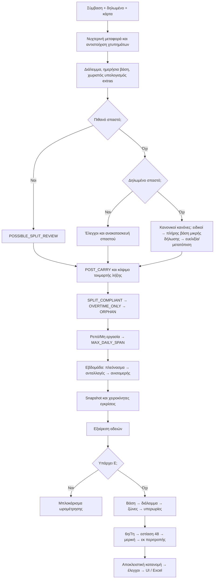
```mermaid
flowchart TD
  A["Σύμβαση + δηλωμένο + κάρτα"] --> B["Νυχτερινή μεταφορά και αντιστοίχιση χτυπημάτων"]
  B --> C["Διάλειμμα, ημερήσια βάση, χωριστός υπολογισμός extras"]
  C --> D{"Πιθανό σπαστό;"}
  D -->|Ναι| E["POSSIBLE_SPLIT_REVIEW"]
  D -->|Όχι| F{"Δηλωμένο σπαστό;"}
  F -->|Ναι| G["Έλεγχοι και ανακατασκευή σπαστού"]
  F -->|Όχι| H["Κανονικοί κανόνες: ειδικοί → πλήρης βάση μικρής δήλωσης → ευελιξία/μετατόπιση"]
  E --> I["POST_CARRY και κόψιμο τεκμαρτής λήξης"]
  G --> I
  H --> I
  I --> J["SPLIT_COMPLIANT → OVERTIME_ONLY → ORPHAN"]
  J --> K["Ρεπό/Μη εργασία → MAX_DAILY_SPAN"]
  K --> L["Εβδομάδα: πλεόνασμα → ανταλλαγές → ανισομερής"]
  L --> M["Snapshot και χειροκίνητες εγκρίσεις"]
  M --> N["Εξαίρεση αδειών"]
  N --> O{"Υπάρχει Ε;"}
  O -->|Ναι| P["Μπλοκάρισμα ωρομέτρησης"]
  O -->|Όχι| Q["Βάση → διάλειμμα → ζώνες → υπερωρίες"]
  Q --> R["6η/7η → εστίαση 48 → μερική → εκ περιτροπής"]
  R --> S["Αποκλειστική κατανομή → έλεγχοι → UI / Excel"]
```

## Ευρετήριο

- [NO_PUNCH_OK — Χωρίς χτύπημα](#no-punch-ok)
- [UNPREDICTABLE_NO_PUNCH — Μη προβλέψιμο χωρίς χτύπημα](#unpredictable-no-punch)
- [UNPREDICTABLE_PUNCH — Μη προβλέψιμο με χτύπημα](#unpredictable-punch)
- [INVALID_PUNCH_REVIEW — Μη ασφαλή όρια](#invalid-punch-review)
- [UNDECLARED_OVERNIGHT_REVIEW — Μη δηλωμένο νυχτερινό](#undeclared-overnight-review)
- [TELEWORK_WITH_PUNCH — Τηλεργασία με κάρτα](#telework-with-punch)
- [MISSING_ENTRY_NO_DURATION — Ελλείπουσα είσοδος χωρίς διάρκεια](#missing-entry-no-duration)
- [MISSING_ENTRY_REBUILT — Ανακατασκευή εισόδου](#missing-entry-rebuilt)
- [MISSING_ENTRY_EXTRA_BACKWARD — Ανάστροφη είσοδος με δηλωμένη διάρκεια](#missing-entry-extra-backward)
- [MISSING_EXIT_NO_DURATION — Ελλείπουσα έξοδος χωρίς διάρκεια](#missing-exit-no-duration)
- [MISSING_EXIT_REBUILT — Ανακατασκευή εξόδου](#missing-exit-rebuilt)
- [UNDECLARED_DAY_PUNCH_REVIEW — Χτύπημα χωρίς δηλωμένη διάρκεια](#undeclared-day-punch-review)
- [PARTIAL_FLEX_COMPLIANT — Παλαιός κανόνας ευελιξίας μερικής](#partial-flex-compliant)
- [PARTIAL_ACTUAL_CAPPED — Μερική με αυξημένη διάρκεια](#partial-actual-capped)
- [FULL_SHORT_DECLARATION_BASE — Πλήρης βάση αντί μικρής δήλωσης](#full-short-declaration-base)
- [FULL_SHORT_EVIDENCE_REVIEW — Έλεγχος αρχικής κάρτας και ιστορικής σύμβασης](#full-short-evidence-review)
- [FLEX_COMPLIANT — Αποδεκτή ευελιξία](#flex-compliant)
- [EARLY_START_SHIFT — Πρόωρη έναρξη](#early-start-shift)
- [LATE_SHORT_BACKWARD — Καθυστερημένο σύντομο χτύπημα](#late-short-backward)
- [ACTUAL_SHIFTED — Γενική μετατόπιση](#actual-shifted)
- [UNKNOWN_CASE_REVIEW — Άγνωστη περίπτωση](#unknown-case-review)
- [OVERTIME_ONLY — Μόνο υπερωρία](#overtime-only)
- [ORPHAN_PUNCH_REVIEW — Ορφανά χτυπήματα](#orphan-punch-review)
- [MAX_DAILY_SPAN_REVIEW — Υπέρβαση μέγιστης διάρκειας](#max-daily-span-review)
- [POST_CARRY_COMPLIANT — Σύμφωνο μετά μεταφορά νυχτερινών](#post-carry-compliant)
- [POST_CARRY_MAIN_SHIFT — Μεταβολή μετά μεταφορά νυχτερινών](#post-carry-main-shift)
- [REST_WORK_EXCHANGE_REVIEW — Υποψήφια ανταλλαγή ρεπό](#rest-work-exchange-review)
- [NON_WORK_DAY_BECOMES_WORK — Μη εργασία που γίνεται εργασία](#non-work-day-becomes-work)
- [SURPLUS_DECLARED_DAY_REST — Πλεονάζουσα δηλωμένη ημέρα](#surplus-declared-day-rest)
- [SPLIT_SINGLE_PUNCH_WITHIN_DECLARED — Παλαιός κανόνας ενός χτυπήματος σε σπαστό](#split-single-punch-within-declared)
- [SPLIT_REBUILT — Κατασκευή σπαστού](#split-rebuilt)
- [SPLIT_GAP_ADJUSTED — Διόρθωση κενού σπαστού](#split-gap-adjusted)
- [SPLIT_COMPLIANT — Σύμφωνο σπαστό](#split-compliant)
- [SPLIT_NON_FULL_REVIEW — Σπαστό χωρίς πλήρη απασχόληση](#split-non-full-review)
- [SPLIT_INVALID_GAP_REVIEW — Αδύνατο κενό σπαστού](#split-invalid-gap-review)
- [SPLIT_FIRST_PART_EXHAUSTS_DAY — Πρώτο μέρος καλύπτει την ημέρα](#split-first-part-exhausts-day)
- [SPLIT_INCOMPLETE_REVIEW — Ελλιπές σπαστό](#split-incomplete-review)
- [SPLIT_INVALID_BOUNDARIES — Μη έγκυρα όρια σπαστού](#split-invalid-boundaries)
- [POSSIBLE_SPLIT_REVIEW — Πιθανό αδήλωτο σπαστό](#possible-split-review)
- [POSSIBLE_SPLIT_INVALID_BOUNDARIES — Μη έγκυρα όρια πιθανού σπαστού](#possible-split-invalid-boundaries)
- [UNEVEN_DISTRIBUTION_TARGET_REVIEW — Ανισομερής: ημέρα αποδέκτης](#uneven-distribution-target-review)
- [UNEVEN_DISTRIBUTION_DONOR_REVIEW — Ανισομερής: ημέρα δότης](#uneven-distribution-donor-review)
- [A-DAILY-BASIS — Επιλογή ημερήσιας βάσης](#a-daily-basis)
- [A-BREAK — Καθαρή διάρκεια απολογιστικού](#a-break)
- [A-MULTI — Πολλαπλά χτυπήματα](#a-multi)
- [A-OVERNIGHT — Αλλαγή ημερομηνίας](#a-overnight)
- [A-INFERRED-OT — Ελλιπές χτύπημα και πρόσθετος χρόνος](#a-inferred-ot)
- [A-EXTRA-FULL — Πρόσθετος χρόνος πλήρους](#a-extra-full)
- [A-EXTRA-ROTATION — Πρόσθετος χρόνος εκ περιτροπής](#a-extra-rotation)
- [A-EXTRA-PARTIAL — Πρόσθετος χρόνος μερικής](#a-extra-partial)
- [PUNCH_DURATION_BELOW_CONTRACT_BASE — Μη εργασία → μικρότερη εργασία](#punch-duration-below-contract-base)
- [CONTRACT_BASE_WITH_EXTRA_CLASSIFICATION — Μη εργασία → βάση και πρόσθετος χρόνος](#contract-base-with-extra-classification)
- [PARTIAL_PUNCH_DURATION_CAPPED_AT_FULL_DAY — Μη εργασία → μερική](#partial-punch-duration-capped-at-full-day)
- [A-SUNDAY-REST — Οφειλόμενο ρεπό](#a-sunday-rest)
- [W-LEAVE — Εξαίρεση άδειας](#w-leave)
- [W-GATE — Προϋπόθεση εκτέλεσης](#w-gate)
- [W-LABEL — Επιλογή δηλωμένου / πρότασης](#w-label)
- [W-SPAN-EFFECTIVE — Χρήση effective διαστήματος](#w-span-effective)
- [W-SPAN-SAME — Ίδια ώρα εισόδου](#w-span-same)
- [W-SPAN-EARLY — Πρόωρη είσοδος](#w-span-early)
- [W-SPAN-LATE-IN — Καθυστέρηση με έξοδο μέσα στο δηλωμένο](#w-span-late-in)
- [W-SPAN-LATE-SHORT — Σύντομο μετατοπισμένο χτύπημα](#w-span-late-short)
- [W-BREAK — Τοποθέτηση εξωτερικού διαλείμματος](#w-break)
- [W-BASE-CAP — Κόφτης καθαρής και ορατής βάσης](#w-base-cap)
- [W-HOLIDAY — Προσαύξηση αργίας χωρίς κάρτα](#w-holiday)
- [W-NIGHT — Νυχτερινό λεπτό](#w-night)
- [W-SUNDAY — Κυριακή / αργία ανά λεπτό](#w-sunday)
- [W-OT-EXCLUDE — Εξαίρεση από 40% / 60%](#w-ot-exclude)
- [W-OT-DAILY — Υπερωρία πάνω από 4 ώρες](#w-ot-daily)
- [W-OT-ANNUAL — Ετήσιο όριο 150 ωρών](#w-ot-annual)
- [W-EXTRA-ZONES — Ζώνες υπερεργασίας και υπερωρίας](#w-extra-zones)
- [W-CANONICAL-INTERVALS — Canonical διαστήματα εξόδου](#w-canonical-intervals)
- [W-OVERWORK-CONTINUITY — Συνέχεια αναγνωρισμένου και υπερεργασίας](#w-overwork-continuity)
- [W-ACTUAL-FLOOR — Διατήρηση πραγματικών προσαυξήσεων](#w-actual-floor)
- [W-SIXTH — Χαρακτηρισμός 6ης ημέρας](#w-sixth)
- [W-SEVENTH — 7 αναγνωρισμένες ημέρες](#w-seventh)
- [W-SIXTH-EXEMPT — Εξαίρεση υποψήφιας 6ης](#w-sixth-exempt)
- [W-EXCEPTION — Πρόσθετος χρόνος 6ης / 7ης](#w-exception)
- [W-CATERING-48 — Εστίαση πάνω από 48 ώρες](#w-catering-48)
- [W-PARTIAL-CONTRACT — Συμβατικά στοιχεία μερικής](#w-partial-contract)
- [W-PARTIAL-PRORATE — Μερική με αλλαγή μέσα στην εβδομάδα](#w-partial-prorate)
- [W-PARTIAL-120 — Μερική πάνω από πλήρη ημέρα](#w-partial-120)
- [W-PARTIAL-WEEK — Δημιουργία πρόσθετης μερικής 12%](#w-partial-week)
- [W-PARTIAL-ALLOC — Κατανομή 12% σε ημερήσια υπερβάλλοντα](#w-partial-alloc)
- [W-PARTIAL-FALLBACK — Υπόλοιπο 12% χωρίς επαρκή ημερήσια υπέρβαση](#w-partial-fallback)
- [W-PARTIAL-PLACE — Χρονική τοποθέτηση 12%](#w-partial-place)
- [W-ROTATION — Επιπλέον ημέρες εκ περιτροπής](#w-rotation)
- [W-EXCLUSIVE — Αποφυγή διπλοχρέωσης βάσης](#w-exclusive)
- [W-MONTH — Μηνιαία ωρομέτρηση](#w-month)
- [S-ANNUAL-CONFIRM — Επιβεβαίωση υποβολής πάνω από 150 ώρες](#s-annual-confirm)

## NO_PUNCH_OK — Χωρίς χτύπημα

**Απολογιστικό · ημερήσιοι · Ενεργός**

Πηγή: [app/apologistic_rules.py:190](../app/apologistic_rules.py#L190)

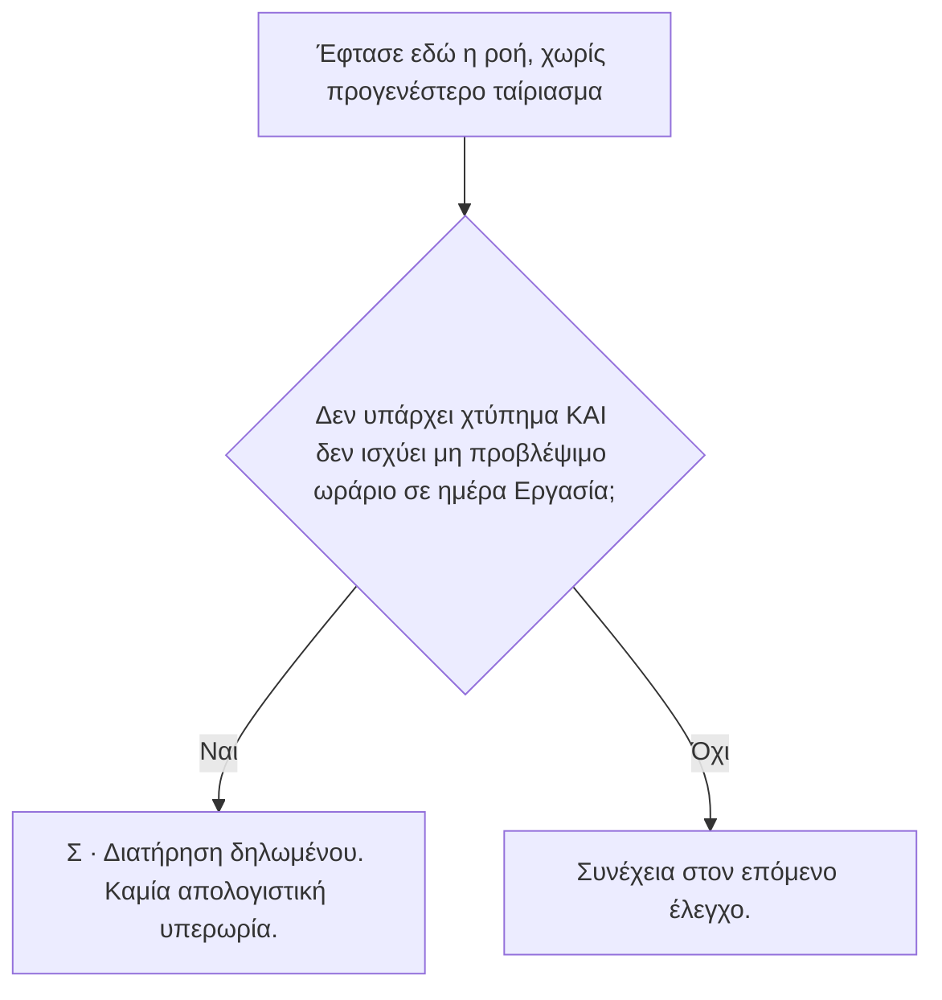
```mermaid
flowchart TD
  A["Έφτασε εδώ η ροή, χωρίς προγενέστερο ταίριασμα"] --> B{"Δεν υπάρχει χτύπημα ΚΑΙ δεν ισχύει μη προβλέψιμο ωράριο σε ημέρα Εργασία;"}
  B -->|Ναι| C["Σ · Διατήρηση δηλωμένου. Καμία απολογιστική υπερωρία."]
  B -->|Όχι| D["Συνέχεια στον επόμενο έλεγχο."]
```

Αφορά την κανονική διαδρομή. Δηλωμένο σπαστό χωρίς κάρτα οδηγείται νωρίτερα στη διαδρομή σπαστού. Στην ωρομέτρηση το δηλωμένο μπορεί να χρησιμοποιηθεί ως τεκμαρτή μισθολογική βάση.

## UNPREDICTABLE_NO_PUNCH — Μη προβλέψιμο χωρίς χτύπημα

**Απολογιστικό · ημερήσιοι · Ενεργός**

Πηγή: [app/apologistic_rules.py:189](../app/apologistic_rules.py#L189)

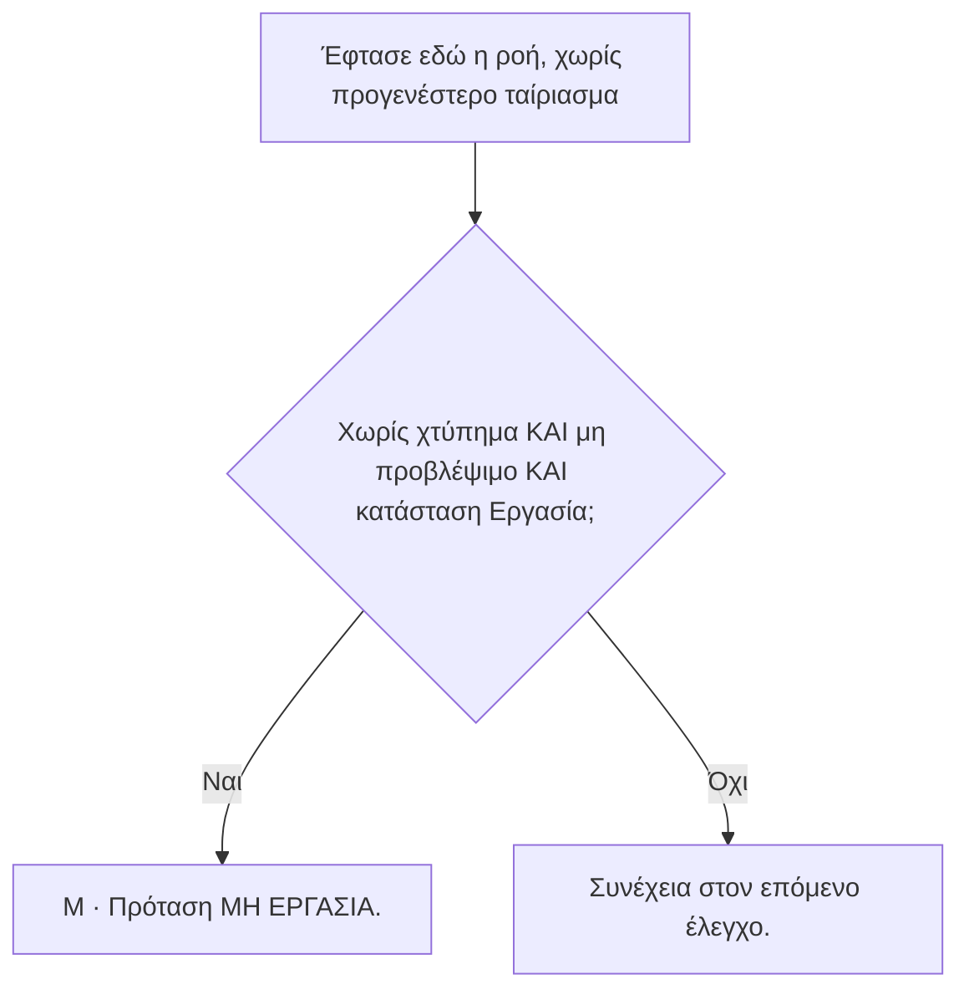
```mermaid
flowchart TD
  A["Έφτασε εδώ η ροή, χωρίς προγενέστερο ταίριασμα"] --> B{"Χωρίς χτύπημα ΚΑΙ μη προβλέψιμο ΚΑΙ κατάσταση Εργασία;"}
  B -->|Ναι| C["Μ · Πρόταση ΜΗ ΕΡΓΑΣΙΑ."]
  B -->|Όχι| D["Συνέχεια στον επόμενο έλεγχο."]
```

## UNPREDICTABLE_PUNCH — Μη προβλέψιμο με χτύπημα

**Απολογιστικό · ημερήσιοι · Ενεργός**

Πηγή: [app/apologistic_rules.py:198](../app/apologistic_rules.py#L198)

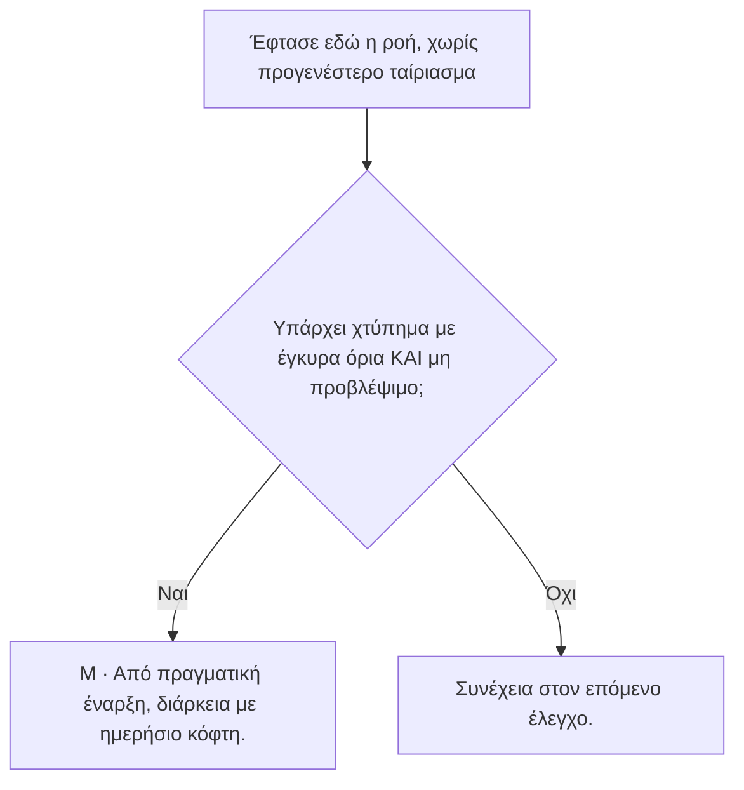
```mermaid
flowchart TD
  A["Έφτασε εδώ η ροή, χωρίς προγενέστερο ταίριασμα"] --> B{"Υπάρχει χτύπημα με έγκυρα όρια ΚΑΙ μη προβλέψιμο;"}
  B -->|Ναι| C["Μ · Από πραγματική έναρξη, διάρκεια με ημερήσιο κόφτη."]
  B -->|Όχι| D["Συνέχεια στον επόμενο έλεγχο."]
```

Κόφτης = επιλεγμένη ημερήσια βάση ή δηλωμένα λεπτά. Ο κώδικας χρησιμοποιεί effective_actual or actual_minutes: μηδενική καθαρή διάρκεια πέφτει στη μικτή.

## INVALID_PUNCH_REVIEW — Μη ασφαλή όρια

**Απολογιστικό · ημερήσιοι · Ενεργός**

Πηγή: [app/apologistic_rules.py:192](../app/apologistic_rules.py#L192)

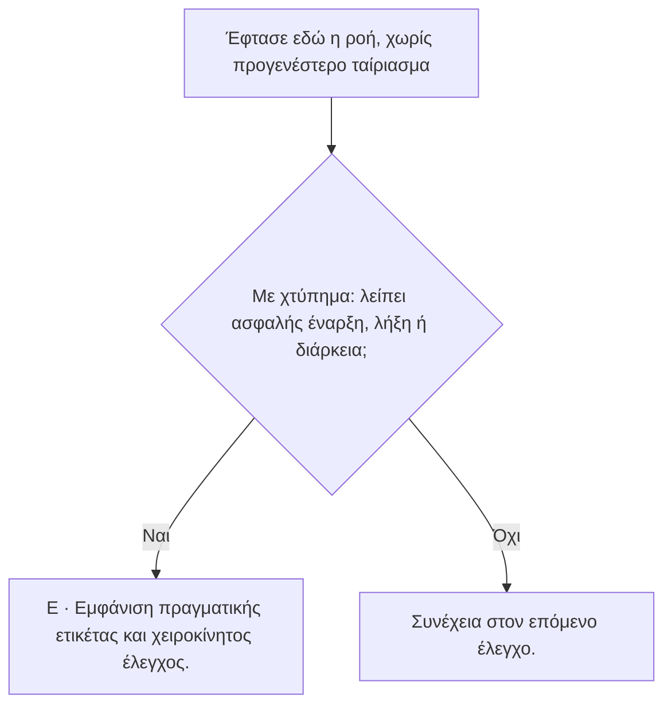
```mermaid
flowchart TD
  A["Έφτασε εδώ η ροή, χωρίς προγενέστερο ταίριασμα"] --> B{"Με χτύπημα: λείπει ασφαλής έναρξη, λήξη ή διάρκεια;"}
  B -->|Ναι| C["Ε · Εμφάνιση πραγματικής ετικέτας και χειροκίνητος έλεγχος."]
  B -->|Όχι| D["Συνέχεια στον επόμενο έλεγχο."]
```

## UNDECLARED_OVERNIGHT_REVIEW — Μη δηλωμένο νυχτερινό

**Απολογιστικό · ημερήσιοι · Μη προσβάσιμος από την τρέχουσα κύρια ροή**

Πηγή: [app/apologistic_rules.py:194](../app/apologistic_rules.py#L194)

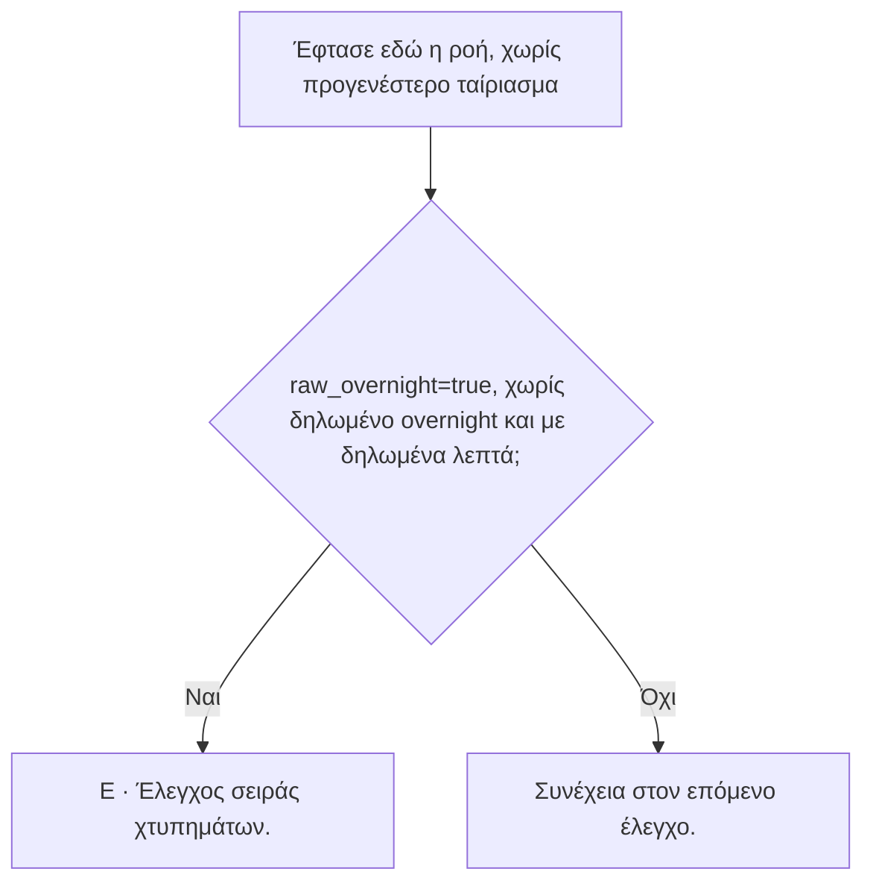
```mermaid
flowchart TD
  A["Έφτασε εδώ η ροή, χωρίς προγενέστερο ταίριασμα"] --> B{"raw_overnight=true, χωρίς δηλωμένο overnight και με δηλωμένα λεπτά;"}
  B -->|Ναι| C["Ε · Έλεγχος σειράς χτυπημάτων."]
  B -->|Όχι| D["Συνέχεια στον επόμενο έλεγχο."]
```

Η συνάρτηση διαθέτει αυτόν τον κλάδο, αλλά το build_weekly_report περνά raw_overnight=False. Η πραγματική αποδοχή overnight γίνεται νωρίτερα στο _valid_punch_interval.

## TELEWORK_WITH_PUNCH — Τηλεργασία με κάρτα

**Απολογιστικό · ημερήσιοι · Ενεργός**

Πηγή: [app/apologistic_rules.py:201](../app/apologistic_rules.py#L201)

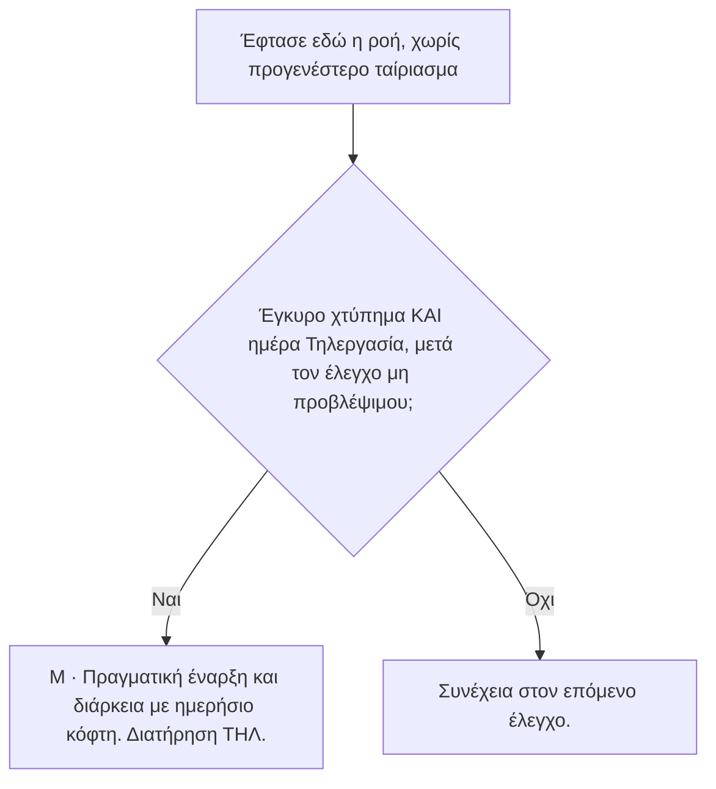
```mermaid
flowchart TD
  A["Έφτασε εδώ η ροή, χωρίς προγενέστερο ταίριασμα"] --> B{"Έγκυρο χτύπημα ΚΑΙ ημέρα Τηλεργασία, μετά τον έλεγχο μη προβλέψιμου;"}
  B -->|Ναι| C["Μ · Πραγματική έναρξη και διάρκεια με ημερήσιο κόφτη. Διατήρηση ΤΗΛ."]
  B -->|Όχι| D["Συνέχεια στον επόμενο έλεγχο."]
```

## MISSING_ENTRY_NO_DURATION — Ελλείπουσα είσοδος χωρίς διάρκεια

**Απολογιστικό · ημερήσιοι · Ενεργός**

Πηγή: [app/apologistic_rules.py:205](../app/apologistic_rules.py#L205)

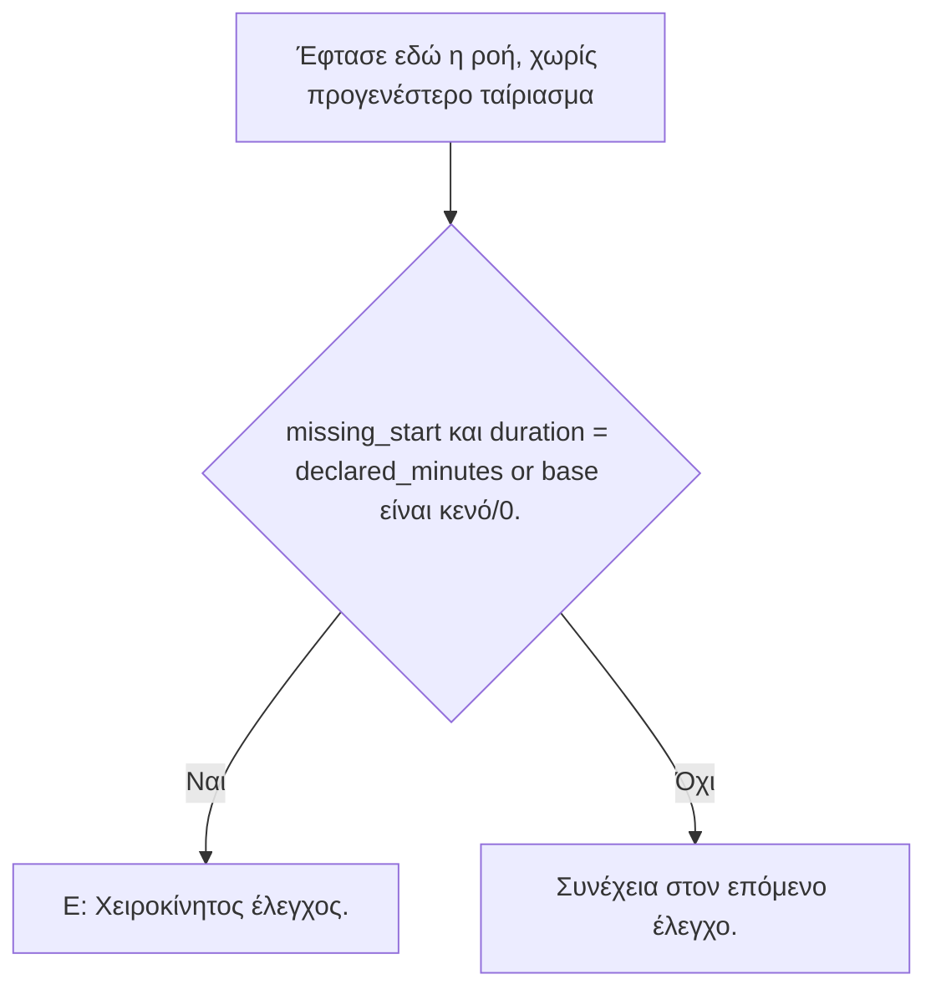
```mermaid
flowchart TD
  A["Έφτασε εδώ η ροή, χωρίς προγενέστερο ταίριασμα"] --> B{"missing_start και duration = declared_minutes or base είναι κενό/0."}
  B -->|Ναι| C["Ε: Χειροκίνητος έλεγχος."]
  B -->|Όχι| D["Συνέχεια στον επόμενο έλεγχο."]
```

## MISSING_ENTRY_REBUILT — Ανακατασκευή εισόδου

**Απολογιστικό · ημερήσιοι · Ενεργός**

Πηγή: [app/apologistic_rules.py:208](../app/apologistic_rules.py#L208)

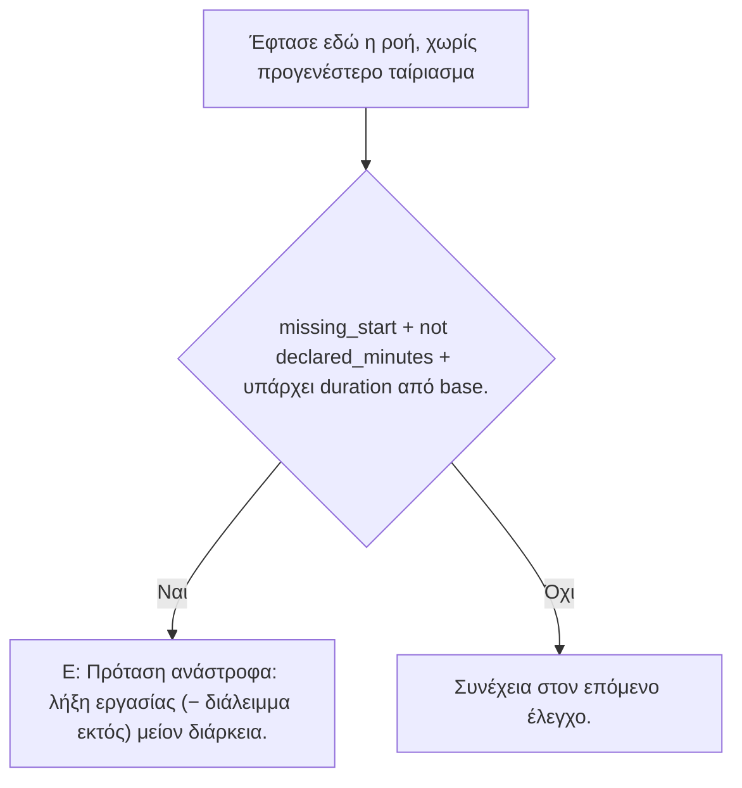
```mermaid
flowchart TD
  A["Έφτασε εδώ η ροή, χωρίς προγενέστερο ταίριασμα"] --> B{"missing_start + not declared_minutes + υπάρχει duration από base."}
  B -->|Ναι| C["Ε: Πρόταση ανάστροφα: λήξη εργασίας (− διάλειμμα εκτός) μείον διάρκεια."]
  B -->|Όχι| D["Συνέχεια στον επόμενο έλεγχο."]
```

Στη βοηθητική συνάρτηση ισχύει όπως περιγράφεται. Η τελική ημερήσια κατάσταση μπορεί να αντικατασταθεί από ειδική ροή ρεπό/μη εργασίας.

## MISSING_ENTRY_EXTRA_BACKWARD — Ανάστροφη είσοδος με δηλωμένη διάρκεια

**Απολογιστικό · ημερήσιοι · Ενεργός**

Πηγή: [app/apologistic_rules.py:211](../app/apologistic_rules.py#L211)

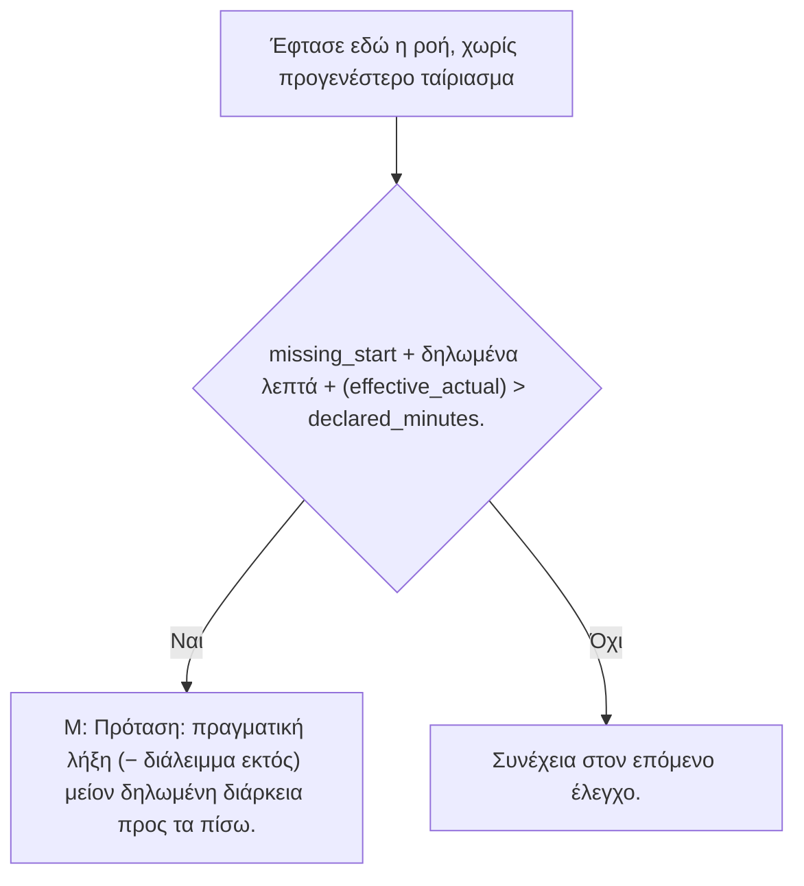
```mermaid
flowchart TD
  A["Έφτασε εδώ η ροή, χωρίς προγενέστερο ταίριασμα"] --> B{"missing_start + δηλωμένα λεπτά + (effective_actual) &gt; declared_minutes."}
  B -->|Ναι| C["Μ: Πρόταση: πραγματική λήξη (− διάλειμμα εκτός) μείον δηλωμένη διάρκεια προς τα πίσω."]
  B -->|Όχι| D["Συνέχεια στον επόμενο έλεγχο."]
```

## MISSING_EXIT_NO_DURATION — Ελλείπουσα έξοδος χωρίς διάρκεια

**Απολογιστικό · ημερήσιοι · Ενεργός**

Πηγή: [app/apologistic_rules.py:215](../app/apologistic_rules.py#L215)

```mermaid
flowchart TD
  A["Έφτασε εδώ η ροή, χωρίς προγενέστερο ταίριασμα"] --> B{"missing_end και duration = 0."}
  B -->|Ναι| C["Ε: Χειροκίνητος έλεγχος."]
  B -->|Όχι| D["Συνέχεια στον επόμενο έλεγχο."]
```

## MISSING_EXIT_REBUILT — Ανακατασκευή εξόδου

**Απολογιστικό · ημερήσιοι · Ενεργός**

Πηγή: [app/apologistic_rules.py:217](../app/apologistic_rules.py#L217)

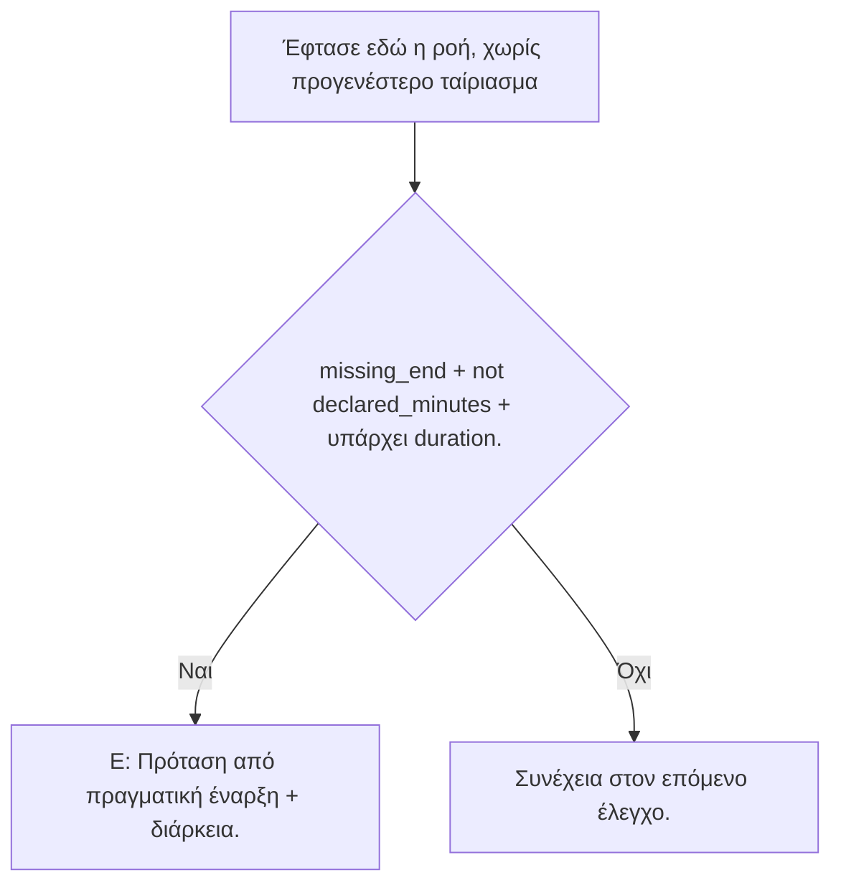
```mermaid
flowchart TD
  A["Έφτασε εδώ η ροή, χωρίς προγενέστερο ταίριασμα"] --> B{"missing_end + not declared_minutes + υπάρχει duration."}
  B -->|Ναι| C["Ε: Πρόταση από πραγματική έναρξη + διάρκεια."]
  B -->|Όχι| D["Συνέχεια στον επόμενο έλεγχο."]
```

Με δηλωμένη διάρκεια η συνάρτηση συνεχίζει στους υπόλοιπους κανόνες. Η τεκμαρτή λήξη μπορεί κατόπιν να κοπεί στη λήξη πρότασης. Ελέγξτε και A-INFERRED-OT.

## UNDECLARED_DAY_PUNCH_REVIEW — Χτύπημα χωρίς δηλωμένη διάρκεια

**Απολογιστικό · ημερήσιοι · Ενεργός**

Πηγή: [app/apologistic_rules.py:221](../app/apologistic_rules.py#L221)

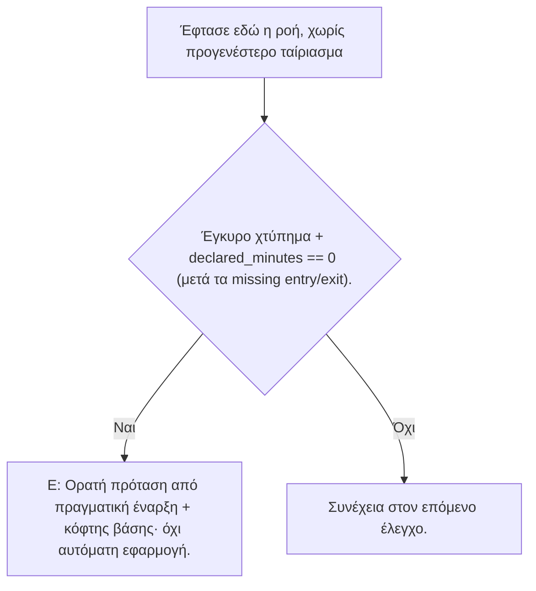
```mermaid
flowchart TD
  A["Έφτασε εδώ η ροή, χωρίς προγενέστερο ταίριασμα"] --> B{"Έγκυρο χτύπημα + declared_minutes == 0 (μετά τα missing entry/exit)."}
  B -->|Ναι| C["Ε: Ορατή πρόταση από πραγματική έναρξη + κόφτης βάσης· όχι αυτόματη εφαρμογή."]
  B -->|Όχι| D["Συνέχεια στον επόμενο έλεγχο."]
```

## PARTIAL_FLEX_COMPLIANT — Παλαιός κανόνας ευελιξίας μερικής

**Απολογιστικό · ημερήσιοι · Ανενεργός · μόνο στον παλιό κατάλογο**

Πηγή: [docs/APOLOGISTIKO_RULES_CATALOG.md:227](../docs/APOLOGISTIKO_RULES_CATALOG.md#L227)

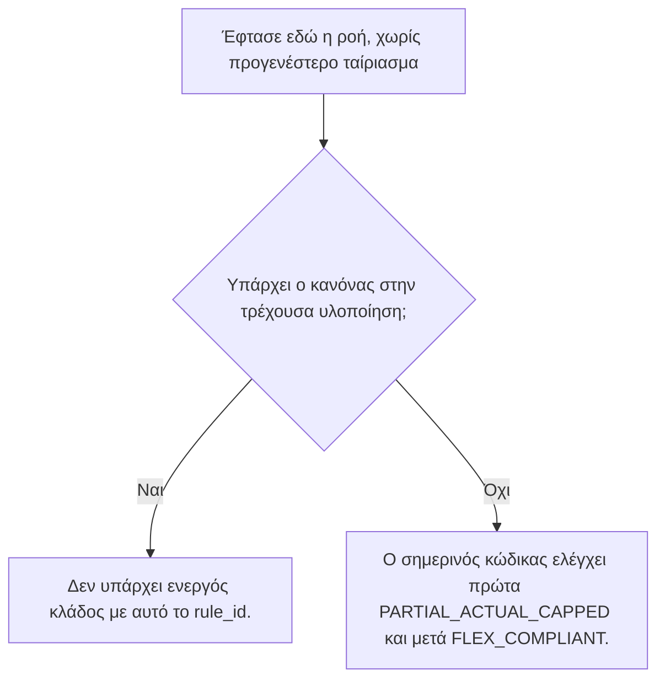
```mermaid
flowchart TD
  A["Έφτασε εδώ η ροή, χωρίς προγενέστερο ταίριασμα"] --> B{"Υπάρχει ο κανόνας στην τρέχουσα υλοποίηση;"}
  B -->|Ναι| C["Δεν υπάρχει ενεργός κλάδος με αυτό το rule_id."]
  B -->|Όχι| D["Ο σημερινός κώδικας ελέγχει πρώτα PARTIAL_ACTUAL_CAPPED και μετά FLEX_COMPLIANT."]
```

Δεν υπάρχει στο app/apologistic_rules.py μετά την αναστροφή του σχετικού fix. Δεν εφαρμόζεται η περιγραφή του παλιού καταλόγου.

## PARTIAL_ACTUAL_CAPPED — Μερική με αυξημένη διάρκεια

**Απολογιστικό · ημερήσιοι · Ενεργός**

Πηγή: [app/apologistic_rules.py:224](../app/apologistic_rules.py#L224)

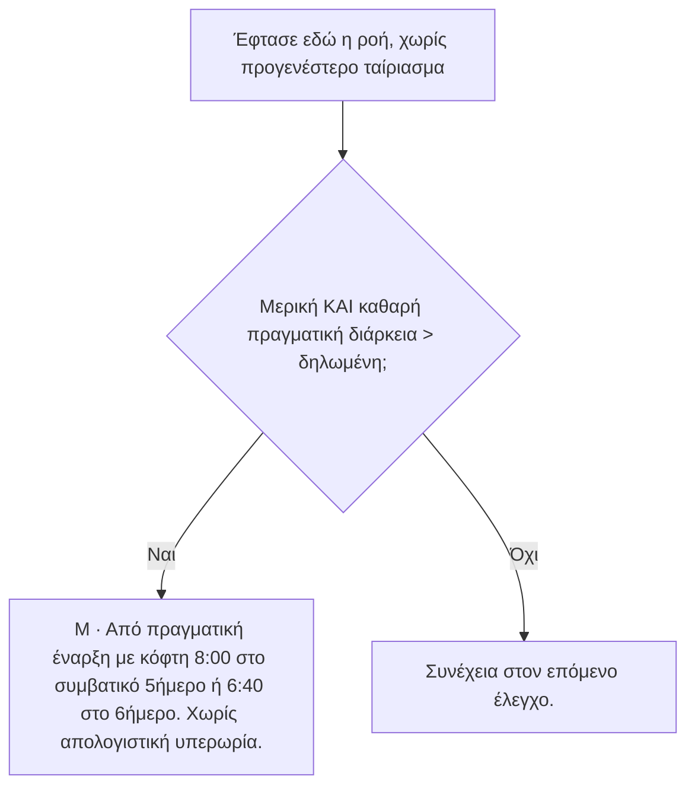
```mermaid
flowchart TD
  A["Έφτασε εδώ η ροή, χωρίς προγενέστερο ταίριασμα"] --> B{"Μερική ΚΑΙ καθαρή πραγματική διάρκεια &gt; δηλωμένη;"}
  B -->|Ναι| C["Μ · Από πραγματική έναρξη με κόφτη 8:00 στο συμβατικό 5ήμερο ή 6:40 στο 6ήμερο. Χωρίς απολογιστική υπερωρία."]
  B -->|Όχι| D["Συνέχεια στον επόμενο έλεγχο."]
```

Αυτός ο έλεγχος προηγείται του FLEX_COMPLIANT. Άγνωστη βάση: fallback στη δηλωμένη διάρκεια.

## FULL_SHORT_DECLARATION_BASE — Πλήρης βάση αντί μικρής δήλωσης

**Απολογιστικό · ημερήσιοι · Ενεργός**

Πηγή: [app/apologistic_rules.py:248](../app/apologistic_rules.py#L248)

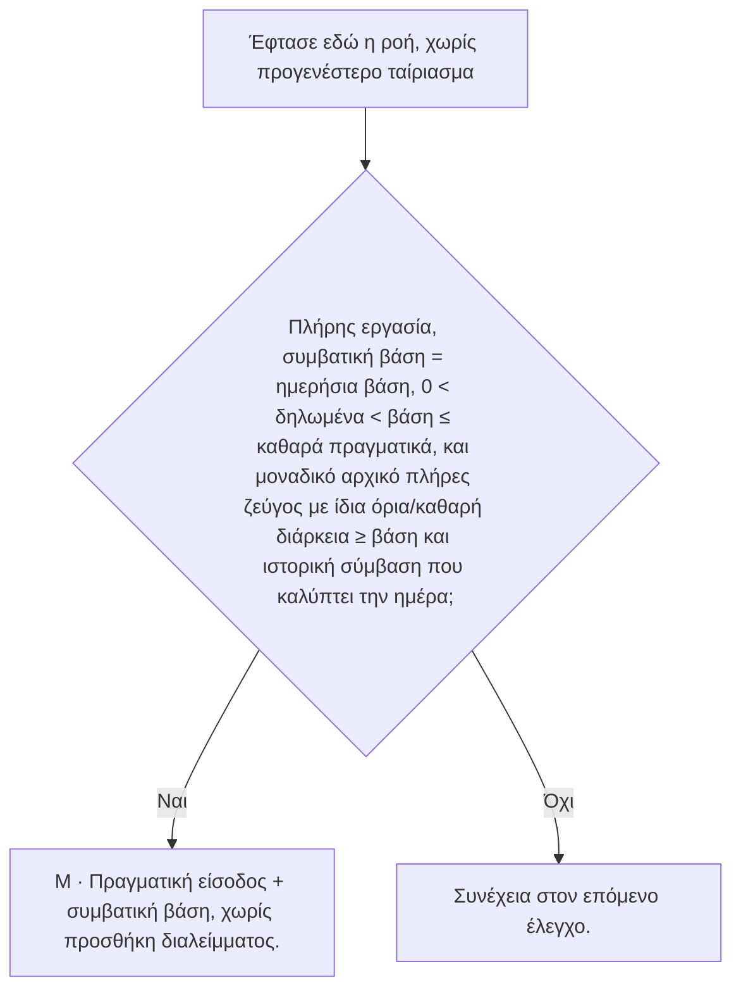
```mermaid
flowchart TD
  A["Έφτασε εδώ η ροή, χωρίς προγενέστερο ταίριασμα"] --> B{"Πλήρης εργασία, συμβατική βάση = ημερήσια βάση, 0 &lt; δηλωμένα &lt; βάση ≤ καθαρά πραγματικά, και μοναδικό αρχικό πλήρες ζεύγος με ίδια όρια/καθαρή διάρκεια ≥ βάση και ιστορική σύμβαση που καλύπτει την ημέρα;"}
  B -->|Ναι| C["Μ · Πραγματική είσοδος + συμβατική βάση, χωρίς προσθήκη διαλείμματος."]
  B -->|Όχι| D["Συνέχεια στον επόμενο έλεγχο."]
```

Πριν από ευελιξία/μετατόπιση. Caller: ένα δηλωμένο/αναγνωρισμένο τμήμα, χωρίς τεκμαρτά, ορφανά, πιθανό σπαστό, POST_CARRY, διευθέτηση ή ανισομερή κατανομή (σύμβαση ή flag καταστήματος). Βάση από συμβατικό 5/6ήμερο. Διατηρούνται declared και extras. Ακριβώς 6:40 σε συμβατικό 5ήμερο εξαιρείται λόγω διαφορετικής ημερήσιας βάσης. Η ωρομέτρηση κρατά χωριστή αναγνωρισμένη βάση.

## FULL_SHORT_EVIDENCE_REVIEW — Έλεγχος αρχικής κάρτας και ιστορικής σύμβασης

**Απολογιστικό · ημερήσιοι · Ενεργός**

Πηγή: [app/apologistic.py:708](../app/apologistic.py#L708)

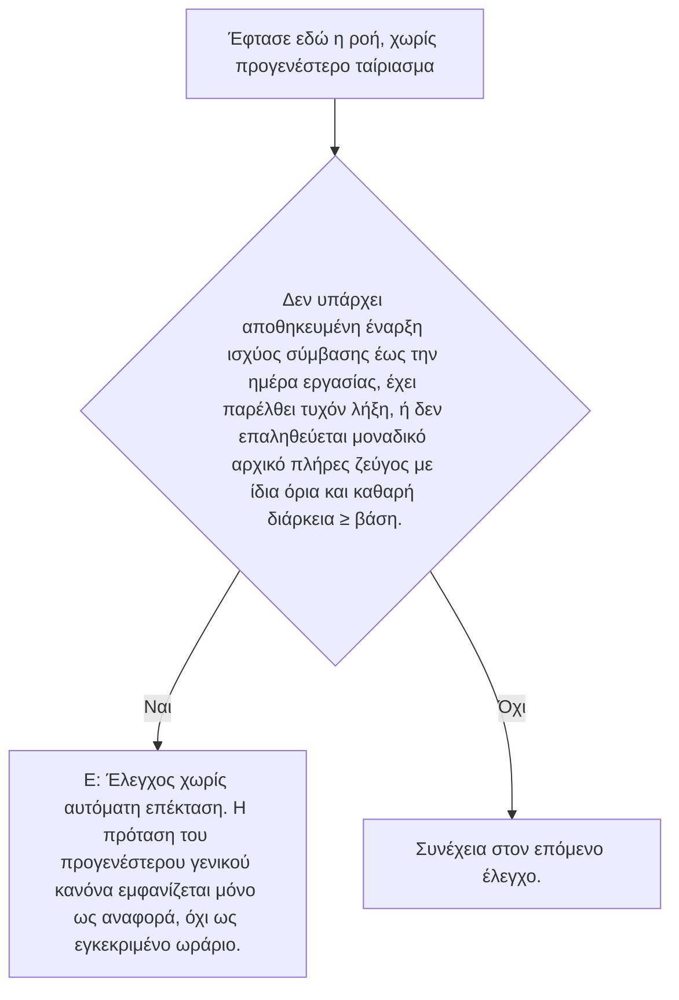
```mermaid
flowchart TD
  A["Έφτασε εδώ η ροή, χωρίς προγενέστερο ταίριασμα"] --> B{"Δεν υπάρχει αποθηκευμένη έναρξη ισχύος σύμβασης έως την ημέρα εργασίας, έχει παρέλθει τυχόν λήξη, ή δεν επαληθεύεται μοναδικό αρχικό πλήρες ζεύγος με ίδια όρια και καθαρή διάρκεια ≥ βάση."}
  B -->|Ναι| C["Ε: Έλεγχος χωρίς αυτόματη επέκταση. Η πρόταση του προγενέστερου γενικού κανόνα εμφανίζεται μόνο ως αναφορά, όχι ως εγκεκριμένο ωράριο."]
  B -->|Όχι| D["Συνέχεια στον επόμενο έλεγχο."]
```

Εφαρμόζεται μόνο σε υποψήφια FULL_SHORT_DECLARATION_BASE. Η αρχική κάρτα διατηρείται πριν από normalize_overnight_work_log_rows στο app/repo_work_log.py. Η παλιά πρόταση είναι αποκλειστικά αναφορά. Δεν μεταβάλλεται ο χωριστός υπολογισμός ωρομέτρησης.

## FLEX_COMPLIANT — Αποδεκτή ευελιξία

**Απολογιστικό · ημερήσιοι · Ενεργός**

Πηγή: [app/apologistic_rules.py:254](../app/apologistic_rules.py#L254)

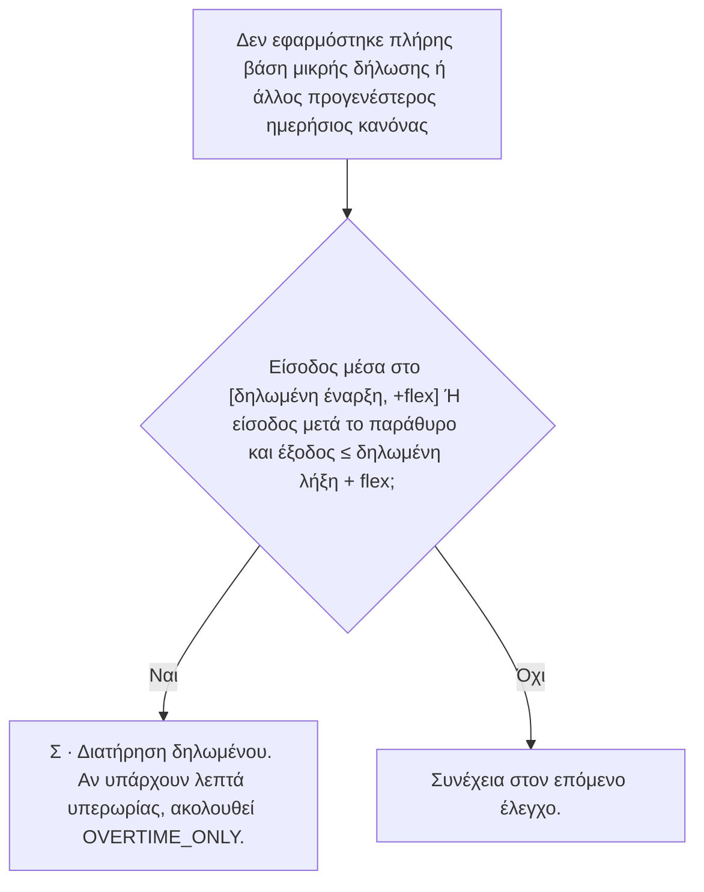
```mermaid
flowchart TD
  A["Δεν εφαρμόστηκε πλήρης βάση μικρής δήλωσης ή άλλος προγενέστερος ημερήσιος κανόνας"] --> B{"Είσοδος μέσα στο [δηλωμένη έναρξη, +flex] Ή είσοδος μετά το παράθυρο και έξοδος ≤ δηλωμένη λήξη + flex;"}
  B -->|Ναι| C["Σ · Διατήρηση δηλωμένου. Αν υπάρχουν λεπτά υπερωρίας, ακολουθεί OVERTIME_ONLY."]
  B -->|Όχι| D["Συνέχεια στον επόμενο έλεγχο."]
```

Ο κλάδος εισόδου εντός flex δεν απαιτεί ταυτόχρονα έξοδο εντός παραθύρου. Προϋπόθεση: δεν έχει ήδη ταιριάξει προηγούμενος κανόνας, π.χ. μερική με αυξημένη διάρκεια.

## EARLY_START_SHIFT — Πρόωρη έναρξη

**Απολογιστικό · ημερήσιοι · Ενεργός**

Πηγή: [app/apologistic_rules.py:256](../app/apologistic_rules.py#L256)

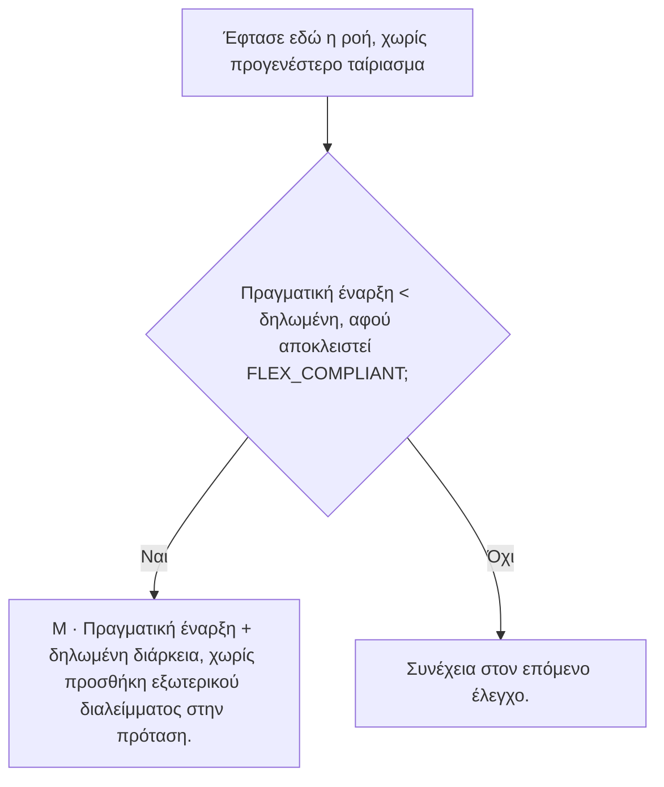
```mermaid
flowchart TD
  A["Έφτασε εδώ η ροή, χωρίς προγενέστερο ταίριασμα"] --> B{"Πραγματική έναρξη &lt; δηλωμένη, αφού αποκλειστεί FLEX_COMPLIANT;"}
  B -->|Ναι| C["Μ · Πραγματική έναρξη + δηλωμένη διάρκεια, χωρίς προσθήκη εξωτερικού διαλείμματος στην πρόταση."]
  B -->|Όχι| D["Συνέχεια στον επόμενο έλεγχο."]
```

## LATE_SHORT_BACKWARD — Καθυστερημένο σύντομο χτύπημα

**Απολογιστικό · ημερήσιοι · Ενεργός**

Πηγή: [app/apologistic_rules.py:259](../app/apologistic_rules.py#L259)

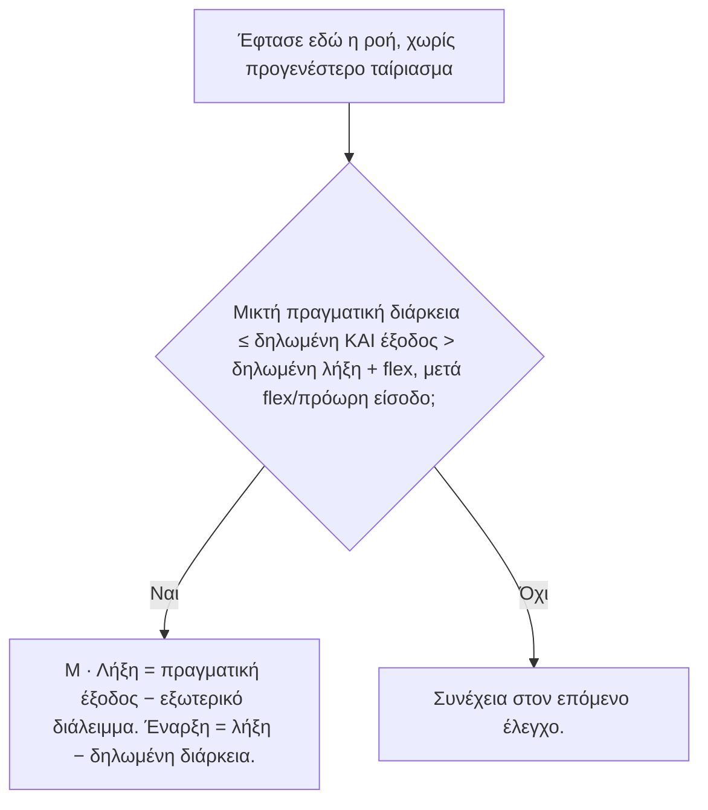
```mermaid
flowchart TD
  A["Έφτασε εδώ η ροή, χωρίς προγενέστερο ταίριασμα"] --> B{"Μικτή πραγματική διάρκεια ≤ δηλωμένη ΚΑΙ έξοδος &gt; δηλωμένη λήξη + flex, μετά flex/πρόωρη είσοδο;"}
  B -->|Ναι| C["Μ · Λήξη = πραγματική έξοδος − εξωτερικό διάλειμμα. Έναρξη = λήξη − δηλωμένη διάρκεια."]
  B -->|Όχι| D["Συνέχεια στον επόμενο έλεγχο."]
```

Παράδειγμα χωρίς διάλειμμα/flex: δηλωμένο 09:00–17:00, κάρτα 11:00–18:00 → πρόταση 10:00–18:00.

## ACTUAL_SHIFTED — Γενική μετατόπιση

**Απολογιστικό · ημερήσιοι · Ενεργός**

Πηγή: [app/apologistic_rules.py:260](../app/apologistic_rules.py#L260)

```mermaid
flowchart TD
  A["Έφτασε εδώ η ροή, χωρίς προγενέστερο ταίριασμα"] --> B{"Υπάρχουν δηλωμένα όρια· δεν καλύφθηκε από flex / early / late-short."}
  B -->|Ναι| C["Μ: Πραγματική έναρξη + δηλωμένη διάρκεια."]
  B -->|Όχι| D["Συνέχεια στον επόμενο έλεγχο."]
```

## UNKNOWN_CASE_REVIEW — Άγνωστη περίπτωση

**Απολογιστικό · ημερήσιοι · Ενεργός**

Πηγή: [app/apologistic_rules.py:261](../app/apologistic_rules.py#L261)

```mermaid
flowchart TD
  A["Έφτασε εδώ η ροή, χωρίς προγενέστερο ταίριασμα"] --> B{"Default στο τέλος του normal_schedule_decision ή αρχική τιμή πριν από ειδική διαδρομή."}
  B -->|Ναι| C["Ε: Χειροκίνητος έλεγχος."]
  B -->|Όχι| D["Συνέχεια στον επόμενο έλεγχο."]
```

## OVERTIME_ONLY — Μόνο υπερωρία

**Απολογιστικό · μετα-κανόνες · Ενεργός**

Πηγή: [app/apologistic.py:1243](../app/apologistic.py#L1243)

```mermaid
flowchart TD
  A["Ειδική διαδρομή / έλεγχος μετά την κύρια απόφαση"] --> B{"status == ok και overtime_minutes &gt; 0."}
  B -->|Ναι| C["Μ: Κρατά δηλωμένο ωράριο· στήλη υπερωρίας γεμίζει με διάστημα."]
  B -->|Όχι| D["Συνέχεια στον επόμενο έλεγχο."]
```

## ORPHAN_PUNCH_REVIEW — Ορφανά χτυπήματα

**Απολογιστικό · μετα-κανόνες · Ενεργός**

Πηγή: [app/apologistic.py:1245](../app/apologistic.py#L1245)

```mermaid
flowchart TD
  A["Ειδική διαδρομή / έλεγχος μετά την κύρια απόφαση"] --> B{"Υπάρχουν ορφανά χτυπήματα ΚΑΙ ακριβώς ένα δηλωμένο τμήμα;"}
  B -->|Ναι| C["Ε · Έλεγχος ορφανών, με διατήρηση προηγούμενης πρότασης."]
  B -->|Όχι| D["Συνέχεια στον επόμενο έλεγχο."]
```

Πολλαπλές εγγραφές δεν σημαίνουν αυτόματα ορφανά: μπορεί να έχουν ενσωματωθεί στο μέγιστο έγκυρο διάστημα.

## MAX_DAILY_SPAN_REVIEW — Υπέρβαση μέγιστης διάρκειας

**Απολογιστικό · μετα-κανόνες · Ενεργός**

Πηγή: [app/apologistic.py:1292](../app/apologistic.py#L1292)

```mermaid
flowchart TD
  A["Ειδική διαδρομή / έλεγχος μετά την κύρια απόφαση"] --> B{"5ήμερο: actual_minutes &gt; 780 (13ώ)· 6ήμερο: &gt; 720 (12ώ)."}
  B -->|Ναι| C["Ε: Status → review· η πρόταση των κανονικών κανόνων διατηρείται για έλεγχο."]
  B -->|Όχι| D["Συνέχεια στον επόμενο έλεγχο."]
```

## POST_CARRY_COMPLIANT — Σύμφωνο μετά μεταφορά νυχτερινών

**Απολογιστικό · μετα-κανόνες · Ενεργός**

Πηγή: [app/apologistic.py:1170](../app/apologistic.py#L1170)

```mermaid
flowchart TD
  A["Ειδική διαδρομή / έλεγχος μετά την κύρια απόφαση"] --> B{"Μεταφέρθηκαν χτυπήματα στη χθεσινή βάρδια, υπάρχει ένα δηλωμένο τμήμα, έγκυρη έναρξη, δηλωμένα λεπτά και όχι πιθανό σπαστό, ΚΑΙ έναρξη + δηλωμένη διάρκεια = δηλωμένο;"}
  B -->|Ναι| C["Σ · Διατήρηση δηλωμένου."]
  B -->|Όχι| D["Συνέχεια στον επόμενο έλεγχο."]
```

Αντικαθιστά την προηγούμενη απόφαση πριν από τους ελέγχους υπερωρίας, ορφανών, μη εργασίας και μέγιστης διάρκειας.

## POST_CARRY_MAIN_SHIFT — Μεταβολή μετά μεταφορά νυχτερινών

**Απολογιστικό · μετα-κανόνες · Ενεργός**

Πηγή: [app/apologistic.py:1178](../app/apologistic.py#L1178)

```mermaid
flowchart TD
  A["Ειδική διαδρομή / έλεγχος μετά την κύρια απόφαση"] --> B{"Ίδιες προϋποθέσεις POST_CARRY, αλλά έναρξη + δηλωμένη διάρκεια ≠ δηλωμένο;"}
  B -->|Ναι| C["Μ · Πρόταση από την πραγματική έναρξη της κύριας βάρδιας με δηλωμένη διάρκεια."]
  B -->|Όχι| D["Συνέχεια στον επόμενο έλεγχο."]
```

## REST_WORK_EXCHANGE_REVIEW — Υποψήφια ανταλλαγή ρεπό

**Απολογιστικό · εβδομάδα / ρεπό · Ενεργός**

Πηγή: [app/apologistic.py:1264](../app/apologistic.py#L1264)

```mermaid
flowchart TD
  A["Ειδική διαδρομή / έλεγχος μετά την κύρια απόφαση"] --> B{"Ειδικό χτύπημα σε Ρεπό/Μη εργασία ΚΑΙ διαθέσιμη δηλωμένη εργάσιμη χωρίς κάρτα στην ίδια εβδομάδα;"}
  B -->|Ναι| C["Ε · Προτάσεις ανταλλαγής με διάρκεια της υποψήφιας εργάσιμης. Καμία αυτόματη ανταλλαγή."]
  B -->|Όχι| D["Συνέχεια στον επόμενο έλεγχο."]
```

Το special_non_work_punch απαιτεί matched και κάρτα, και είτε δηλωμένη κατάσταση είτε μη τεκμαρτό χτύπημα. Εβδομαδιαία κρατούνται μόνο τόσες ανταλλαγές όσες οι διαθέσιμες εργάσιμες.

## NON_WORK_DAY_BECOMES_WORK — Μη εργασία που γίνεται εργασία

**Απολογιστικό · εβδομάδα / ρεπό · Ενεργός**

Πηγή: [app/apologistic.py:1269](../app/apologistic.py#L1269)

```mermaid
flowchart TD
  A["Ειδική διαδρομή / έλεγχος μετά την κύρια απόφαση"] --> B{"Χτύπημα σε ειδική ημέρα Ρεπό/Μη εργασία χωρίς διαθέσιμη ανταλλαγή ή υπεράριθμη ημέρα ανταλλαγής;"}
  B -->|Ναι| C["Μ · Εργασία με την ήδη υπολογισμένη πρόταση."]
  B -->|Όχι| D["Συνέχεια στον επόμενο έλεγχο."]
```

Στον ημερήσιο κλάδο γράφεται και non_work_to_work_duration_rule. Στον εβδομαδιαίο κλάδο πλεοναζουσών ανταλλαγών αλλάζει status/rule_id και αδειάζουν επιλογές, αλλά δεν ανακατασκευάζεται η προηγούμενη πρόταση. Αυτό διαφέρει από τη γενική διατύπωση του καταλόγου.

## SURPLUS_DECLARED_DAY_REST — Πλεονάζουσα δηλωμένη ημέρα

**Απολογιστικό · εβδομάδα / ρεπό · Ενεργός**

Πηγή: [app/apologistic.py:1470](../app/apologistic.py#L1470)

```mermaid
flowchart TD
  A["Ειδική διαδρομή / έλεγχος μετά την κύρια απόφαση"] --> B{"Δηλωμένες εργάσιμες &gt; ημέρες σύμβασης ΚΑΙ υπάρχουν εργάσιμες χωρίς κάρτα;"}
  B -->|Ναι| C["Ε · Στις πρώτες χωρίς κάρτα, έως το πλεόνασμα: πρόταση ΑΝΑΠΑΥΣΗ/ΡΕΠΟ με έγκριση."]
  B -->|Όχι| D["Συνέχεια στον επόμενο έλεγχο."]
```

## SPLIT_SINGLE_PUNCH_WITHIN_DECLARED — Παλαιός κανόνας ενός χτυπήματος σε σπαστό

**Απολογιστικό · σπαστό · Ανενεργός · μόνο στον παλιό κατάλογο**

Πηγή: [docs/APOLOGISTIKO_RULES_CATALOG.md:463](../docs/APOLOGISTIKO_RULES_CATALOG.md#L463)

```mermaid
flowchart TD
  A["Ειδική διαδρομή / έλεγχος μετά την κύρια απόφαση"] --> B{"Υπάρχει ο ειδικός κλάδος ενός χτυπήματος μέσα σε δηλωμένο σπαστό;"}
  B -->|Ναι| C["Δεν υπάρχει στην τρέχουσα υλοποίηση."]
  B -->|Όχι| D["Ελλιπές/τεκμαρτό δηλωμένο σπαστό → SPLIT_INCOMPLETE_REVIEW."]
```

Ο σχετικός κώδικας προστέθηκε και αναστράφηκε. Δεν ισχύει αυτόματο Σ για ένα χτύπημα μέσα σε τμήμα.

## SPLIT_REBUILT — Κατασκευή σπαστού

**Απολογιστικό · σπαστό · Ενεργός**

Πηγή: [app/apologistic_rules.py:157](../app/apologistic_rules.py#L157)

```mermaid
flowchart TD
  A["Ειδική διαδρομή / έλεγχος μετά την κύρια απόφαση"] --> B{"Πλήρης, γνωστή ημερήσια βάση, έγκυρα δύο μέρη, πρώτο &lt; βάση και αρχικό κενό ≥ 3 ώρες;"}
  B -->|Ναι| C["Μ · Πρώτο μέρος πραγματικό. Δεύτερη λήξη = δεύτερη είσοδος + υπόλοιπο ημερήσιας βάσης + εξωτερικό διάλειμμα."]
  B -->|Όχι| D["Συνέχεια στον επόμενο έλεγχο."]
```

Η ημερήσια βάση που περνά ο caller χρησιμοποιεί τη δηλωμένη διάρκεια ακριβώς 8:00/6:40 ή τη σύμβαση ως fallback.

## SPLIT_GAP_ADJUSTED — Διόρθωση κενού σπαστού

**Απολογιστικό · σπαστό · Ενεργός**

Πηγή: [app/apologistic_rules.py:156](../app/apologistic_rules.py#L156)

```mermaid
flowchart TD
  A["Ειδική διαδρομή / έλεγχος μετά την κύρια απόφαση"] --> B{"Στο έγκυρο σπαστό: min(πρώτη έξοδος, δεύτερη είσοδος − 180 λεπτά) αλλάζει την πρώτη έξοδο;"}
  B -->|Ναι| C["Μ · Κόψιμο πρώτου μέρους για κενό 3 ωρών. Υπόλοιπη βάση στο δεύτερο μέρος, με εξωτερικό διάλειμμα."]
  B -->|Όχι| D["Συνέχεια στον επόμενο έλεγχο."]
```

Προηγούνται έλεγχοι μη πλήρους, άκυρου κενού και εξάντλησης της ημέρας από το πρώτο μέρος.

## SPLIT_COMPLIANT — Σύμφωνο σπαστό

**Απολογιστικό · σπαστό · Ενεργός**

Πηγή: [app/apologistic.py:1241](../app/apologistic.py#L1241)

```mermaid
flowchart TD
  A["Ειδική διαδρομή / έλεγχος μετά την κύρια απόφαση"] --> B{"Δηλωμένο σπαστό, τρέχον αποτέλεσμα Μ, πρόταση = δηλωμένο ΚΑΙ υπερωρία = 0;"}
  B -->|Ναι| C["Σ · Καμία απολογιστική μεταβολή."]
  B -->|Όχι| D["Συνέχεια στον επόμενο έλεγχο."]
```

## SPLIT_NON_FULL_REVIEW — Σπαστό χωρίς πλήρη απασχόληση

**Απολογιστικό · σπαστό · Ενεργός**

Πηγή: [app/apologistic_rules.py:146](../app/apologistic_rules.py#L146)

```mermaid
flowchart TD
  A["Ειδική διαδρομή / έλεγχος μετά την κύρια απόφαση"] --> B{"contract_kind != Πλήρης ή daily_base is None."}
  B -->|Ναι| C["Ε: Απαγορεύεται αυτοματισμός σπαστού."]
  B -->|Όχι| D["Συνέχεια στον επόμενο έλεγχο."]
```

## SPLIT_INVALID_GAP_REVIEW — Αδύνατο κενό σπαστού

**Απολογιστικό · σπαστό · Ενεργός**

Πηγή: [app/apologistic_rules.py:149](../app/apologistic_rules.py#L149)

```mermaid
flowchart TD
  A["Ειδική διαδρομή / έλεγχος μετά την κύρια απόφαση"] --> B{"adjusted_first_end &lt;= first_start."}
  B -->|Ναι| C["Ε: Χειροκίνητος έλεγχος."]
  B -->|Όχι| D["Συνέχεια στον επόμενο έλεγχο."]
```

## SPLIT_FIRST_PART_EXHAUSTS_DAY — Πρώτο μέρος καλύπτει την ημέρα

**Απολογιστικό · σπαστό · Ενεργός**

Πηγή: [app/apologistic_rules.py:152](../app/apologistic_rules.py#L152)

```mermaid
flowchart TD
  A["Ειδική διαδρομή / έλεγχος μετά την κύρια απόφαση"] --> B{"first_minutes &gt;= daily_base."}
  B -->|Ναι| C["Ε: Έλεγχος πρόσθετης εργασίας/υπερωρίας."]
  B -->|Όχι| D["Συνέχεια στον επόμενο έλεγχο."]
```

## SPLIT_INCOMPLETE_REVIEW — Ελλιπές σπαστό

**Απολογιστικό · σπαστό · Ενεργός**

Πηγή: [app/apologistic.py:1102](../app/apologistic.py#L1102)

```mermaid
flowchart TD
  A["Ειδική διαδρομή / έλεγχος μετά την κύρια απόφαση"] --> B{"Περισσότερα από ένα δηλωμένα τμήματα, αλλά όχι ≥2 matched χωρίς τεκμαρτά όρια και χωρίς ορφανά;"}
  B -->|Ναι| C["Ε · Ελλιπές ή ορφανό σπαστό. Περιλαμβάνει ένα μόνο χτύπημα και πλήρη απουσία κάρτας."]
  B -->|Όχι| D["Συνέχεια στον επόμενο έλεγχο."]
```

## SPLIT_INVALID_BOUNDARIES — Μη έγκυρα όρια σπαστού

**Απολογιστικό · σπαστό · Ενεργός**

Πηγή: [app/apologistic.py:1100](../app/apologistic.py#L1100)

```mermaid
flowchart TD
  A["Ειδική διαδρομή / έλεγχος μετά την κύρια απόφαση"] --> B{"first_start/end ή second_start None."}
  B -->|Ναι| C["Ε: Χειροκίνητος έλεγχος."]
  B -->|Όχι| D["Συνέχεια στον επόμενο έλεγχο."]
```

## POSSIBLE_SPLIT_REVIEW — Πιθανό αδήλωτο σπαστό

**Απολογιστικό · σπαστό · Ενεργός**

Πηγή: [app/apologistic.py:1082](../app/apologistic.py#L1082)

```mermaid
flowchart TD
  A["Ειδική διαδρομή / έλεγχος μετά την κύρια απόφαση"] --> B{"possible_split_parts ορισμένο."}
  B -->|Ναι| C["Ε: Αιτία «ΠΙΘΑΝΟ ΣΠΑΣΤΟ ΩΡΑΡΙΟ»· πρόταση από κανόνες σπαστού ως υπόδειξη· απαιτεί ανθρώπινη επιβεβαίωση."]
  B -->|Όχι| D["Συνέχεια στον επόμενο έλεγχο."]
```

## POSSIBLE_SPLIT_INVALID_BOUNDARIES — Μη έγκυρα όρια πιθανού σπαστού

**Απολογιστικό · σπαστό · Εσωτερικός · αντικαθίσταται πριν την έξοδο**

Πηγή: [app/apologistic.py:1072](../app/apologistic.py#L1072)

```mermaid
flowchart TD
  A["Ειδική διαδρομή / έλεγχος μετά την κύρια απόφαση"] --> B{"Στο πιθανό σπαστό δεν διαβάζονται τα όρια των δύο τμημάτων;"}
  B -->|Ναι| C["Εσωτερικά κενή πρόταση. Τελικό rule_id: POSSIBLE_SPLIT_REVIEW."]
  B -->|Όχι| D["Συνέχεια στον επόμενο έλεγχο."]
```

Ο caller κατασκευάζει πάντα τελικό POSSIBLE_SPLIT_REVIEW, ακόμη και αν η βοηθητική απόφαση έχει INVALID_BOUNDARIES.

## UNEVEN_DISTRIBUTION_TARGET_REVIEW — Ανισομερής: ημέρα αποδέκτης

**Απολογιστικό · εβδομάδα / ρεπό · Ενεργός**

Πηγή: [app/apologistic.py:1529](../app/apologistic.py#L1529)

```mermaid
flowchart TD
  A["Ειδική διαδρομή / έλεγχος μετά την κύρια απόφαση"] --> B{"Ενεργή ρύθμιση, έγκυρο ισοσκελισμένο πλάνο 40 ωρών ΚΑΙ θετική μεταφορά λεπτών στην ημέρα;"}
  B -->|Ναι| C["Ε · Πραγματική είσοδος + δηλωμένα λεπτά + μεταφερόμενα λεπτά. Έγκριση όλης της ομάδας."]
  B -->|Όχι| D["Συνέχεια στον επόμενο έλεγχο."]
```

Επιλεξιμότητα: πλήρης, γνωστό 5/6ήμερο, δηλωμένο εβδομαδιαίο σύνολο ακριβώς 2.400 λεπτά. Συμμετέχοντες: Εργασία, ίδιο συμβατικό καθεστώς, χωρίς ορφανά/σπαστό. Έλλειμμα < βάση και καθαρό χτύπημα ≥ βάση. Δεν υπάρχει χωριστός έλεγχος πλήρους ζεύγους εδώ. Δότες πάνω από βάση. Ανεπαρκείς δότες → κανένα πλάνο.

## UNEVEN_DISTRIBUTION_DONOR_REVIEW — Ανισομερής: ημέρα δότης

**Απολογιστικό · εβδομάδα / ρεπό · Ενεργός**

Πηγή: [app/apologistic.py:1530](../app/apologistic.py#L1530)

```mermaid
flowchart TD
  A["Ειδική διαδρομή / έλεγχος μετά την κύρια απόφαση"] --> B{"Έγκυρο ισοσκελισμένο πλάνο ΚΑΙ αρνητική μεταφορά λεπτών στην ημέρα;"}
  B -->|Ναι| C["Ε · Δηλωμένη έναρξη + μειωμένη διάρκεια. Έγκριση ολόκληρης ομάδας."]
  B -->|Όχι| D["Συνέχεια στον επόμενο έλεγχο."]
```

Δότες και αποδέκτες εξετάζονται χρονολογικά. Το σύνολο πριν και μετά παραμένει 40:00.

## A-DAILY-BASIS — Επιλογή ημερήσιας βάσης

**Απολογιστικό · κοινές αρχές · Ενεργός**

Πηγή: [app/apologistic.py:760](../app/apologistic.py#L760)

```mermaid
flowchart TD
  A["Είσοδος στη συγκεκριμένη διαδρομή"] --> B{"Δηλωμένη διάρκεια ακριβώς 8:00 ή 6:40;"}
  B -->|Ναι| C["8:00 → βάση 480, όριο πλήρους υπερωρίας 540 λεπτά. 6:40 → βάση 400, όριο πλήρους υπερωρίας 480."]
  B -->|Όχι| D["Άλλη διάρκεια → βάση συμβατικού 5ημέρου/6ημέρου. Άγνωστο → απροσδιόριστη βάση."]
```

Το συμβατικό 5ήμερο/6ήμερο δεν μεταβάλλεται. Η μερική δεν χρησιμοποιεί daily_overtime_days. Πλήρης ΚΑΙ εκ περιτροπής λαμβάνουν classification_days από αυτή τη συνάρτηση.

## A-BREAK — Καθαρή διάρκεια απολογιστικού

**Απολογιστικό · κοινές αρχές · Ενεργός**

Πηγή: [app/apologistic.py:308](../app/apologistic.py#L308)

```mermaid
flowchart TD
  A["Είσοδος στη συγκεκριμένη διαδρομή"] --> B{"break_in_work=0 και θετικό διάλειμμα με δηλωμένο τμήμα ή πραγματική εργασία;"}
  B -->|Ναι| C["Αφαίρεση διαλείμματος από τη μικτή διάρκεια, με κατώτατο 0."]
  B -->|Όχι| D["Εντός ή άγνωστο → δεν αφαιρείται αυτόματα."]
```

## A-MULTI — Πολλαπλά χτυπήματα

**Απολογιστικό · κοινές αρχές · Ενεργός**

Πηγή: [app/apologistic.py:87](../app/apologistic.py#L87)

```mermaid
flowchart TD
  A["Είσοδος στη συγκεκριμένη διαδρομή"] --> B{"Μη σπαστό με διαθέσιμο έγκυρο διάστημα εισόδου → μεταγενέστερης εξόδου;"}
  B -->|Ναι| C["Επιλογή μέγιστου έγκυρου διαστήματος για τους γενικούς ελέγχους."]
  B -->|Όχι| D["Αντιστοίχιση/συμπλήρωση από δηλωμένο ή έλεγχος ασαφών ορίων."]
```

Ο χρόνος υπερωρίας προκύπτει χωριστά από _overtime_interval_before_general_validation. Μπορεί να χρησιμοποιεί διαφορετικό χρονικό περίβλημα.

## A-OVERNIGHT — Αλλαγή ημερομηνίας

**Απολογιστικό · κοινές αρχές · Ενεργός**

Πηγή: [app/apologistic.py:63](../app/apologistic.py#L63)

```mermaid
flowchart TD
  A["Είσοδος στη συγκεκριμένη διαδρομή"] --> B{"Ρητή ένδειξη επόμενης ημέρας ή έξοδος πριν την είσοδο με αποδεκτή νυχτερινή διάρκεια;"}
  B -->|Ναι| C["Μεταφορά εξόδου στην επόμενη ημέρα. Έγκυρο μόνο με θετική διάρκεια."]
  B -->|Όχι| D["Χωρίς ρητή ένδειξη και εκτός ορίου ή άγνωστο όριο → μη έγκυρο ζεύγος."]
```

Για τεκμαιρόμενο wrap το όριο είναι 13/12 ώρες κατά σύμβαση. Με ρητή ένδειξη μπορεί να γίνει δεκτό μεγαλύτερο διάστημα και να σημανθεί αργότερα για έλεγχο.

## A-INFERRED-OT — Ελλιπές χτύπημα και πρόσθετος χρόνος

**Απολογιστικό · κοινές αρχές · Ενεργός**

Πηγή: [app/apologistic.py:835](../app/apologistic.py#L835)

```mermaid
flowchart TD
  A["Είσοδος στη συγκεκριμένη διαδρομή"] --> B{"Λείπει η πραγματική είσοδος ή η πραγματική έξοδος;"}
  B -->|Ναι| C["Μηδενισμός υπερεργασίας, υπερωρίας, αδήλωτου πρόσθετου χρόνου και παράνομης υπερωρίας. Η πρόταση/αναγνωρισμένη βάση μπορεί να ανακατασκευαστεί από το τεκμαρτό όριο."]
  B -->|Όχι| D["Με πλήρη πραγματικά όρια εφαρμόζεται ο κανονικός χαρακτηρισμός πρόσθετου χρόνου."]
```

Το τεκμαρτό όριο δεν αποτελεί απόδειξη εργασίας πέρα από την ανακατασκευασμένη αναγνωρισμένη βάση.

## A-EXTRA-FULL — Πρόσθετος χρόνος πλήρους

**Απολογιστικό · κοινές αρχές · Ενεργός**

Πηγή: [app/apologistic_rules.py:99](../app/apologistic_rules.py#L99)

```mermaid
flowchart TD
  A["Είσοδος στη συγκεκριμένη διαδρομή"] --> B{"Πλήρης απασχόληση και επιλεγμένη ημερήσια βάση 5 ή 6 ημερών;"}
  B -->|Ναι| C["Βάση 5: ΥΕ 480–540, υπερωρία επόμενα έως 240 λεπτά, υπέρβαση μετά 780. Βάση 6: ΥΕ 400–480, υπερωρία έως 240, υπέρβαση μετά 720."]
  B -->|Όχι| D["Άλλο καθεστώς → αντίστοιχος κανόνας."]
```

## A-EXTRA-ROTATION — Πρόσθετος χρόνος εκ περιτροπής

**Απολογιστικό · κοινές αρχές · Ενεργός**

Πηγή: [app/apologistic_rules.py:99](../app/apologistic_rules.py#L99)

```mermaid
flowchart TD
  A["Είσοδος στη συγκεκριμένη διαδρομή"] --> B{"Εκ περιτροπής με γνωστή επιλεγμένη ημερήσια βάση;"}
  B -->|Ναι| C["Χωρίς ΥΕ. Υπερωρία μετά 480 ή 400 λεπτά έως 240 λεπτά· υπόλοιπο σε unlawful_overtime_minutes."]
  B -->|Όχι| D["Άγνωστη βάση → προειδοποίηση χαρακτηρισμού."]
```

Ο caller μπορεί να επιλέξει βάση από δήλωση ακριβώς 8:00/6:40. Δεν είναι πάντοτε αποκλειστικά η συμβατική βάση όπως γράφει ο κατάλογος.

## A-EXTRA-PARTIAL — Πρόσθετος χρόνος μερικής

**Απολογιστικό · κοινές αρχές · Ενεργός**

Πηγή: [app/apologistic_rules.py:99](../app/apologistic_rules.py#L99)

```mermaid
flowchart TD
  A["Είσοδος στη συγκεκριμένη διαδρομή"] --> B{"Μερική απασχόληση;"}
  B -->|Ναι| C["Απολογιστική υπερωρία 0. undeclared_extra = max(0, καθαρή πραγματική − δηλωμένη)."]
  B -->|Όχι| D["Άλλο καθεστώς → άλλος χαρακτηρισμός."]
```

## PUNCH_DURATION_BELOW_CONTRACT_BASE — Μη εργασία → μικρότερη εργασία

**Απολογιστικό · κοινές αρχές · Ενεργός**

Πηγή: [app/apologistic.py:835](../app/apologistic.py#L835)

```mermaid
flowchart TD
  A["Είσοδος στη συγκεκριμένη διαδρομή"] --> B{"Πλήρης/εκ περιτροπής, ειδική μετατροπή χωρίς ανταλλαγή και καθαρό χτύπημα &lt; συμβατική βάση;"}
  B -->|Ναι| C["Ετικέτα διάρκειας: διατήρηση μικρότερου χτυπήματος στην κανονική πρόταση."]
  B -->|Όχι| D["Συνέχεια χωρίς εφαρμογή αυτού του κανόνα."]
```

Πεδίο non_work_to_work_duration_rule, όχι ξεχωριστό τελικό rule_id. Η πρόταση έχει ήδη υπολογιστεί· η ανάθεση της ετικέτας δεν την ξαναχτίζει.

## CONTRACT_BASE_WITH_EXTRA_CLASSIFICATION — Μη εργασία → βάση και πρόσθετος χρόνος

**Απολογιστικό · κοινές αρχές · Ενεργός**

Πηγή: [app/apologistic.py:835](../app/apologistic.py#L835)

```mermaid
flowchart TD
  A["Είσοδος στη συγκεκριμένη διαδρομή"] --> B{"Πλήρης/εκ περιτροπής, ειδική μετατροπή χωρίς ανταλλαγή και όχι κάτω από γνωστή συμβατική βάση;"}
  B -->|Ναι| C["Ετικέτα διάρκειας: βάση και χωριστός χαρακτηρισμός επιπλέον χρόνου."]
  B -->|Όχι| D["Συνέχεια χωρίς εφαρμογή αυτού του κανόνα."]
```

Πεδίο non_work_to_work_duration_rule, όχι ξεχωριστό τελικό rule_id. Η πρόταση έχει ήδη υπολογιστεί· η ανάθεση της ετικέτας δεν την ξαναχτίζει.

## PARTIAL_PUNCH_DURATION_CAPPED_AT_FULL_DAY — Μη εργασία → μερική

**Απολογιστικό · κοινές αρχές · Ενεργός**

Πηγή: [app/apologistic.py:835](../app/apologistic.py#L835)

```mermaid
flowchart TD
  A["Είσοδος στη συγκεκριμένη διαδρομή"] --> B{"Μερική, ειδική μετατροπή χωρίς ανταλλαγή;"}
  B -->|Ναι| C["Ετικέτα διάρκειας: χτύπημα με κόφτη πλήρους ημέρας· χωρίς απολογιστική υπερωρία."]
  B -->|Όχι| D["Συνέχεια χωρίς εφαρμογή αυτού του κανόνα."]
```

Πεδίο non_work_to_work_duration_rule, όχι ξεχωριστό τελικό rule_id. Η πρόταση έχει ήδη υπολογιστεί· η ανάθεση της ετικέτας δεν την ξαναχτίζει.

## A-SUNDAY-REST — Οφειλόμενο ρεπό

**Απολογιστικό · κοινές αρχές · Ενεργός**

Πηγή: [app/apologistic.py:835](../app/apologistic.py#L835)

```mermaid
flowchart TD
  A["Είσοδος στη συγκεκριμένη διαδρομή"] --> B{"Ρύθμιση sunday_rest_transfer_enabled, Κυριακή/αργία, συμβατικό 5ήμερο, ≥6 ημέρες με κάρτα και καθαρή διάρκεια &gt;300 λεπτά;"}
  B -->|Ναι| C["Σήμανση compensatory_rest_due και στόχου ρεπό."]
  B -->|Όχι| D["Δεν τίθεται οφειλή από αυτόν τον κανόνα."]
```

Ο κώδικας εξετάζει τον αριθμό διαφορετικών ημερών με κάρτα της εβδομάδας και αποθηκεύει work_date+1 ως target. Δεν αλλάζει από μόνο του το rule_id.

## W-LEAVE — Εξαίρεση άδειας

**Ωρομέτρηση · Ενεργός**

Πηγή: [app/timekeeping.py:329](../app/timekeeping.py#L329)

```mermaid
flowchart TD
  A["Ολοκληρωμένο απολογιστικό / αντίστοιχη διαδρομή"] --> B{"Η effective πρόταση Μ περιέχει ΑΔΕΙΑ, αλλιώς η κατάσταση ή το δηλωμένο περιέχει ΑΔΕΙΑ;"}
  B -->|Ναι| C["Αφαίρεση από ημερήσιες γραμμές και όλα τα σύνολα πριν από έλεγχο Ε."]
  B -->|Όχι| D["Η ημέρα συμμετέχει στους επόμενους ελέγχους."]
```

Αγνοούνται τόνοι/πεζά. Μεταβολή άδειας σε εργασία συμπεριλαμβάνεται από τη νέα πρόταση.

## W-GATE — Προϋπόθεση εκτέλεσης

**Ωρομέτρηση · Ενεργός**

Πηγή: [app/timekeeping.py:595](../app/timekeeping.py#L595)

```mermaid
flowchart TD
  A["Ολοκληρωμένο απολογιστικό / αντίστοιχη διαδρομή"] --> B{"Παραμένει μη εξαιρούμενη γραμμή με status review;"}
  B -->|Ναι| C["Διακοπή με σφάλμα: ολοκλήρωση απολογιστικού."]
  B -->|Όχι| D["Υπολογισμός από αποθηκευμένες effective γραμμές."]
```

Ο πραγματικός έλεγχος αποκλείει review· δεν κάνει αυστηρό whitelist Σ/Μ. Οι εξαιρούμενες άδειες δεν μπλοκάρουν.

## W-LABEL — Επιλογή δηλωμένου / πρότασης

**Ωρομέτρηση · Ενεργός**

Πηγή: [app/timekeeping.py:86](../app/timekeeping.py#L86)

```mermaid
flowchart TD
  A["Ολοκληρωμένο απολογιστικό / αντίστοιχη διαδρομή"] --> B{"status=change;"}
  B -->|Ναι| C["Πρόταση, αλλιώς fallback στο δηλωμένο· basis_source=effective_proposed."]
  B -->|Όχι| D["Δηλωμένο· χωρίς κάρτα declared_no_punch, με κάρτα declared_compliant."]
```

Η πηγή της ετικέτας δεν αρκεί για να καθορίσει την τελική χρονική τοποθέτηση. Ακολουθούν οι W-SPAN κανόνες.

## W-SPAN-EFFECTIVE — Χρήση effective διαστήματος

**Ωρομέτρηση · Ενεργός**

Πηγή: [app/timekeeping.py:96](../app/timekeeping.py#L96)

```mermaid
flowchart TD
  A["Ολοκληρωμένο απολογιστικό / αντίστοιχη διαδρομή"] --> B{"Μη εργασία, όχι ακριβώς ένα δηλωμένο και ένα πραγματικό, σπαστό ή Τεκμαρτό;"}
  B -->|Ναι| C["Διαστήματα της effective ετικέτας. Αν υπάρχει εξωτερικό διάλειμμα, επέκταση λήξης του τελευταίου διαστήματος."]
  B -->|Όχι| D["Χρονική τοποθέτηση από ένα δηλωμένο και ένα πραγματικό διάστημα."]
```

## W-SPAN-SAME — Ίδια ώρα εισόδου

**Ωρομέτρηση · Ενεργός**

Πηγή: [app/timekeeping.py:96](../app/timekeeping.py#L96)

```mermaid
flowchart TD
  A["Ολοκληρωμένο απολογιστικό / αντίστοιχη διαδρομή"] --> B{"Στην απλή διαδρομή: πραγματική έναρξη = δηλωμένη;"}
  B -->|Ναι| C["Δηλωμένη έναρξη → δηλωμένη λήξη + εξωτερικό διάλειμμα."]
  B -->|Όχι| D["Έλεγχος πρόωρης εισόδου."]
```

## W-SPAN-EARLY — Πρόωρη είσοδος

**Ωρομέτρηση · Ενεργός**

Πηγή: [app/timekeeping.py:96](../app/timekeeping.py#L96)

```mermaid
flowchart TD
  A["Ολοκληρωμένο απολογιστικό / αντίστοιχη διαδρομή"] --> B{"Στην απλή διαδρομή: πραγματική έναρξη &lt; δηλωμένη;"}
  B -->|Ναι| C["Πραγματική έναρξη + δηλωμένη διάρκεια + εξωτερικό διάλειμμα."]
  B -->|Όχι| D["Έλεγχος καθυστερημένης εισόδου / λήξης."]
```

## W-SPAN-LATE-IN — Καθυστέρηση με έξοδο μέσα στο δηλωμένο

**Ωρομέτρηση · Ενεργός**

Πηγή: [app/timekeeping.py:96](../app/timekeeping.py#L96)

```mermaid
flowchart TD
  A["Ολοκληρωμένο απολογιστικό / αντίστοιχη διαδρομή"] --> B{"Αργότερη είσοδος και πραγματική έξοδος ≤ δηλωμένη λήξη + εξωτερικό διάλειμμα;"}
  B -->|Ναι| C["Διατήρηση δηλωμένης έναρξης και επεκταμένης λήξης."]
  B -->|Όχι| D["Έλεγχος σύντομης διάρκειας."]
```

## W-SPAN-LATE-SHORT — Σύντομο μετατοπισμένο χτύπημα

**Ωρομέτρηση · Ενεργός**

Πηγή: [app/timekeeping.py:96](../app/timekeeping.py#L96)

```mermaid
flowchart TD
  A["Ολοκληρωμένο απολογιστικό / αντίστοιχη διαδρομή"] --> B{"Αργότερη είσοδος/έξοδος και πραγματική διάρκεια &lt; δηλωμένη + εξωτερικό διάλειμμα;"}
  B -->|Ναι| C["Από πραγματική έξοδο προς τα πίσω για δηλωμένη διάρκεια + διάλειμμα."]
  B -->|Όχι| D["Πραγματική είσοδος προς τα εμπρός για δηλωμένη διάρκεια + διάλειμμα."]
```

Ο κλάδος ΟΧΙ αντιστοιχεί στο late_long_forward. Εδώ χρησιμοποιείται αυστηρό <, ενώ ο απολογιστικός κανόνας late-short χρησιμοποιεί ≤.

## W-BREAK — Τοποθέτηση εξωτερικού διαλείμματος

**Ωρομέτρηση · Ενεργός**

Πηγή: [app/timekeeping.py:62](../app/timekeeping.py#L62)

```mermaid
flowchart TD
  A["Ολοκληρωμένο απολογιστικό / αντίστοιχη διαδρομή"] --> B{"Το διάλειμμα είναι ρητά εκτός εργασίας και έχει θετική διάρκεια;"}
  B -->|Ναι| C["Πρώτο εσωτερικό συνεχόμενο διάστημα χωρίς προσαύξηση· αν δεν υπάρχει, πρώτο συνεχόμενο οποιασδήποτε ζώνης. Αφαίρεσή του."]
  B -->|Όχι| D["Εντός ή άγνωστο → καμία αφαίρεση."]
```

Δεν τοποθετείται στο πρώτο/τελευταίο λεπτό. Αν δεν χωρά, δεν αφαιρείται και με μη κενή βάση παράγεται warning. Το χρονικό διάστημα μπορεί ήδη να έχει επεκταθεί από W-SPAN.

## W-BASE-CAP — Κόφτης καθαρής και ορατής βάσης

**Ωρομέτρηση · Ενεργός**

Πηγή: [app/timekeeping.py:406](../app/timekeeping.py#L406)

```mermaid
flowchart TD
  A["Ολοκληρωμένο απολογιστικό / αντίστοιχη διαδρομή"] --> B{"Πλήρης/εκ περιτροπής ΚΑΙ υπάρχει daily_overtime_basis_minutes;"}
  B -->|Ναι| C["Κράτημα πρώτων καθαρών λεπτών έως βάση· ορατό τέλος στο τελευταίο αναγνωρισμένο λεπτό +1."]
  B -->|Όχι| D["Χωρίς αυτόν τον ημερήσιο κόφτη."]
```

Το διάλειμμα δεν αυξάνει καθαρά λεπτά. Η μερική έχει χωριστή κατανομή 12%/120%.

## W-HOLIDAY — Προσαύξηση αργίας χωρίς κάρτα

**Ωρομέτρηση · Ενεργός**

Πηγή: [app/timekeeping.py:406](../app/timekeeping.py#L406)

```mermaid
flowchart TD
  A["Ολοκληρωμένο απολογιστικό / αντίστοιχη διαδρομή"] --> B{"Ενεργή sunday_work_enabled Ή υπάρχει χτύπημα;"}
  B -->|Ναι| C["Οι αργίες του καταστήματος συμμετέχουν στις ζώνες βάσης."]
  B -->|Όχι| D["Κενό ημερολόγιο αργιών για τη βάση· η Κυριακή εξακολουθεί να αναγνωρίζεται."]
```

Στο route το sunday_work_enabled λαμβάνει την τιμή get_sunday_rest_transfer_enabled. Ο επιμερισμός extras χρησιμοποιεί holiday_dates χωριστά.

## W-NIGHT — Νυχτερινό λεπτό

**Ωρομέτρηση · Ενεργός**

Πηγή: [app/timekeeping.py:50](../app/timekeeping.py#L50)

```mermaid
flowchart TD
  A["Ολοκληρωμένο απολογιστικό / αντίστοιχη διαδρομή"] --> B{"Η ώρα του λεπτού είναι ≥22:00 ή &lt;06:00;"}
  B -->|Ναι| C["Νυχτερινό: 25%· αν Κυριακή/αργία, συνδυασμένη ζώνη."]
  B -->|Όχι| D["Ημέρας· αν Κυριακή/αργία, ζώνη 75%."]
```

Στις 06:00 σταματά η νύχτα. Στις 22:00 αρχίζει.

## W-SUNDAY — Κυριακή / αργία ανά λεπτό

**Ωρομέτρηση · Ενεργός**

Πηγή: [app/timekeeping.py:50](../app/timekeeping.py#L50)

```mermaid
flowchart TD
  A["Ολοκληρωμένο απολογιστικό / αντίστοιχη διαδρομή"] --> B{"Η πραγματική ημερομηνία του λεπτού είναι Κυριακή ή αργία;"}
  B -->|Ναι| C["75%, ή νύχτα + Κυριακή/αργία όταν είναι νυχτερινό."]
  B -->|Όχι| D["Απλή ημέρα ή νύχτα."]
```

Στις 00:00 επανεκτιμάται η ημερομηνία. Ένα λεπτό ανήκει σε ακριβώς μία από τις τέσσερις ζώνες.

## W-OT-EXCLUDE — Εξαίρεση από 40% / 60%

**Ωρομέτρηση · Ενεργός**

Πηγή: [app/timekeeping.py:595](../app/timekeeping.py#L595)

```mermaid
flowchart TD
  A["Ολοκληρωμένο απολογιστικό / αντίστοιχη διαδρομή"] --> B{"Μερική Ή work_arrangement / uneven_distribution στη γραμμή;"}
  B -->|Ναι| C["overtime=0 πριν τον επιμερισμό 40/60/120. Για ειδικό καθεστώς προστίθεται προειδοποίηση."]
  B -->|Όχι| D["Χρήση overtime_minutes από το απολογιστικό."]
```

Η μεταγενέστερη μερική ουρά μπορεί να πάρει 120%. Δεν υπάρχει εδώ αυτόματη συμπλήρωση πλήρους ανισομερούς μέχρι 40 ώρες όπως αναφέρει ο παλιός κατάλογος.

## W-OT-DAILY — Υπερωρία πάνω από 4 ώρες

**Ωρομέτρηση · Ενεργός**

Πηγή: [app/timekeeping.py:579](../app/timekeeping.py#L579)

```mermaid
flowchart TD
  A["Ολοκληρωμένο απολογιστικό / αντίστοιχη διαδρομή"] --> B{"Υπερωριακά λεπτά &gt; υπόλοιπο ημερήσιου ορίου 240 λεπτών;"}
  B -->|Ναι| C["Τα πρώτα διαθέσιμα έως 240 εξετάζονται για 40/60· τα υπόλοιπα 120%."]
  B -->|Όχι| D["Όλα τα υπερωριακά λεπτά εξετάζονται για 40/60."]
```

Ο κανόνας μοιράζει το overtime_minutes που λαμβάνει. Δεν προσθέτει αυτομάτως unlawful_overtime_minutes στην είσοδό του.

## W-OT-ANNUAL — Ετήσιο όριο 150 ωρών

**Ωρομέτρηση · Ενεργός**

Πηγή: [app/timekeeping.py:579](../app/timekeeping.py#L579)

```mermaid
flowchart TD
  A["Ολοκληρωμένο απολογιστικό / αντίστοιχη διαδρομή"] --> B{"Υπάρχει διαθέσιμο όριο πριν τις 9.000 ετήσιες νόμιμες υπερωριακές μονάδες λεπτών;"}
  B -->|Ναι| C["Νόμιμα λεπτά μέχρι το υπόλοιπο → 40%. Τυχόν υπόλοιπα νόμιμα → 60%."]
  B -->|Όχι| D["Όλα τα νόμιμα υπερωριακά λεπτά → 60%."]
```

Χρονολογική κατανομή ανά εργαζόμενο. Το ετήσιο σύνολο αυξάνεται μόνο με τα νόμιμα λεπτά· το ημερήσιο υπερβάλλον μένει στο 120%.

## W-EXTRA-ZONES — Ζώνες υπερεργασίας και υπερωρίας

**Ωρομέτρηση · Ενεργός**

Πηγή: [app/timekeeping.py:595](../app/timekeeping.py#L595)

```mermaid
flowchart TD
  A["Ολοκληρωμένο απολογιστικό / αντίστοιχη διαδρομή"] --> B{"Υπάρχουν τα αντίστοιχα χρονικά λεπτά;"}
  B -->|Ναι| C["Επιμερισμός ΥΕ και κάθε 40/60/120 σε ημέρα, νύχτα, Κυριακή/αργία, συνδυασμό."]
  B -->|Όχι| D["Προειδοποίηση όταν λείπει πλήρες διάστημα, χωρίς επινόηση τεκμηρίωσης χτυπήματος."]
```

Υπερωρία από overtime_segments ή from/to. ΥΕ ακριβώς πριν από την υπερωρία· αλλιώς μετά τη βάση ή από fallback έναρξης/βάσης.

## W-CANONICAL-INTERVALS — Canonical διαστήματα εξόδου

**Ωρομέτρηση · Ενεργός**

Πηγή: [app/timekeeping.py:363](../app/timekeeping.py#L363)

```mermaid
flowchart TD
  A["Ολοκληρωμένο απολογιστικό / αντίστοιχη διαδρομή"] --> B{"Ολοκληρώθηκε η χρονική τοποθέτηση αναγνωρισμένης βάσης και υπερεργασίας;"}
  B -->|Ναι| C["Έκθεση recognized_interval/basis_label και overwork_interval/from/to από τα ίδια εσωτερικά timelines."]
  B -->|Όχι| D["Κενά canonical πεδία για ανύπαρκτο διάστημα."]
```

Το proposed δεν χρησιμοποιείται για να ανακατασκευαστεί το αναγνωρισμένο ή η υπερεργασία από exporter.

## W-OVERWORK-CONTINUITY — Συνέχεια αναγνωρισμένου και υπερεργασίας

**Ωρομέτρηση · Ενεργός**

Πηγή: [app/timekeeping.py:363](../app/timekeeping.py#L363)

```mermaid
flowchart TD
  A["Ολοκληρωμένο απολογιστικό / αντίστοιχη διαδρομή"] --> B{"overwork_minutes &gt; 0;"}
  B -->|Ναι| C["Σύγκριση datetime: λήξη τελευταίου αναγνωρισμένου διαστήματος = έναρξη υπερεργασίας. Ασυνέχεια → warning."]
  B -->|Όχι| D["Δεν απαιτείται έλεγχος συνέχειας."]
```

Η σύγκριση παραμένει ορθή σε νυχτερινά διαστήματα και αλλαγή ημερομηνίας.

## W-ACTUAL-FLOOR — Διατήρηση πραγματικών προσαυξήσεων

**Ωρομέτρηση · Ενεργός**

Πηγή: [app/timekeeping.py:280](../app/timekeeping.py#L280)

```mermaid
flowchart TD
  A["Ολοκληρωμένο απολογιστικό / αντίστοιχη διαδρομή"] --> B{"Πλήρης με πραγματικό διάστημα κάρτας;"}
  B -->|Ναι| C["Αφαίρεση διαλείμματος και extras, κόψιμο στη βάση· προστασία ζωνών με σειρά νύχτα+Κυριακή, Κυριακή, νύχτα."]
  B -->|Όχι| D["Παραμένει ο αρχικός επιμερισμός."]
```

Ανακατανέμονται τα ίδια λεπτά βάσης, δεν προστίθενται ώρες. Κάθε προστατευμένη ζώνη παίρνει max(τρέχουσα, πραγματική), εντός υπολειπόμενης βάσης.

## W-SIXTH — Χαρακτηρισμός 6ης ημέρας

**Ωρομέτρηση · Ενεργός**

Πηγή: [app/timekeeping.py:595](../app/timekeeping.py#L595)

```mermaid
flowchart TD
  A["Ολοκληρωμένο απολογιστικό / αντίστοιχη διαδρομή"] --> B{"Όλες οι εργάσιμες πλήρους, 6 αναγνωρισμένες ημέρες ΚΑΙ καθαρή βάση εβδομάδας &gt;40:00;"}
  B -->|Ναι| C["Επιλογή μίας μικρότερης ημέρας. Ισοβαθμία: Κυριακή → Σάββατο → … → Δευτέρα."]
  B -->|Όχι| D["Έως 5 ημέρες ή ≤40 ώρες: καμία 6η. Για 7 ημέρες ισχύει W-SEVENTH."]
```

Δεν υπάρχει φίλτρο weekly_days==5 σε αυτόν τον κλάδο· ο έλεγχος είναι πλήρης απασχόληση. Μικτή εβδομάδα δεν μπαίνει στον κανόνα.

## W-SEVENTH — 7 αναγνωρισμένες ημέρες

**Ωρομέτρηση · Ενεργός**

Πηγή: [app/timekeeping.py:595](../app/timekeeping.py#L595)

```mermaid
flowchart TD
  A["Ολοκληρωμένο απολογιστικό / αντίστοιχη διαδρομή"] --> B{"Πλήρης απασχόληση σε όλες τις 7 αναγνωρισμένες ημέρες;"}
  B -->|Ναι| C["Κυριακή → κατ’ εξαίρεση βάση. Στις υπόλοιπες 6, μόνο αν βάση &gt;40:00, μία μικρότερη → υποψήφια 6η."]
  B -->|Όχι| D["Εφαρμογή κανόνα 6 ημερών ή καμία ειδική ημέρα."]
```

Δεν επιλέγονται δύο 6ες ημέρες. Η Κυριακή είναι πάντα η 7η σε αυτόν τον κλάδο.

## W-SIXTH-EXEMPT — Εξαίρεση υποψήφιας 6ης

**Ωρομέτρηση · Ενεργός**

Πηγή: [app/timekeeping.py:595](../app/timekeeping.py#L595)

```mermaid
flowchart TD
  A["Ολοκληρωμένο απολογιστικό / αντίστοιχη διαδρομή"] --> B{"sunday_work_enabled=false, Κυριακή &gt;5:00, γνωστή επόμενη εβδομάδα και ≥3 ρητά ρεπό;"}
  B -->|Ναι| C["Δεν χρεώνεται η υποψήφια 6η· προσθήκη επεξηγηματικής προειδοποίησης."]
  B -->|Όχι| D["Χρέωση καθαρής βάσης υποψήφιας στη 6η ημέρα."]
```

Ακριβώς 5:00 δεν αρκεί. Τα ρεπό δεν χρειάζεται να είναι συνεχόμενα. Το known στον route σημαίνει ότι βρέθηκε τουλάχιστον μία ομάδα δηλώσεων, όχι αποδεδειγμένη πληρότητα επόμενης εβδομάδας. Η εξαίρεση δεν αναιρεί την 7η Κυριακή.

## W-EXCEPTION — Πρόσθετος χρόνος 6ης / 7ης

**Ωρομέτρηση · Ενεργός**

Πηγή: [app/timekeeping.py:595](../app/timekeeping.py#L595)

```mermaid
flowchart TD
  A["Ολοκληρωμένο απολογιστικό / αντίστοιχη διαδρομή"] --> B{"Ημέρα χαρακτηρισμένη ως 6η ή 7η Κυριακή;"}
  B -->|Ναι| C["ΥΕ και 40/60 μεταφέρονται στο 120%. Στην 7η μεταφέρεται και όλη η καθαρή βάση."]
  B -->|Όχι| D["Παραμένουν οι συνήθεις κατηγορίες."]
```

Η βάση της 6ης παραμένει στη δική της κατηγορία. Το overwork_minutes παραμένει διαγνωστικό, αλλά το overwork_breakdown αδειάζει για αποφυγή διπλοχρέωσης.

## W-CATERING-48 — Εστίαση πάνω από 48 ώρες

**Ωρομέτρηση · Ενεργός**

Πηγή: [app/timekeeping.py:595](../app/timekeeping.py#L595)

```mermaid
flowchart TD
  A["Ολοκληρωμένο απολογιστικό / αντίστοιχη διαδρομή"] --> B{"is_catering και χαρακτηρισμένη 6η/7η, με χρονικό τμήμα πέρα από 48:00 σωρευτικής εβδομαδιαίας απασχόλησης;"}
  B -->|Ναι| C["Βάση 6ης πάνω από 48 → sixth_day_above_48. Βάση 7ης και extras πάνω από 48 → exception_sixth_day_above_48."]
  B -->|Όχι| D["Διατήρηση συνήθους 6ης / κατ’ εξαίρεση."]
```

Χρονολογική συσσώρευση καθαρής βάσης + ΥΕ + υπερωρίας. Η μεταφορά γίνεται στην ακριβή ουρά λεπτών και αφαιρείται από την αρχική κατηγορία.

## W-PARTIAL-CONTRACT — Συμβατικά στοιχεία μερικής

**Ωρομέτρηση · Ενεργός**

Πηγή: [app/timekeeping.py:595](../app/timekeeping.py#L595)

```mermaid
flowchart TD
  A["Ολοκληρωμένο απολογιστικό / αντίστοιχη διαδρομή"] --> B{"Υπάρχουν εβδομαδιαία συμβατικά λεπτά και θετικός αριθμός ημερών;"}
  B -->|Ναι| C["Υπολογισμός εβδομαδιαίου ορίου και τεκμαρτής ημέρας με ακέραια διαίρεση."]
  B -->|Όχι| D["Προειδοποίηση· παράλειψη του εβδομαδιαίου allocator μερικής."]
```

## W-PARTIAL-PRORATE — Μερική με αλλαγή μέσα στην εβδομάδα

**Ωρομέτρηση · Ενεργός**

Πηγή: [app/timekeeping.py:595](../app/timekeeping.py#L595)

```mermaid
flowchart TD
  A["Ολοκληρωμένο απολογιστικό / αντίστοιχη διαδρομή"] --> B{"Πρόσληψη/λήξη/όριο σύμβασης μέσα στην εβδομάδα ή διαφορετικές υπογραφές ωρών/ημερών;"}
  B -->|Ναι| C["Εβδομαδιαίο όριο = άθροισμα εβδομαδιαίων λεπτών / ημερών για κάθε αναγνωρισμένη ημέρα μερικής."]
  B -->|Όχι| D["Όριο = συμβατικά εβδομαδιαία λεπτά της πρώτης ημέρας μερικής."]
```

Περιλαμβάνονται όρια ημερομηνιών μέσα στο κλειστό Δευτέρα–Κυριακή. Δεν γίνεται απλή αναλογία ημερολογιακών ημερών.

## W-PARTIAL-120 — Μερική πάνω από πλήρη ημέρα

**Ωρομέτρηση · Ενεργός**

Πηγή: [app/timekeeping.py:449](../app/timekeeping.py#L449)

```mermaid
flowchart TD
  A["Ολοκληρωμένο απολογιστικό / αντίστοιχη διαδρομή"] --> B{"Αναγνωρισμένα λεπτά μερικής &gt;480 για 5ήμερο ή &gt;400 για 6ήμερο;"}
  B -->|Ναι| C["Η ουρά → υπερωρία 120%, εκτός βάσης μερικής 12%."]
  B -->|Όχι| D["Καμία ουρά 120% από τον συγκεκριμένο έλεγχο."]
```

Η συνθήκη εφαρμόζεται από τον εβδομαδιαίο allocator όταν υπάρχουν συμβατικά στοιχεία. Οι ζώνες και τα διαστήματα κρατούνται χωριστά.

## W-PARTIAL-WEEK — Δημιουργία πρόσθετης μερικής 12%

**Ωρομέτρηση · Ενεργός**

Πηγή: [app/timekeeping.py:595](../app/timekeeping.py#L595)

```mermaid
flowchart TD
  A["Ολοκληρωμένο απολογιστικό / αντίστοιχη διαδρομή"] --> B{"Σύνολο αναγνωρισμένων λεπτών μερικής &gt; ενεργό συμβατικό εβδομαδιαίο όριο;"}
  B -->|Ναι| C["Πλεόνασμα = θετική διαφορά. Αφαίρεση ουρών 120% πριν την κατανομή 12%."]
  B -->|Όχι| D["Καμία πρόσθετη 12%, ακόμη και αν μία ημέρα ξεπερνά την τεκμαρτή βάση."]
```

## W-PARTIAL-ALLOC — Κατανομή 12% σε ημερήσια υπερβάλλοντα

**Ωρομέτρηση · Ενεργός**

Πηγή: [app/timekeeping.py:595](../app/timekeeping.py#L595)

```mermaid
flowchart TD
  A["Ολοκληρωμένο απολογιστικό / αντίστοιχη διαδρομή"] --> B{"Απομένει εβδομαδιαίο πλεόνασμα και υπάρχει ημερήσιος χώρος πάνω από τεκμαρτή βάση;"}
  B -->|Ναι| C["Κυριακή → Δευτέρα: min(υπόλοιπο, ημερήσιος υπερβάλλων χρόνος έως πλήρες όριο)."]
  B -->|Όχι| D["Πέρασμα στο fallback ή ολοκλήρωση κατανομής."]
```

Τεκμαρτή βάση ημέρας = συμβατικά εβδομαδιαία λεπτά // συμβατικές ημέρες.

## W-PARTIAL-FALLBACK — Υπόλοιπο 12% χωρίς επαρκή ημερήσια υπέρβαση

**Ωρομέτρηση · Ενεργός**

Πηγή: [app/timekeeping.py:595](../app/timekeeping.py#L595)

```mermaid
flowchart TD
  A["Ολοκληρωμένο απολογιστικό / αντίστοιχη διαδρομή"] --> B{"Απομένει πλεόνασμα μετά το πρώτο πέρασμα;"}
  B -->|Ναι| C["Από τελευταία εργάσιμη προς προηγούμενες: χρήση διαθέσιμης αναγνωρισμένης βάσης, χωρίς 120% ή ήδη κατανεμημένο 12%."]
  B -->|Όχι| D["Ολοκλήρωση κατανομής."]
```

## W-PARTIAL-PLACE — Χρονική τοποθέτηση 12%

**Ωρομέτρηση · Ενεργός**

Πηγή: [app/timekeeping.py:595](../app/timekeeping.py#L595)

```mermaid
flowchart TD
  A["Ολοκληρωμένο απολογιστικό / αντίστοιχη διαδρομή"] --> B{"Κατανεμήθηκαν λεπτά 12% στην ημέρα;"}
  B -->|Ναι| C["Από τη λήξη αναγνωρισμένου χρόνου προς τα πίσω, πριν από τυχόν ουρά 120%. Επιμερισμός στις τέσσερις ζώνες."]
  B -->|Όχι| D["Κενά διαστήματα 12%."]
```

Αποθηκεύονται partial_additional_12_intervals. Τα κενά/διαλείμματα δεν μετατρέπονται σε εργασία.

## W-ROTATION — Επιπλέον ημέρες εκ περιτροπής

**Ωρομέτρηση · Ενεργός**

Πηγή: [app/timekeeping.py:595](../app/timekeeping.py#L595)

```mermaid
flowchart TD
  A["Ολοκληρωμένο απολογιστικό / αντίστοιχη διαδρομή"] --> B{"Πρώτη αναγνωρισμένη ημέρα εκ περιτροπής και αναγνωρισμένες ημέρες &gt; συμβατικές;"}
  B -->|Ναι| C["Επιλογή τόσων επιπλέον ημερών από Κυριακή προς Δευτέρα. Βάση τους →12%, ουρά πάνω από πλήρες όριο →120%."]
  B -->|Όχι| D["Δεν ορίζονται επιπλέον ημέρες."]
```

Ο κλάδος εξετάζει το καθεστώς της πρώτης εργάσιμης, όχι ομοιογένεια όλης της εβδομάδας. Πλήρες όριο ορίζεται εδώ μόνο όταν contractual_days είναι 5 ή 6.

## W-EXCLUSIVE — Αποφυγή διπλοχρέωσης βάσης

**Ωρομέτρηση · Ενεργός**

Πηγή: [app/timekeeping.py:211](../app/timekeeping.py#L211)

```mermaid
flowchart TD
  A["Ολοκληρωμένο απολογιστικό / αντίστοιχη διαδρομή"] --> B{"Υπάρχουν λεπτά σε 6η, 6η άνω 48, 12%, μερική 120% ή βάση 7ης;"}
  B -->|Ναι| C["Αφαίρεσή τους ανά ζώνη από την κοινή βάση. Έλεγχος ότι οι κατανομές ισούνται με τα αναγνωρισμένα λεπτά."]
  B -->|Όχι| D["Παραμένει κοινή βάση και γίνεται έλεγχος αθροίσματος."]
```

Ασυμφωνία → warning. Δεν είναι από μόνη της νέα απολογιστική κατάσταση Ε.

## W-MONTH — Μηνιαία ωρομέτρηση

**Ωρομέτρηση · Ενεργός**

Πηγή: [app/routes_apologistic.py:181](../app/routes_apologistic.py#L181)

```mermaid
flowchart TD
  A["Είσοδος στη συγκεκριμένη διαδρομή"] --> B{"Υπάρχουν ολοκληρωμένες εβδομάδες με αποθηκευμένο report και χωρίς Ε μετά την εξαίρεση αδειών;"}
  B -->|Ναι| C["Υπολογισμός ολόκληρων εβδομάδων χρονολογικά, μεταφορά ετήσιου υπολοίπου, τελική επιλογή ημερών μέσα στον μήνα."]
  B -->|Όχι| D["Σφάλμα έλλειψης snapshot/εβδομάδων ή λίστα εβδομάδων με Ε."]
```

Η τρέχουσα/επόμενη ανολοκλήρωτη εβδομάδα εξαιρείται. Οι εβδομαδιαίοι κανόνες υπολογίζονται πριν από το κόψιμο στα όρια μήνα.

## S-ANNUAL-CONFIRM — Επιβεβαίωση υποβολής πάνω από 150 ώρες

**Υποβολή · Ενεργός**

Πηγή: [app/routes_apologistic.py:958](../app/routes_apologistic.py#L958)

```mermaid
flowchart TD
  A["Είσοδος στη συγκεκριμένη διαδρομή"] --> B{"Επιτυχώς υποβλημένες ετήσιες + νέες υπερωρίες &gt;9.000 λεπτά, χωρίς confirm_annual_limit;"}
  B -->|Ναι| C["Απαίτηση δεύτερης επιβεβαίωσης πριν την υποβολή."]
  B -->|Όχι| D["Συνέχεια των υπόλοιπων ελέγχων υποβολής."]
```

Διαφορετικός έλεγχος από τη μισθολογική κατανομή W-OT-ANNUAL.

## Έλεγχος

Η αποδοχή νέας έκδοσης απαιτεί ανθρώπινο έλεγχο και επιτυχή σχετικά tests. Ο έλεγχος --check επαληθεύει τα αποτυπώματα πηγών και παραδοτέων.
